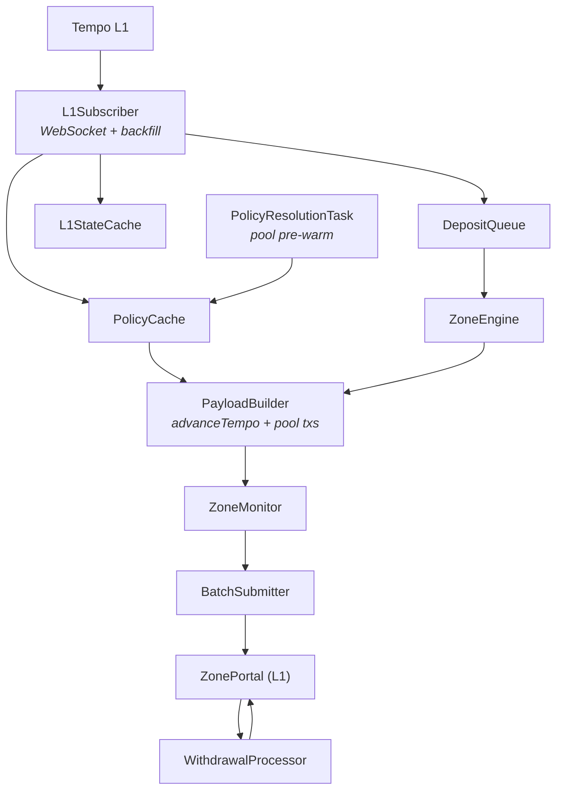

# Tempo Zone Node

A lightweight L2 node built on [reth](https://github.com/paradigmxyz/reth) that
derives its state from Tempo L1.

## Overview

A **zone** is a Tempo L2 that processes one L1 block per zone block. The
sequencer watches the L1 chain for deposit, withdrawal, and token-enablement
events, builds zone blocks that execute those events via a system transaction,
and periodically submits batch proofs back to the L1 portal contract.

## Architecture



## Block Production

Each zone block processes exactly one L1 block. The flow is driven by the
`ZoneEngine`:

1. **L1Subscriber** connects to L1 via WebSocket, backfills missed blocks, and
   enqueues `L1BlockDeposits` into the `DepositQueue`.
2. **ZoneEngine** peeks the next L1 block from the queue and builds
   `ZonePayloadAttributes` containing the L1 header, deposits, and enabled
   tokens.
3. The **payload builder** constructs an `advanceTempo` system transaction that
   calls `ZoneInbox.advanceTempo(header, deposits, decryptions, enabledTokens)`.
   This is always the first transaction in a zone block.
4. Pool transactions are appended after the system transaction, followed by a
   withdrawal batch finalization if applicable.
5. After `newPayload` succeeds, the engine **confirms** the L1 block in the
   deposit queue (removing it). On failure the block stays for retry.

The zone uses **instant finality** — head, safe, and finalized all point to the
same block.

## State Derivation

Zone state is fully derived from L1 events. The `advanceTempo` system
transaction atomically:

- Advances `tempoBlockNumber` and `tempoBlockHash` in the `TempoState`
  predeploy, anchoring the zone to L1.
- Enables newly bridged TIP-20 tokens via the `ZoneTokenFactory` precompile.
- Processes deposits from the L1 queue — minting zone-side tokens to recipients.
- Validates the deposit hash chain against the L1 portal's queue hash.

Chain continuity is enforced: the L1 block number must equal
`tempoBlockNumber + 1` and its parent hash must match the stored
`tempoBlockHash`.

### Encrypted Deposits

Deposits can be encrypted using ECIES with the sequencer's public key. The
sequencer decrypts them off-chain and provides `DecryptionData` (ECDH shared
secret + Chaum-Pedersen proof) that the contract verifies on-chain via two
precompiles before minting.

## Token Enablement

TIP-20 tokens are enabled on the zone at runtime (not at genesis). When a new
token is bridged via the L1 portal's `enableToken()`, the `L1Subscriber` picks
up the `TokenEnabled` event and includes it in the next zone block's system
transaction. The `ZoneInbox` contract calls the `ZoneTokenFactory` precompile,
which initializes the token's storage and grants `ISSUER_ROLE` to the inbox
(for minting on deposits) and outbox (for burning on withdrawals).

## Batch Submission

The `ZoneMonitor` watches the zone chain for new blocks, aggregates multiple
zone blocks into a single batch, and submits it to the `ZonePortal` on L1 via
`BatchSubmitter`. Each batch contains:

- A block state transition (previous → new block hash)
- A deposit queue transition (proving which deposits were processed)
- A withdrawal hash chain (so L1 can process withdrawals back to users)

The portal verifies `tempoBlockNumber` via EIP-2935 (last 8192 block hashes).
If the zone falls behind, the submitter switches to **ancestry mode** with a
header chain linking back to the target block.

## Withdrawals

1. Users call `ZoneOutbox.requestWithdrawal()` on the zone.
2. The zone monitor collects `WithdrawalRequested` events and stores them in the
   `WithdrawalStore`.
3. At batch finalization, withdrawals are hashed into a chain and submitted to
   L1 as part of the batch proof.
4. The `WithdrawalProcessor` polls the L1 portal queue and calls
   `processWithdrawal` for each pending withdrawal.

## TIP-403 Policy Enforcement

The zone enforces TIP-403 transfer policies (whitelist, blacklist, compound)
identically to L1. Policy state is mirrored via:

1. **L1Subscriber** — extracts `PolicyCreated`, `WhitelistUpdated`,
   `BlacklistUpdated`, `CompoundPolicyCreated`, and `TransferPolicyUpdate`
   events from L1 block receipts (via `eth_getBlockReceipts`) and applies
   them to the in-memory `PolicyCache`.
2. **PolicyProvider** — cache-first, RPC-fallback resolution. On cache miss
   it queries L1 via `block_in_place` and populates the cache for subsequent
   lookups.
3. **ZoneTip403ProxyRegistry** — a read-only precompile at the same address
   as the L1 `TIP403Registry` (`0x403C…0000`). It intercepts `isAuthorized`,
   `policyData`, `compoundPolicyData`, etc. and serves them from the
   `PolicyProvider`. Mutating calls are reverted.
4. **Pool pre-fetching** — the `PolicyResolutionTask` pre-warms the cache for
   pending pool transactions so payload building doesn't block on RPC.

The payload builder checks sender/recipient authorization during
`advanceTempo` deposit processing. Encrypted deposits that fail policy checks
are included with a zeroed-out amount (the deposit hash chain must still
match L1).

## Demo: Token Creation with Transfer Policy

End-to-end walkthrough for creating a TIP-20 token on L1, assigning a
blacklist policy, enabling it on the zone, and verifying enforcement.

**Prerequisites:** `L1_RPC_URL`, `PRIVATE_KEY`, `L1_PORTAL_ADDRESS`, and
`SEQUENCER_KEY` env vars set. A running zone (`just zone-up <name>`).

### 1. Create a TIP-20 token on L1

```bash
just create-token "TestUSD" "TUSD"
# → Token created at 0x20C0...
```

Save the token address for subsequent steps:
```bash
export TOKEN=0x20C0...  # address from output
```

### 2. Configure the token

```bash
# Set supply cap (defaults to u128::MAX)
just set-supply-cap $TOKEN

# Grant yourself ISSUER_ROLE so you can mint
just grant-issuer-role $TOKEN

# Mint tokens to yourself
just mint-tokens $TOKEN
```

### 3. Create a blacklist policy

```bash
# type=1 for blacklist (type=0 for whitelist)
just create-policy 1
# → Policy ID: <N>
```

Save the policy ID:
```bash
export POLICY_ID=<N>  # from output
```

### 4. Blacklist an address

```bash
# Block a specific address from receiving transfers
just modify-blacklist $POLICY_ID 0x000000000000000000000000000000000000dead

# Verify
just check-authorized $POLICY_ID 0x000000000000000000000000000000000000dead
# → authorized=false
```

### 5. Assign the policy to the token

```bash
just set-transfer-policy $TOKEN $POLICY_ID

# Verify
just token-policy $TOKEN
# → transferPolicyId=<N>
```

### 6. Enable the token on the zone and deposit

```bash
# Enable the token for bridging (requires SEQUENCER_KEY)
just enable-token $TOKEN

# Approve the portal to spend your tokens
just max-approve-portal

# Deposit to yourself on the zone
just send-deposit token=$TOKEN
```

### 7. Test enforcement on the zone

Transfers to blacklisted addresses will be rejected by the zone's
`ZoneTip403ProxyRegistry` precompile, which mirrors L1 policy state.

```bash
# Check balance on zone
just check-balance $(cast wallet address $PRIVATE_KEY) $TOKEN

# Transfer to a non-blacklisted address — succeeds
cast send $TOKEN "transfer(address,uint256)" <allowed_addr> 1000 \
    --rpc-url $ZONE_RPC_URL --private-key $PRIVATE_KEY

# Transfer to blacklisted address — reverts
cast send $TOKEN "transfer(address,uint256)" 0x...dead 1000 \
    --rpc-url $ZONE_RPC_URL --private-key $PRIVATE_KEY
# → reverts with Unauthorized
```

### Compound policies

For role-based policies (different rules for senders vs recipients), create
sub-policies first, then combine them:

```bash
# Allow-all senders (builtin 1), blacklist recipients
just create-compound-policy 1 $POLICY_ID
# → Compound Policy ID: <M>

just set-transfer-policy $TOKEN <M>
```

## Zone Precompiles

| Address | Precompile | Purpose |
|---------|-----------|---------|
| `0x1C00…0004` | `TempoStateReader` | Read L1 contract storage from zone contracts |
| `0x1C00…0100` | `ChaumPedersenVerify` | Verify DLOG equality proofs for ECDH |
| `0x1C00…0101` | `AesGcmDecrypt` | AES-256-GCM authenticated decryption |
| `0x20FC…0000` | `ZoneTokenFactory` | Initialize TIP-20 tokens on the zone |
| `0x403C…0000` | `ZoneTip403ProxyRegistry` | Read-only proxy mirroring L1 TIP-403 policy state |

## EVM Configuration

`ZoneEvmConfig` wraps `TempoEvmConfig` — the zone runs the same EVM as Tempo
L1 with these differences:

- The **TIP20Factory** precompile is replaced by `ZoneTokenFactory`, which only
  supports `enableToken` (no `createToken`) since zone tokens are always bridged
  from L1.
- The **TIP403Registry** precompile is replaced by `ZoneTip403ProxyRegistry`,
  a storage-less read-only proxy that resolves authorization from the in-memory
  policy cache rather than on-chain storage.
- The **block executor** is simplified: no subblock ordering, shared-gas
  accounting, or end-of-block metadata system transactions — those are L1-only
  concerns.
