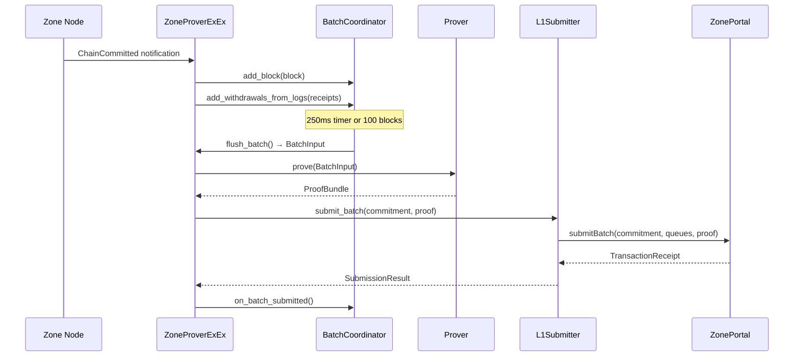

# SP1 Withdrawal Proofs

## Overview

The SP1 withdrawal proof system enables trustless L2→L1 withdrawals from Tempo Zones. It implements a proving pipeline that:

1. **Batches zone blocks** into provable units (250ms interval or 100 blocks)
2. **Generates ZK proofs** (SP1 or mock) attesting to valid state transitions
3. **Submits proofs to L1** via the `ZonePortal.submitBatch()` function

The system runs as a Reth Execution Extension (ExEx), receiving chain notifications and coordinating the prove-then-submit pipeline. This allows the zone sequencer node to continuously generate proofs for committed blocks without blocking consensus.

## Architecture

The proving pipeline consists of five main components:

```mermaid
graph TB
    subgraph "Zone Node (Reth ExEx)"
        ExEx[ZoneProverExEx]
        Batcher[BatchCoordinator]
        DT[DepositTracker]
        Prover[Prover<br/>Mock / SP1]
    end

    subgraph "L1 (Tempo)"
        L1Sub[L1Subscriber]
        Portal[ZonePortal]
        Verifier[IVerifier]
    end

    L1Sub -->|DepositMade events| DT
    ExEx -->|ChainCommitted| Batcher
    Batcher -->|BatchInput| Prover
    Prover -->|ProofBundle| ExEx
    ExEx -->|submitBatch tx| Submitter[L1Submitter]
    Submitter -->|Transaction| Portal
    Portal -->|verify()| Verifier
```

### Components

| Component | File | Description |
|-----------|------|-------------|
| **ZoneProverExEx** | [`exex.rs`](crates/tempo-zone-exex/src/exex.rs) | Main ExEx that subscribes to chain notifications, orchestrates batching, proving, and submission |
| **BatchCoordinator** | [`batcher.rs`](crates/tempo-zone-exex/src/batcher.rs) | Accumulates blocks, deposits, and withdrawals into proof-ready batches |
| **DepositTracker** | [`deposit_tracker.rs`](crates/tempo-zone-exex/src/deposit_tracker.rs) | Maintains L1→L2 deposit hash chain state |
| **Prover** | [`prover.rs`](crates/tempo-zone-exex/src/prover.rs) | Trait with `MockProver` and `Sp1Prover` implementations |
| **L1Submitter** | [`submitter.rs`](crates/tempo-zone-exex/src/submitter.rs) | Submits proof bundles to `ZonePortal` on L1 with retry logic |

## Data Flow



### Batch Input Construction

When the batch is flushed, `BatchCoordinator` produces a `BatchInput` containing:

- **8 public values** (see below)
- **Blocks**: List of block headers included in the batch
- **Deposits**: L1→L2 deposits to process
- **Withdrawals**: L2→L1 withdrawals extracted from block logs
- **Witness**: State transition witness data (Mock or Real)

## Public Values

The prover generates 8 `bytes32` values that are verified on-chain by the `IVerifier` contract:

| # | Field | Description |
|---|-------|-------------|
| 1 | `processedDepositQueueHash` | Where proof starts (portal's last processed deposit hash) |
| 2 | `pendingDepositQueueHash` | Stable ceiling target (portal's current deposit queue head) |
| 3 | `newProcessedDepositQueueHash` | Where zone processed up to in this batch |
| 4 | `prevStateRoot` | Zone state root before batch execution |
| 5 | `newStateRoot` | Zone state root after batch execution |
| 6 | `expectedWithdrawalQueue2` | What proof assumed `withdrawalQueue2` was |
| 7 | `updatedWithdrawalQueue2` | `queue2` with new withdrawals added to innermost |
| 8 | `newWithdrawalQueueOnly` | New withdrawals only (used if `queue2` was empty) |

These values are defined in:
- Rust: [`types.rs` - PublicValues](crates/tempo-zone-exex/src/types.rs#L183-L193)
- Solidity: [`IZone.sol` - IVerifier.verify()](docs/specs/src/zone/IZone.sol#L62-L84)

### Withdrawal Hash Chain

Withdrawals use an "oldest outermost" hash chain for O(1) pop:

```
hash = keccak256(abi.encode(withdrawal, tail_hash))
```

For withdrawals `[w1, w2, w3]`:
```
queue = hash(w1, hash(w2, hash(w3, expected_queue2)))
```

## Configuration

### CLI Flags

| Flag | Environment Variable | Default | Description |
|------|---------------------|---------|-------------|
| `--zone.prover` | `ZONE_PROVER_ENABLED` | `false` | Enable zone prover ExEx |
| `--zone.mock-prover` | `ZONE_MOCK_PROVER` | `true` | Use mock prover instead of SP1 |
| `--zone.portal-address` | `ZONE_PORTAL_ADDRESS` | - | ZonePortal contract address on L1 |
| `--zone.sequencer-key` | `ZONE_SEQUENCER_KEY` | - | Sequencer private key for L1 txs (32 bytes hex) |
| `--l1.rpc-url` | `L1_RPC_URL` | - | L1 WebSocket RPC URL for deposit events |

### Batch Configuration

Configured via `BatchConfig` (currently hardcoded defaults):

| Parameter | Default | Description |
|-----------|---------|-------------|
| `batch_interval` | 250ms | Time between batch flushes |
| `max_blocks_per_batch` | 100 | Maximum blocks per batch |

### Submitter Configuration

| Parameter | Default | Description |
|-----------|---------|-------------|
| `max_retries` | 3 | Retry attempts for transient failures |
| `retry_delay` | 1s | Base delay (exponential backoff) |
| `gas_limit` | 500,000 | Gas limit for submitBatch transactions |

## Development

### Running with Mock Prover

For local development and testing, use the mock prover which generates dummy proofs:

```bash
# Start zone node with mock prover
tempo-zone node \
  --chain zone-dev \
  --zone.prover \
  --zone.mock-prover \
  --l1.rpc-url wss://localhost:8546 \
  --zone.portal-address 0x5FbDB2315678afecb367f032d93F642f64180aa3 \
  --zone.sequencer-key 0xac0974bec39a17e36ba4a6b4d238ff944bacb478cbed5efcae784d7bf4f2ff80
```

Or using environment variables:

```bash
export L1_RPC_URL="wss://localhost:8546"
export ZONE_PORTAL_ADDRESS="0x5FbDB2315678afecb367f032d93F642f64180aa3"
export ZONE_SEQUENCER_KEY="0xac0974bec39a17e36ba4a6b4d238ff944bacb478cbed5efcae784d7bf4f2ff80"
export ZONE_PROVER_ENABLED="true"
export ZONE_MOCK_PROVER="true"

tempo-zone node --chain zone-dev
```

The mock prover:
- Returns dummy 32-byte proofs immediately
- Correctly propagates all 8 public values
- Works with a mock verifier on L1

### Running Without Prover (Sync Only)

```bash
tempo-zone node \
  --chain zone-mainnet \
  --l1.rpc-url wss://tempo-l1.example.com/ws
```

## Production

### Real SP1 Proofs

To use real SP1 ZK proofs:

```bash
tempo-zone node \
  --chain zone-mainnet \
  --zone.prover \
  --zone.mock-prover=false \
  --l1.rpc-url wss://tempo-mainnet.example.com/ws \
  --zone.portal-address 0x... \
  --zone.sequencer-key $ZONE_SEQUENCER_KEY
```

### SP1 Prover Requirements

The `Sp1Prover` implementation (currently a placeholder) will require:

1. **SP1 SDK Integration**: Install and configure the SP1 prover SDK
2. **Guest Program**: Build the SP1 guest from [`tempo-zone-sp1-guest`](crates/tempo-zone-sp1-guest/src/main.rs)
3. **Prover Network** (optional): Configure network proving for faster proofs
4. **ELF Binary**: Path to the compiled SP1 guest ELF

```rust
Sp1ProverConfig {
    elf_path: "path/to/zone-guest.elf",
    use_network: true,
    network_rpc: Some("https://prover.succinct.xyz"),
}
```

### Security Notes

- **Never commit `ZONE_SEQUENCER_KEY` to version control**
- Use a secrets manager or secure environment for the sequencer key
- The sequencer key must have ETH on L1 for gas fees
- Ensure the sequencer address is authorized in the ZonePortal contract

## Testing

### Unit Tests

Run unit tests for individual components:

```bash
# All tempo-zone-exex tests
cargo test -p tempo-zone-exex

# Specific modules
cargo test -p tempo-zone-exex prover
cargo test -p tempo-zone-exex batcher
cargo test -p tempo-zone-exex deposit_tracker
cargo test -p tempo-zone-exex submitter
```

### Integration Tests

End-to-end tests covering the full pipeline:

```bash
cargo test -p tempo-zone-exex --test integration
```

The integration tests verify:
- Withdrawal hash chain computation
- Batch input state roots
- Mock prover public values
- Submit calldata encoding
- Full flow: commit → extract → batch → prove → prepare submit
- Deposit hash chain through batcher
- Batch state updates after submission

### Test Coverage

Key test scenarios in [`tests/integration.rs`](crates/tempo-zone-exex/tests/integration.rs):

| Test | Description |
|------|-------------|
| `test_withdrawal_hash_chain_computation` | Verifies withdrawal queue hash chain is correct |
| `test_batch_input_state_roots` | Verifies prev/new state roots from blocks |
| `test_mock_prover_public_values` | Verifies prover outputs match inputs |
| `test_submit_calldata_encoding` | Verifies ABI encoding for L1 submission |
| `test_end_to_end_flow` | Full pipeline test |
| `test_deposit_hash_chain_through_batcher` | Deposit queue tracking |
| `test_batch_state_updates` | State updates after submission callback |

## Related Documentation

- [tempo-zone-exex README](crates/tempo-zone-exex/README.md) - Crate documentation
- [tempo-zone README](bin/tempo-zone/README.md) - Node binary documentation  
- [IZone.sol](docs/specs/src/zone/IZone.sol) - L1 contract interfaces
- [ZonePortal.sol](docs/specs/src/zone/ZonePortal.sol) - L1 portal contract
