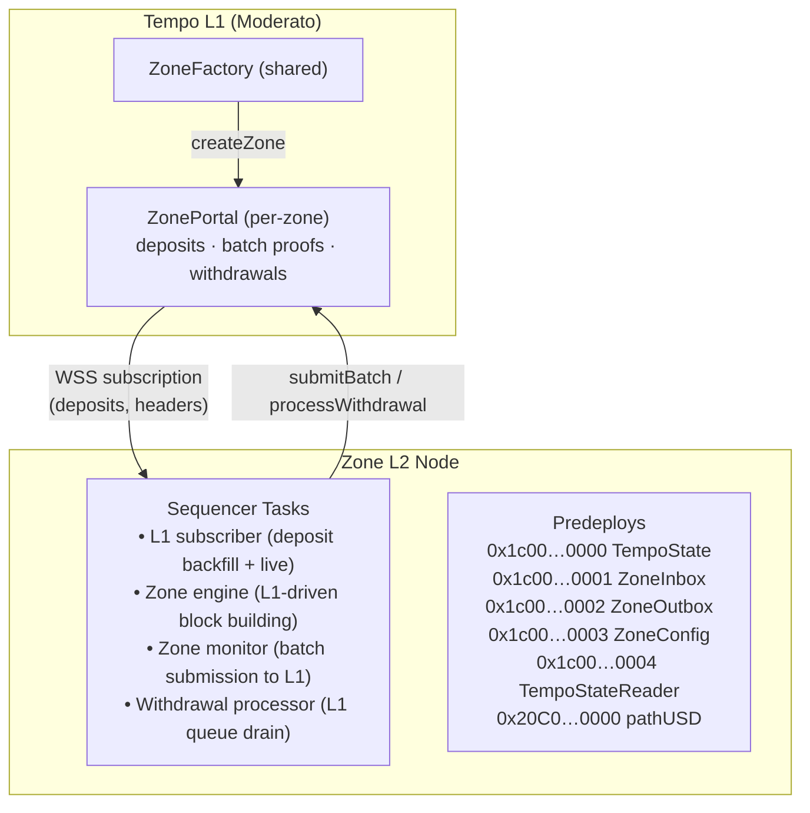

# Tempo Zones

Zones are L2 chains anchored to Tempo L1. Each zone has its own sequencer, genesis state, and portal contract on L1 that escrows deposits and processes withdrawals.

**Explorers:** [Moderato](https://explore.moderato.tempo.xyz/) · [Devnet](https://explore.devnet.tempo.xyz/)

## Quick Start (One Command)

The fastest way to deploy and run a zone on moderato:

```bash
export L1_RPC_URL="wss://rpc.moderato.tempo.xyz"
just deploy-zone my-zone
```

To choose a different initial TIP-20 on the portal at deploy time, pass it as the second positional argument:

```bash
just deploy-zone my-zone alphausd
```

This single command will:
1. Generate a fresh sequencer keypair
2. Fund the sequencer on L1 via `tempo_fundAddress`
3. Build the Solidity specs
4. Deploy a zone on L1 via ZoneFactory (`createZone`)
5. Generate the zone's `genesis.json` and `zone.json`
6. Build and start the zone node

> The sequencer key is saved in `generated/<name>/zone.json` — `zone-up` reads it automatically.
> `zone.json` now also stores `zoneFactory`, and `just deploy-router` appends `swapAndDepositRouter`.

Once running, generate a user wallet and deposit some tokens:

```bash
# Generate a wallet
cast wallet new
# Save the private key and address
export PRIVATE_KEY="0x<your-wallet-private-key>"
ADDR=$(cast wallet address "$PRIVATE_KEY")

# Fund the wallet on L1 (testnet faucet)
cast rpc tempo_fundAddress "$ADDR" --rpc-url "$L1_RPC_URL"

# Approve the portal and deposit tokens to the zone
export L1_PORTAL_ADDRESS=$(jq -r '.portal' generated/my-zone/zone.json)
just max-approve-portal
just send-deposit 1000000

# Check your balance on the zone
just check-balance "$ADDR"
```

See [Interact with the Zone](#6-interact-with-the-zone) for withdrawals and private RPC usage.

To restart the zone later:

```bash
just zone-up my-zone false release
```

## Step-by-Step Guide

### Prerequisites

- [Rust toolchain](https://rustup.rs/)
- [Foundry](https://book.getfoundry.sh/getting-started/installation) (`cast`, `forge`)
- [`just`](https://github.com/casey/just#packages)
- [`jq`](https://jqlang.github.io/jq/download/)

### 1. Set the L1 RPC URL

All zone commands need an L1 RPC URL.

**Moderato testnet:**
```bash
export L1_RPC_URL="wss://rpc.moderato.tempo.xyz"
```

**Devnet:**
```bash
export L1_RPC_URL="wss://rpc.devnet.tempoxyz.dev"
```

### 2. Generate a Sequencer Key

The sequencer is the operator that builds zone blocks, processes deposits, and submits batch proofs back to L1.

```bash
cast wallet new
```

Save both the **address** and **private key**.

```bash
export SEQUENCER_KEY="0x<your-private-key>"
SEQUENCER_ADDR=$(cast wallet address "$SEQUENCER_KEY")
```

### 3. Fund the Sequencer on L1

The sequencer needs pathUSD on L1 to pay for the `createZone` transaction and deposit fees.

```bash
cast rpc tempo_fundAddress "$SEQUENCER_ADDR" --rpc-url "$L1_RPC_URL"
```

Verify the balance:

```bash
cast call 0x20C0000000000000000000000000000000000000 \
  "balanceOf(address)(uint256)" "$SEQUENCER_ADDR" \
  --rpc-url "$L1_RPC_URL"
```

View on explorer: `https://explore.moderato.tempo.xyz/address/<SEQUENCER_ADDR>`

### 4. Create the Zone on L1

This deploys a ZonePortal + ZoneMessenger on L1 and generates the zone's genesis file:

```bash
export PRIVATE_KEY="$SEQUENCER_KEY"
just create-zone my-zone
```

To choose the initial TIP-20 enabled on the portal, pass it as the second positional argument:

```bash
just create-zone my-zone alphausd
```

This creates `generated/my-zone/` containing:
- **`genesis.json`** — Zone L2 genesis state (system contracts, fee token, etc.)
- **`zone.json`** — Deployment metadata (portal address, zone ID, anchor block, `zoneFactory`, and optional router/sequencer metadata)

This initial token controls the first L1 TIP-20 the portal accepts and mirrors onto the zone. The zone's fee token in genesis remains `pathUSD`.

You can also run the xtask directly for more control:

```bash
cargo run -p tempo-xtask -- create-zone \
  --output generated/my-zone \
  --initial-token 0x20c0000000000000000000000000000000000001 \
  --sequencer "$SEQUENCER_ADDR" \
  --private-key "$SEQUENCER_KEY"
```

### 5. Start the Zone Node

```bash
just zone-up my-zone false release
```

Use `release` profile for production (recommended). Omit it for debug builds during development.

The zone node will:
- Listen on `http://localhost:8546` for JSON-RPC
- Subscribe to L1 for deposit events and backfill from the genesis anchor block
- Build one zone block per L1 block (catches up at full speed during sync)
- Submit batch proofs to L1 every 60s (or immediately when withdrawals are pending)
- Process withdrawals from the zone back to L1

To reset the zone's datadir and start fresh:

```bash
just zone-up my-zone true release
```

The zone node stores data in `/tmp/tempo-zone-<name>/`.

### 6. Interact with the Zone

#### Create and fund a user wallet

The `just` commands below sign transactions with `PRIVATE_KEY`. Generate a wallet and fund it on L1 via the testnet faucet:

```bash
cast wallet new
export PRIVATE_KEY="0x<your-wallet-private-key>"
ADDR=$(cast wallet address "$PRIVATE_KEY")
cast rpc tempo_fundAddress "$ADDR" --rpc-url "$L1_RPC_URL"
```

#### Deposit from L1 to Zone

Approve the portal to spend your tokens, then deposit:

```bash
export L1_PORTAL_ADDRESS=$(jq -r '.portal' generated/my-zone/zone.json)
just max-approve-portal
just send-deposit 1000000                       # deposit to your own address
just send-deposit 1000000 <recipient-address>   # deposit to a specific address
```

#### Encrypted Deposit (Private Recipient)

Encrypted deposits hide the recipient address and memo on-chain using ECIES encryption to the sequencer's public key. Only the sequencer can decrypt them during block building.

```bash
# The sequencer must first register their encryption key (done automatically by deploy-zone)
# For manual setup:
cargo run -p tempo-xtask -- set-encryption-key \
  --portal "$L1_PORTAL_ADDRESS" \
  --private-key "$SEQUENCER_KEY"

# Send an encrypted deposit
just send-deposit-encrypted 1000000                       # to your own address
just send-deposit-encrypted 1000000 <recipient-address>   # to a specific address
```

Set `ZONE_RPC_URL` to poll the zone for processing confirmation:

```bash
export ZONE_RPC_URL="http://localhost:8546"
just send-deposit-encrypted 1000000
```

#### Check balance on the zone

```bash
just check-balance "$ADDR"
```

#### Withdraw from Zone to L1

Approve the outbox, then request a withdrawal:

```bash
just max-approve-outbox
just send-withdrawal 1000000                       # withdraw to your own address
just send-withdrawal 1000000 <recipient-address>   # withdraw to a specific address
```

The sequencer includes the withdrawal in the next batch submission to L1 and processes it automatically.

#### Router Swap + Deposit Demo (Same Zone)

This demo exercises the `SwapAndDepositRouter` flow against a running zone. It creates temporary `AlphaUSD` and `BetaUSD` tokens on L1, seeds matching StablecoinDEX liquidity, withdraws `AlphaUSD` from the zone to the router, swaps on L1, and deposits `BetaUSD` back into the same zone via an encrypted deposit. If the portal does not already have the current sequencer encryption key registered, the demo registers it automatically before building the routed callback payload.

Prerequisites:
- A running zone with an active sequencer
- `L1_RPC_URL` and `PRIVATE_KEY` set
- `generated/<name>/zone.json` present
- `SEQUENCER_KEY` set if `zone.json` does not already contain `sequencerKey`

Deploy the router once for the zone:

```bash
just deploy-router my-zone
```

That command saves the router address to `generated/my-zone/zone.json` as `swapAndDepositRouter`.

Run the demo:

```bash
just demo-swap-and-deposit my-zone
```

Optional parameters:

```bash
just demo-swap-and-deposit my-zone 100000000 0
```

This is a same-zone demo only. The command creates its own temporary tokens and DEX liquidity automatically, so you do not need to pre-create assets or seed the order book yourself.

#### Query the Private RPC

The private RPC (port 8544) requires a signed auth token derived from your private key. This ensures only the account owner can query their own scoped state.

Use the built-in helper if you only want a quick balance check:

```bash
just check-balance-private my-zone
```

For direct RPC calls, `just zone-auth-token` generates a 10-minute token from `generated/<name>/zone.json`, and `cast rpc` forwards it with `X-Authorization-Token`.
HTTP header names are case-insensitive, so `x-authorization-token` works too, but the examples here use the canonical casing from the spec.

One-liner to verify the private endpoint and inspect the authenticated account:

```bash
cast rpc zone_getAuthorizationTokenInfo \
  --rpc-url http://localhost:8544 \
  --rpc-headers "X-Authorization-Token: $(just zone-auth-token my-zone)"
```

If you want to make multiple requests, generate the token once and reuse it:

```bash
TOKEN=$(just zone-auth-token my-zone)

cast rpc zone_getAuthorizationTokenInfo \
  --rpc-url http://localhost:8544 \
  --rpc-headers "X-Authorization-Token: $TOKEN"

cast rpc eth_blockNumber \
  --rpc-url http://localhost:8544 \
  --rpc-headers "X-Authorization-Token: $TOKEN"
```

To query your own TIP-20 balance directly with `eth_call`, derive the authenticated account from `PRIVATE_KEY`, encode `balanceOf(address)`, and send the call through the private endpoint:

```bash
ADDR=$(cast wallet address "$PRIVATE_KEY")
DATA=$(cast calldata "balanceOf(address)" "$ADDR")

cast rpc eth_call \
  "{\"from\":\"$ADDR\",\"to\":\"0x20C0000000000000000000000000000000000000\",\"data\":\"$DATA\"}" \
  latest \
  --rpc-url http://localhost:8544 \
  --rpc-headers "X-Authorization-Token: $TOKEN"
```

Swap the `to` address above if you want to query a different zone TIP-20.

#### Check portal status on L1

```bash
PORTAL=$(jq -r '.portal' generated/my-zone/zone.json)
HTTP_RPC=$(echo "$L1_RPC_URL" | sed 's|^wss://|https://|' | sed 's|^ws://|http://|')

# Last L1 block synced by the zone
cast call "$PORTAL" "lastSyncedTempoBlockNumber()(uint64)" --rpc-url "$HTTP_RPC"

# Withdrawal queue status (head == tail means empty)
cast call "$PORTAL" "withdrawalQueueHead()(uint256)" --rpc-url "$HTTP_RPC"
cast call "$PORTAL" "withdrawalQueueTail()(uint256)" --rpc-url "$HTTP_RPC"
```

## Token & Policy Management (TIP-403)

Tempo L1 supports transfer policies via the TIP-403 registry. You can create new TIP-20 tokens, assign transfer policies (whitelist, blacklist, or compound), and manage membership — all from L1. The zone picks up policy changes automatically via the L1 subscriber.

### Create a New Token

```bash
# Create a TIP-20 token named "MyUSD" with symbol "MUSD"
# The address is derived from your wallet + salt (not the name/symbol).
# Use a different salt to create multiple tokens from the same wallet.
just create-token MyUSD MUSD
just create-token AnotherUSD AUSD 0x0000000000000000000000000000000000000000000000000000000000000001
# → Token created! Address: 0x20C0...

# Grant yourself ISSUER_ROLE and mint tokens
just grant-issuer-role <token-address>
just mint-tokens <token-address>               # 1B tokens to yourself
just mint-tokens <token-address> <to> 5000000  # 5 tokens to someone else

# Set a supply cap (optional)
just set-supply-cap <token-address> 1000000000000
```

### Enable a Token on the Zone

To deposit a custom token into the zone, it must be enabled on the ZonePortal. By default the portal starts with `pathUSD`, or whichever TIP-20 you selected with `just create-zone <name> <token>` or `just deploy-zone <name> <token>`. Additional tokens must exist on L1 and be enabled by the sequencer.

```bash
# Enable a token by address (requires SEQUENCER_KEY, L1_RPC_URL, L1_PORTAL_ADDRESS)
export SEQUENCER_KEY="0x<your-sequencer-key>"
export L1_PORTAL_ADDRESS=$(jq -r '.portal' generated/my-zone/zone.json)
just enable-token <token-address>

# Well-known aliases also work
just enable-token pathusd
just enable-token alphausd
```

If `ZONE_RPC_URL` is set (defaults to `http://localhost:8546`), the command waits for the zone to process the L1 block and confirms the token is available on L2.

Once the token is enabled, approve the portal and deposit as usual — just pass the token address:

```bash
# Approve the portal to spend the custom token
just max-approve-portal <token-address>

# Deposit the custom token into the zone
just send-deposit 1000000 "" <token-address>

# Check balance on the zone (pass the token address)
just check-balance "$ADDR" <token-address>
```

### Blacklist a Sender

This example creates a blacklist policy that prevents a specific address from sending transfers, while still allowing them to receive deposits.

```bash
# 1. Create a blacklist policy (type=1)
just create-policy 1
# → Policy ID: 2

# 2. Add the address to the blacklist
just modify-blacklist 2 0x<address-to-block>

# 3. Wrap in a compound policy so only the SENDER role is restricted
#    (recipient and mint-recipient use policy 1 = allow-all)
just create-compound-policy 2 1 1
# → Policy ID: 3

# 4. Assign the compound policy to the token
just set-transfer-policy 0x20C0000000000000000000000000000000000000 3

# 5. Verify
just check-authorized 2 0x<address-to-block>
# → authorized=false
```

> **Why compound?** A simple blacklist blocks an address as both sender and recipient. A compound policy lets you blacklist only the sender role while keeping deposits (mint-recipient) and incoming transfers (recipient) open.

### Other Policy Commands

| Command | Description |
|---------|-------------|
| `just create-policy [type]` | Create a policy (`0`=whitelist, `1`=blacklist) |
| `just create-compound-policy <sender> <recipient> [mint]` | Create a compound policy from sub-policies |
| `just modify-whitelist <policy-id> <account> [allowed]` | Add/remove from a whitelist |
| `just modify-blacklist <policy-id> <account> [restricted]` | Add/remove from a blacklist |
| `just set-transfer-policy <token> <policy-id>` | Assign a transfer policy to a token |
| `just check-authorized <policy-id> <account>` | Check if an address is authorized |
| `just token-policy <token>` | Read a token's current transfer policy ID |
| `just create-token <name> <symbol> [salt]` | Create a new TIP-20 token on L1 |
| `just mint-tokens <token> [to] [amount]` | Mint tokens (requires ISSUER_ROLE) |
| `just grant-issuer-role <token> [to]` | Grant ISSUER_ROLE on a token |
| `just set-supply-cap <token> [cap]` | Set a token's supply cap |

### Blacklist Demo (End-to-End)

`just demo-blacklist` runs a self-contained scenario that exercises the full TIP-20 + TIP-403 lifecycle in a single command. It creates a fresh token, deposits into the zone, blacklists an address, proves that encrypted deposits to that address bounce, unblacklists the address, proves deposits now succeed, and withdraws back to L1.

This is useful for verifying that transfer-policy enforcement works end-to-end across L1 and L2, or for demoing the blacklist feature to others.

```bash
export PRIVATE_KEY="0x<your-wallet-private-key>"
export L1_PORTAL_ADDRESS=$(jq -r '.portal' generated/my-zone/zone.json)

just demo-blacklist              # default deposit amount = 500,000
just demo-blacklist 1000000      # custom deposit amount
```

The demo walks through 9 steps, printing every transaction with an explorer link:

1. **Create token** — deploys a fresh TIP-20 "DemoUSD" via `TIP20Factory` (random salt each run)
2. **Configure token** — sets supply cap, grants `ISSUER_ROLE`, mints tokens, approves portal
3. **Enable on zone** — sequencer calls `enableToken` on the portal (auto-reads sequencer key from `zone.json`)
4. **Deposit** — plain deposit so admin has L2 funds
5. **Blacklist** — creates a TIP-403 blacklist policy, adds a fresh target wallet, assigns the policy to the token
6. **Encrypted deposit → bounce** — sends an encrypted deposit to the blacklisted target; zone rejects it and returns funds to sender
7. **Unblacklist** — removes the target from the blacklist on L1
8. **Encrypted deposit → success** — same encrypted deposit now goes through
9. **Withdraw** — target withdraws tokens from zone back to L1

Prerequisites: a running zone with the sequencer producing blocks, and the admin wallet funded with pathUSD on L1 (the demo deposits a small amount to the target for L2 gas fees).

## Architecture



### Precompiles

Zones inherit the Tempo L1 EVM but replace, disable, or pass through each precompile depending on whether it is relevant in the zone context. The zone also adds new precompiles for L1 state access, privacy, and zone-specific transaction context.

#### Tempo L1 Precompiles on Zones

| Precompile | Address | Zone Behavior |
|------------|---------|---------------|
| Standard EVM (ecrecover, SHA-256, etc.) | `0x01`–`0x0a`, `0x0100` on T1C+ | **Unchanged** — standard Ethereum precompiles inherited from Tempo's active hardfork (Prague pre-T1C, Osaka at T1C+) are available as-is. |
| TIP-20 tokens | `0x20C0…` prefix | **Replaced** — routed through `ZoneTip20Token`, which adds privacy (caller-scoped reads), fixed gas for transfers, bridge-auth for mint/burn, and TIP-403 policy enforcement via the L1-synced cache. |
| TIP20Factory | `0x20FC…0000` | **Replaced** — `ZoneTokenFactory` exposes only `enableToken(address, name, symbol, currency)`, called by ZoneInbox during `advanceTempo` to initialize bridged tokens. |
| TIP403Registry | `0x403C…0000` | **Replaced** — read-only `ZoneTip403ProxyRegistry` serves authorization queries from a cache-first, L1-RPC-fallback provider. Mutating calls (`createPolicy`, `modifyPolicyWhitelist`, etc.) revert — policy state is managed on L1. |
| TipFeeManager | `0xfeec…0000` | **Present** — the precompile is still registered, but its liquidity pools are not used by transactions. The zone executor overrides `validatorTokens` to match each transaction's fee token, so the FeeAMM swap path is bypassed and fees are collected directly in the user's token. |
| StablecoinDEX | `0xdec0…0000` | **Disabled** — not registered on zones, so the address behaves like an empty account. Users on zones can trade on the StablecoinDEX on Tempo via the bridge. |
| NonceManager | `0x4E4F…0000` | **Unchanged** — same implementation as L1, runs locally on zone state. |
| ValidatorConfig (legacy) | `0xCCCC…0000` | **Not registered** — zones do not run validators, so the precompile is not loaded. |
| ValidatorConfigV2 | `0xCCCC…0001` | **Not registered** — zones do not run validators, so the precompile is not loaded. |
| AccountKeychain | `0xAAAA…0000` | **Unchanged** — same implementation as L1, runs locally on zone state. |
| AddressRegistry | `0xFDC0…0000` | **Not registered** — the address has no zone precompile implementation. |
| SignatureVerifier | `0x5165…0000` | **Not registered** — the address has no zone precompile implementation. |

#### Zone-Only Precompiles

| Precompile | Address | Description |
|------------|---------|-------------|
| TempoStateReader | `0x1c00…0004` | Reads L1 contract storage from zone contracts via the L1 state cache. |
| ZoneTxContext | `0x1c00…0005` | Exposes the hash of the currently executing zone transaction (`currentTxHash`), used by ZoneOutbox for authenticated withdrawals. |
| ChaumPedersenVerify | `0x1c00…0100` | Verifies DLOG equality proofs for ECDH key exchange (encrypted deposits). |
| AesGcmDecrypt | `0x1c00…0101` | AES-256-GCM authenticated decryption (encrypted deposit payloads). |

## Configuration

### Key Addresses

| Contract | Address |
|----------|---------|
| pathUSD (TIP-20) | `0x20C0000000000000000000000000000000000000` |
| ZoneFactory (moderato) | `0x7Cc496Dc634b718289c192b59CF90262C5228545` |

The xtasks use this Moderato `ZoneFactory` as their built-in default: `create-zone` and `zone-info` point at it automatically, and `deploy-router` falls back to it when `zone.json` does not already record `zoneFactory`.

### Zone Node CLI Options

| Flag | Default | Description |
|------|---------|-------------|
| `--l1.rpc-url` | (required) | L1 WebSocket RPC URL |
| `--l1.portal-address` | (from zone.json) | ZonePortal contract on L1 |
| `--l1.genesis-block-number` | (from zone.json) | L1 block when the zone was created |
| `--zone.id` | 0 | Zone ID from ZoneFactory (for private RPC auth). The zone's chain ID is derived as `421700000 + (zone_id % 1002610000)` (mainnet) or `1424310000 + (zone_id % 723173648)` (testnet). |
| `--sequencer-key` | (optional) | Sequencer private key for block production |
| `--block.interval-ms` | 250 | Block building interval |
| `--zone.batch-interval-secs` | 60 | Max seconds to accumulate zone blocks before submitting a batch to L1 |
| `--zone.poll-interval-secs` | 1 | How often (seconds) the zone monitor polls for new L2 blocks |
| `--withdrawal-poll-interval-secs` | 5 | How often (seconds) the withdrawal processor polls the L1 queue |
| `--http.port` | 8546 | HTTP JSON-RPC port |
| `--private-rpc.port` | 8544 | Private RPC server port |
| `--private-rpc.max-auth-token-validity-secs` | 2592000 | Maximum auth token validity the private RPC accepts, in seconds. The effective limit is capped at 30 days. |

### Environment Variables

| Variable | Required | Description |
|----------|----------|-------------|
| `L1_RPC_URL` | Yes | L1 WebSocket URL (`wss://...`) |
| `SEQUENCER_KEY` | For sequencing | Sequencer private key |
| `PRIVATE_KEY` | For transactions | Key for L1 transactions (deposits, approvals) |
| `L1_PORTAL_ADDRESS` | For deposits | ZonePortal address (from `zone.json`) |
| `PRIVATE_RPC_MAX_AUTH_TOKEN_VALIDITY_SECS` | No | Maximum auth token validity the private RPC accepts, in seconds. The effective limit is capped at 30 days. |
| `ZONE_TOKEN` | No | Default initial TIP-20 for `just create-zone` / `just deploy-zone`; defaults to `pathUSD` |

## Justfile Commands Reference

| Command | Description |
|---------|-------------|
| `just deploy-zone <name> [<tip20>]` | One-shot: keygen → fund → create → genesis → start node |
| `just create-zone <name> [<tip20>]` | Create zone on L1 + generate genesis (requires `PRIVATE_KEY`, `SEQUENCER_KEY`) |
| `just deploy-router <name>` | Deploy `SwapAndDepositRouter` on L1 for the zone and save it to `zone.json` |
| `just zone-up <name> [reset] [profile]` | Start the zone node. `reset=true` wipes datadir. `profile=release` for production. |
| `just max-approve-portal` | Approve portal to spend tokens on L1 |
| `just send-deposit [to]` | Deposit tokens from L1 to zone (defaults to sender) |
| `just send-deposit-encrypted [to]` | Encrypted deposit — hides recipient and memo on-chain |
| `just enable-token <token>` | Enable a TIP-20 token on the portal for bridging (sequencer only) |
| `just max-approve-outbox` | Approve outbox to spend tokens on zone |
| `just send-withdrawal [to]` | Withdraw tokens from zone to L1 (defaults to sender) |
| `just demo-swap-and-deposit <name>` | Self-contained same-zone router demo: create tokens, seed DEX liquidity, swap on L1, deposit output back into the zone |
| `just check-balance <addr>` | Check token balance on the zone |
| `just zone-auth-token <name>` | Generate a signed private RPC auth token (10 min TTL) |
| `just check-balance-private <name>` | Check balance via the private RPC (auto-generates auth token) |
| `just zone-info <id-or-portal>` | Fetch zone metadata from ZoneFactory |
| `just demo-blacklist [amount]` | End-to-end TIP-20 + TIP-403 blacklist lifecycle demo |
