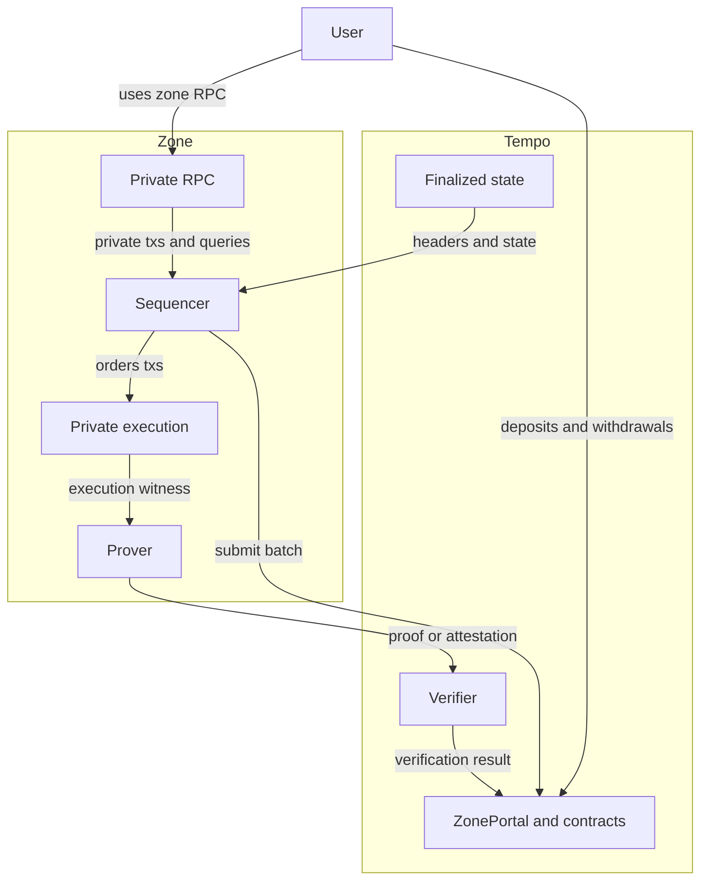
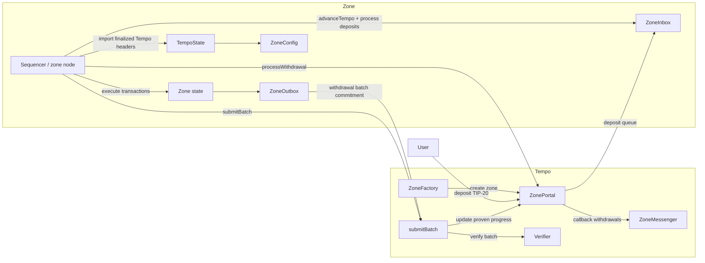
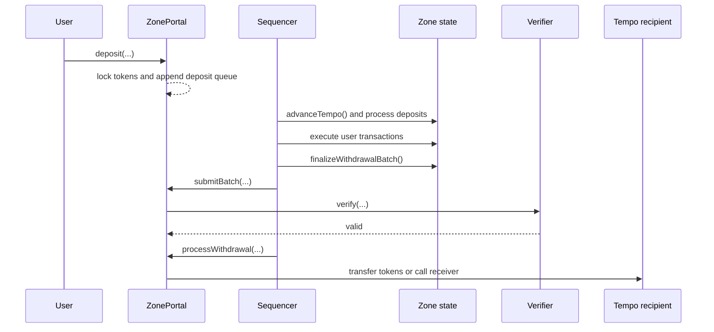

# Tempo Zones (Draft)

This document is the entry point to the zone specifications, giving an overview of all essential ideas and components of Tempo Zones.

A zone is a Tempo-anchored validium. Execution happens on a separate chain operated by a permissioned sequencer. Settlement happens on Tempo, where deposits are locked and withdrawals are finalized after a verifier accepts the zone's batch proof or attestation.

For interface-by-interface detail, exact proof inputs, RPC method tables, and upgrade mechanics, follow the links to the dedicated specs at the end of this document.

## Zones mental model

The simplest way to think about a zone is:

- **Tempo** is the settlement chain. It holds locked assets, deploys zone contracts, and is the place where withdrawals ultimately land.
- A **zone** is a separate execution chain with its own state, blocks, and transactions.
- Each zone has exactly one permissioned **sequencer** that orders transactions, imports finalized Tempo state, and submits batches back to Tempo.
- A **verifier** checks that a submitted batch was executed correctly. This can be a ZK verifier or a verifier for a TEE attestation.
- The **portal** is the Tempo-side contract that holds locked funds, accepts verified batches, and processes withdrawals.
- Liveness and data availability are trusted to the sequencer. If the sequencer halts or withholds data, users cannot force progress.

Two consequences of this model are:

1. Zones can keep user activity private from the public chain because transaction data is not posted on Tempo.
2. Zones are not trying to solve censorship resistance or data availability.

## What zones optimize for

Zones are designed to combine four properties:

- **Private execution**. Public observers on Tempo do not get a public feed of zone balances, transfers, or transaction history.
- **Tempo-native settlement**. Deposits, withdrawals, and proof verification all settle directly on Tempo.
- **Multi-asset operation**. A zone can support multiple bridged TIP-20 tokens, and the operator can choose which tokens to enable for gas.
- **Simple interoperability**. A withdrawal can land as a plain token transfer on Tempo or invoke a callback through `ZoneMessenger`, which is enough to support operations such as swap-and-deposit flows.

The main trade-off is that privacy and liveness both depend on the sequencer. Public observers are blind, but the sequencer sees the zone's full activity.

## System components

At the highest level, the user interacts with Tempo for deposits and withdrawals and with the zone RPC for private execution. The sequencer runs the zone, imports finalized Tempo state, and hands execution data to the prover. The prover produces a proof or attestation that Tempo verifies before accepting a batch.



## System smart contracts



| Component | Lives on | Role |
|-----------|----------|------|
| `ZoneFactory` | Tempo | Creates zones and records their top-level parameters. |
| `ZonePortal` | Tempo | Retains locked deposits, tracks proven progress, verifies batches, and finalizes withdrawals. |
| `ZoneMessenger` | Tempo | Executes callback withdrawals atomically with the token transfer. |
| `Verifier` | Tempo | Accepts or rejects the batch proof or attestation supplied by the sequencer. |
| `TempoState` | Zone | Stores the zone's imported view of finalized Tempo state. |
| `ZoneInbox` | Zone | Imports Tempo state into the zone and processes deposits. |
| `ZoneOutbox` | Zone | Records withdrawal requests and builds the per-batch withdrawal commitment. |
| `ZoneConfig` | Zone | Reads sequencer and token configuration from Tempo via `TempoState`. |
| Zone TIP-20 predeploys | Zone | Represent bridged assets inside the zone at the same addresses they use on Tempo. |

The important design choice is that Tempo remains the source of truth for locked balances, token enablement, and verifier configuration, while the zone remains the place where private execution happens.

## How money and state move through a zone



### 1. Deposit from Tempo into a zone

A user enters the zone by depositing an enabled TIP-20 token into `ZonePortal` on Tempo.

At a high level:

- The portal keeps the tokens locked on Tempo.
- The portal appends the deposit to the deposit queue.
- The sequencer later imports the relevant finalized Tempo block through `ZoneInbox.advanceTempo()`.
- `ZoneInbox` mints the corresponding zone-side TIP-20 balance to the recipient.

Zones also support **encrypted deposits**. In that mode, the deposited token and amount remain public on Tempo, but the recipient and memo are encrypted to the sequencer's published encryption key. This gives users a private on-ramp into the zone without exposing the recipient address on Tempo.

### 2. Execute transactions inside the zone

Once funds are inside the zone, users submit transactions to the sequencer rather than to Tempo.

The zone behaves like a restricted EVM environment:

- TIP-20 balances live inside zone token predeploys.
- The sequencer imports finalized Tempo state through `TempoState`.
- User transactions, deposit processing, and withdrawal requests all execute against the zone's private state.

This is where most of the privacy properties come from. The zone does not publish its transaction stream on Tempo, and the execution environment itself restricts balance and allowance reads so contracts cannot trivially leak private account data.

### 3. Settle a batch on Tempo

The sequencer does not settle each zone block individually. Instead, it groups one or more zone blocks into a **batch** and submits a single proof or attestation to the portal.

A settled batch commits to four things:

- the zone block hash transition
- how far deposit processing advanced
- the withdrawal commitment generated by `ZoneOutbox`
- the imported Tempo block the zone is claiming to have executed against

The portal accepts the batch only if the verifier confirms that the state transition is valid. Once the batch is accepted, Tempo learns:

- the next proven zone block hash
- the next processed deposit queue hash
- the latest Tempo block number the zone has synced to
- the next withdrawal batch that can be processed

### 4. Withdraw from a zone back to Tempo

To leave the zone, a user requests a withdrawal inside `ZoneOutbox`.

That request:

- burns the zone-side balance
- records the Tempo recipient
- records the processing fee
- optionally includes callback data and a `fallbackRecipient`

After the containing batch has been proven on Tempo, the sequencer processes the queued withdrawal from the portal.

There are two execution modes:

- **Simple withdrawal**: transfer the TIP-20 directly to the Tempo recipient.
- **Callback withdrawal**: transfer the token and then call a Tempo contract through `ZoneMessenger`.

Callback withdrawals are the mechanism that makes zones interoperable with Tempo contracts. They allow flows such as "withdraw on Tempo and immediately swap" or "withdraw from one zone and immediately deposit into another".

Failures do not block the queue. If the transfer or callback fails, the amount is bounced back into the same zone as a fresh deposit to the specified `fallbackRecipient`. This is one of the most important operational properties of the design: a bad receiver contract or a restrictive token policy does not permanently wedge withdrawal processing.

## Tokens, fees, and gas

Zones are multi-asset systems rather than single-token rollups.

The sequencer can enable additional TIP-20 tokens over time, and enabled tokens have three important properties:

- Enablement is append-only. Once a token is enabled, it stays enabled.
- Deposits for a token can be paused and resumed.
- Withdrawals for an enabled token cannot be disabled.

That split gives zones a strong withdrawal guarantee without requiring deposits to stay open forever.

Gas is also multi-asset:

- Every zone transaction names a `feeToken`.
- Any enabled USD-denominated TIP-20 can pay gas.
- The sequencer must accept all enabled gas tokens directly, so there is no fee AMM inside the zone.

There are two explicit processing fees in the system:

- **Deposit fee**: `FIXED_DEPOSIT_GAS * zoneGasRate`
- **Withdrawal fee**: `gasLimit * tempoGasRate`

The exact accounting rules, including fixed TIP-20 gas costs and zone-side mint/burn permissions, live in the [execution specification](https://github.com/tempoxyz/zones/blob/docs/zones-specs-entrypoint/docs/specs/privacy/execution.md).

## How zones stay private

Zones rely on multiple privacy layers rather than a single trick.

### No public zone data on Tempo

Tempo sees deposits, batch submissions, and processed withdrawals, but it does not see the zone's transaction list or full account state.

### Execution-level privacy

Inside the zone itself:

- `balanceOf` is restricted so users cannot read each other's balances.
- `allowance` is restricted so approval relationships are not public.
- TIP-20 transfer-family operations use fixed gas to avoid leaking storage-state information.
- Contract creation is currently disabled to reduce privacy footguns.

These details live in the [execution specification](https://github.com/tempoxyz/zones/blob/docs/zones-specs-entrypoint/docs/specs/privacy/execution.md).

### RPC-level privacy

The RPC server adds a second layer:

- clients authenticate with authorization tokens
- state queries are scoped to the authenticated account
- transaction lookup and log access are filtered
- dangerous raw state access methods are restricted or disabled

These details live in the [RPC specification](https://github.com/tempoxyz/zones/blob/docs/zones-specs-entrypoint/docs/specs/privacy/rpc.md).

### Sequencer visibility

Zones are not hiding information from the sequencer. The sequencer sees the zone's full transaction flow, balances, and ordering. The privacy target is the public chain and everyone who is not operating the sequencer.

## Trust model and guarantees

| Property | What zones guarantee | What zones do not guarantee |
|----------|----------------------|-----------------------------|
| Correctness | If the verifier is sound, the sequencer cannot forge state transitions or steal locked funds by posting an invalid batch. | Zones do not remove the verifier as a trust anchor. A critical bug in the verifier or proving system is a safety risk. |
| Withdrawals | Once a token is enabled, users keep a withdrawal path for that token. Failed callback withdrawals bounce back instead of blocking the queue. | Zones do not guarantee immediate exits. The sequencer still has to keep processing batches and withdrawals. |
| Liveness | None beyond what the sequencer provides. | There is no forced inclusion, no permissionless exit path, and no automatic recovery if the sequencer halts. |
| Data availability | None beyond what the sequencer provides. | Users cannot reconstruct zone state without the sequencer's data if the sequencer withholds it. |
| Privacy | Public observers on Tempo do not get a public ledger of zone balances or transactions. | The sequencer can see all zone activity. |

This is the essential zone trade-off in one sentence: **zones are safe against theft if the verifier is sound, but they are not trustless for liveness, data availability, or sequencer-side privacy**.

## Creating and operating a zone

A new zone is created through `ZoneFactory.createZone(...)` with:

- an initial TIP-20 token
- a sequencer address
- a verifier address
- genesis parameters tying the zone to an initial Tempo block and genesis zone block hash

The factory deploys the zone's `ZonePortal` and `ZoneMessenger` on Tempo. The zone itself starts with its system predeploys at fixed addresses.

Each zone has a deterministic EIP-155 chain ID:

```text
chain_id = 421700000 + zone_id
```

That gives every zone a separate signing domain, so a transaction signed for one zone cannot be replayed on another.

Operationally:

- The sequencer can transfer control through a two-step Tempo-side handoff.
- The sequencer can enable new tokens later.
- Upgrades activate in lockstep with Tempo hard forks when the zone imports the fork Tempo block.

The full hard-fork model, including verifier rotation and operator failure modes, lives in the [upgrades specification](https://github.com/tempoxyz/zones/blob/docs/zones-specs-entrypoint/docs/specs/privacy/upgrades.md).

## Where to go next

If you want the deep details, read the specs in this order:

1. [Execution](https://github.com/tempoxyz/zones/blob/docs/zones-specs-entrypoint/docs/specs/privacy/execution.md) for fee accounting, token management, fixed gas costs, and execution-level privacy rules.
2. [Zone Prover Design](https://github.com/tempoxyz/zones/blob/docs/zones-specs-entrypoint/docs/specs/privacy/prover-design.md) for batch inputs, queue commitments, ancestry proofs, and verifier-facing outputs.
3. [Tempo-side contracts](https://github.com/tempoxyz/zones/blob/docs/zones-specs-entrypoint/docs/specs/privacy/contracts-tempo.md) for `ZoneFactory`, `ZonePortal`, `ZoneMessenger`, and withdrawal processing on Tempo.
4. [Zone-side contracts](https://github.com/tempoxyz/zones/blob/docs/zones-specs-entrypoint/docs/specs/privacy/contracts-zone.md) for `TempoState`, `ZoneInbox`, `ZoneOutbox`, `ZoneConfig`, and authenticated-withdrawal mechanics.
5. [RPC](https://github.com/tempoxyz/zones/blob/docs/zones-specs-entrypoint/docs/specs/privacy/rpc.md) for authorization tokens, method access control, scoped queries, and timing defenses.
6. [Upgrades](https://github.com/tempoxyz/zones/blob/docs/zones-specs-entrypoint/docs/specs/privacy/upgrades.md) for same-block fork activation, verifier rotation, and operator upgrade paths.

This overview intentionally omits the exact queue layouts, witness structures, RPC method tables, and fork rollout edge cases. Those are the right kind of details for the dedicated specs, not for the first document a reader sees.
