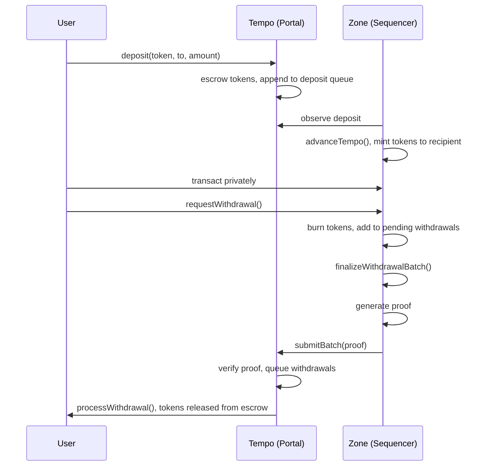

# Tempo Zones

**Table of Contents**

- [Abstract](#abstract)
- [Specification](#specification)
  - [Terminology](#terminology)
  - [System Overview](#system-overview)
  - [Zone Deployment](#zone-deployment)
    - [Creating a Zone](#creating-a-zone)
    - [Chain ID](#chain-id)
    - [Tempo Contracts](#tempo-contracts)
    - [Zone Predeploys](#zone-predeploys)
    - [Zone Token Model](#zone-token-model)
  - [Sequencer Operations](#sequencer-operations)
    - [Token Management](#token-management)
    - [Gas Rate Configuration](#gas-rate-configuration)
    - [Encryption Key Management](#encryption-key-management)
    - [Sequencer Transfer](#sequencer-transfer)
  - [Deposits](#deposits)
    - [Regular Deposits](#regular-deposits)
    - [Deposit Fees](#deposit-fees)
    - [Deposit Queue](#deposit-queue)
    - [Encrypted Deposits](#encrypted-deposits)
    - [On-Chain Decryption Verification](#on-chain-decryption-verification)
  - [Zone Execution](#zone-execution)
    - [Fee Accounting](#fee-accounting)
    - [Block Structure](#block-structure)
    - [Block Header Format](#block-header-format)
    - [Privacy Modifications](#privacy-modifications)
  - [Tempo L1 State Reads](#tempo-l1-state-reads)
    - [TempoState Predeploy](#tempostate-predeploy)
    - [Header Finalization](#header-finalization)
    - [Storage Reads](#storage-reads)
    - [Staleness and Finality](#staleness-and-finality)
  - [TIP-403 Policies](#tip-403-policies)
    - [Policy Enforcement on Zones](#policy-enforcement-on-zones)
    - [Policy Inheritance](#policy-inheritance)
  - [Private RPC](#private-rpc)
    - [Authorization Tokens](#authorization-tokens)
    - [Signature Types](#signature-types)
    - [Method Access Control](#method-access-control)
    - [Block Responses](#block-responses)
    - [Event Filtering](#event-filtering)
    - [Timing Side Channels](#timing-side-channels)
    - [WebSocket Subscriptions](#websocket-subscriptions)
    - [Zone-Specific Methods](#zone-specific-methods)
    - [Error Codes](#error-codes)
  - [Proving System](#proving-system)
    - [State Transition Function](#state-transition-function)
    - [Witness Structure](#witness-structure)
    - [Batch Output](#batch-output)
    - [Block Execution](#block-execution)
    - [Tempo State Proofs](#tempo-state-proofs)
    - [Deployment Modes](#deployment-modes)
  - [Batch Submission](#batch-submission)
    - [submitBatch](#submitbatch)
    - [Verifier Interface](#verifier-interface)
    - [Anchor Block Validation](#anchor-block-validation)
    - [Proof Requirements](#proof-requirements)
  - [Withdrawals](#withdrawals)
    - [Withdrawal Request](#withdrawal-request)
    - [Withdrawal Fees](#withdrawal-fees)
    - [Withdrawal Batching](#withdrawal-batching)
    - [Withdrawal Queue](#withdrawal-queue)
    - [Withdrawal Processing](#withdrawal-processing)
    - [Callback Withdrawals](#callback-withdrawals)
    - [Withdrawal Failures and Bounce-Back](#withdrawal-failures-and-bounce-back)
    - [Authenticated Withdrawals](#authenticated-withdrawals)
    - [Zone-to-Zone Transfers](#zone-to-zone-transfers)
  - [Zone Precompiles](#zone-precompiles)
    - [TIP-20 Token Precompile](#tip-20-token-precompile)
    - [Chaum-Pedersen Verify](#chaum-pedersen-verify)
    - [AES-GCM Decrypt](#aes-gcm-decrypt)
  - [Contracts and Interfaces](#contracts-and-interfaces)
    - [Common Types](#common-types)
    - [IZoneFactory](#izonefactory)
    - [IZonePortal](#izoneportal)
    - [IZoneMessenger](#izonemessenger)
    - [IWithdrawalReceiver](#iwithdrawalreceiver)
    - [ITempoState](#itempostate)
    - [IZoneInbox](#izoneinbox)
    - [IZoneOutbox](#izoneoutbox)
    - [IZoneConfig](#izoneconfig)
    - [TIP-403 Registry](#tip-403-registry)
  - [Network Upgrades and Hard Fork Activation](#network-upgrades-and-hard-fork-activation)
- [Security Considerations](#security-considerations)
- [Open Questions](#open-questions)

---

# Abstract

A Tempo Zone is a private execution environment anchored to Tempo. Inside a zone, balances, transfers, and transaction history are invisible to block explorers, indexers, and other users. Each zone is operated by a dedicated sequencer that is the sole block producer, settling back to Tempo through a proof-agnostic verification system.

Funds enter a zone through deposits on Tempo, where they are held in escrow. The zone mints equivalent tokens, and users transact privately with balances and transaction history hidden behind authenticated RPC access and execution-level controls. When users withdraw, tokens are burned on the zone and released from escrow on Tempo. Proofs guarantee that the sequencer executed every transaction correctly and cannot forge state transitions. Withdrawals support optional callbacks, making them composable with Tempo contracts and enabling zone-to-zone transfers.

This document specifies the zone protocol: deployment, sequencer operations, deposits, execution, the private RPC interface, the proving system, batch submission, withdrawals, precompiles, contract interfaces, and the network upgrade process.

# Specification

## Terminology

| Term | Definition |
|------|------------|
| Tempo | The base chain that zones settle to. |
| Zone | A private execution environment anchored to Tempo. |
| Portal | The contract on Tempo that escrows deposited tokens and finalizes withdrawals for a zone. |
| Batch | A sequencer-produced commitment covering one or more zone blocks, submitted to Tempo with a proof. |
| Enabled token | A TIP-20 token that the sequencer has activated for deposits and withdrawals on a zone. Enablement is permanent. |
| TIP-20 | Tempo's fungible token standard. |
| TIP-403 | Tempo's compliance registry. Issuers attach transfer policies (whitelists, blacklists) to TIP-20 tokens. |
| Predeploy | A system contract deployed at a fixed address on the zone at genesis. |

## System Overview

Each zone is operated by a **sequencer** that collects transactions, produces blocks, generates proofs, and submits batches to Tempo. A single registered address controls sequencer operations for each zone. **Users** deposit TIP-20 tokens from Tempo into the zone, transact privately, and withdraw back to Tempo.

On the Tempo side, an on-chain **verifier** contract validates that each batch was executed correctly. The verifier is abstracted behind a minimal interface (`IVerifier`) and is proof-agnostic. Any proving backend (ZK, TEE, or otherwise) can implement the interface. The portal does not care how the proof was produced.

On Tempo, each zone has a **portal** that escrows deposited tokens. When a user deposits, the portal locks their tokens and appends the deposit to a queue. The sequencer observes the deposit, advances the zone's view of Tempo, and mints equivalent tokens on the zone.

Users transact on the zone privately. Balances, transfers, and transaction history are only visible to the account holder and the sequencer.

When a user wants to exit, they request a withdrawal on the zone. Their tokens are burned, and the withdrawal is added to a pending list. At the end of a batch, the sequencer finalizes all pending withdrawals into a hash chain and generates a proof covering the full batch of zone blocks. The sequencer submits this batch and proof to the portal on Tempo, which verifies the proof and queues the withdrawals. The sequencer then processes each withdrawal, releasing tokens from escrow to the recipient.

## Zone Deployment

<!-- This section covers everything about creating and configuring a zone — the contracts, predeploys, and token model that make up a deployed zone. -->

### Creating a Zone

<!-- ZoneFactory.createZone params: initialToken, sequencer, verifier, zoneParams. What gets deployed (portal, messenger). -->

### Chain ID

<!-- Derivation formula: 4217000000 + zone_id. Replay protection between zones. -->

### Tempo Contracts

<!-- ZoneFactory, ZonePortal, ZoneMessenger — what each is, what it does, how they relate -->

### Zone Predeploys

<!-- TempoState, ZoneInbox, ZoneOutbox, ZoneConfig — fixed addresses, purpose of each, how they read L1 state -->

### Zone Token Model

<!-- No factory on zone, no contract deployment, same addresses as Tempo. Mint on deposit (ZoneInbox), burn on withdrawal (ZoneOutbox). Total supply = net deposits - net withdrawals. -->

## Sequencer Operations

<!-- Everything the sequencer does to configure and operate a zone after deployment. -->

### Token Management

<!-- enableToken (irreversible), pauseDeposits/resumeDeposits, non-custodial withdrawal guarantee. Sequencer can enable additional TIP-20 tokens at any time. Enablement is permanent (append-only). -->

### Gas Rate Configuration

<!-- 
- zoneGasRate: token units per gas unit on the zone (set via ZonePortal.setZoneGasRate)
  - Used to calculate deposit fees: FIXED_DEPOSIT_GAS * zoneGasRate
- tempoGasRate: token units per gas unit on Tempo (set via ZoneOutbox.setTempoGasRate)
  - Used to calculate withdrawal fees: gasLimit * tempoGasRate
- Sequencer takes risk on gas price fluctuations
- Single uniform rate applies to all tokens
-->

### Encryption Key Management

<!--
- setSequencerEncryptionKey with proof of possession (ECDSA sig)
- Key history: append-only list, users specify keyIndex when encrypting
- Key rotation: previous key valid for ENCRYPTION_KEY_GRACE_PERIOD (86400 blocks)
- isEncryptionKeyValid, encryptionKeyAtBlock lookups
- Why keyIndex: avoids race condition between signing and inclusion
-->

### Sequencer Transfer

<!-- Two-step process on L1 only (transferSequencer → acceptSequencer), L1 as single source of truth. Zone-side contracts read sequencer from L1 via ZoneConfig. -->

## Deposits

### Regular Deposits

<!-- User calls deposit() → escrow → queue hash → sequencer observes → advanceTempo → mint -->

### Deposit Fees

<!-- FIXED_DEPOSIT_GAS * zoneGasRate, deducted from amount, paid to sequencer -->

### Deposit Queue

<!-- Hash chain structure: newest-outermost, O(1) addition, diagram -->

### Encrypted Deposits

<!-- ECIES with secp256k1, what's public vs private (token/sender/amount public, to/memo encrypted), processing flow. References encryption keys from Sequencer Operations. -->

### On-Chain Decryption Verification

<!-- Chaum-Pedersen proof, AES-GCM decryption, HKDF key derivation, failure handling -->

## Zone Execution

### Fee Accounting

<!-- Multi-token gas via feeToken field, sequencer accepts all enabled tokens -->

### Block Structure

<!-- advanceTempo (optional) → user txs → finalizeWithdrawalBatch (final block only) -->

### Block Header Format

<!-- Simplified header fields, field coverage table (in hash / proven / how verified) -->

### Privacy Modifications

<!-- Brief summary of execution-level privacy changes, link to execution.md for full details:
- balanceOf/allowance access control
- Fixed 100k gas for transfers (side channel prevention)
- CREATE/CREATE2 disabled
-->

## Tempo L1 State Reads

<!-- This is the core mechanism for how the zone reads Tempo L1 state. Everything — sequencer identity, deposit queue hashes, token enablement, TIP-403 policies — flows through this. -->

### TempoState Predeploy

<!--
- Address: 0x1c00000000000000000000000000000000000000
- Stores finalized Tempo header fields (wrapper + inner Ethereum fields)
- tempoBlockHash is always keccak256(RLP(TempoHeader)), committing to full header
- Tempo header RLP format: rlp([general_gas_limit, shared_gas_limit, timestamp_millis_part, inner])
-->

### Header Finalization

<!--
- ZoneInbox calls finalizeTempo(header) to advance zone's view of Tempo
- Validates chain continuity (parent hash, block number +1)
- Stores wrapper fields and selected inner fields
- If block omits advanceTempo, Tempo binding carries over from previous block
-->

### Storage Reads

<!--
- readTempoStorageSlot(account, slot): read a storage slot from any Tempo contract
- RESTRICTED to system contracts only (ZoneInbox, ZoneOutbox, ZoneConfig)
- User transactions cannot directly read Tempo state
- Implementation: precompile stubs, actual reads validated against tempoStateRoot by zone node
- Prover includes Merkle proofs for each unique account+slot accessed during batch
- Used by: ZoneConfig (sequencer address, token registry), ZoneInbox (deposit queue hash), TIP-403 Registry (policy state)
-->

### Staleness and Finality

<!--
- Staleness depends on how frequently sequencer calls advanceTempo
- Zone client must only finalize headers after L1 finality
- Proofs should only reference finalized Tempo blocks to avoid reorg risk
-->

## TIP-403 Policies

<!-- TIP-403 policy enforcement is a headline feature — compliance inherited from Tempo automatically. -->

### Policy Enforcement on Zones

<!--
- TIP403Registry deployed at same address as on Tempo
- Read-only: does NOT support writing policies on zone
- isAuthorized reads policy state from Tempo via TempoState.readTempoStorageSlot
- Zone-side TIP-20 transfers enforce Tempo TIP-403 policies automatically
- Every transfer checks isAuthorized(policyId, from) AND isAuthorized(policyId, to)
-->

### Policy Inheritance

<!--
- Issuers set policy once on Tempo, zone picks it up automatically
- If issuer freezes an address or updates a blacklist on Tempo, zone inherits next time advanceTempo runs
- Policy types: WHITELIST (must be in set), BLACKLIST (must not be in set)
- Policy ID 1 is "always-allow" (default for most tokens)
- Portal address MUST be whitelisted for restricted policies
- Impact on withdrawals: if policy restricts portal or recipient, withdrawal fails and bounces back
-->

## Private RPC

<!-- 
This is a critical section. Zones expose a modified Ethereum JSON-RPC that enforces privacy.
Every request is authenticated and scoped to the caller's account. This section should be
comprehensive — the RPC is the primary interface users interact with and the main attack surface.
-->

### Authorization Tokens

<!-- 
- Every request requires X-Authorization-Token header
- Signed message: keccak256(TempoZoneRPC magic, version, zoneId, chainId, issuedAt, expiresAt)
- Wire format: signature || token fields (last 29 bytes)
- Unscoped tokens (zoneId=0) valid for any zone
- Max validity: 30 days
- Validation rules (expiry, clock skew, chain ID, zone ID)
-->

### Signature Types

<!--
- secp256k1, P256, WebAuthn, Keychain (V1/V2)
- Same format as Tempo transaction signatures
- Keychain: wraps inner sig + user_address, authenticates as root account
- Zone has independent AccountKeychain (not mirrored from L1)
-->

### Method Access Control

<!--
- Default deny: unlisted methods return -32601
- Four categories: allowed, scoped, restricted (sequencer-only), disabled
- Allowed: eth_chainId, eth_blockNumber, eth_gasPrice, etc.
- Scoped: eth_getBalance (returns 0x0 for non-self), eth_getTransactionByHash (null for non-self), eth_getLogs (filtered), eth_sendRawTransaction (sender must match), eth_call/eth_estimateGas (from must match)
- Restricted: eth_getBlockByNumber with full txs, trace/debug/admin/txpool
- Disabled: eth_getProof (leaks trie structure), pending tx filters (mempool observation)
- Error vs silent response: explicit errors for user-supplied mismatches, silent 0x0/null for queries about others
- State override rejection for non-sequencer callers
-->

### Block Responses

<!--
- Non-sequencer: transactions always empty array, logsBloom zeroed
- Sequencer: full block data
- Rationale: tx ordering and per-address activity reveal correlations
-->

### Event Filtering

<!--
- Only TIP-20 events returned (Transfer, Approval, TransferWithMemo, Mint, Burn)
- Filtered to authenticated account as relevant party
- Address filter must be zone token or omitted
- Topic injection + post-filtering
- All other events (system, config) filtered out
-->

### Timing Side Channels

<!--
- 100ms minimum response time on: eth_getTransactionByHash, eth_getTransactionReceipt, eth_getLogs, eth_getFilterLogs, eth_getFilterChanges
- Why: fetch-then-check methods leak existence via timing difference
- Methods that don't need it: eth_getBalance (check before fetch), eth_call (from validated before execution)
-->

### WebSocket Subscriptions

<!--
- eth_subscribe("newHeads"): allowed, pushes block headers (logsBloom zeroed for non-sequencer)
- eth_subscribe("logs"): scoped to authenticated account, same event filtering rules
- eth_subscribe("newPendingTransactions"): DISABLED — mempool observation
- Auth token provided during WebSocket handshake, scopes all subscriptions
- Connection terminated when auth token expires — client must reconnect with fresh token
- Keychain revocation: connection terminated within 1 second of importing revocation block
-->

### Zone-Specific Methods

<!--
- zone_getAuthorizationTokenInfo: returns authenticated account + expiry
- zone_getZoneInfo: zoneId, zoneTokens, sequencer, chainId
- zone_getDepositStatus: scoped deposit processing status
- No state-changing methods via auth token — withdrawals require signed transactions
-->

### Error Codes

<!--
- -32001: Authorization token required
- -32002: Authorization token expired
- -32003: Transaction rejected (sender mismatch on eth_sendRawTransaction)
- -32004: Account mismatch (from mismatch on eth_call/eth_estimateGas)
- -32005: Sequencer only
- -32006: Method disabled
- Design principle: explicit errors for user-supplied mismatches, silent 0x0/null for queries about others (avoids leaking "data exists but you can't see it")
-->

## Proving System

<!-- The proving system is proof-agnostic. The core is a pure state transition function in Rust (no_std) that executes zone blocks and outputs commitments for on-chain verification. Any proving backend can run this function. The on-chain verifier is abstracted behind IVerifier and the portal does not care how the proof was produced. -->

### State Transition Function

<!--
- prove_zone_batch(witness: BatchWitness) -> Result<BatchOutput, Error>
- Pure function: takes witness, executes EVM transitions, outputs commitments
- Core commitment is zone block hash transition (not raw state root)
- no_std compatible for portability across proving backends
-->

### Witness Structure

<!--
- PublicInputs: prev_block_hash, tempo_block_number, anchor_block_number, anchor_block_hash, expected_withdrawal_batch_index, sequencer
- BatchWitness: public_inputs, prev_block_header, zone_blocks, initial_zone_state, tempo_state_proofs, tempo_ancestry_headers
- ZoneBlock: number, parent_hash, timestamp, beneficiary, tempo_header_rlp (optional), deposits, decryptions, finalize_withdrawal_batch_count (optional), transactions
- ZoneStateWitness: accounts with MPT proofs, state_root — only includes accounts/slots accessed during batch
- Missing witness data must error, not default to zero (prevents prover from omitting non-zero state)
-->

### Batch Output

<!--
- BlockTransition: prev_block_hash → next_block_hash
- DepositQueueTransition: prev_processed_hash → next_processed_hash
- withdrawal_queue_hash: hash chain for this batch (0 if none)
- LastBatchCommitment: withdrawal_batch_index from ZoneOutbox.lastBatch
-->

### Block Execution

<!--
- For each block: validate parent hash, block number, timestamp monotonicity, beneficiary == sequencer
- System tx: advanceTempo (optional, start of block) — processes deposits, validates Tempo header binding
- User txs: executed in order via revm
- System tx: finalizeWithdrawalBatch (required in final block only, absent in intermediate blocks)
- Block hash computed from simplified zone header (parentHash, beneficiary, stateRoot, transactionsRoot, receiptsRoot, number, timestamp, protocolVersion)
-->

### Tempo State Proofs

<!--
- BatchStateProof: deduplicated node_pool (MPT nodes) + L1StateRead list
- Each read specifies: zone_block_index, tempo_block_number, account, slot, node_path, expected value
- Verified once per proof, indexed for on-demand access during execution
- Anchor validation: direct (anchor == tempo block, hashes match) or ancestry (parent-hash chain verified inside proof)
-->

### Deployment Modes

<!--
- The state transition function is proof-agnostic and runs in any backend
- Examples: ZKVM, TEE, or any environment that can execute the no_std Rust function
- Same prove_zone_batch function regardless of backend
- Reference to prover-design.md for full implementation details
-->

## Batch Submission

### submitBatch

<!-- Parameters, what gets updated on-chain -->

### Verifier Interface

<!-- IVerifier.verify() signature, what each parameter means -->

### Anchor Block Validation

<!-- EIP-2935 lookup, ancestry chain for historical blocks, when each is used -->

### Proof Requirements

<!-- Enumerated list of everything the proof must validate -->

## Withdrawals

### Withdrawal Request

<!-- User approves outbox, calls requestWithdrawal, tokens burned -->

### Withdrawal Fees

<!-- gasLimit * tempoGasRate, user estimates total gas -->

### Withdrawal Batching

<!-- finalizeWithdrawalBatch at end of final block, hash chain construction, withdrawalBatchIndex ordering -->

### Withdrawal Queue

<!-- Fixed-size ring buffer (capacity 100), head/tail, slot mechanics, diagram -->

### Withdrawal Processing

<!-- processWithdrawal on Tempo, hash verification, unconditional pop -->

### Callback Withdrawals

<!-- ZoneMessenger relay, atomic transfer + callback, IWithdrawalReceiver -->

### Withdrawal Failures and Bounce-Back

<!-- Failure reasons, bounce-back via re-deposit to fallbackRecipient -->

### Authenticated Withdrawals

<!-- senderTag commitment (keccak256(sender, txHash)), revealTo public key, encryptedSender field. 
Two disclosure modes: manual reveal (share txHash off-chain) and encrypted reveal (holder of revealTo key decrypts).
Trust model: sequencer computes senderTag and encryptedSender, trusted to do so correctly (modest extension of existing trust).
Impact on callback withdrawals: onWithdrawalReceived receives bytes32 senderTag instead of address sender.
-->

### Zone-to-Zone Transfers

<!--
- Headline feature: withdraw from Zone A, deposit into Zone B in one flow
- Sender on Zone A sets revealTo = Zone B sequencer's public key
- Withdrawal processed on Tempo with callback data that deposits into Zone B's portal
- Zone B's sequencer decrypts encryptedSender to learn (sender, txHash), verifies against senderTag
- Enables sender-aware processing on Zone B
- Sequencer encryption keys are already published (used for encrypted deposits), no extra infra needed
- Generalizes beyond zone-to-zone: withdraw + swap on Tempo DEX + deposit into another zone
-->

## Zone Precompiles

<!-- Zone-specific precompiles beyond the standard Tempo TIP-20 precompile. These are deployed at fixed addresses in the 0x1c... range. -->

### TIP-20 Token Precompile

<!--
- Same address as on Tempo, modified for privacy zones
- balanceOf/allowance access control (self or sequencer only)
- Fixed 100k gas for transfer-family operations
- System mint (ZoneInbox only) and burn (ZoneOutbox only)
- Link to execution.md for full details
-->

### Chaum-Pedersen Verify

<!--
- Address: 0x1c00000000000000000000000000000000000100
- Interface: verifyProof(ephemeralPub, sharedSecret, sequencerPub, proof) → bool
- Purpose: prove ECDH shared secret was correctly derived without exposing sequencer private key
- Protocol: R1 = s*G - c*pubSeq, R2 = s*ephemeralPub - c*sharedSecretPoint, recompute challenge
- Gas cost: ~8000
-->

### AES-GCM Decrypt

<!--
- Address: 0x1c00000000000000000000000000000000000101
- Interface: decrypt(key, nonce, ciphertext, aad, tag) → (plaintext, valid)
- Purpose: symmetric decryption for encrypted deposit verification
- Gas cost: ~1000 base + ~500 per 32 bytes
- HKDF-SHA256 key derivation is done in Solidity using SHA256 precompile (0x02)
-->

## Contracts and Interfaces

### Common Types

<!-- Deposit, Withdrawal, EncryptedDeposit, EncryptedDepositPayload, DecryptionData, ChaumPedersenProof, BlockTransition, DepositQueueTransition, TokenConfig, ZoneInfo, ZoneParams, LastBatch -->

### IZoneFactory

<!-- Solidity interface -->

### IZonePortal

<!-- Solidity interface -->

### IZoneMessenger

<!-- Solidity interface -->

### IWithdrawalReceiver

<!-- Solidity interface -->

### ITempoState

<!-- Solidity interface, address, how reads work -->

### IZoneInbox

<!-- Solidity interface, address -->

### IZoneOutbox

<!-- Solidity interface, address -->

### IZoneConfig

<!-- Solidity interface, address, reads sequencer from L1 -->

### TIP-403 Registry

<!-- Read-only on zone, reads policy from Tempo via TempoState -->

## Network Upgrades and Hard Fork Activation

<!-- Brief summary of activation rule, verifier routing, two-verifier invariant. Link to upgrades.md for full process -->

# Security Considerations

<!-- Consolidated: sequencer trust, verifier trust anchor, encrypted deposit trust, bounce-back guarantees, TIP-403 policy changes, token pause effects -->

# Open Questions

<!-- Cancellable deposits? Portal interface changes across forks? Predeploy upgrade mechanism? -->
