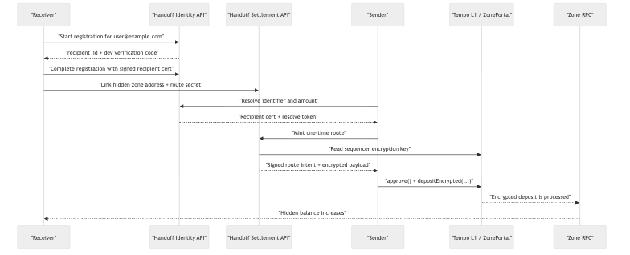

# Zone Examples

This crate holds runnable examples that build on the `zones` workspace.

## Handoff Demo

The current example is a more realistic Handoff-style private payment flow for zones.

It demonstrates:

- a public identifier like `user@example.com`
- a recipient-signed route commitment
- a real HTTP control plane for registration, resolve, and route minting
- a one-time route minted from that commitment by the server
- a real encrypted `ZonePortal.depositEncrypted(...)` call on Tempo L1
- a hidden recipient balance update on the zone

What is mocked or intentionally simplified:

- email delivery is simulated with a dev verification code returned by the server
- the Handoff server stores registrations and linked destinations in memory
- Handoff Identity and Handoff Settlement live in the same local server process
- no MPP
- no zk proof

What is real:

- the HTTP interactions between the demo client and the Handoff server
- the recipient, resolve-token, and route-intent signatures
- the portal encryption key lookup
- the ECIES payload generation
- the L1 token approval
- the `depositEncrypted(...)` transaction
- the zone-side balance increase

## Trust Assumptions

- The Handoff server is trusted to bind `user@example.com` to the correct recipient commitment during registration.
- Because Identity and Settlement run in the same local process in this PoC, the operator can link the public identifier, the hidden zone destination, and the payment metadata.
- The sender can verify signatures on the recipient cert, resolve token, and route intent, but without a zk proof the sender still trusts the server that the encrypted deposit payload really targets the recipient-authorized hidden destination.
- The receiver trusts the ZonePortal, sequencer, and zone RPC to process the encrypted deposit correctly and credit the hidden balance.
- Public chain observers can still see that a deposit happened, along with the token, amount, and portal contract, even though they cannot see the email identifier or hidden zone recipient.
- Email verification in this example proves mailbox control only; it does not prove legal identity or solve account-recovery risk.

In a stronger version of Handoff, the main upgrades would be splitting Identity from Settlement, adding zk proofs at route minting time, and persisting recipient bindings with stronger recovery rules.

## Alternative: Zone Virtual Addresses

Another plausible design is to resolve the email identifier to recipient-authorized zone routing material instead of returning an opaque encrypted deposit payload.

In the current `Zones` model, that means:

- the sender resolves the identifier to a zone-side virtual recipient or derivation hint
- the sender uses that resolved recipient as the `to` field inside `depositEncrypted(...)`
- the zone credits that recipient directly after decryption
- the routing service becomes closer to `identifier -> recipient-authorized routing material`

This helps with the current trust gap because the sender no longer has to trust a server-generated encrypted payload blindly. Instead, the sender can construct the encrypted deposit locally. The main tradeoff is how much linkability the published routing material introduces.

Two variants are worth distinguishing:

- Stable virtual address:
  `user@example.com -> one long-lived zone-side virtual recipient`
- Fresh virtual address:
  `user@example.com -> one-time or per-payment zone-side virtual recipient`

The stable version is much simpler, but it lets senders and recipients correlate repeated payments to the same destination. The fresh version preserves better privacy, but it needs either a minting service or recipient-published routing material that lets the sender derive a valid one-time zone recipient.

Even in the virtual-address model, the sender should still be able to verify that the returned routing material is recipient-authorized, for example through a recipient signature, derivation from recipient-published routing material, or a proof that the resolved virtual recipient is consistent with the signed recipient commitment.

## What Runs Where


Editable source: [examples/assets/handoff-what-runs-where.mmd](./assets/handoff-what-runs-where.mmd)

## Sequence Flow



Editable source: [examples/assets/handoff-sequence-flow.mmd](./assets/handoff-sequence-flow.mmd)

## Run

From the workspace root:

```bash
cargo run -p zone-examples -- demo \
  --zone-rpc-url http://127.0.0.1:8546
```

This will:

1. spawn a local Handoff server automatically
2. register `user@example.com`
3. link a freshly generated hidden zone address
4. resolve and mint a route over HTTP
5. submit a real encrypted deposit to the local zone

If the local `tempo-zone` process was started with `--l1.portal-address ...`, the demo will try to detect that automatically.

If auto-detection is not available, pass the portal explicitly:

```bash
cargo run -p zone-examples -- demo \
  --portal-address 0x6093069316396606e298106E5d122DA04f243ad5 \
  --l1-rpc-url https://rpc.moderato.tempo.xyz \
  --zone-rpc-url http://127.0.0.1:8546
```

## Run The Server Separately

If you want to keep the Handoff control plane running independently and point the demo at it:

```bash
cargo run -p zone-examples -- server \
  --zone-rpc-url http://127.0.0.1:8546
```

Then run the demo against that server:

```bash
cargo run -p zone-examples -- demo \
  --base-url http://127.0.0.1:3000 \
  --zone-rpc-url http://127.0.0.1:8546
```
