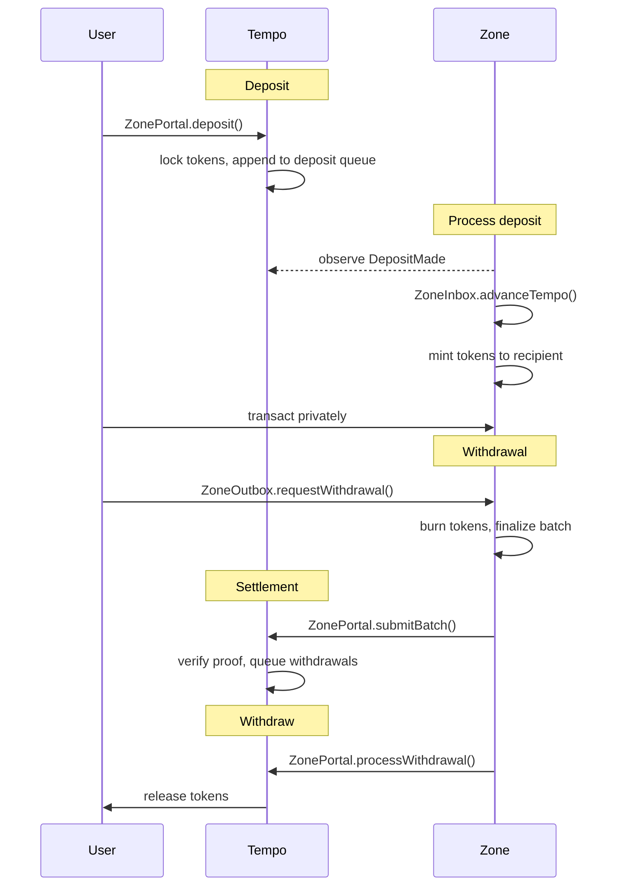
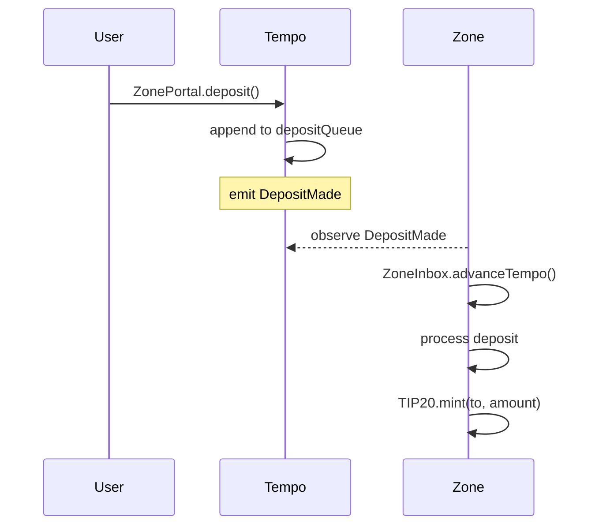
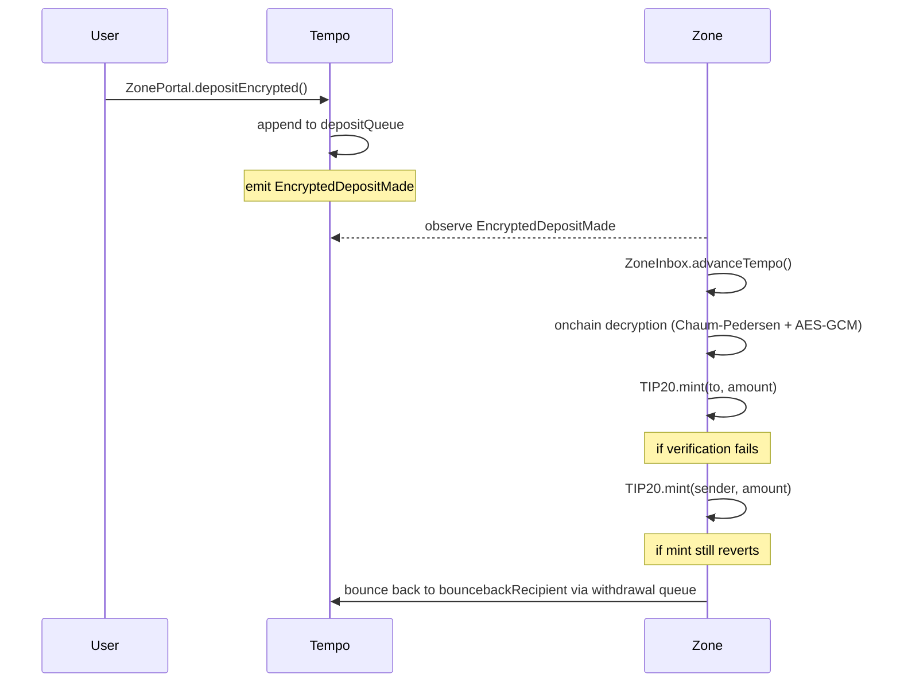
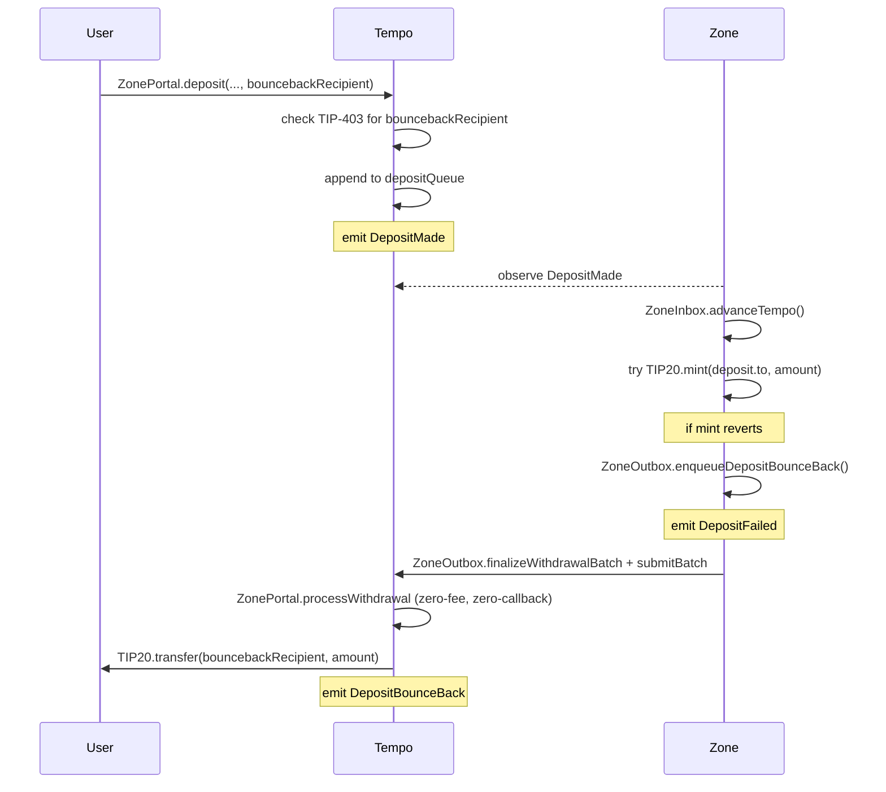
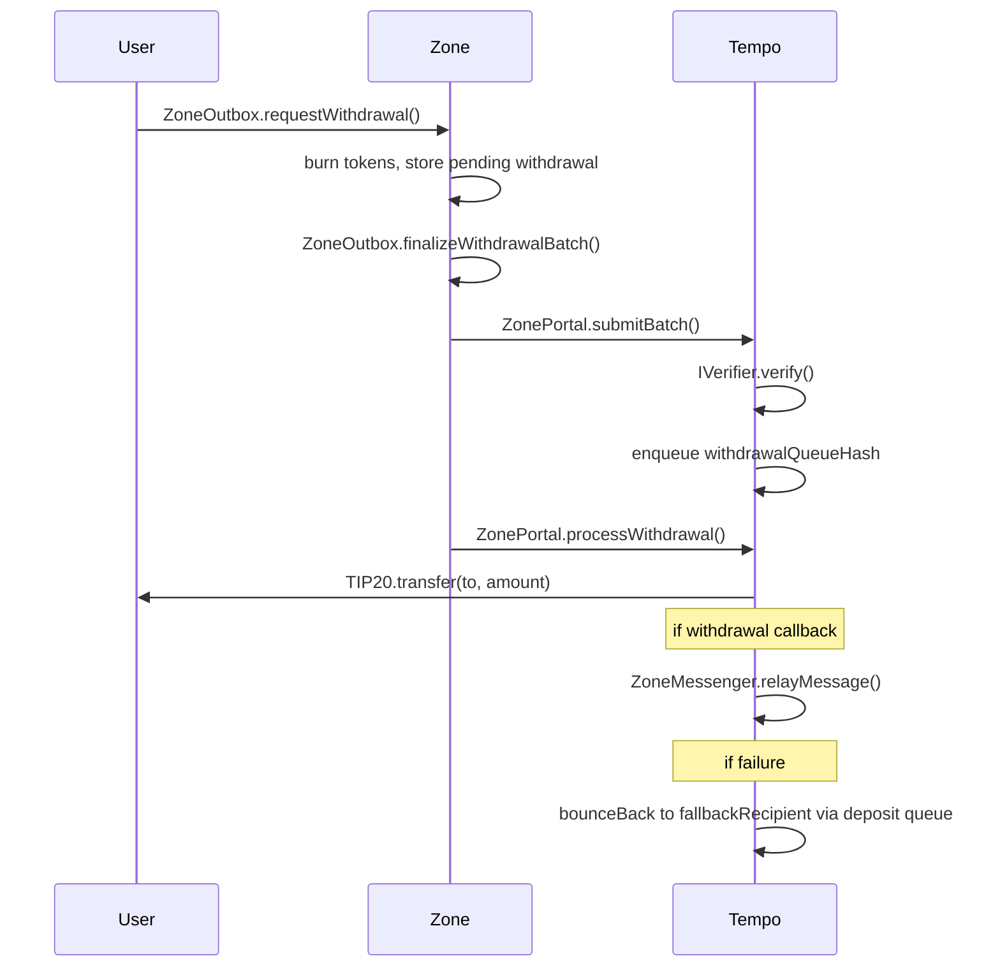

# Tempo Zones

**Table of Contents**

- [Abstract](#abstract)
- [Specification](#specification)
  - [Terminology](#terminology)
  - [System Overview](#system-overview)
  - [Zone Deployment](#zone-deployment)
    - [Chain ID](#chain-id)
    - [Tempo Contracts](#tempo-contracts)
    - [Zone Predeploys](#zone-predeploys)
    - [Zone Token Model](#zone-token-model)
  - [Sequencer Operations](#sequencer-operations)
    - [Token Management](#token-management)
    - [Gas Rate Configuration](#gas-rate-configuration)
    - [Encryption Key Management](#encryption-key-management)
    - [Sequencer Transfer](#sequencer-transfer)
  - [Deposits](#deposits)
    - [Regular Deposits](#regular-deposits)
    - [Deposit Fees](#deposit-fees)
    - [Deposit Queue](#deposit-queue)
    - [Encrypted Deposits](#encrypted-deposits)
    - [Onchain Decryption Verification](#onchain-decryption-verification)
    - [Deposit Failures and Bounce-Back](#deposit-failures-and-bounce-back)
  - [Withdrawals](#withdrawals)
    - [Withdrawal Request](#withdrawal-request)
    - [Withdrawal Fees](#withdrawal-fees)
    - [Withdrawal Batching](#withdrawal-batching)
    - [Withdrawal Queue](#withdrawal-queue)
    - [Withdrawal Processing](#withdrawal-processing)
    - [Withdrawal Callbacks](#withdrawal-callbacks)
    - [Withdrawal Failures and Bounce-Back](#withdrawal-failures-and-bounce-back)
    - [Authenticated Withdrawals](#authenticated-withdrawals)
    - [Zone-to-Zone Transfers](#zone-to-zone-transfers)
  - [Zone Execution](#zone-execution)
    - [Fee Accounting](#fee-accounting)
    - [Block Structure](#block-structure)
    - [Block Header Format](#block-header-format)
    - [Privacy Modifications](#privacy-modifications)
  - [Tempo State Reads](#tempo-state-reads)
    - [TempoState Predeploy](#tempostate-predeploy)
    - [Header Finalization](#header-finalization)
    - [Storage Reads](#storage-reads)
    - [Staleness and Finality](#staleness-and-finality)
  - [TIP-403 Policies](#tip-403-policies)
    - [Policy Enforcement on Zones](#policy-enforcement-on-zones)
    - [Policy Inheritance](#policy-inheritance)
  - [Private RPC](#private-rpc)
    - [Authorization Tokens](#authorization-tokens)
    - [Signature Types](#signature-types)
    - [Method Access Control](#method-access-control)
    - [Block Responses](#block-responses)
    - [Event Filtering](#event-filtering)
    - [Timing Side Channels](#timing-side-channels)
    - [WebSocket Subscriptions](#websocket-subscriptions)
    - [Zone-Specific Methods](#zone-specific-methods)
    - [Error Codes](#error-codes)
  - [Proving System](#proving-system)
    - [State Transition Function](#state-transition-function)
    - [Witness Structure](#witness-structure)
    - [Batch Output](#batch-output)
    - [Block Execution](#block-execution)
    - [Tempo State Proofs](#tempo-state-proofs)
    - [Deployment Modes](#deployment-modes)
  - [Batch Submission](#batch-submission)
    - [submitBatch](#submitbatch)
    - [Verifier Interface](#verifier-interface)
    - [Anchor Block Validation](#anchor-block-validation)
    - [Proof Requirements](#proof-requirements)
  - [Zone Precompiles](#zone-precompiles)
    - [TIP-20 Token Precompile](#tip-20-token-precompile)
    - [Chaum-Pedersen Verify](#chaum-pedersen-verify)
    - [AES-GCM Decrypt](#aes-gcm-decrypt)
  - [Contracts and Interfaces](#contracts-and-interfaces)
    - [Common Types](#common-types)
    - [IZoneFactory](#izonefactory)
    - [IZonePortal](#izoneportal)
    - [IZoneMessenger](#izonemessenger)
    - [IWithdrawalReceiver](#iwithdrawalreceiver)
    - [ITempoState](#itempostate)
    - [IZoneInbox](#izoneinbox)
    - [IZoneOutbox](#izoneoutbox)
    - [IZoneConfig](#izoneconfig)
    - [TIP-403 Registry](#tip-403-registry)
  - [Network Upgrades and Hard Fork Activation](#network-upgrades-and-hard-fork-activation)

---

# Abstract

A Tempo Zone is a private execution environment anchored to Tempo. Inside a zone, balances, transfers, and transaction history are invisible to block explorers, indexers, and other users. Each zone is operated by a dedicated sequencer that is the sole block producer, settling back to Tempo through a proof-agnostic verification system.

Funds enter a zone through deposits on Tempo, where they are locked in the portal. The zone mints equivalent tokens, and users transact privately with balances and transaction history hidden behind authenticated RPC access and execution-level controls. When users withdraw, tokens are burned on the zone and released from the portal on Tempo. Proofs guarantee that the sequencer executed every transaction correctly and cannot forge state transitions. Withdrawals support optional callbacks, making them composable with Tempo contracts and enabling zone-to-zone transfers.

This document specifies the zone protocol: deployment, sequencer operations, deposits, execution, the private RPC interface, the proving system, batch submission, withdrawals, precompiles, contract interfaces, and the network upgrade process.

# Specification

## Terminology

| Term | Definition |
|------|------------|
| Tempo | The base chain that zones settle to. |
| Zone | A private execution environment anchored to Tempo. |
| Portal | The contract on Tempo that locks deposited tokens and finalizes withdrawals for a zone. |
| Batch | A sequencer-produced commitment covering one or more zone blocks, submitted to Tempo with a proof. |
| Enabled token | A TIP-20 token that the sequencer has activated for deposits and withdrawals on a zone. Enablement is permanent. |
| TIP-20 | Tempo's fungible token standard. |
| TIP-403 | Tempo's compliance registry. Issuers attach transfer policies (whitelists, blacklists) to TIP-20 tokens. |
| Predeploy | A system contract deployed at a fixed address on the zone at genesis. |

<br>

## System Overview

Each zone is operated by a **sequencer** that collects transactions, produces blocks, generates proofs, and submits batches to Tempo. A single registered address controls sequencer operations for each zone. **Users** deposit TIP-20 tokens from Tempo into the zone, transact privately, and withdraw back to Tempo.

On the Tempo side, an onchain **verifier** contract validates that each batch was executed correctly. The verifier is abstracted behind a minimal interface (`IVerifier`) and is proof-agnostic. Any proving backend (ZK, TEE, or otherwise) can implement the interface. The portal does not care how the proof was produced.

On Tempo, each zone has a **portal** that locks deposited tokens. When a user deposits, the portal locks their tokens and appends the deposit to a queue. The sequencer observes the deposit, advances the zone's view of Tempo, and mints equivalent tokens on the zone.

Users transact on the zone privately. Balances, transfers, and transaction history are only visible to the account holder and the sequencer. The zone does not post transaction data, and data availability is entrusted to the sequencer. The sequencer has full visibility into zone activity. Privacy protects against public observers on Tempo, not against the sequencer.

Zones rely on the following trust assumptions: the verifier must be sound for state transition integrity, the sequencer is trusted for liveness and data availability, and there is no forced inclusion or permissionless exit mechanism.

When a user wants to exit, they request a withdrawal on the zone. Their tokens are burned on the zone side, and the withdrawal is added to a pending list. At the end of a batch, the sequencer finalizes all pending withdrawals into a hash chain and generates a proof covering the full batch of zone blocks. The sequencer submits this batch and proof to the portal on Tempo, which verifies the proof and queues the withdrawals. The sequencer then processes each withdrawal, releasing tokens from the portal to the recipient.



<br>

## Zone Deployment

A zone is created via `ZoneFactory.createZone(...)` on Tempo with the following parameters:

| Parameter | Description |
|-----------|-------------|
| `initialToken` | The first TIP-20 token to enable. The sequencer can enable additional tokens later. |
| `sequencer` | The address that will operate the zone. |
| `verifier` | The `IVerifier` contract used to validate batch proofs. |
| `zoneParams` | Genesis configuration: genesis block hash, genesis Tempo block hash, and genesis Tempo block number. |

The factory assigns a unique `zoneId`, deploys a [`ZonePortal`](#izoneportal) and a [`ZoneMessenger`](#izonemessenger), and enables the initial token. The [`ZoneCreated`](#izonefactory) event emits all deployment parameters.

### Chain ID

Each zone has a unique chain ID derived from its zone ID:

```
chain_id = 421700000 + zone_id
```

The prefix `4217` is derived from the Tempo chain ID. This ensures replay protection between zones. A transaction signed for one zone cannot be replayed on another. The chain ID is set in the zone's genesis configuration and validated by the zone node at startup.

### Tempo Contracts

A single [`ZoneFactory`](#izonefactory) on Tempo creates zones and maintains the registry of all deployed zones. When a zone is created, the factory deploys two contracts for it:

| Contract | Purpose |
|----------|---------|
| [`ZonePortal`](#izoneportal) | Locks deposited tokens, accepts batch submissions, verifies proofs, and processes withdrawals. Manages the token registry and deposit/withdrawal queues. |
| [`ZoneMessenger`](#izonemessenger) | Relays withdrawal callbacks. When a withdrawal includes calldata, the messenger transfers tokens from the portal to the recipient and executes the callback atomically. Deployed separately from the portal to isolate callback execution. |

The portal gives the messenger max approval for each enabled token so that withdrawal callbacks can transfer tokens from the portal to the recipient in a single call.

### Zone Predeploys

Each zone has six system contracts deployed at genesis at fixed addresses:

| Predeploy | Address | Purpose |
|-----------|---------|---------|
| [`TempoState`](#itempostate) | `0x1c00...0000` | Stores finalized Tempo block headers and provides storage read access to Tempo contracts. |
| [`ZoneInbox`](#izoneinbox) | `0x1c00...0001` | Advances the zone's view of Tempo and processes incoming deposits. Sole mint authority. |
| [`ZoneOutbox`](#izoneoutbox) | `0x1c00...0002` | Handles withdrawal requests and batch finalization. Sole burn authority. |
| [`ZoneConfig`](#izoneconfig) | `0x1c00...0003` | Central configuration. Reads the sequencer address and token registry from Tempo via `TempoState`. |
| `TempoStateReader` | `0x1c00...0004` | Precompile stub for reading Tempo L1 storage. Actual reads are performed by the zone node and validated against the `tempoStateRoot`. |
| `ZoneTxContext` | `0x1c00...0005` | Provides the current transaction hash to system contracts (used by `ZoneOutbox` for `senderTag` computation). |

`ZoneConfig` reads the sequencer address and token registry from the portal on Tempo via `TempoState` storage reads, making Tempo the single source of truth for zone configuration. See [Tempo State Reads](#tempo-state-reads) for details.

### Zone Token Model

Contract creation is disabled on zones (`CREATE` and `CREATE2` revert). All TIP-20 tokens on a zone are representations of Tempo tokens, deployed at the same address as on Tempo. When the sequencer enables a token on the portal, the zone's TIP-20 factory precompile (at `0x20Fc000000000000000000000000000000000000`) provisions a TIP-20 token precompile at that address. The factory is called by `ZoneInbox` during `advanceTempo` and is not user-accessible.

Token supply on the zone is controlled exclusively by the system contracts:

- `ZoneInbox` mints tokens when processing deposits from Tempo.
- `ZoneOutbox` burns tokens when users request withdrawals.

The zone-side supply of each token always equals net deposits minus net withdrawals. The corresponding tokens on Tempo are locked in the portal. No other actor can mint or burn zone tokens.

<br>

## Sequencer Operations

### Token Management

The sequencer manages which TIP-20 tokens are available on the zone:

- `enableToken(token)`: Enable a new TIP-20 for deposits and withdrawals. This is **irreversible**. Once enabled, a token can never be disabled.
- `pauseDeposits(token)`: Pause new deposits for a token. Does not affect withdrawals.
- `resumeDeposits(token)`: Resume deposits for a previously paused token.

The portal maintains a `TokenConfig` per token with an `enabled` flag and a configurable `depositsActive` flag, along with an append-only `enabledTokens` list. The sequencer can halt deposits but cannot disable withdrawals for an enabled token. Note that token issuers can independently restrict transfers via TIP-403 policies, which may cause withdrawals to fail and bounce back (see [Withdrawal Failures and Bounce-Back](#withdrawal-failures-and-bounce-back)).

### Gas Rate Configuration

The sequencer configures two gas rates that determine fees for deposits and withdrawals:

| Rate | Set via | Used for |
|------|---------|----------|
| `zoneGasRate` | `ZonePortal.setZoneGasRate()` | Deposit fees: `FIXED_DEPOSIT_GAS (100,000) * zoneGasRate` |
| `tempoGasRate` | `ZoneOutbox.setTempoGasRate()` | Withdrawal fees: `(WITHDRAWAL_BASE_GAS (50,000) + gasLimit) * tempoGasRate` |

Both rates are denominated in token units per gas unit. A single uniform `zoneGasRate` applies to all tokens. Fees are paid in the same token being deposited or withdrawn.

The sequencer takes the risk on Tempo gas price fluctuations for withdrawals. If actual gas costs on Tempo exceed the fee collected, the sequencer covers the difference. If costs are lower, the sequencer keeps the surplus.

### Encryption Key Management

The sequencer publishes a secp256k1 encryption public key used for [encrypted deposits](#encrypted-deposits). The key is set via `setSequencerEncryptionKey(x, yParity, popV, popR, popS)` on the portal, which requires a proof of possession (an ECDSA signature proving control of the corresponding private key).

The portal stores all historical encryption keys in an append-only list. Users specify a `keyIndex` when making encrypted deposits, referencing which key they encrypted to. This avoids a race condition where a key rotates between transaction signing and block inclusion.

When a new key is set, the previous key remains valid for `ENCRYPTION_KEY_GRACE_PERIOD` (86,400 blocks). After that, deposits using the old key are rejected. The current key never expires. Users can call `isEncryptionKeyValid(keyIndex)` before signing to check validity.

### Sequencer Transfer

The sequencer can transfer control to a new address via a two-step process on Tempo:

1. Current sequencer calls `ZonePortal.transferSequencer(newSequencer)` to nominate a new sequencer.
2. New sequencer calls `ZonePortal.acceptSequencer()` to accept the transfer.

Sequencer management happens exclusively on Tempo. Zone-side contracts read the sequencer address from the portal via `ZoneConfig`, so the transfer takes effect on the zone once `advanceTempo` imports the Tempo block containing the accepted transfer. The two-step pattern prevents accidental transfers to incorrect addresses.

<br>

## Deposits

Deposits move TIP-20 tokens from Tempo into a zone. The user deposits on Tempo, the portal locks the tokens and appends the deposit to a hash chain, and the sequencer mints equivalent tokens on the zone.

### Regular Deposits

A user deposits by calling `deposit(token, to, amount, memo, bouncebackRecipient)` on the portal. The portal:

1. Validates the token is enabled and deposits are active.
2. Validates `bouncebackRecipient` against the token's TIP-403 policy (if non-zero). This ensures that if the deposit later bounces back, the refund transfer on Tempo is guaranteed to be accepted by the policy (see [Deposit Failures and Bounce-Back](#deposit-failures-and-bounce-back)).
3. Transfers `amount` from the user into the portal.
4. Deducts the deposit fee (see [Deposit Fees](#deposit-fees)) and pays it to the sequencer immediately.
5. Appends the deposit to the deposit queue hash chain with the net amount (`amount - fee`) and `bouncebackRecipient`.
6. Emits `DepositMade`.

The sequencer observes `DepositMade` events and relays deposits to the zone via `ZoneInbox.advanceTempo()`. This function processes deposits in order, minting the zone-side TIP-20 token to each recipient: `mint(deposit.to, deposit.amount)`.

If the zone-side mint reverts (for example, because the recipient is blocked by a TIP-403 policy active on the zone at processing time), the deposit bounces back to `bouncebackRecipient` on Tempo. See [Deposit Failures and Bounce-Back](#deposit-failures-and-bounce-back) for the full mechanism. If the sequencer withholds deposits, funds remain locked in the portal with no forced inclusion mechanism.



### Deposit Fees

Each deposit incurs a fixed processing fee:

```
fee = FIXED_DEPOSIT_GAS * zoneGasRate
    = 100,000 * zoneGasRate
```

The fee is paid in the same token being deposited. It is deducted from the deposit amount and paid to the sequencer immediately on Tempo. The deposit queue stores the net amount (`amount - fee`), which is what gets minted on the zone. A deposit must be large enough to cover the fee. If it is not, the portal reverts with `DepositTooSmall`.

### Deposit Queue

Deposits flow from Tempo to the zone through a hash chain. The portal tracks a single `currentDepositQueueHash` representing the head of the chain. Each new deposit wraps the existing hash:

```
currentDepositQueueHash = keccak256(abi.encode(DepositType.Regular, deposit, currentDepositQueueHash))
```

The newest deposit is always outermost, making onchain addition O(1). The zone tracks its own `processedDepositQueueHash` in state. During `advanceTempo()`, the zone processes deposits oldest-first, rebuilding the hash chain and validating that the result matches `currentDepositQueueHash` read from Tempo state via `TempoState.readTempoStorageSlot()`.

After a batch is accepted, the portal updates `lastSyncedTempoBlockNumber` to record how far Tempo state was synced. Users can check whether their deposit has been processed by comparing their deposit's Tempo block number against this value.

### Encrypted Deposits

Users can encrypt the recipient and memo of a deposit so that only the sequencer can see who received the funds. The token, sender, and amount remain public (required for onchain accounting), but the `to` address and `memo` are encrypted.

The encryption scheme is ECIES with secp256k1:

1. The user generates an ephemeral keypair and derives a shared secret via ECDH with the sequencer's published encryption key.
2. The user derives an AES-256 key from the shared secret using HKDF-SHA256.
3. The user encrypts `(to || memo || padding)` with AES-256-GCM, producing ciphertext, a nonce, and an authentication tag.
4. The user calls `depositEncrypted(token, amount, keyIndex, encryptedPayload, bouncebackRecipient)` on the portal, where `keyIndex` references which encryption key they encrypted to (see [Encryption Key Management](#encryption-key-management)), and `bouncebackRecipient` is the Tempo address that receives a refund if zone-side processing fails (see [Deposit Failures and Bounce-Back](#deposit-failures-and-bounce-back)).

The portal locks the tokens, appends the encrypted deposit to the deposit queue, and emits `EncryptedDepositMade`. The sequencer decrypts the payload off-chain and provides the decrypted `(to, memo)` when processing the deposit on the zone via `advanceTempo()`.

Regular and encrypted deposits share a single ordered queue with a type discriminator in the hash:

```
keccak256(abi.encode(DepositType.Regular, deposit, prevHash))
keccak256(abi.encode(DepositType.Encrypted, encryptedDeposit, prevHash))
```

Deposits are processed in the exact order they were made, regardless of type.

| Field | Visibility | Reason |
|-------|------------|--------|
| `token` | Public | Required for onchain accounting and zone-side minting |
| `sender` | Public | Required for refunds if decryption fails |
| `amount` | Public | Required for onchain accounting |
| `to` | Encrypted | Only the sequencer learns the recipient |
| `memo` | Encrypted | Only the sequencer learns the payment context |

### Onchain Decryption Verification

When the sequencer processes an encrypted deposit on the zone, it claims the ciphertext decrypts to a specific `(to, memo)`. The zone verifies this onchain without the sequencer revealing their private key.

The sequencer provides the ECDH shared secret alongside the decrypted data. Verification proceeds in three steps:

1. **Chaum-Pedersen proof.** The sequencer provides a zero-knowledge proof that the shared secret was correctly derived: "I know `privSeq` such that `pubSeq = privSeq * G` AND `sharedSecretPoint = privSeq * ephemeralPub`." The [Chaum-Pedersen Verify](#chaum-pedersen-verify) precompile checks this proof. The sequencer's public key is looked up from the onchain key history, not supplied by the sequencer, preventing key substitution.

2. **AES-GCM decryption.** The zone derives an AES-256 key from the shared secret using HKDF-SHA256 (implemented in Solidity using the SHA256 precompile at `0x02`). The HKDF info string includes `tempoPortal`, `keyIndex`, and `ephemeralPubkeyX` for domain separation. The [AES-GCM Decrypt](#aes-gcm-decrypt) precompile decrypts the ciphertext and validates the GCM authentication tag.

3. **Plaintext validation.** The zone confirms the decrypted plaintext matches the `(to, memo)` the sequencer claimed. The plaintext is packed as `[address (20 bytes)][memo (32 bytes)][padding (12 bytes)]` totaling 64 bytes.

If any step fails (invalid proof, GCM tag mismatch, plaintext mismatch), the zone attempts to mint the tokens to the sender's address on the zone instead. If that mint also reverts (for example, because the sender is blocked by a TIP-403 policy on the zone), the deposit bounces back to `bouncebackRecipient` on Tempo (see [Deposit Failures and Bounce-Back](#deposit-failures-and-bounce-back)). This ensures chain progress is never blocked by invalid encrypted deposits and funds are never stranded.

The Chaum-Pedersen proof also prevents griefing. Without it, a user could submit garbage ciphertext that the sequencer cannot decrypt and cannot prove invalid, blocking the chain. The proof lets the sequencer demonstrate correct shared secret derivation, and the GCM tag failure then proves the ciphertext itself was invalid.



### Deposit Failures and Bounce-Back

> Related TIP: the guaranteed-liveness property of the Tempo-side refund transfer described below relies on [TIP-1049: System-Contract Transfer Policy Exemption](https://github.com/tempoxyz/tempo/blob/main/tips/tip-1049.md), which introduces `ITIP20.systemForceTransfer` and a `ZoneFactory`-gated authority predicate that covers every per-zone `ZonePortal`. Before TIP-1049 activates, the mechanism described here is still correct with respect to safety, but a refund transfer can still revert if the token's TIP-403 policy is edited to forbid `bouncebackRecipient` between deposit time and refund time.

Regular deposits always succeed on the original design: the zone simply mints to `deposit.to`. In practice the mint can revert. The most important case is TIP-403 policies: the policy for a token can change between the time the depositor sent funds on Tempo and the time the zone processes the deposit, and the new policy may forbid minting to `deposit.to`. Without a recovery path, those funds would be stranded — locked in the portal on Tempo, un-minted on the zone.

To address this symmetrically to [Withdrawal Failures and Bounce-Back](#withdrawal-failures-and-bounce-back), every deposit carries a `bouncebackRecipient`: a Tempo address that receives a refund if zone-side processing fails.

**Validation at deposit time.** When a user calls `deposit(...)` or `depositEncrypted(...)` with a non-zero `bouncebackRecipient`, the portal checks that the recipient is authorized by the token's current TIP-403 policy. The portal itself has a TIP-403 transfer bypass, but the bounce-back pays directly to `bouncebackRecipient`, so the recipient must satisfy the policy. Checking at deposit time guarantees that a later bounce-back transfer on Tempo will not itself revert on policy grounds. The check uses the portal's view of the policy at the time of deposit; later policy changes do not invalidate already-queued deposits.

**Triggering conditions.** The zone bounces a deposit back when `ZoneInbox.advanceTempo` attempts the final mint and the mint reverts. For a regular deposit, the final mint is to `deposit.to`. For an encrypted deposit with a valid decryption, the final mint is to the decrypted recipient; for an encrypted deposit with an invalid decryption (see [Onchain Decryption Verification](#onchain-decryption-verification)), the final mint is to the depositor as a fallback. A revert at any of those sites triggers a bounce-back, provided `bouncebackRecipient` is non-zero. Typical causes include:

- A TIP-403 policy active on the zone at processing time that forbids minting to the target address. For encrypted deposits this can hit either the decrypted recipient (valid decryption) or the depositor (invalid decryption), if either is blocked by the policy.
- An invalid encryption on an encrypted deposit — malformed Chaum-Pedersen proof, AES-GCM tag mismatch, or plaintext mismatch — which causes the zone to fall back to minting to the depositor, and that fallback mint then reverts (e.g. because the depositor itself is blocked by a TIP-403 policy on the zone).
- A custom TIP-20 `mint` that reverts for some token-specific reason.

**Zone-side handling.** When a mint reverts, the `ZoneInbox` catches the revert (rather than propagating it) and calls `ZoneOutbox.enqueueDepositBounceBack(token, amount, bouncebackRecipient)`. This records a zero-fee, zero-callback, zero-`fallbackRecipient` withdrawal in the outbox's pending list, with `sender = address(0)` and `txHash = bytes32(0)`. The inbox emits `DepositFailed` (for regular and decrypted-encrypted deposits) or `EncryptedDepositFailed` (for deposits whose decryption failed) so off-chain observers can track the failure. The deposit queue hash chain advances normally; no retries are performed on the zone.

**Tempo-side refund.** The bounce-back withdrawal is submitted in the next batch alongside any user-initiated withdrawals. When `ZonePortal.processWithdrawal` runs on the deposit-bounce-back entry (`gasLimit == 0`, `fee == 0`, `fallbackRecipient == address(0)`), it moves `amount` of `token` from the portal's escrow to `bouncebackRecipient` on Tempo. `bouncebackRecipient` was validated against the token's TIP-403 policy at deposit time, so that specific policy cannot cause the refund to fail. However, TIP-403 policies are mutable between deposit time and refund time, and the standard `ITIP20.transfer` does not exempt system contracts from the current policy. The guaranteed-liveness property of the refund therefore depends on [TIP-1049 (System-Contract Transfer Policy Exemption)](https://github.com/tempoxyz/tempo/blob/main/tips/tip-1049.md) activating: once TIP-1049 is live, `ZonePortal.processWithdrawal` uses `ITIP20.systemForceTransfer` on this path, which skips the TIP-403 check while preserving pause, zero-recipient, balance, and spending-limit enforcement. Until TIP-1049 activates, the refund transfer can still revert if the policy is edited to forbid `bouncebackRecipient` after the deposit; in that case the bounce-back re-enters the pending list and is retried on subsequent batches. The sequencer keeps the deposit fee that was already paid on Tempo.

**No recursive bounces.** Bounce-back paths are deliberately one-shot to prevent cycles:

- A deposit created by the portal as a bounce-back from a failed _withdrawal_ (`_enqueueWithdrawalBounceBack`) always sets `bouncebackRecipient = address(0)`. If zone-side minting to `fallbackRecipient` for such a deposit somehow reverted, the zone must not try to bounce again; it mints unconditionally. This matches the pre-existing invariant that bounce-back withdrawals are a terminal state.
- A withdrawal created by the zone as a bounce-back from a failed _deposit_ (`enqueueDepositBounceBack`) always sets `fee = 0`, `gasLimit = 0`, `callbackData = ""`, and `fallbackRecipient = address(0)`. The Tempo-side refund transfer is guaranteed-live against TIP-403 policy drift once [TIP-1049](https://github.com/tempoxyz/tempo/blob/main/tips/tip-1049.md) activates. For any non-policy revert (e.g. a paused token), the entry remains in the pending queue and is retried on subsequent batches; the portal never enqueues a second bounce-back for a deposit-bounce-back entry, so the depth of the chain is at most one.

**Opting out.** A depositor can pass `bouncebackRecipient = address(0)` to opt out of the bounce-back path. In that case the zone treats the mint as infallible and will propagate any revert; the deposit queue cannot advance past the failing entry. This preserves the previous behavior for depositors who prefer liveness failure over refund, and it is the mode used by the portal itself for internally-generated bounce-back deposits.

**Events summary.**

| Event | Emitted by | When |
|-------|------------|------|
| `DepositFailed` | `ZoneInbox` | Mint for a regular deposit (or decrypted encrypted deposit) reverted, funds queued for bounceback |
| `EncryptedDepositFailed` | `ZoneInbox` | Decryption failed (pre-existing event; now also emitted when the fallback mint to `sender` succeeds or after a bounceback is queued) |
| `DepositBounceBack` | `ZonePortal` | Bounce-back withdrawal processed on Tempo, funds credited to `bouncebackRecipient` |
| `WithdrawalBounceBack` | `ZonePortal` | Withdrawal-side bounce-back (renamed from `BounceBack` for symmetry with `DepositBounceBack`) |



<br>

## Withdrawals

Withdrawals move tokens from a zone back to Tempo. The user requests a withdrawal on the zone, tokens are burned, and the sequencer eventually processes the withdrawal on Tempo, releasing tokens from the portal.

A user withdraws by calling `requestWithdrawal(token, to, amount, memo, gasLimit, fallbackRecipient, data, revealTo)` on the `ZoneOutbox`. The user must first approve the outbox to spend `amount + fee` of the token.

The outbox transfers `amount + fee` from the user via `transferFrom`, burns the tokens, and stores the withdrawal in a pending array. The `WithdrawalRequested` event is emitted with the plaintext sender (zone events are private).



### Withdrawal Fees

The withdrawal fee compensates the sequencer for Tempo-side gas costs:

```
fee = (WITHDRAWAL_BASE_GAS + gasLimit) * tempoGasRate
    = (50,000 + gasLimit) * tempoGasRate
```

`WITHDRAWAL_BASE_GAS` (50,000) covers the fixed overhead of processing a withdrawal on Tempo (queue dequeue, transfer, event emission). The user specifies `gasLimit` covering any additional execution costs (e.g., callback gas). For simple withdrawals with no callback, use `gasLimit = 0`. The fee is paid in the same token being withdrawn. On success, `amount` goes to the recipient and `fee` goes to the sequencer. On failure (bounce-back), only `amount` is re-deposited to `fallbackRecipient`. The sequencer keeps the fee regardless of outcome.

### Withdrawal Batching

At the end of the final block in a batch, the sequencer calls `finalizeWithdrawalBatch(count, blockNumber, encryptedSenders)` on the `ZoneOutbox`. The `blockNumber` must match the current zone block number. The `encryptedSenders` array carries one ciphertext per finalized withdrawal for [authenticated withdrawals](#authenticated-withdrawals) (empty bytes for withdrawals without `revealTo`). This constructs a hash chain from pending withdrawals in LIFO order (newest to oldest), so the oldest withdrawal ends up outermost, enabling FIFO processing on Tempo:

```
withdrawalQueueHash = EMPTY_SENTINEL
for i from (count - 1) down to 0:
    withdrawalQueueHash = keccak256(abi.encode(withdrawals[i], withdrawalQueueHash))
```

The function writes `withdrawalQueueHash` and `withdrawalBatchIndex` to `lastBatch` storage, where the proof reads them. The call is required even if there are zero withdrawals (use `count = 0`) so the batch index advances. The `withdrawalBatchIndex` ensures batches are submitted in order, preventing the sequencer from omitting batches that contain withdrawals.

### Withdrawal Queue

The portal stores withdrawals in a fixed-size ring buffer with `WITHDRAWAL_QUEUE_CAPACITY = 100`. Each batch gets its own slot.

The portal tracks `head` (oldest unprocessed batch) and `tail` (where the next batch writes). Both are raw counters that never wrap. Modular arithmetic (`index % 100`) is used for slot indexing. Empty slots contain `EMPTY_SENTINEL` (`0xff...ff`) instead of `0x00` to avoid storage clearing and gas refund incentive issues.

When `submitBatch` includes a non-zero `withdrawalQueueHash`, it is written to `slots[tail % 100]` and `tail` advances. The queue reverts with `WithdrawalQueueFull` if `tail - head >= 100`.

### Withdrawal Processing

The sequencer processes withdrawals on Tempo by calling `processWithdrawal(withdrawal, remainingQueue)` on the portal. The portal verifies `keccak256(abi.encode(withdrawal, remainingQueue)) == slots[head % 100]`, then executes the withdrawal.

The withdrawal is popped unconditionally, regardless of success or failure. If `remainingQueue` is zero (last item in the slot), the slot is set to `EMPTY_SENTINEL` and `head` advances. Otherwise, the slot is updated to `remainingQueue`.

For simple withdrawals (`gasLimit == 0`), the portal transfers tokens directly to the recipient.

### Withdrawal Callbacks

For withdrawals with `gasLimit > 0`, the portal delegates to the `ZoneMessenger`. The messenger calls `transferFrom` to move tokens from the portal to the recipient, then calls the recipient with the provided `callbackData`. Both operations are atomic: if the callback reverts, the transfer reverts too.

Receiving contracts must implement `IWithdrawalReceiver` and return `onWithdrawalReceived.selector` to confirm successful handling. Receivers authenticate the call by checking `msg.sender == messenger`.

This enables composable withdrawals where funds flow directly into Tempo contracts (DEX swaps, staking, cross-zone deposits).

### Withdrawal Failures and Bounce-Back

Withdrawals can fail for several reasons:

- TIP-403 policy restricts the portal or recipient
- The token is paused
- The callback reverts (out of gas, logic error)
- The receiver returns the wrong selector

When a withdrawal fails, the portal bounces back the funds by creating a new deposit to `fallbackRecipient` on the zone:

```
currentDepositQueueHash = keccak256(abi.encode(DepositType.Regular, bounceBackDeposit, currentDepositQueueHash))
```

The zone processes the bounce-back deposit like any other deposit, crediting `fallbackRecipient`. The sequencer keeps the fee regardless of success or failure.

### Authenticated Withdrawals

Zone transactions are private, but when a withdrawal is processed on Tempo, the `Withdrawal` struct is passed in calldata and publicly visible. To avoid leaking the sender's identity, the `sender` field is replaced with a `senderTag` commitment:

```
senderTag = keccak256(abi.encodePacked(sender, txHash))
```

The `txHash` is the hash of the `requestWithdrawal` transaction on the zone. Since zone transaction data is not published, `txHash` acts as a blinding factor known only to the sender and the sequencer.

The sender can optionally specify a `revealTo` public key (compressed secp256k1, 33 bytes) when requesting the withdrawal. If provided, the sequencer encrypts `(sender, txHash)` to that key using ECDH and populates `encryptedSender` in the withdrawal struct. The wire format is `ephemeralPubKey (33 bytes) || nonce (12 bytes) || ciphertext (52 bytes) || tag (16 bytes)` totaling 113 bytes.

Two disclosure modes are available:

- **Manual reveal**: The sender shares `txHash` with a verifier off-chain. The verifier checks `keccak256(abi.encodePacked(sender, txHash)) == senderTag`.
- **Encrypted reveal**: The holder of the `revealTo` private key decrypts `encryptedSender` to obtain `(sender, txHash)` and verifies against `senderTag`. No off-chain communication needed.

The sequencer computes `senderTag` and `encryptedSender` during `finalizeWithdrawalBatch`. This is trusted: a malicious sequencer could insert incorrect values. This is a modest extension of the existing trust model, where the sequencer is already trusted for liveness and transaction ordering.

For callback withdrawals, `IWithdrawalReceiver.onWithdrawalReceived` receives `bytes32 senderTag` instead of a plaintext sender address.

### Zone-to-Zone Transfers

Zones do not interoperate directly. Zone-to-zone transfers work through composable withdrawals on Tempo.

The sender on Zone A requests a withdrawal with `revealTo` set to Zone B's sequencer public key and `callbackData` that deposits into Zone B's portal. The flow:

1. Zone A processes the withdrawal and submits the batch to Tempo.
2. `processWithdrawal` on Tempo transfers tokens to Zone B's portal via the messenger callback.
3. Zone B's sequencer observes the incoming deposit and decrypts `encryptedSender` to learn `(sender, txHash)`.
4. Zone B verifies `keccak256(sender || txHash) == senderTag`, enabling sender-aware processing.

Sequencer encryption keys are already published (used for encrypted deposits), so no additional infrastructure is needed. This pattern generalizes beyond zone-to-zone: a withdrawal can swap on a Tempo DEX and deposit into another zone in a single composable flow.

<br>

## Zone Execution

### Fee Accounting

Zone transactions specify which enabled TIP-20 token to use for gas fees via a `feeToken` field. The sequencer accepts all enabled tokens as gas. Transactions use Tempo transaction semantics for fee payer, max fee per gas, and gas limit.

### Block Structure

Each zone block contains system transactions and user transactions in a fixed order:

1. `ZoneInbox.advanceTempo(header, deposits, decryptions, enabledTokens)` (optional, at the start of the block). Advances the zone's view of Tempo, enables newly-bridged tokens, processes any pending deposits, and verifies encrypted deposit decryptions. If omitted, the zone's Tempo binding carries forward from the previous block.
2. User transactions, executed in order.
3. `ZoneOutbox.finalizeWithdrawalBatch(count, blockNumber, encryptedSenders)` (required in the final block of a batch, absent in intermediate blocks). Constructs the withdrawal hash chain from pending withdrawals, populates `encryptedSender` for authenticated withdrawals, and writes the `withdrawalQueueHash` and `withdrawalBatchIndex` to state. Must be called even if there are zero withdrawals so the batch index advances.

A batch covers one or more zone blocks, with each batch interval targeting 250 milliseconds. The sequencer controls batch frequency, and intermediate blocks within a batch contain only `advanceTempo` (optional) and user transactions.

### Block Header Format

Zone blocks use a simplified header with fewer fields than a standard Ethereum header:

| Field | Type | Description |
|-------|------|-------------|
| `parentHash` | `bytes32` | Hash of the parent block header |
| `beneficiary` | `address` | Sequencer address (must match the registered sequencer) |
| `stateRoot` | `bytes32` | MPT root of the zone state after executing all transactions |
| `transactionsRoot` | `bytes32` | Root computed over the ordered list of block transactions |
| `receiptsRoot` | `bytes32` | Root computed over the ordered list of transaction receipts |
| `number` | `uint64` | Block number |
| `timestamp` | `uint64` | Block timestamp (must be non-decreasing) |
| `protocolVersion` | `uint64` | Zone protocol version |

The block hash is `keccak256` of the RLP-encoded header. Batch proofs commit to block hash transitions (`prevBlockHash` to `nextBlockHash`), not raw state roots, so the proof covers the full header structure.

### Privacy Modifications

Zone execution differs from standard Tempo execution in three areas. These changes are enforced at the EVM level, not just at the RPC layer, so they apply to all code paths including user transactions, `eth_call` simulations, and prover re-execution.

- **Balance and allowance access control.** `balanceOf(account)` reverts unless `msg.sender` is the account owner or the sequencer. `allowance(owner, spender)` reverts unless `msg.sender` is the owner, the spender, or the sequencer.
- **Fixed gas for transfers.** All TIP-20 transfer and approve operations charge a fixed 100,000 gas regardless of storage layout. This eliminates a side channel where variable gas costs reveal whether a recipient has previously received tokens.
- **Contract creation disabled.** `CREATE` and `CREATE2` revert. The zone runs only predeploys and TIP-20 token precompiles. Arbitrary contract deployment would allow users to circumvent the execution-level privacy controls.

<br>

## Tempo State Reads

The zone reads all of its configuration from Tempo: the sequencer address, the token registry, the deposit queue hash, and TIP-403 policy state. Everything flows through the `TempoState` predeploy.

### TempoState Predeploy

`TempoState` is deployed at `0x1c00000000000000000000000000000000000000`. It stores finalized Tempo block header fields and provides storage read access to Tempo contracts.

The predeploy exposes Tempo wrapper fields (`generalGasLimit`, `sharedGasLimit`) and selected inner Ethereum header fields (`parentHash`, `beneficiary`, `stateRoot`, `blockNumber`, `timestamp`, etc.). The `tempoBlockHash` is always `keccak256(RLP(TempoHeader))`, committing to the complete header contents even though only a subset of fields are stored.

Tempo headers are RLP-encoded as `rlp([general_gas_limit, shared_gas_limit, timestamp_millis_part, inner])`, where `inner` is a standard Ethereum header.

### Header Finalization

`ZoneInbox.advanceTempo()` calls `TempoState.finalizeTempo(header)` to advance the zone's view of Tempo. This function decodes the RLP header, validates chain continuity (parent hash must match the previous finalized header, block number must increment by one), and stores the header fields.

If a block omits `advanceTempo`, the Tempo binding carries forward from the previous block. Multiple blocks can share the same Tempo binding.

### Storage Reads

`TempoState` provides `readTempoStorageSlot(account, slot)` for reading storage from any Tempo contract. This function is restricted to zone system contracts (`ZoneInbox`, `ZoneOutbox`, `ZoneConfig`). User transactions cannot call it.

The function is a precompile stub. The actual storage reads are performed by the zone node and validated against the `tempoStateRoot` from the finalized header. The prover includes Merkle proofs for each unique account and storage slot accessed by system contracts during the batch.

Current callers:

- `ZoneInbox`: `currentDepositQueueHash` and encryption keys from the portal
- `ZoneConfig`: sequencer address, token registry from the portal

TIP-403 policy authorization on the zone is handled by a dedicated read-only proxy precompile (at the same address as the L1 `TIP403Registry`), which resolves policy queries via the zone node's policy provider rather than calling `readTempoStorageSlot` directly.

### Staleness and Finality

The zone's view of Tempo is only as current as the most recent `advanceTempo` call. If the sequencer advances Tempo infrequently, zone-side reads of portal state (sequencer address, deposit queue, token registry) may lag behind Tempo.

The zone node must only finalize Tempo headers that have reached finality on Tempo. Proofs should only reference finalized Tempo blocks to avoid reorg risk.

<br>

## TIP-403 Policies

Zones inherit compliance policies from Tempo automatically. Token issuers set transfer policies once on Tempo, and zones enforce them without any additional configuration.

### Policy Enforcement on Zones

The zone has a `TIP403Registry` deployed at the same address as on Tempo. This contract is read-only and does not support writing policies. Its `isAuthorized` function reads policy state from Tempo via `TempoState.readTempoStorageSlot()`.

Zone-side TIP-20 transfers check `isAuthorized(policyId, from)` and `isAuthorized(policyId, to)` before executing. If either check fails, the transfer reverts.

### Policy Inheritance

Issuers manage policies exclusively on Tempo. When an issuer freezes an address, updates a blacklist, or modifies a whitelist on Tempo, the zone inherits the change the next time `advanceTempo` imports a Tempo block containing the update.

If a TIP-403 policy restricts the portal address or a withdrawal recipient, the withdrawal fails on Tempo and bounces back to the sender's `fallbackRecipient` on the zone (see [Withdrawal Failures and Bounce-Back](#withdrawal-failures-and-bounce-back)).

<br>

## Private RPC

Zones expose a modified Ethereum JSON-RPC where every request is authenticated and every response is scoped to the caller's account. The RPC is the primary user interface and the main attack surface for privacy leaks.

### Authorization Tokens

Every RPC request must include an authorization token in the `X-Authorization-Token` HTTP header. The token proves the caller controls a Tempo account and scopes all responses to that account.

The signed message is `keccak256` of a packed encoding containing a `"TempoZoneRPC"` magic prefix, a version byte (currently `0`), the `zoneId`, `chainId`, `issuedAt`, and `expiresAt` timestamps. The wire format concatenates the signature and the 29-byte token fields, with the token fields always at the end.

A `zoneId` of `0` indicates an unscoped token valid for any zone. Zone IDs start at 1, so `0` is never a valid zone ID. The maximum validity window is 30 days (`expiresAt - issuedAt <= 2592000`). A clock skew tolerance of 60 seconds is allowed for `issuedAt`.

The RPC server rejects authorization tokens where:

- `zoneId` does not match the zone's configured `zoneId` and is not `0`.
- `chainId` does not match the zone's chain ID.
- `expiresAt - issuedAt > 2592000`.
- `expiresAt <= now`.
- `issuedAt > now + 60`.
- The signature is malformed or does not verify.
- For Keychain signatures: the signing key is not authorized, revoked, or expired in the zone's `AccountKeychain`.

Requests without an authorization token receive HTTP `401`. Requests with an invalid or expired token receive HTTP `403`.

### Signature Types

Authorization token signatures follow the same format as Tempo transaction signatures:

| Type | Detection | Authentication |
|------|-----------|----------------|
| secp256k1 | 65 bytes, no prefix | Standard `ecrecover` |
| P256 | Prefix `0x01`, 130 bytes | Public key embedded in signature |
| WebAuthn | Prefix `0x02`, variable length | P256 key via WebAuthn assertion |
| Keychain V1 | Prefix `0x03` | Wraps inner sig + `user_address`, authenticates as root account |
| Keychain V2 | Prefix `0x04` | Same as V1 but binds `user_address` into signing hash |

Keychain keys allow session keys and scoped access keys to authenticate to the RPC with the same permissions as the root account. The zone has its own independent `AccountKeychain` instance, not mirrored from Tempo. Users must register keychain keys on the zone directly.

### Method Access Control

The RPC uses a default-deny model. Any method not explicitly listed returns `-32601` (method not found). Methods fall into four categories:

**Allowed.** `eth_chainId`, `eth_blockNumber`, `eth_gasPrice`, `eth_maxPriorityFeePerGas`, `eth_feeHistory`, `eth_getBlockByNumber` and `eth_getBlockByHash` (without full transactions), `eth_syncing`, `eth_coinbase`, `net_version`, `net_listening`, `web3_clientVersion`, `web3_sha3`.

**Scoped.** Available to any authenticated caller but filtered to the caller's account:

- `eth_getBalance`, `eth_getTransactionCount`: return `0x0` for non-self queries (no error, to avoid leaking account existence).
- `eth_getTransactionByHash`, `eth_getTransactionReceipt`: return `null` if the caller is not the sender.
- `eth_sendRawTransaction`: rejects if the transaction sender does not match the authenticated account.
- `eth_call`, `eth_estimateGas`: `from` must equal the authenticated account. State override sets and block override objects are rejected for non-sequencer callers.
- `eth_getLogs`, `eth_getFilterLogs`, `eth_getFilterChanges`: filtered to TIP-20 events where the caller is a relevant party (see [Event Filtering](#event-filtering)).
- `eth_newFilter`, `eth_newBlockFilter`, `eth_uninstallFilter`: allowed, filters are scoped to the authenticated account.

**Restricted (sequencer-only).** Methods that expose raw state, full block data, or transaction-level detail that would break per-account privacy. This includes raw state access (`eth_getStorageAt`, `eth_getCode`, `eth_createAccessList`), full block queries (`eth_getBlockByNumber`/`eth_getBlockByHash` with full transactions, `eth_getBlockReceipts`, `eth_getBlockTransactionCountByNumber`/`Hash`, `eth_getTransactionByBlockNumberAndIndex`/`HashAndIndex`, `eth_getUncleCountByBlockNumber`/`Hash`), and all `debug_*`, `admin_*`, and `txpool_*` namespace methods.

**Disabled.** Methods not available on zones. `eth_getProof` leaks trie structure. `eth_newPendingTransactionFilter` and `eth_subscribe("newPendingTransactions")` enable mempool observation. Uncle query methods (`eth_getUncleByBlockNumberAndIndex`, `eth_getUncleByBlockHashAndIndex`) and mining methods (`eth_mining`, `eth_hashrate`, `eth_getWork`, `eth_submitWork`, `eth_submitHashrate`) do not apply to zones.

### Block Responses

For non-sequencer callers, block responses are modified:

- The `transactions` field is always an empty array, regardless of the `include_transactions` parameter.
- The `logsBloom` field is zeroed. The Bloom filter summarizes all log topics and emitting addresses in the block, so returning the real value would allow probing whether a specific address had activity in that block.
- All other header fields (`number`, `hash`, `parentHash`, `timestamp`, `stateRoot`, `gasUsed`, etc.) are returned normally. Aggregate activity metrics are intentionally public.

The sequencer receives full block data.

### Event Filtering

All log queries are restricted to TIP-20 events where the authenticated account is a relevant party:

| Event | Relevant if |
|-------|-------------|
| `Transfer(from, to, amount)` | `from == caller` OR `to == caller` |
| `Approval(owner, spender, amount)` | `owner == caller` OR `spender == caller` |
| `TransferWithMemo(from, to, amount, memo)` | `from == caller` OR `to == caller` |
| `Mint(to, amount)` | `to == caller` |
| `Burn(from, amount)` | `from == caller` |

All other events (system events, configuration events) are filtered out. The `address` filter parameter must be a zone token address or omitted. The RPC server injects topic filters to restrict indexed address parameters to the caller, then post-filters results as a final pass.

### Timing Side Channels

Scoped methods that fetch data before checking authorization leak existence via timing differences. The RPC server enforces a minimum response time of 100ms on `eth_getTransactionByHash`, `eth_getTransactionReceipt`, `eth_getLogs`, `eth_getFilterLogs`, and `eth_getFilterChanges`.

Methods where authorization is checked before any data fetch (`eth_getBalance`, `eth_call`, `eth_sendRawTransaction`) do not need the speed bump.

### WebSocket Subscriptions

WebSocket connections follow the same authorization model. The authorization token is provided during the handshake and scopes all subscriptions for that connection.

- `eth_subscribe("newHeads")`: allowed, pushes block headers with `logsBloom` zeroed for non-sequencer callers.
- `eth_subscribe("logs")`: scoped to the authenticated account using the same event filtering rules.
- `eth_subscribe("newPendingTransactions")`: disabled.

The connection is terminated when the authorization token expires. For keychain-authenticated connections, the server must also terminate the connection within 1 second of importing a block that revokes the keychain key.

### Zone-Specific Methods

The zone exposes three methods under the `zone_` namespace:

| Method | Access | Description |
|--------|--------|-------------|
| `zone_getAuthorizationTokenInfo` | Any authenticated | Returns the authenticated account address and token expiry |
| `zone_getZoneInfo` | Any authenticated | Returns `zoneId`, `zoneTokens`, `sequencer`, `chainId` |
| `zone_getDepositStatus(tempoBlockNumber)` | Scoped | Returns deposit processing status for the given Tempo block, filtered to deposits where the caller is the sender or recipient |

There are no state-changing methods via authorization token. Withdrawals require a signed transaction submitted via `eth_sendRawTransaction`.

### Error Codes

| Code | Message | When |
|------|---------|------|
| `-32001` | Authorization token required | No token provided |
| `-32002` | Authorization token expired | Token has expired |
| `-32003` | Transaction rejected | Sender mismatch on `eth_sendRawTransaction` |
| `-32004` | Account mismatch | `from` mismatch on `eth_call` / `eth_estimateGas` |
| `-32005` | Sequencer only | Method requires sequencer access |
| `-32006` | Method disabled | Method not available on zones |

Methods where the user explicitly supplies a mismatched parameter return explicit errors (the user already knows the address they provided). Methods that query about other accounts return silent dummy values (`0x0`, `null`, empty results) to avoid revealing "data exists but you can't see it."

<br>

## Proving System

The proving system is proof-agnostic. The core is a pure state transition function that takes a witness, executes zone blocks, and outputs commitments for onchain verification. The onchain verifier is abstracted behind `IVerifier`, and the portal does not care how the proof was produced. Any proving backend (ZKVM, TEE, or otherwise) can run the same state transition function.

### State Transition Function

The entry point is a pure function:

```rust
pub fn prove_zone_batch(witness: BatchWitness) -> Result<BatchOutput, Error>
```

It takes a complete witness of zone blocks and their dependencies, executes EVM state transitions (including system transactions), and outputs commitments for onchain verification. The core commitment is the zone block hash transition, not the raw state root. The function is `no_std` compatible for portability across proving backends.

### Witness Structure

The witness contains everything needed to re-execute the batch:

- **PublicInputs**: `prev_block_hash`, `tempo_block_number`, `anchor_block_number`, `anchor_block_hash`, `expected_withdrawal_batch_index`, `sequencer`. These are the values the portal passes to the verifier and the proof must be consistent with.
- **BatchWitness**: the public inputs, the previous batch's block header, the zone blocks to execute, the initial zone state, Tempo state proofs, and Tempo ancestry headers (for ancestry validation).
- **ZoneBlock**: `number`, `parent_hash`, `timestamp`, `beneficiary`, `tempo_header_rlp` (optional), `deposits`, `decryptions`, `finalize_withdrawal_batch_count` (optional), and user `transactions`.
- **ZoneStateWitness**: account data with MPT proofs and the zone state root at the start of the batch. Only accounts and storage slots accessed during execution are included. Missing witness data must produce an error, not default to zero, to prevent the prover from omitting non-zero state.

### Batch Output

The state transition function produces:

| Field | Description |
|-------|-------------|
| `block_transition` | `prev_block_hash` to `next_block_hash` covering all blocks in the batch |
| `deposit_queue_transition` | `prev_processed_hash` to `next_processed_hash` for deposit processing |
| `withdrawal_queue_hash` | Hash chain of withdrawals finalized in this batch (`0` if none) |
| `last_batch_commitment` | `withdrawal_batch_index` read from `ZoneOutbox.lastBatch` |

### Block Execution

For each block in the batch, the prover:

1. Validates `parent_hash` matches the previous block's hash, `number` increments by one, `timestamp` is non-decreasing, and `beneficiary` equals the registered sequencer.
2. Executes `advanceTempo` if present (start of block): finalizes the Tempo header, processes deposits, verifies encrypted deposit decryptions.
3. Executes user transactions in order.
4. Executes `finalizeWithdrawalBatch` if present (required in the final block, absent in intermediate blocks).
5. Computes the block hash from the simplified zone header fields (see [Block Header Format](#block-header-format)).

### Tempo State Proofs

System contracts read Tempo state during execution (deposit queue hash, sequencer address, token registry, TIP-403 policies). The witness includes a `BatchStateProof` containing:

- A deduplicated `node_pool` of MPT nodes, keyed by `keccak256(rlp(node))`. Each node is verified exactly once.
- A list of `L1StateRead` entries, each specifying the zone block index, Tempo block number, account, storage slot, node path through the pool, and expected value.

Reads are indexed and verified on demand during execution. Because many reads access the same accounts and storage trie paths, the deduplicated pool significantly reduces proof size and prover cost compared to including separate MPT proofs per read.

Anchor validation ensures the zone's view of Tempo is correct. If `anchor_block_number` equals `tempo_block_number`, the zone's `tempoBlockHash` must match `anchor_block_hash` directly. If `anchor_block_number` is greater (for zones that have been offline longer than the EIP-2935 window), the proof verifies the parent-hash chain from `tempo_block_number` to `anchor_block_number` using the ancestry headers in the witness.

### Deployment Modes

The state transition function runs in any backend that can execute the `no_std` Rust function. Examples include ZKVMs and TEE environments. The same `prove_zone_batch` function is used regardless of backend.

<br>

## Batch Submission

The sequencer submits batches to Tempo via `ZonePortal.submitBatch()`. Each batch covers one or more zone blocks and includes a proof that the state transition was executed correctly.

### submitBatch

The call takes the following parameters:

| Parameter | Description |
|-----------|-------------|
| `tempoBlockNumber` | The Tempo block the zone committed to via `TempoState` |
| `recentTempoBlockNumber` | A recent Tempo block for ancestry validation (`0` for direct lookup) |
| `blockTransition` | Zone block hash transition: `prevBlockHash` to `nextBlockHash` |
| `depositQueueTransition` | Deposit queue processing: `prevProcessedHash` to `nextProcessedHash` |
| `withdrawalQueueHash` | Hash chain of withdrawals finalized in this batch (`0` if none) |
| `verifierConfig` | Opaque payload for the verifier (domain separation, attestation data) |
| `proof` | The proof or attestation produced by the proving backend |

On success, the portal:

1. Updates `blockHash` to `nextBlockHash`.
2. Updates `lastSyncedTempoBlockNumber` to `tempoBlockNumber`.
3. Advances `withdrawalBatchIndex`.
4. Adds the withdrawal hash chain to the next slot in the withdrawal queue ring buffer (if `withdrawalQueueHash` is non-zero).
5. Emits `BatchSubmitted`.

### Verifier Interface

The portal calls the verifier to validate each batch:

```solidity
interface IVerifier {
    function verify(
        uint64 tempoBlockNumber,
        uint64 anchorBlockNumber,
        bytes32 anchorBlockHash,
        uint64 expectedWithdrawalBatchIndex,
        address sequencer,
        BlockTransition calldata blockTransition,
        DepositQueueTransition calldata depositQueueTransition,
        bytes32 withdrawalQueueHash,
        bytes calldata verifierConfig,
        bytes calldata proof
    ) external view returns (bool);
}
```

The portal computes `anchorBlockNumber` and `anchorBlockHash` from the submission parameters (see [Anchor Block Validation](#anchor-block-validation)) and passes them alongside the portal's current `withdrawalBatchIndex + 1` as `expectedWithdrawalBatchIndex` and the registered `sequencer` address. The `verifierConfig` and `proof` are opaque to the portal.

### Anchor Block Validation

The portal needs to verify that the zone's view of Tempo (via `TempoState`) is anchored to a real Tempo block. It looks up a block hash via the EIP-2935 block hash history precompile and passes it to the verifier.

If `recentTempoBlockNumber` is `0`, the portal looks up `tempoBlockNumber` directly from EIP-2935. The proof must show that the zone's `tempoBlockHash` matches this hash.

If `recentTempoBlockNumber` is greater than `tempoBlockNumber`, the portal looks up `recentTempoBlockNumber` from EIP-2935 instead. The proof verifies the parent-hash chain from `tempoBlockNumber` to `recentTempoBlockNumber` internally, using Tempo headers included in the witness. This allows batch submission even when `tempoBlockNumber` has rotated out of the EIP-2935 window (roughly 8192 blocks), preventing the zone from being bricked after extended downtime.

`recentTempoBlockNumber` must be strictly greater than `tempoBlockNumber` when non-zero. Both values must be at or after `genesisTempoBlockNumber`.

### Proof Requirements

The proof must validate:

1. The state transition from `prevBlockHash` to `nextBlockHash` is correct.
2. The zone committed to `tempoBlockNumber` via `TempoState`.
3. The zone's `tempoBlockHash` matches `anchorBlockHash` (direct), or the parent-hash chain from `tempoBlockNumber` to `anchorBlockNumber` is valid (ancestry).
4. `ZoneOutbox.lastBatch().withdrawalBatchIndex` equals `expectedWithdrawalBatchIndex`.
5. `ZoneOutbox.lastBatch().withdrawalQueueHash` matches the submitted `withdrawalQueueHash`.
6. Every zone block `beneficiary` matches `sequencer`.
7. Deposit processing is correct (the zone read `currentDepositQueueHash` from Tempo state and processed deposits accordingly).

## Zone Precompiles

Zones have three categories of precompiles: TIP-20 token precompiles (one per enabled token) and two cryptographic precompiles for encrypted deposit verification.

### TIP-20 Token Precompile

Each enabled TIP-20 token is deployed as a precompile at the same address as on Tempo. The precompile implements the standard TIP-20 interface with privacy modifications:

- `balanceOf` and `allowance` are restricted to the account owner (or sequencer).
- Transfer-family operations (`transfer`, `transferFrom`, `approve`) charge a fixed 100,000 gas.
- `mint` is restricted to `ZoneInbox`, `burn` is restricted to `ZoneOutbox`.

### Chaum-Pedersen Verify

| | |
|---|---|
| **Address** | `0x1c00000000000000000000000000000000000100` |
| **Gas** | ~8,000 |

```solidity
interface IChaumPedersenVerify {
    function verifyProof(
        bytes32 ephemeralPubX,
        uint8 ephemeralPubYParity,
        bytes32 sharedSecret,
        uint8 sharedSecretYParity,
        bytes32 sequencerPubX,
        uint8 sequencerPubYParity,
        ChaumPedersenProof calldata proof
    ) external view returns (bool valid);
}
```

Verifies that an ECDH shared secret was correctly derived from the sequencer's private key and an ephemeral public key, without exposing the private key. Used during [onchain decryption verification](#onchain-decryption-verification) of encrypted deposits.

The verifier reconstructs commitments `R1 = s*G - c*pubSeq` and `R2 = s*ephemeralPub - c*sharedSecretPoint`, recomputes the Fiat-Shamir challenge `c' = hash(G, ephemeralPub, pubSeq, sharedSecretPoint, R1, R2)`, and checks `c == c'`.

### AES-GCM Decrypt

| | |
|---|---|
| **Address** | `0x1c00000000000000000000000000000000000101` |
| **Gas** | ~1,000 base + ~500 per 32 bytes of ciphertext |

```solidity
interface IAesGcmDecrypt {
    function decrypt(
        bytes32 key,
        bytes12 nonce,
        bytes calldata ciphertext,
        bytes calldata aad,
        bytes16 tag
    ) external view returns (bytes memory plaintext, bool valid);
}
```

Performs AES-256-GCM decryption and authentication tag verification. Returns the decrypted plaintext and `true` if the tag validates, or empty bytes and `false` otherwise. Used during [onchain decryption verification](#onchain-decryption-verification) of encrypted deposits.

HKDF-SHA256 key derivation (used to derive the AES key from the ECDH shared secret) is implemented in Solidity using the SHA256 precompile at `0x02`, keeping this precompile minimal.

<br>

## Contracts and Interfaces

This section lists the key types and contract interfaces referenced throughout the spec. Only the essential functions are shown. Implementations may include additional view functions and events.

### Common Types

```solidity
struct Deposit {
    address token;
    address sender;
    address to;
    uint128 amount;
    bytes32 memo;
}

struct Withdrawal {
    address token;
    bytes32 senderTag;          // keccak256(abi.encodePacked(sender, txHash))
    address to;
    uint128 amount;
    uint128 fee;
    bytes32 memo;
    uint64 gasLimit;
    address fallbackRecipient;
    bytes callbackData;         // max 1KB
    bytes encryptedSender;      // ECDH-encrypted (sender, txHash), or empty
}

struct EncryptedDeposit {
    address token;
    address sender;
    uint128 amount;
    uint256 keyIndex;
    EncryptedDepositPayload encrypted;
}

struct EncryptedDepositPayload {
    bytes32 ephemeralPubkeyX;
    uint8 ephemeralPubkeyYParity;
    bytes ciphertext;
    bytes12 nonce;
    bytes16 tag;
}

struct DecryptionData {
    bytes32 sharedSecret;
    uint8 sharedSecretYParity;
    address to;
    bytes32 memo;
    ChaumPedersenProof cpProof;
}

struct ChaumPedersenProof {
    bytes32 s;  // response
    bytes32 c;  // challenge
}

struct BlockTransition {
    bytes32 prevBlockHash;
    bytes32 nextBlockHash;
}

struct DepositQueueTransition {
    bytes32 prevProcessedHash;
    bytes32 nextProcessedHash;
}

struct TokenConfig {
    bool enabled;
    bool depositsActive;
}

struct ZoneInfo {
    uint32 zoneId;
    address portal;
    address messenger;
    address initialToken;
    address sequencer;
    address verifier;
    bytes32 genesisBlockHash;
    bytes32 genesisTempoBlockHash;
    uint64 genesisTempoBlockNumber;
}

struct ZoneParams {
    bytes32 genesisBlockHash;
    bytes32 genesisTempoBlockHash;
    uint64 genesisTempoBlockNumber;
}

struct LastBatch {
    bytes32 withdrawalQueueHash;
    uint64 withdrawalBatchIndex;
}
```

### IZoneFactory

```solidity
interface IZoneFactory {
    struct CreateZoneParams {
        address initialToken;
        address sequencer;
        address verifier;
        ZoneParams zoneParams;
    }

    event ZoneCreated(
        uint32 indexed zoneId, address indexed portal, address indexed messenger,
        address initialToken, address sequencer, address verifier,
        bytes32 genesisBlockHash, bytes32 genesisTempoBlockHash, uint64 genesisTempoBlockNumber
    );

    function createZone(CreateZoneParams calldata params) external returns (uint32 zoneId, address portal);
    function zoneCount() external view returns (uint32);
    function zones(uint32 zoneId) external view returns (ZoneInfo memory);
    function isZonePortal(address portal) external view returns (bool);
}
```

### IZonePortal

```solidity
interface IZonePortal {
    // Events
    event DepositMade(
        bytes32 indexed newCurrentDepositQueueHash, address indexed sender,
        address token, address to, uint128 netAmount, uint128 fee, bytes32 memo,
        address bouncebackRecipient, uint64 depositNumber
    );
    event EncryptedDepositMade(
        bytes32 indexed newCurrentDepositQueueHash, address indexed sender,
        address token, uint128 netAmount, uint128 fee, uint256 keyIndex,
        bytes32 ephemeralPubkeyX, uint8 ephemeralPubkeyYParity,
        bytes ciphertext, bytes12 nonce, bytes16 tag, uint64 depositNumber
    );
    event BatchSubmitted(
        uint64 indexed withdrawalBatchIndex, bytes32 nextProcessedDepositQueueHash,
        bytes32 nextBlockHash, bytes32 withdrawalQueueHash,
        uint64 lastProcessedDepositNumber
    );
    event WithdrawalProcessed(address indexed to, address token, uint128 amount, bool callbackSuccess);
    event WithdrawalBounceBack(
        bytes32 indexed newCurrentDepositQueueHash, address indexed fallbackRecipient,
        address token, uint128 amount, uint64 depositNumber
    );
    event DepositBounceBack(address indexed bouncebackRecipient, address token, uint128 amount);
    event SequencerTransferStarted(address indexed currentSequencer, address indexed pendingSequencer);
    event SequencerTransferred(address indexed previousSequencer, address indexed newSequencer);
    event SequencerEncryptionKeyUpdated(bytes32 x, uint8 yParity, uint256 keyIndex, uint64 activationBlock);
    event ZoneGasRateUpdated(uint128 zoneGasRate);
    event TokenEnabled(address indexed token, string name, string symbol, string currency);
    event DepositsPaused(address indexed token);
    event DepositsResumed(address indexed token);

    // Token management
    function enableToken(address token) external;
    function pauseDeposits(address token) external;
    function resumeDeposits(address token) external;
    function isTokenEnabled(address token) external view returns (bool);
    function areDepositsActive(address token) external view returns (bool);
    function enabledTokenCount() external view returns (uint256);
    function enabledTokenAt(uint256 index) external view returns (address);

    // Deposits
    function deposit(
        address token, address to, uint128 amount, bytes32 memo, address bouncebackRecipient
    ) external returns (bytes32 newCurrentDepositQueueHash);
    function depositEncrypted(
        address token, uint128 amount, uint256 keyIndex,
        EncryptedDepositPayload calldata encrypted, address bouncebackRecipient
    ) external returns (bytes32 newCurrentDepositQueueHash);
    function calculateDepositFee() external view returns (uint128 fee);
    function depositCount() external view returns (uint64);
    function lastProcessedDepositNumber() external view returns (uint64);

    // Batch submission
    function submitBatch(
        uint64 tempoBlockNumber, uint64 recentTempoBlockNumber,
        BlockTransition calldata blockTransition, DepositQueueTransition calldata depositQueueTransition,
        bytes32 withdrawalQueueHash, bytes calldata verifierConfig, bytes calldata proof
    ) external;

    // Withdrawal processing
    function processWithdrawal(Withdrawal calldata withdrawal, bytes32 remainingQueue) external;

    // Sequencer management
    function transferSequencer(address newSequencer) external;
    function acceptSequencer() external;
    function setZoneGasRate(uint128 _zoneGasRate) external;

    // Encryption keys
    function setSequencerEncryptionKey(bytes32 x, uint8 yParity, uint8 popV, bytes32 popR, bytes32 popS) external;
    function sequencerEncryptionKey() external view returns (bytes32 x, uint8 yParity);
    function isEncryptionKeyValid(uint256 keyIndex) external view returns (bool valid, uint64 expiresAtBlock);

    // State
    function sequencer() external view returns (address);
    function verifier() external view returns (address);
    function blockHash() external view returns (bytes32);
    function currentDepositQueueHash() external view returns (bytes32);
    function withdrawalBatchIndex() external view returns (uint64);
    function lastSyncedTempoBlockNumber() external view returns (uint64);
}
```

### IZoneMessenger

```solidity
interface IZoneMessenger {
    function portal() external view returns (address);
    function relayMessage(
        address token, bytes32 senderTag, address target,
        uint128 amount, uint64 gasLimit, bytes calldata data
    ) external;
}
```

### IWithdrawalReceiver

```solidity
interface IWithdrawalReceiver {
    function onWithdrawalReceived(
        bytes32 senderTag, address token, uint128 amount, bytes calldata callbackData
    ) external returns (bytes4);
}
```

The receiver must return `IWithdrawalReceiver.onWithdrawalReceived.selector` to confirm successful handling.

### ITempoState

Address: `0x1c00000000000000000000000000000000000000`

```solidity
interface ITempoState {
    event TempoBlockFinalized(bytes32 indexed blockHash, uint64 indexed blockNumber, bytes32 stateRoot);

    function tempoBlockHash() external view returns (bytes32);
    function tempoBlockNumber() external view returns (uint64);
    function tempoStateRoot() external view returns (bytes32);
    function tempoTimestamp() external view returns (uint64);

    function finalizeTempo(bytes calldata header) external;
    function readTempoStorageSlot(address account, bytes32 slot) external view returns (bytes32);
    function readTempoStorageSlots(address account, bytes32[] calldata slots) external view returns (bytes32[] memory);
}
```

### IZoneInbox

Address: `0x1c00000000000000000000000000000000000001`

```solidity
interface IZoneInbox {
    event TempoAdvanced(
        bytes32 indexed tempoBlockHash, uint64 indexed tempoBlockNumber,
        uint256 depositsProcessed, bytes32 newProcessedDepositQueueHash
    );
    event DepositProcessed(
        bytes32 indexed depositHash, address indexed sender, address indexed to,
        address token, uint128 amount, bytes32 memo
    );
    event EncryptedDepositProcessed(
        bytes32 indexed depositHash, address indexed sender, address indexed to,
        address token, uint128 amount, bytes32 memo
    );
    event EncryptedDepositFailed(
        bytes32 indexed depositHash, address indexed sender, address token, uint128 amount
    );
    event TokenEnabled(address indexed token, string name, string symbol, string currency);

    function processedDepositQueueHash() external view returns (bytes32);
    function advanceTempo(
        bytes calldata header, QueuedDeposit[] calldata deposits, DecryptionData[] calldata decryptions,
        EnabledToken[] calldata enabledTokens
    ) external;
}
```

`EnabledToken` carries token metadata (`token`, `name`, `symbol`, `currency`) for provisioning zone-side TIP-20 precompiles via the TIP-20 factory.

### IZoneOutbox

Address: `0x1c00000000000000000000000000000000000002`

```solidity
interface IZoneOutbox {
    event WithdrawalRequested(
        uint64 indexed withdrawalIndex, address indexed sender, address token, address to,
        uint128 amount, uint128 fee, bytes32 memo, uint64 gasLimit,
        address fallbackRecipient, bytes data, bytes revealTo
    );
    event TempoGasRateUpdated(uint128 tempoGasRate);
    event MaxWithdrawalsPerBlockUpdated(uint256 maxWithdrawalsPerBlock);
    event BatchFinalized(bytes32 indexed withdrawalQueueHash, uint64 withdrawalBatchIndex);

    function tempoGasRate() external view returns (uint128);
    function lastBatch() external view returns (LastBatch memory);
    function calculateWithdrawalFee(uint64 gasLimit) external view returns (uint128);
    function setTempoGasRate(uint128 _tempoGasRate) external;

    function requestWithdrawal(
        address token, address to, uint128 amount, bytes32 memo,
        uint64 gasLimit, address fallbackRecipient, bytes calldata data
    ) external;

    function requestWithdrawal(
        address token, address to, uint128 amount, bytes32 memo,
        uint64 gasLimit, address fallbackRecipient, bytes calldata data, bytes calldata revealTo
    ) external;

    function finalizeWithdrawalBatch(uint256 count, uint64 blockNumber, bytes[] calldata encryptedSenders)
        external returns (bytes32 withdrawalQueueHash);
}
```

### IZoneConfig

Address: `0x1c00000000000000000000000000000000000003`

```solidity
interface IZoneConfig {
    function sequencer() external view returns (address);
    function isSequencer(address account) external view returns (bool);
    function isEnabledToken(address token) external view returns (bool);
    function sequencerEncryptionKey() external view returns (bytes32 x, uint8 yParity);
}
```

Reads the sequencer address, token registry, and encryption key from the portal on Tempo via `TempoState` storage reads.

### TIP-403 Registry

Deployed at the same address as on Tempo. Read-only on the zone. Its `isAuthorized(policyId, account)` function reads policy state from Tempo via `TempoState.readTempoStorageSlot()`. Zone-side TIP-20 transfers call this automatically.

<br>

## Network Upgrades and Hard Fork Activation

> **Note:** The verifier rotation and protocol version mechanisms described below are the target design. The current `ZonePortal` implementation declares `verifier` as `immutable`, so the rotation mechanism is not yet implemented. This section will be updated when the upgrade contracts are deployed.

Zones activate hard fork upgrades in lockstep with Tempo using same-block activation. The trigger is the Tempo block number: the zone block whose `advanceTempo` imports the fork Tempo block uses the new execution rules for its entire scope.

The portal will maintain two verifier slots (`verifier` and `forkVerifier`). At each fork, verifiers rotate: the previous fork verifier is promoted to `verifier`, and the new fork verifier takes the `forkVerifier` slot. At most two verifiers are active at any time. The `IVerifier` interface is unchanged across forks. New proof parameters are passed via the opaque `verifierConfig` bytes.

`ZoneFactory` will maintain a `protocolVersion` counter incremented at each fork. Zone nodes embed the highest protocol version they support and halt cleanly if the imported Tempo block bumps `protocolVersion` beyond their supported version, preventing an outdated node from producing blocks under incorrect rules.

No onchain action is required from zone operators. The new verifier is deployed and rotated as part of the Tempo hard fork. Operators upgrade their zone node binary and prover program before the fork. When the fork Tempo block arrives, the node activates new rules automatically.

The portal will enforce a `forkActivationBlock` cutoff where batches targeting the old `verifier` must have `tempoBlockNumber < forkActivationBlock`. This prevents post-fork batches from being submitted against old verification rules.

The Tempo hard fork block executes the following as system transactions:

1. Deploy the new `IVerifier` contract.
2. Call `ZoneFactory.setForkVerifier(forkVerifier)`, which for each registered portal promotes `forkVerifier` to `verifier`, installs the new verifier as `forkVerifier`, and sets `forkActivationBlock = block.number`.
3. Increment `ZoneFactory.protocolVersion`.

If the fork changes zone predeploy behavior, the zone node injects new bytecode at the predeploy addresses before `advanceTempo` executes in the first post-fork zone block.

The two-verifier invariant means only the two most recent verifiers are active at any time. A zone that falls more than one full fork cycle behind loses the ability to submit its oldest unproven batches once the N-2 verifier is deprecated.

If the operator does not upgrade before the fork, the zone node detects the unsupported protocol version and halts cleanly. If the node is upgraded but the prover is stale, zone execution continues but settlement pauses until the new prover is installed. In both cases, user funds remain safe in the portal.
