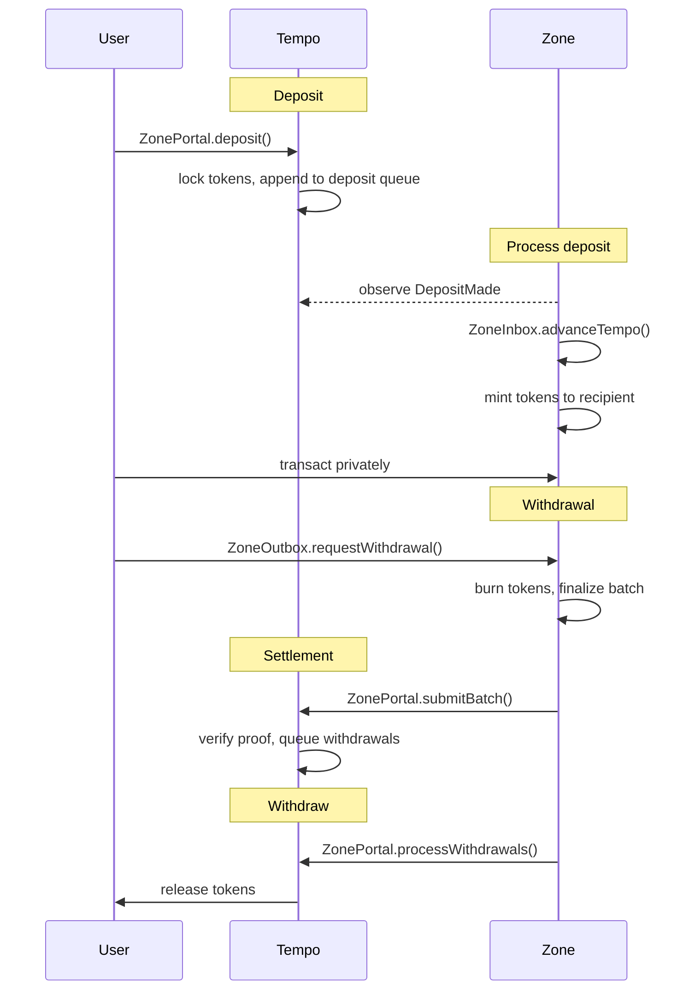
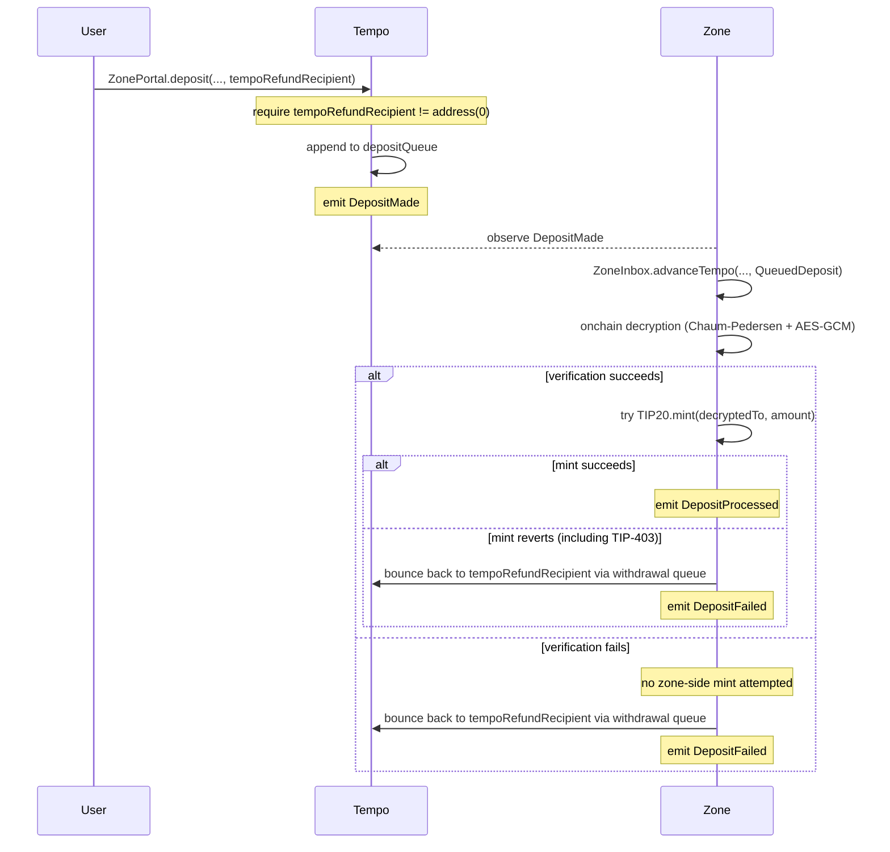
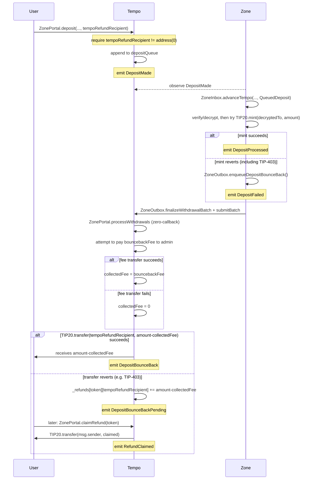
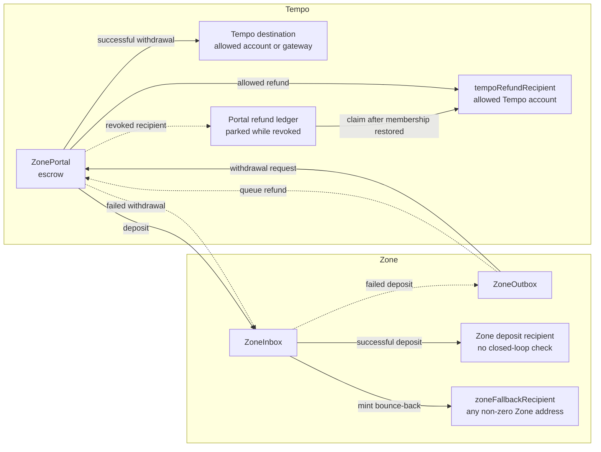
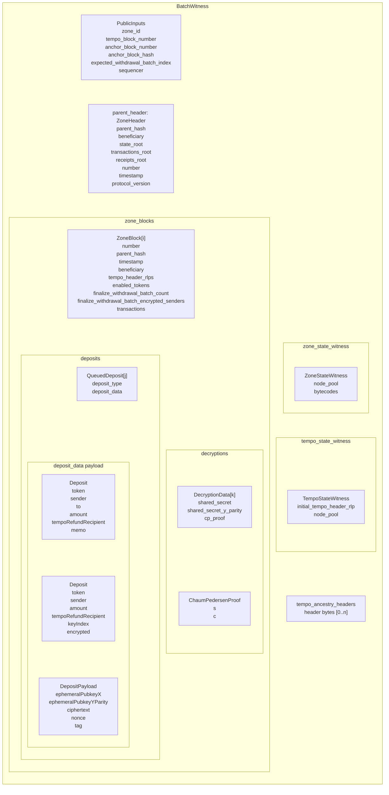

# Tempo Zones

**Table of Contents**

- [Abstract](#abstract)
- [Specification](#specification)
  - [Terminology](#terminology)
  - [System Overview](#system-overview)
  - [Access Control](#access-control)
    - [Roles](#roles)
    - [Permission Matrix](#permission-matrix)
  - [Zone Deployment](#zone-deployment)
    - [Chain ID](#chain-id)
    - [Tempo Contracts](#tempo-contracts)
    - [Zone Predeploys](#zone-predeploys)
    - [Zone Token Model](#zone-token-model)
  - [Sequencer Operations](#sequencer-operations)
    - [Token Management](#token-management)
    - [Gas Rate Configuration](#gas-rate-configuration)
    - [Encryption Key Management](#encryption-key-management)
    - [Sequencer Set Rotation](#sequencer-set-rotation)
    - [Admin Transfer](#admin-transfer)
  - [Deposits](#deposits)
    - [Deposit Fees](#deposit-fees)
    - [Deposit Queue](#deposit-queue)
    - [Deposits](#deposits)
    - [Onchain Decryption Verification](#onchain-decryption-verification)
    - [Deposit Failures and Bounce-Back](#deposit-failures-and-bounce-back)
  - [Withdrawals](#withdrawals)
    - [Withdrawal Request](#withdrawal-request)
    - [Withdrawal Fees](#withdrawal-fees)
    - [Withdrawal Batching](#withdrawal-batching)
    - [Withdrawal Queue](#withdrawal-queue)
    - [Withdrawal Processing](#withdrawal-processing)
    - [Withdrawal Callbacks](#withdrawal-callbacks)
    - [Withdrawal Failures and Bounce-Back](#withdrawal-failures-and-bounce-back)
    - [Authenticated Withdrawals](#authenticated-withdrawals)
    - [Zone-to-Zone Transfers](#zone-to-zone-transfers)
  - [Zone Execution](#zone-execution)
    - [Fee Accounting](#fee-accounting)
    - [Block Structure](#block-structure)
    - [Block Header Format](#block-header-format)
    - [Privacy Modifications](#privacy-modifications)
  - [Tempo State Reads](#tempo-state-reads)
    - [TempoState Predeploy](#tempostate-predeploy)
    - [Tempo Follower Mode](#tempo-follower-mode)
    - [Header Finalization](#header-finalization)
    - [Storage Reads](#storage-reads)
    - [Staleness and Finality](#staleness-and-finality)
  - [TIP-403 Policies](#tip-403-policies)
    - [Policy Enforcement on Zones](#policy-enforcement-on-zones)
    - [Policy Inheritance](#policy-inheritance)
  - [Redacted RPC](#redacted-rpc)
    - [Authorization Tokens](#authorization-tokens)
    - [Signature Types](#signature-types)
    - [Method Access Control](#method-access-control)
    - [Block Responses](#block-responses)
    - [Event Filtering](#event-filtering)
    - [WebSocket Subscriptions](#websocket-subscriptions)
    - [Zone-Specific Methods](#zone-specific-methods)
    - [Error Codes](#error-codes)
  - [Proving System](#proving-system)
    - [State Transition Function](#state-transition-function)
    - [Witness Structure](#witness-structure)
    - [Input Schematic](#input-schematic)
    - [Detailed Input Definitions](#detailed-input-definitions)
    - [Shared Trie Proof Format](#shared-trie-proof-format)
    - [Batch Output](#batch-output)
    - [Block Execution](#block-execution-stateless-prover-execution-function)
    - [Tempo State Witness](#tempo-state-witness)
    - [Deployment Modes](#deployment-modes)
  - [Batch Submission](#batch-submission)
    - [submitBatch](#submitbatch)
    - [Verifier Interface](#verifier-interface)
    - [Anchor Block Validation](#anchor-block-validation)
    - [Proof Requirements](#proof-requirements)
  - [Zone Precompiles](#zone-precompiles)
    - [TIP-20 Token Precompile](#tip-20-token-precompile)
    - [Chaum-Pedersen Verify](#chaum-pedersen-verify)
    - [AES-GCM Decrypt](#aes-gcm-decrypt)
  - [Contracts and Interfaces](#contracts-and-interfaces)
    - [Common Types](#common-types)
    - [IZoneFactory](#izonefactory)
    - [IZonePortal](#izoneportal)
    - [IZoneMessenger](#izonemessenger)
    - [IWithdrawalReceiver](#iwithdrawalreceiver)
    - [ITempoState](#itempostate)
    - [IZoneInbox](#izoneinbox)
    - [IZoneOutbox](#izoneoutbox)
    - [TIP-403 Registry](#tip-403-registry)
  - [Network Upgrades and Hard Fork Activation](#network-upgrades-and-hard-fork-activation)

---

# Abstract

A Tempo Zone is a private execution environment anchored to Tempo. Inside a zone, balances, transfers, and transaction history are invisible to block explorers, indexers, and other users. Each zone is operated by a dedicated sequencer that is the sole block producer, settling back to Tempo through a proof-agnostic verification system.

Funds enter a zone through deposits on Tempo, where they are locked in the portal. The zone mints equivalent tokens, and users transact privately with balances and transaction history hidden behind authenticated RPC access and execution-level controls. When users withdraw, tokens are burned on the zone and released from the portal on Tempo. Proofs guarantee that the sequencer executed every transaction correctly and cannot forge state transitions. Each portal has two independent, admin-mutable boolean flags: `accessMode` controls account allowlist enforcement for deposits, refunds, and plain withdrawals, while `gatewayMode` controls callback target registration. Disabling either flag disables only its corresponding checks without deleting the stored mapping.

This document specifies the zone protocol: deployment, sequencer operations, deposits, execution, the operator and redacted RPC interfaces, the proving system, batch submission, withdrawals, precompiles, contract interfaces, and the network upgrade process.

# Specification

## Terminology

| Term | Definition |
|------|------------|
| Tempo | The base chain that zones settle to. |
| Zone | A private execution environment anchored to Tempo. |
| Portal | The contract on Tempo that locks deposited tokens and finalizes withdrawals for a zone. |
| Batch | A sequencer-produced commitment covering one or more zone blocks, submitted to Tempo with a proof. |
| Admin | The privileged governance role for a zone. Cold/mission-critical key. Controls token enablement. See [Access Control](#access-control). |
| Sequencer | The privileged operational role for a zone. Hot/online key. Sole block producer; submits batches and processes withdrawals. See [Access Control](#access-control). |
| Enabled token | A TIP-20 token that the admin has activated for deposits and withdrawals on a zone. Enablement is permanent. |
| TIP-20 | Tempo's fungible token standard. |
| TIP-403 | Tempo's compliance registry. Issuers attach transfer policies (whitelists, blacklists) to TIP-20 tokens. |
| Predeploy | A system contract deployed at a fixed address on the zone at genesis. |
| Allowed account | An address assigned the portal's `Account` role. The role is enforced while `accessMode` is `true` and retained but inactive while it is `false`. |
| ZoneGateway | A Tempo callback contract assigned the portal's `CallbackGateway` role. The role is enforced while `gatewayMode` is `true` and retained but inactive while it is `false`. |

<br>

## System Overview

Each zone is operated by a **sequencer** that collects transactions, produces blocks, generates proofs, and submits batches to Tempo. A single registered address controls sequencer operations for each zone. Each zone also has a separate **admin** role that holds governance powers (enabling tokens, configuring deposit pause/resume); see [Access Control](#access-control). **Users** deposit TIP-20 tokens from Tempo into the zone, transact privately, and withdraw back to Tempo.

On the Tempo side, an onchain **verifier** contract validates that each batch was executed correctly. The verifier is abstracted behind a minimal interface (`IVerifier`) and is proof-agnostic. Any proving backend (ZK, TEE, or otherwise) can implement the interface. The portal does not care how the proof was produced.

On Tempo, each zone has a **portal** that locks deposited tokens. All user deposits encrypt the zone recipient and memo to a registered sequencer encryption key. In closed access mode, only allowed accounts may initiate deposits and refund recipients must also be allowed; open access mode skips both membership checks. Decrypted zone recipients need not be allowed Tempo accounts. The portal locks the tokens and appends the deposit to a queue. The sequencer observes the deposit, advances the zone's view of Tempo, and mints equivalent tokens on the zone.

Users transact on the zone privately. Balances, transfers, and transaction history are only visible to the account holder and the sequencer. The zone does not post transaction data, and data availability is entrusted to the sequencer. The sequencer has full visibility into zone activity. Privacy protects against public observers on Tempo, not against the sequencer.

Zones rely on the following trust assumptions: the verifier must be sound for state transition integrity, the sequencer is trusted for liveness and data availability, and there is no forced inclusion or permissionless exit mechanism.

When a user wants to exit, they request a withdrawal on the zone. Their tokens are burned on the zone side, and the withdrawal is added to a pending list. At the end of a batch, the sequencer finalizes all pending withdrawals into a hash chain and generates a proof covering the full batch of zone blocks. The sequencer submits this batch and proof to the portal on Tempo, which verifies the proof and queues the withdrawals. The sequencer then processes each withdrawal, releasing tokens from the portal to the recipient.


```mermaid
sequenceDiagram
    participant U as User
    participant T as Tempo
    participant Z as Zone

    Note over T: Deposit
    U->>T: ZonePortal.deposit()
    T->>T: lock tokens, append to deposit queue

    Note over Z: Process deposit
    Z-->>T: observe DepositMade
    Z->>Z: ZoneInbox.advanceTempo()
    Z->>Z: mint tokens to recipient

    U->>Z: transact privately

    Note over Z: Withdrawal
    U->>Z: ZoneOutbox.requestWithdrawal()
    Z->>Z: burn tokens, finalize batch

    Note over T: Settlement
    Z->>T: ZonePortal.submitBatch()
    T->>T: verify proof, queue withdrawals

    Note over T: Withdraw
    Z->>T: ZonePortal.processWithdrawals()
    T->>U: release tokens
```

<br>

## Access Control

Each zone has two privileged roles registered on the [`ZonePortal`](#izoneportal): an **admin** and a set of **sequencers**. The roles are intentionally separated so that mission-critical governance powers can be held in a cold key (or multisig) while day-to-day block production runs from operational keys. An admin MAY also be a sequencer; the protocol does not enforce separation.

### Roles

**Admin.**

- Holds governance powers over the zone (token enablement, deposit pause/resume, and account and gateway membership).
- Expected to be a cold key, multisig, or governance contract.
- Set at zone creation via [`IZoneFactory.createZone`](#izonefactory).
- Rotatable via a two-step transfer (see [Admin Transfer](#admin-transfer)), so a lost or compromised admin key can be moved to a new cold key or multisig.
- Cannot be renounced. 

**Sequencers.**

- Operates the zone: collects transactions, produces blocks, advances Tempo, processes deposits and withdrawals, and submits batches with proofs.
- Are equal online operational keys; there is no primary sequencer.
- Are configured at creation as a nonempty set of at most eight unique addresses and a nonzero threshold no greater than the set size.
- May be replaced atomically by the admin together with the threshold. The configuration nonce starts at `0`; each later replacement increments `sequencerSetVersion` and invalidates certificates from earlier configurations.
- Any active sequencer may perform a sequencer-authorized portal operation. Batch settlement additionally requires a threshold certificate.
- Hold the encryption private keys used to decrypt [deposits](#deposits).

A zone MAY include its admin in the sequencer set. The protocol still treats each privileged call as belonging to its role.

### Permission Matrix

The following table lists every privileged action and the role authorized to invoke it.

| Action | Contract | Authorized caller |
|---|---|---|
| `enableToken(token)` | [`ZonePortal`](#izoneportal) | **admin** |
| `pauseDeposits(token)` | [`ZonePortal`](#izoneportal) | **admin** |
| `resumeDeposits(token)` | [`ZonePortal`](#izoneportal) | **admin** |
| `setRole(account, role)` | [`ZonePortal`](#izoneportal) | **admin** |
| `setAccessMode(mode)` | [`ZonePortal`](#izoneportal) | **admin** |
| `setGatewayMode(mode)` | [`ZonePortal`](#izoneportal) | **admin** |
| `transferAdmin(newAdmin)` | [`ZonePortal`](#izoneportal) | **admin** |
| `acceptAdmin()` | [`ZonePortal`](#izoneportal) | **pending admin** |
| `setSequencerSet(sequencers, threshold)` | [`ZonePortal`](#izoneportal) | **admin** |
| `setZoneGasRate(rate)` | [`ZonePortal`](#izoneportal) | **admin** |
| `setMaxTempoGasRate(rate)` | [`ZonePortal`](#izoneportal) | **admin** |
| `setBouncebackGas(gasAmount)` | [`ZonePortal`](#izoneportal) | **admin** |
| `setSequencerEncryptionKey(...)` | [`ZonePortal`](#izoneportal) | **any active sequencer** |
| `setRpcUrl(url)` | [`ZonePortal`](#izoneportal) | **any active sequencer** |
| `submitBatch(...)` | [`ZonePortal`](#izoneportal) | **any active sequencer with a threshold certificate** |
| `processWithdrawals(...)` | [`ZonePortal`](#izoneportal) | **any active sequencer** |
| `setTempoGasRate(rate)` | [`ZoneOutbox`](#izoneoutbox) (zone-side) | **sequencer** or zone system caller (`address(0)`) |
| `setMaxWithdrawalsPerBlock(limit)` | [`ZoneOutbox`](#izoneoutbox) (zone-side) | **sequencer** or zone system caller (`address(0)`) |
| `finalizeWithdrawalBatch(...)` | [`ZoneOutbox`](#izoneoutbox) (zone-side) | **zone system caller (`address(0)`) only** |
| Block production / `beneficiary` | zone | **sequencer** |

Rationale notes:

- **Token enablement and deposit pause/resume are admin-only** because they govern what the zone is and which deposit flows are open. A compromised sequencer hot key MUST NOT be able to enable arbitrary tokens or unilaterally re-open paused deposits.
- **Withdrawal gas rates are sequencer-controlled within an admin ceiling** so the sequencer can react quickly to Tempo gas-price fluctuations while the admin retains control over the maximum user fee. The admin directly controls the Tempo-side deposit and bounce-back fee parameters.
- **Encryption key management is sequencer-only** because the proof of possession requires the encryption private key.
- **Zone-side system calls** to `ZoneOutbox` use `msg.sender == address(0)`. Withdrawal finalization is system-only; sequencers may call the gas-rate and withdrawal-limit setters directly.
- **Withdrawal processing is sequencer-only** today; whether to make it permissionless once the proof has settled is tracked separately.

<br>

## Zone Deployment

A zone is created via `ZoneFactory.createZone(...)` on Tempo with the following parameters:

| Parameter | Description |
|-----------|-------------|
| `initialToken` | The first TIP-20 token to enable. The admin can enable additional tokens later. |
| `accessMode` | Initial account enforcement flag: `true` requires the `Account` role; `false` skips account membership checks. The admin may change it later. |
| `gatewayMode` | Initial callback enforcement flag: `true` requires the `CallbackGateway` role; `false` accepts arbitrary callback targets. The admin may change it later. |
| `allowedAccounts` | Optional addresses initially assigned the `Account` role. An empty closed configuration denies all accounts until the admin assigns one; open mode may pre-stage roles for a later close. Members MUST NOT be the messenger. |
| `zoneGateways` | Optional addresses initially assigned the `CallbackGateway` role. Gateways MUST NOT also be allowed accounts. Roles are retained while gateway mode is open. |
| `admin` | The nonzero address that holds the admin role for the zone. |
| `sequencers` | One to eight unique, nonzero equal sequencer addresses. Creation-time order is not significant. |
| `threshold` | The number of distinct active-sequencer signatures required for settlement. MUST be nonzero and no greater than `sequencers.length`. |
| `rpcUrl` | The operator RPC endpoint advertised for the zone. |

The native factory assigns a unique `zoneId`, etches the TIP-1091 proxy runtime at its reserved vanity address, initializes the portal storage with the fixed messenger and verifier, sets `blockHash` and the initial sequencer-set configuration nonce to zero, and enables the initial token. The [`ZoneCreated`](#izonefactory) event emits the zone deployment parameters.

The shared portal runtime MUST preserve the native factory's constructor-equivalent storage suffix:

| Slot | Offset | Value |
|------|-------:|-------|
| 15 | 0 | `zoneId` |
| 15 | 4 | `messenger` |
| 16 | 0 | `verifier` |
| 16 | 20 | `_initialized` |
| 16 | 21 | `sequencerSetVersion` |
| 16 | 29 | `sequencerThreshold` |
| 17 | 0 | `zoneHeight` |
| 18 | 0 | `_sequencers` |
| 19 | 0 | `isSequencer` |
| 20 | 0 | `role` |
| 21 | 0 | `_isAccessEnforced` |
| 21 | 1 | `_isGatewayEnforced` |

The factory performs this initialization natively in the portal account; the Solidity
`initialize` function documents and tests the equivalent state transition.

### Chain ID

Each zone has a unique chain ID derived from its zone ID:

```
chain_id = 421700000 + zone_id
```

The prefix `4217` is derived from the Tempo chain ID. This ensures replay protection between zones. A transaction signed for one zone cannot be replayed on another. The chain ID is set in the zone's genesis configuration and validated by the zone node at startup.

### Tempo Contracts

A single [`ZoneFactory`](#izonefactory) on Tempo creates zones and maintains the registry of all deployed zones. The factory also exposes the shared [`ZoneMessenger`](#izonemessenger) used for withdrawal callbacks. When a zone is created, the factory deploys one per-zone contract:

| Contract | Purpose |
|----------|---------|
| [`ZonePortal`](#izoneportal) | Locks deposited tokens, accepts batch submissions, verifies proofs, and processes withdrawals. Manages the token registry and deposit/withdrawal queues. |

The factory's shared `ZoneMessenger` is fixed when each portal is initialized. It is separated from the portal so callback code does not execute with the fund-owning portal as `msg.sender`. Portal roles are managed atomically with `setRole(account, role)`. An account has exactly one of `None`, `Account`, or `CallbackGateway`; the messenger cannot have the `Account` role. `setAccessMode` and `setGatewayMode` activate or deactivate enforcement of the corresponding roles without clearing them.

Account and gateway membership is evaluated when each portal or zone-side action executes. Revoked in-flight destinations and gateways bounce back, while revoked refund recipients have funds parked until membership is restored.

### Zone Predeploys

Each zone has four system contracts deployed at genesis at fixed addresses:

| Predeploy | Address | Purpose |
|-----------|---------|---------|
| [`TempoState`](#itempostate) | `0x1c00...0000` | Stores the finalized Tempo checkpoint used to anchor the zone's Tempo L1 state view. |
| [`ZoneInbox`](#izoneinbox) | `0x1c00...0001` | Advances the zone's view of Tempo and processes incoming deposits. Sole mint authority. |
| [`ZoneOutbox`](#izoneoutbox) | `0x1c00...0002` | Handles withdrawal requests and batch finalization. Sole burn authority. |
| `ZoneTxContext` | `0x1c00...0005` | Provides the current transaction hash to system contracts (used by `ZoneOutbox` for `senderTag` computation). |

### Zone Token Model

Contract creation is disabled on zones (`CREATE` and `CREATE2` revert). All TIP-20 tokens on a zone are representations of Tempo tokens, deployed at the same address as on Tempo. When the sequencer enables a token on the portal, `ZoneInbox` directly initializes the corresponding TIP-20 state and bridge roles during `advanceTempo`. The TIP-20 factory is disabled on zones.

Token supply on the zone is controlled exclusively by the system contracts:

- `ZoneInbox` mints tokens when processing deposits from Tempo.
- `ZoneOutbox` burns tokens when users request withdrawals.

The zone-side supply of each token always equals net deposits minus net withdrawals. The corresponding tokens on Tempo are locked in the portal. No other actor can mint or burn zone tokens.

<br>

## Sequencer Operations

### Token Management

The admin manages which TIP-20 tokens are available on the zone (see [Access Control](#access-control)):

- `enableToken(token)`: Enable a new TIP-20 for deposits and withdrawals. This is **irreversible**. Once enabled, a token can never be disabled.
- `pauseDeposits(token)`: Pause new deposits for a token. Does not affect withdrawals.
- `resumeDeposits(token)`: Resume deposits for a previously paused token.

The portal maintains a `TokenConfig` per token with an `enabled` flag and a configurable `depositsActive` flag, along with an append-only `enabledTokens` list. The admin can halt deposits but cannot disable withdrawals for an enabled token. To keep the mandatory zone-side `advanceTempo()` call within its fixed system gas budget, each portal accepts at most `MAX_TOKENS_ENABLED_PER_TEMPO_BLOCK` (8) token enablements in one Tempo block, including the initial token enabled during portal creation. Metadata copied into the zone is bounded by encoded byte length: 64 bytes for `name` and 31 bytes each for `symbol` and `currency`. Note that token issuers can independently restrict transfers via TIP-403 policies, which may cause withdrawals to fail and bounce back (see [Withdrawal Failures and Bounce-Back](#withdrawal-failures-and-bounce-back)).

### Gas Rate Configuration

The admin configures Tempo-side deposit and bounce-back fees, while sequencers configure the zone-side withdrawal rate. Each rate is the price (in token units) of one gas unit on the chain where the work runs:

| Rate | Set via | Used for |
|------|---------|----------|
| `zoneGasRate` | `ZonePortal.setZoneGasRate()` | Deposit fees: `FIXED_DEPOSIT_GAS (100,000) * zoneGasRate` |
| `maxTempoGasRate` | `ZonePortal.setMaxTempoGasRate()` | Admin ceiling for the sequencer-controlled withdrawal gas rate |
| `tempoGasRate` | `ZoneOutbox.setTempoGasRate()` | Withdrawal fee reserve: `(WITHDRAWAL_BASE_GAS (50,000) + gasLimit) * tempoGasRate` |

`zoneGasRate` and `maxTempoGasRate` live on `ZonePortal` on Tempo. `maxTempoGasRate` defaults to zero, so nonzero withdrawal pricing remains disabled until the admin explicitly configures a ceiling. `tempoGasRate` lives on the zone-side `ZoneOutbox`; the sequencer may update it only to a value less than or equal to the finalized portal maximum. The outbox reads `tempoGasRate` at withdrawal-request time. Deposit and withdrawal fees are snapshotted onto their queued entries, so in-flight rate changes never retroactively raise the fee on already-queued items.

Deposit bounce-backs do not use `tempoGasRate`. Their fee is derived from the admin-configured `bouncebackGas`, Tempo `block.basefee`, and `TEMPO_BASE_FEE_SCALE (1e12)`. All rates are denominated in token units per gas unit and fees are paid in the same token being deposited or withdrawn. Tempo-side deposit and bounce-back fees are paid to the portal admin; the protocol does not distribute them among sequencers.

The sequencer can also configure `maxWithdrawalsPerBlock` via `ZoneOutbox.setMaxWithdrawalsPerBlock(limit)`. This is a zone-side load-shedding limit for withdrawal requests, not a fee parameter. A value of `0` disables the limit.

### Encryption Key Management

The sequencer publishes a secp256k1 encryption public key used for [deposits](#deposits) and for deterministic authenticated-withdrawal sender reveals. The key is set via `setSequencerEncryptionKey(x, yParity, popV, popR, popS)` on the portal, which requires a proof of possession (an ECDSA signature proving control of the corresponding private key).

The portal stores all historical encryption keys in an append-only list. Users specify a `keyIndex` when making encrypted deposits, referencing which key they encrypted to. This avoids a race condition where a key rotates between transaction signing and block inclusion.

When a new key is set, the previous key remains valid for `ENCRYPTION_KEY_GRACE_PERIOD` (86,400 blocks). After that, deposits using the old key are rejected. The current key never expires. Users can call `isEncryptionKeyValid(keyIndex)` before signing to check validity.

### Sequencer Set Rotation

The admin atomically replaces the active sequencer set and threshold with
`ZonePortal.setSequencerSet(sequencers, threshold)`. Replacement members must be nonzero,
unique, and no more than eight; their order has no protocol meaning. A replacement
increments `sequencerSetVersion`, including a threshold-only change, so certificates collected
under the previous configuration cannot be replayed. The initial configuration uses nonce `0`.

The active set has no distinguished lead. Zone-side components authorize sequencers exclusively
through active-set membership.

### Admin Transfer

The admin can transfer the governance role to a new address via the same two-step process, allowing an operator to rotate to a new cold key or multisig after a planned governance change or a suspected key compromise:

1. Current admin calls `ZonePortal.transferAdmin(newAdmin)` to nominate a new admin. Calling it with `address(0)` cancels a pending transfer.
2. New admin calls `ZonePortal.acceptAdmin()` to accept the transfer.

Until `acceptAdmin()` is called the current admin retains all governance powers, so a nomination to a wrong or unreachable address cannot strand the role. Because only a non-zero pending admin can accept, the transfer can never set the admin to `address(0)` — the admin still cannot be renounced.

<br>

## Deposits

Deposits move TIP-20 tokens from Tempo into a zone. The user deposits on Tempo, the portal locks the tokens and appends the deposit to a hash chain, and the sequencer mints equivalent tokens on the zone.

The user-facing deposit ABI is encrypted-only. `deposit(...)` is an exact alias of `depositEncrypted(...)` with the same encrypted arguments, validation, queue encoding, and `DepositMade` event; first-party clients use `deposit`. `DepositType.WithdrawalBounceBack` remains solely as the internal encoding for withdrawal bounce-backs. This is a breaking protocol boundary: zones created against a plaintext-deposit implementation are not migrated or backfilled and must be recreated.

### Deposit Fees

Every deposit is associated with a deposit fee and a possible bounce-back fee:

```
depositFee    = FIXED_DEPOSIT_GAS    * zoneGasRate    (= 100,000 * zoneGasRate)
bouncebackFee = ceil(bouncebackGas * block.basefee / 1e12)
```

The deposit fee is charged on every deposit and paid immediately. The bounce-back fee is not stored on the deposit; it is recalculated from Tempo's current `block.basefee` only if the deposit actually bounces back.

The two fees are conceptually independent because their work happens on different chains:

- The **deposit fee** covers the operational cost of processing the deposit on the zone (calling `advanceTempo`, performing the mint, advancing the queue) and is therefore priced at the zone's gas rate. It is charged on every deposit, success or failure, and paid to the portal admin immediately on Tempo.
- The **bounce-back fee** covers the worst-case Tempo-side cost of paying out a refund — primarily new-account creation for `tempoRefundRecipient`, which can dominate the gas of `processWithdrawals` and is much larger than the steady-state per-deposit gas — and is priced from Tempo `block.basefee`. It is charged only when a deposit actually bounces back, and is paid to the portal admin at that point.

### Deposit Queue

Deposits flow from Tempo to the zone through a hash chain. The portal tracks a single `currentDepositQueueHash` representing the head of the chain. Each new deposit wraps the existing hash:

```
currentDepositQueueHash = keccak256(abi.encode(DepositType.Deposit, deposit, currentDepositQueueHash))
```

The newest deposit is always outermost, making onchain addition O(1). The zone tracks its own `processedDepositQueueHash` and `processedDepositNumber` in state. During `advanceTempo()`, the zone processes deposits oldest-first, rebuilding the hash chain and validating that the result matches `currentDepositQueueHash` read from Tempo L1 at the zone's finalized checkpoint.

Each portal accepts at most `MAX_UNPROCESSED_DEPOSITS` deposits outstanding in its queue. Before appending a deposit or withdrawal bounce-back, the portal computes `depositCount - lastProcessedDepositNumber`; the append is rejected when that count has reached the applicable limit. Twenty slots are reserved for withdrawal bounce-backs, enough for one maximum-size sequencer withdrawal batch, so user deposits stop at `MAX_UNPROCESSED_DEPOSITS - 20`. This bounds the complete deposit vector below the Zone's `advanceTempo()` system gas budget.

`advanceTempo()` reads the portal's `currentDepositQueueHash` from Tempo L1 at the zone's finalized checkpoint. The call must process deposits through the current queue head: after rebuilding the hash chain, the resulting `processedDepositQueueHash` must equal the portal's `currentDepositQueueHash`. This check is binding and atomic: a mismatch reverts the entire system transaction, including the Tempo checkpoint advancement, token enablement, deposit mints, and any bounce-back side effects. The opening `advanceTempo` system transaction is also consensus-critical: if it reverts or halts for any reason, the containing zone block is invalid and must not be committed; it is not a valid block with a failed system-transaction receipt.

After a batch is accepted, the portal updates `lastSyncedTempoBlockNumber` to record how far Tempo state was synced, and updates `lastProcessedDepositNumber` from the proven `DepositQueueTransition`. Users should track deposit inclusion by deposit number: `DepositMade` emits `depositNumber`, `ZoneInbox.TempoAdvanced` emits the inbox's `lastProcessedDepositNumber`, and `ZonePortal.BatchSubmitted` emits the accepted portal value. A deposit with number `N` is processed once `lastProcessedDepositNumber >= N`.

### Deposits

Users can encrypt the recipient and memo of a deposit so that only the sequencer can see who received the funds. The token, sender, and amount remain public (required for onchain accounting), but the `to` address and `memo` are encrypted.

The encryption scheme is ECIES with secp256k1:

1. The user generates an ephemeral keypair and derives a shared secret via ECDH with the sequencer's published encryption key.
2. The user derives an AES-256 key from the shared secret using HKDF-SHA256.
3. The user encrypts `(to || memo || padding)` with AES-256-GCM, producing ciphertext, a nonce, and an authentication tag.
4. The user calls `deposit(token, amount, keyIndex, encryptedPayload, tempoRefundRecipient)` on the portal, where `keyIndex` references which encryption key they encrypted to (see [Encryption Key Management](#encryption-key-management)), and `tempoRefundRecipient` is the Tempo address that receives a refund if zone-side processing fails (see [Deposit Failures and Bounce-Back](#deposit-failures-and-bounce-back)). In closed access mode, the caller and refund recipient must be allowed; a caller with the `CallbackGateway` role is the exception while gateway mode is enforced. Open access mode skips membership checks. The decrypted `to` address is not checked against Tempo membership. `deposit` also enforces its fee, encryption-key, payload-shape, and TIP-403 checks.

Before queue insertion, the portal also validates encrypted-payload shape. `deposit` reverts `InvalidEphemeralPubkey` if the ephemeral public key parity is not `0x02` or `0x03`, or if the X coordinate is not a valid secp256k1 X coordinate. It reverts `InvalidCiphertextLength(actual, expected)` unless `ciphertext.length == 64`, the fixed plaintext size for `(to, memo, padding)`. These are Tempo-side deposit-time reverts: no queue entry is created and no zone-side bounce-back is needed.

The portal locks the tokens, appends the encrypted deposit to the deposit queue, and emits `DepositMade`, including `tempoRefundRecipient`. The sequencer provides the ECDH shared secret and proof when processing the deposit on the zone via `advanceTempo()`; the zone decrypts `(to, memo)` from the ciphertext onchain.

Encrypted user deposits and internal withdrawal bounce-backs share a single ordered queue with a type discriminator in the hash:

```
keccak256(abi.encode(DepositType.WithdrawalBounceBack, deposit, prevHash))
keccak256(abi.encode(DepositType.Deposit, deposit, prevHash))
```

`DepositType.WithdrawalBounceBack` is reserved for portal-created withdrawal bounce-backs; it is not a user deposit API. Entries are processed in their exact queue order.

| Field | Visibility | Reason |
|-------|------------|--------|
| `token` | Public | Required for onchain accounting and zone-side minting |
| `sender` | Public | Required for onchain accounting and as the origin of the deposit event |
| `amount` | Public | Required for onchain accounting |
| `tempoRefundRecipient` | Public | Required; receives the Tempo-side refund if decryption or the final mint fails |
| `to` | Encrypted | Only the sequencer learns the recipient |
| `memo` | Encrypted | Only the sequencer learns the payment context |

### Onchain Decryption Verification

When the sequencer processes an encrypted deposit on the zone, the zone recovers the recipient and memo from the ciphertext onchain without the sequencer revealing their private key or supplying the plaintext.

The sequencer provides the ECDH shared secret alongside a proof of its correct derivation. Verification proceeds in two steps:

1. **Chaum-Pedersen proof.** The sequencer provides a zero-knowledge proof that the shared secret was correctly derived: "I know `privSeq` such that `pubSeq = privSeq * G` AND `sharedSecretPoint = privSeq * ephemeralPub`." The [Chaum-Pedersen Verify](#chaum-pedersen-verify) precompile checks this proof. The sequencer's public key is looked up from the onchain key history, not supplied by the sequencer, preventing key substitution.

2. **AES-GCM decryption.** The zone derives an AES-256 key from the shared secret using HKDF-SHA256 (implemented in Solidity using the SHA256 precompile at `0x02`). The HKDF info string includes `tempoPortal`, `keyIndex`, and `ephemeralPubkeyX` for domain separation. The [AES-GCM Decrypt](#aes-gcm-decrypt) precompile decrypts the ciphertext and validates the GCM authentication tag. The plaintext is packed as `[address (20 bytes)][memo (32 bytes)][padding (12 bytes)]` totaling 64 bytes; the zone parses `(to, memo)` directly from it and uses those values for the mint.

If any step fails (invalid proof, GCM tag mismatch, or invalid decrypted plaintext length), the zone does **not** attempt any zone-side mint. Instead, the deposit bounces back immediately to `tempoRefundRecipient` on Tempo via the outbox (see [Deposit Failures and Bounce-Back](#deposit-failures-and-bounce-back)). Because `deposit` requires a non-zero `tempoRefundRecipient` at deposit time, this path always has a well-defined target and never stalls the deposit queue. Because `(to, memo)` are derived from the decrypted plaintext rather than supplied by the sequencer, there is no separate plaintext-mismatch check and the sequencer cannot redirect a valid ciphertext to a different recipient onchain.

Every encrypted deposit must be processed with exactly one `DecryptionData` entry, consumed in deposit order. The inbox always performs the Chaum-Pedersen and AES-GCM verification; missing or extra decryption entries make `advanceTempo()` revert. There is no sequencer-supplied accept/reject decision.

The Chaum-Pedersen proof also prevents griefing. Without it, a user could submit garbage ciphertext that the sequencer cannot decrypt and cannot prove invalid, blocking the chain. The proof lets the sequencer demonstrate correct shared secret derivation, and the GCM tag failure then proves the ciphertext itself was invalid.


```mermaid
sequenceDiagram
    participant U as User
    participant T as Tempo
    participant Z as Zone

    U->>T: ZonePortal.deposit(..., tempoRefundRecipient)
    Note over T: require tempoRefundRecipient != address(0)
    T->>T: append to depositQueue
    Note over T: emit DepositMade
    Z-->>T: observe DepositMade
    Z->>Z: ZoneInbox.advanceTempo(..., QueuedDeposit)
    Z->>Z: onchain decryption (Chaum-Pedersen + AES-GCM)
    alt verification succeeds
        Z->>Z: try TIP20.mint(decryptedTo, amount)
        alt mint succeeds
            Note over Z: emit DepositProcessed
        else mint reverts (including TIP-403)
            Z->>T: bounce back to tempoRefundRecipient via withdrawal queue
            Note over Z: emit DepositFailed
        end
    else verification fails
        Note over Z: no zone-side mint attempted
        Z->>T: bounce back to tempoRefundRecipient via withdrawal queue
        Note over Z: emit DepositFailed
    end
```

### Deposit Failures and Bounce-Back

Deposits can fail because the zone-side mint reverts (including a TIP-403 policy rejection) or because onchain decryption verification fails. To make sure that all cases can be handled without loss of user funds, every user deposit carries a `tempoRefundRecipient`: a Tempo address that receives a refund if zone-side processing fails. Every encrypted deposit is verified and attempts its mint only when decryption succeeds.

**Validation at deposit time.** `deposit(...)` requires an allowed, non-zero `tempoRefundRecipient` and requires it to be authorized by the token's TIP-403 recipient policy. Zone recipients are not checked against closed-loop membership because they are encrypted. If the on-Tempo refund transfer later reverts because policy changed, the funds are parked in a per-recipient refund registry on the portal and may be claimed only by that allowed recipient via `claimRefund(token)`.

**Triggering conditions.** There are two triggering sites:

- **Encrypted deposit.** Two failure modes, both of which unconditionally bounce back (no zone-side mint is attempted as a fallback):
  - **Invalid encryption.** The Chaum-Pedersen proof, AES-GCM tag, or decrypted plaintext length check fails during [Onchain Decryption Verification](#onchain-decryption-verification). There is no well-defined recipient on the zone in this case, so the zone does not try to mint to the depositor; it bounces back immediately.
  - **Valid decryption, mint reverts.** `TIP20.mint(decryptedTo, amount)` reverts (for example, because a TIP-403 policy active on the zone forbids minting to the decrypted recipient, or a custom TIP-20 `mint` reverts for some token-specific reason). The deposit bounces back.

Because the deposit entry point requires a non-zero `tempoRefundRecipient`, every user-initiated deposit has a refund target and the deposit queue never stalls on a failed mint or invalid encryption.

The portal's internal withdrawal-bounce-back deposits are the only `DepositType.WithdrawalBounceBack` entries. Their canonical payload contains only `token`, the fallback nonce encoded in `to`, and `amount`. They are introduced by `_enqueueWithdrawalBounceBack` after a withdrawal callback fails, and their zone-side mint failure path is the symmetric refund-registry described in [Withdrawal Failures and Bounce-Back](#withdrawal-failures-and-bounce-back), preserving the terminal-bounce invariant.


**Zone-side handling.** When an encrypted deposit fails, the `ZoneInbox` calls `ZoneOutbox.enqueueDepositBounceBack(token, amount, tempoRefundRecipient)`. Invalid encryption skips the mint; a mint revert is caught; and a sequencer-rejected encrypted deposit skips both verification and minting. `enqueueDepositBounceBack` records a zero-callback, zero-`fallbackNonce` withdrawal in the outbox's pending list with `sender = address(0)` and `txHash = bytes32(0)`. The inbox emits `DepositFailed` for verification or mint failure, or `DepositRejected` for a sequencer rejection. The deposit queue hash chain advances normally; no retries are performed on the zone.


**Tempo-side refund.** The bounce-back withdrawal is submitted in the next batch alongside any user-initiated withdrawals. When `ZonePortal.processWithdrawals` runs on the deposit-bounce-back entry (`gasLimit == 0`, `fallbackNonce == 0`), it computes `bouncebackFee = min(ceil(bouncebackGas * block.basefee / 1e12), amount)` and attempts to pay it to the portal admin. The effective `collectedFee` is `bouncebackFee` only when that transfer succeeds, otherwise it is zero; the portal then attempts to deliver `amount - collectedFee` from its escrow, wrapped in `try/catch`. Before delivery, the portal validates the recipient's TIP-1028 receive policy using the portal as the transfer sender; a blocked policy is treated as failed delivery without invoking TIP-20, so funds cannot be redirected to `ReceivePolicyGuard`.

If the refund transfer succeeds, the portal emits `DepositBounceBack(tempoRefundRecipient, token, amount - collectedFee, collectedFee)`. If it reverts (e.g. the token's TIP-403 policy forbids `tempoRefundRecipient`, or the token is paused), the funds stay in the portal's locked balance and the portal credits `_refunds[token][tempoRefundRecipient] += (amount - collectedFee)` and emits `DepositBounceBackPending(...)`. Either way the bounce-back entry is fully retired. If the admin fee transfer fails, processing continues without charging the fee and the full amount remains refundable.

In the case of a failed bounceback, the recipient can claim the parked funds by calling `ZonePortal.claimRefund(token)` on Tempo. The portal zeroes `_refunds[token][msg.sender]` and attempts direct delivery with the same TIP-1028 precheck; on success it emits `RefundClaimed(msg.sender, token, amount)`, while a blocked policy, false return, or revert leaves storage unchanged so the user can retry later.

- A deposit created by the portal as a bounce-back from a failed _withdrawal_ (`_enqueueWithdrawalBounceBack`) is encoded as the only valid `DepositType.WithdrawalBounceBack` entry with the canonical `(token, to, amount)` payload. The zone-side mint is attempted with the standard `mint`, and on failure the funds land in a refund registry on `ZoneInbox` (see [Withdrawal Failures and Bounce-Back](#withdrawal-failures-and-bounce-back)) rather than re-bouncing.
- A withdrawal created by the zone as a bounce-back from a failed _deposit_ (`enqueueDepositBounceBack`) always sets `gasLimit = 0`, `callbackData = ""`, and `fallbackNonce = 0`. The Tempo-side fee transfer and refund transfer are wrapped in `try/catch`: the portal admin receives `bouncebackFee` only if the fee transfer succeeds, and the user receives `amount - collectedFee` directly only if the refund transfer succeeds. If the fee transfer fails, `collectedFee` is zero and the full amount remains refundable. If the refund transfer fails, the effective refund amount is parked in the portal's refund registry. `bouncebackFee` is computed on Tempo at processing time from `block.basefee` and capped at `amount`.

**Events summary.**

| Event | Emitted by | When |
|-------|------------|------|
| `DepositFailed` | `ZoneInbox` | Encrypted deposit failed — either invalid encryption, or valid decryption with a mint that reverted; funds queued for bounce-back |
| `DepositBounceBack` | `ZonePortal` | Bounce-back withdrawal processed on Tempo and the refund transfer to `tempoRefundRecipient` succeeded |
| `DepositBounceBackPending` | `ZonePortal` | Bounce-back transfer reverted on Tempo (e.g. TIP-403 forbids `tempoRefundRecipient`); funds parked in the portal's refund registry, claimable via `claimRefund(token)` |
| `RefundClaimed` | `ZonePortal` | Recipient claimed an outstanding deposit-bounce-back refund |
| `WithdrawalBounceBack` | `ZonePortal` | Withdrawal-side bounce-back processed on Tempo (zone-side refund mint will be attempted by the inbox; renamed from `BounceBack` for symmetry with `DepositBounceBack`) |


```mermaid
sequenceDiagram
    participant U as User
    participant T as Tempo
    participant Z as Zone

    U->>T: ZonePortal.deposit(..., tempoRefundRecipient)
    Note over T: require tempoRefundRecipient != address(0)
    T->>T: append to depositQueue
    Note over T: emit DepositMade
    Z-->>T: observe DepositMade
    Z->>Z: ZoneInbox.advanceTempo(..., QueuedDeposit)
    Z->>Z: verify/decrypt, then try TIP20.mint(decryptedTo, amount)
    alt mint succeeds
        Note over Z: emit DepositProcessed
    else mint reverts (including TIP-403)
        Z->>Z: ZoneOutbox.enqueueDepositBounceBack()
        Note over Z: emit DepositFailed
    end
    Z->>T: ZoneOutbox.finalizeWithdrawalBatch + submitBatch
    T->>T: ZonePortal.processWithdrawals (zero-callback)
    T->>T: attempt to pay bouncebackFee to admin
    alt fee transfer succeeds
        T->>T: collectedFee = bouncebackFee
    else fee transfer fails
        T->>T: collectedFee = 0
    end
    alt TIP20.transfer(tempoRefundRecipient, amount-collectedFee) succeeds
        T->>U: receives amount-collectedFee
        Note over T: emit DepositBounceBack
    else transfer reverts (e.g. TIP-403)
        T->>T: _refunds[token][tempoRefundRecipient] += amount-collectedFee
        Note over T: emit DepositBounceBackPending
        U->>T: later: ZonePortal.claimRefund(token)
        T->>U: TIP20.transfer(msg.sender, claimed)
        Note over T: emit RefundClaimed
    end
```

<br>

## Withdrawals

Withdrawals move tokens from a zone back to Tempo. The user requests a withdrawal on the zone, tokens are burned, and the sequencer eventually processes the withdrawal on Tempo, releasing tokens from the portal.


```mermaid
flowchart LR
    subgraph Tempo
        P["ZonePortal<br/>escrow"]
        TD["Tempo destination<br/>allowed account or gateway"]
        TR["tempoRefundRecipient<br/>allowed Tempo account"]
        PR["Portal refund ledger<br/>parked while revoked"]
    end

    subgraph Zone
        O["ZoneOutbox"]
        I["ZoneInbox"]
        ZD["Zone deposit recipient<br/>no closed-loop check"]
        ZF["zoneFallbackRecipient<br/>any non-zero Zone address"]
    end

    O -->|withdrawal request| P
    P -->|successful withdrawal| TD
    P -. failed withdrawal .-> I
    I -->|mint bounce-back| ZF

    P -->|deposit| I
    I -->|successful deposit| ZD
    I -. failed deposit .-> O
    O -. queue refund .-> P
    P -->|allowed refund| TR
    P -. revoked recipient .-> PR
    PR -->|claim after membership restored| TR
```

### Withdrawal Request

A user withdraws by calling `requestWithdrawal(token, to, amount, memo, gasLimit, zoneFallbackRecipient, data, revealTo)` on the `ZoneOutbox`. The user must first approve the outbox to spend `amount + fee` of the token, and `amount` must be non-zero. The token must be enabled, and the `zoneFallbackRecipient` must be non-zero but need not be a Tempo allowed account. For a plain withdrawal (`gasLimit == 0`), closed access mode requires `to` to have the `Account` role; open access mode does not. Enforced gateway mode prevents accounts with the `CallbackGateway` role from receiving plain withdrawals and requires callback targets (`gasLimit > 0`) to have that role. Open gateway mode skips both role checks.

Withdrawal requests are bounded before they enter the pending queue. `gasLimit` must be less than or equal to `MAX_WITHDRAWAL_GAS_LIMIT` or the request reverts with `GasLimitTooHigh`; `data.length` must be less than or equal to `MAX_CALLBACK_DATA_SIZE` (1,024 bytes) or the request reverts with `CallbackDataTooLarge`; and `revealTo`, when non-empty, must be a valid 33-byte compressed secp256k1 public key or the request reverts with `InvalidRevealTo`. The outbox reads the current zone transaction hash from `ZoneTxContext`; if it is zero, the request reverts with `InvalidCurrentTxHash`, because the transaction hash is part of the authenticated-withdrawal sender tag.

The sequencer can additionally configure `maxWithdrawalsPerBlock` on the outbox. A value of `0` means unlimited. When nonzero, only that many `requestWithdrawal` calls can be accepted in a single zone block; further requests in the same block revert with `TooManyWithdrawalsThisBlock` before any token transfer or burn. The outbox tracks the last block number counted and resets the per-block counter when `block.number` changes.

The outbox transfers `amount + fee` from the user via `transferFrom`, burns the tokens, assigns a monotonically increasing nonzero `uint64 fallbackNonce`, stores `fallbackNonce -> zoneFallbackRecipient`, and stores the withdrawal in a pending array. The `WithdrawalRequested` event is emitted with the plaintext sender and fallback nonce (zone events are private).

Keeping the recipient in zone state prevents the L1-visible withdrawal and any later bounce-back from revealing the user's private zone address. A monotonic nonce is deterministic under the zone's canonical transaction ordering, including multi-sequencer execution, while remaining collision-free; it reveals only relative withdrawal order and count, not the mapped recipient.

### Withdrawal Fees

The withdrawal fee reserves value against Tempo-side gas costs:

```
fee = (WITHDRAWAL_BASE_GAS + gasLimit) * tempoGasRate
    = (50,000 + gasLimit) * tempoGasRate
```

`WITHDRAWAL_BASE_GAS` (50,000) covers the fixed overhead of processing a withdrawal on Tempo (queue dequeue, transfer, event emission). The user specifies `gasLimit` covering any additional Tempo callback gas. `gasLimit` must be at most `MAX_WITHDRAWAL_GAS_LIMIT` (10,000,000), which keeps the outer `processWithdrawals` transaction below the Tempo L1 block gas limit after portal overhead is added. For simple withdrawals with no callback, use `gasLimit = 0`. The fee is charged in the same token being withdrawn and burned with the withdrawal amount on the zone. It is not included in the cross-chain `Withdrawal` data and the portal does not transfer it from escrow. On success, `amount` goes to the recipient. Failed plain transfers and callbacks re-deposit `amount` using `fallbackNonce`.

`tempoGasRate` lives on the zone-side `ZoneOutbox` (see [Gas Rate Configuration](#gas-rate-configuration)). The outbox reads it at request time and snapshots it onto the queued withdrawal.

### Withdrawal Batching

A withdrawal batch ends with exactly one call to `finalizeWithdrawalBatch(count, blockNumber, encryptedSenders)` on the `ZoneOutbox` in the final block of that batch. The block builder includes this as the last transaction using the zone system caller (`msg.sender == address(0)`), and the `blockNumber` argument must match the current zone block number. The encrypted-senders array carries one sequencer-supplied ciphertext per finalized withdrawal for [authenticated withdrawals](#authenticated-withdrawals) (empty bytes for withdrawals without `revealTo`); `senderTag` is recomputed by the outbox from the queued withdrawal sender, transaction hash, and fallback nonce. This constructs a hash chain from pending withdrawals in LIFO order (newest to oldest), so the oldest withdrawal ends up outermost, enabling FIFO processing on Tempo:

```
withdrawalQueueHash = EMPTY_SENTINEL
for i from (count - 1) down to 0:
    withdrawalQueueHash = keccak256(abi.encode(withdrawals[i], withdrawalQueueHash))
```

The function writes `withdrawalQueueHash` and `withdrawalBatchIndex` to `lastBatch` storage, where the proof reads them. The call is required at each batch boundary even if there are zero withdrawals (use `count = 0`) so the batch index advances. The `withdrawalBatchIndex` ensures batches are submitted in order, preventing the sequencer from omitting batches that contain withdrawals.

Batch cadence is deterministic. It closes a batch when there are pending withdrawals or otherwise closes an empty batch at a block-number boundary. The default cadence is every 120th zone block (~1 minute at Tempo's expected 500 ms block interval), configurable as a block count. Intermediate zone blocks in the same batch do not call `finalizeWithdrawalBatch`.

### Withdrawal Queue

The portal stores withdrawals in a fixed-size ring buffer with `WITHDRAWAL_QUEUE_CAPACITY = 100`. Each batch with a non-zero `withdrawalQueueHash` gets its own logical queue index. Empty batches advance `withdrawalBatchIndex` but do not consume a queue index.

The portal tracks `head` (oldest unprocessed batch) and `tail` (the logical index assigned to the next non-empty batch). Both are monotonically increasing counters that never wrap. The physical ring-buffer slot for a logical queue index is `index % 100`. `withdrawalQueueSlot(physicalSlot)` reads a physical slot, so clients resolving a pending logical index from an event must call `withdrawalQueueSlot(withdrawalQueueIndex % 100)`. Empty physical slots contain `EMPTY_SENTINEL` (`0xff...ff`) instead of `0x00` to avoid storage clearing and gas refund incentive issues.

When `submitBatch` includes a non-zero `withdrawalQueueHash`, the current `tail` is assigned as its logical `withdrawalQueueIndex`, the hash is written to `slots[withdrawalQueueIndex % 100]`, and `tail` advances. `BatchSubmitted.withdrawalQueueIndex` emits that assigned logical index. For an empty batch, the event emits `NO_QUEUE_INDEX = type(uint256).max` and `tail` does not advance. The queue reverts with `WithdrawalQueueFull` if `tail - head >= 100`.

### Withdrawal Processing

The sequencer processes ordered withdrawals atomically on Tempo by calling `processWithdrawals(withdrawals, remainingQueue)` on the portal. `remainingQueue` is the queue suffix after the last supplied withdrawal, or `0x00` when the call exhausts the current slot. The portal derives each intermediate queue hash by folding the withdrawals backward from that suffix, then verifies and processes them in order.

Before each call, the portal bounds the attempted withdrawal count by the deposit-queue capacity that remains before the next Tempo batch can process deposits. Specifically, with `unprocessed = depositCount - lastProcessedDepositNumber` and `remainingCapacity = MAX_UNPROCESSED_DEPOSITS - unprocessed`, the call must satisfy `withdrawals.length <= remainingCapacity`. This conservative check assumes every attempted withdrawal fails and creates a bounce-back, so all possible side effects fit within the outstanding-deposit limit. A finalized withdrawal batch may therefore be split across multiple ordered `processWithdrawals` calls, each carrying the appropriate `remainingQueue`; if `remainingCapacity` is zero, the operator must first run `advanceTempo()` to process queued deposits and reopen capacity.

The portal dequeues before executing the withdrawal, then independently requires `withdrawal.token` to be enabled. Failed callbacks roll back in an external self-call and become bounce-backs, so the dequeue remains committed and cannot block the FIFO. If `remainingQueue` is zero (last item in the slot), processing sets the slot to `EMPTY_SENTINEL` and advances `head`; otherwise it updates the slot to `remainingQueue`.

The sequencer first packs withdrawals into transactions using a configurable per-transaction gas budget, then submits them through a queue bounded by transaction count. Transactions use consecutive nonces on the dedicated withdrawal nonce key, preserving FIFO queue transitions even when later transactions are broadcast before earlier receipts arrive. If a submission reverts or cannot be confirmed, the sequencer stops admitting new transactions, drains those already submitted, then reconciles the on-chain queue and retries its unfinished suffix.

For a plain withdrawal (`gasLimit == 0`), the portal rechecks the current modes and roles before transferring directly. A failed transfer or a destination invalidated by a mode or membership change creates a withdrawal bounce-back deposit for the Zone-local `zoneFallbackRecipient`.

### Withdrawal Callbacks

For withdrawals with `gasLimit > 0`, enforced gateway mode requires `to` to have the portal's `CallbackGateway` role; open gateway mode accepts any target. The withdrawal queue hash is verified and dequeued by `ZonePortal.processWithdrawal` before the callback reaches the messenger. The portal snapshots `currentDepositQueueHash`, transfers exactly `amount` to its fixed `ZoneMessenger`, and asks the messenger to relay the callback. The messenger authenticates the source portal through `ZoneFactory`, independently applies the current gateway mode and role check, transfers the funds to the target, invokes `onWithdrawalReceived`, and requires the expected selector.

Receiving contracts must implement `IWithdrawalReceiver` and return `onWithdrawalReceived.selector` to confirm successful handling. Receivers authenticate the call by checking `msg.sender == ZONE_MESSENGER_ADDRESS` and can use the `sourcePortal` callback argument to identify the originating portal.

A callback target is untrusted, so the messenger reads at most the single word a `bytes4` return occupies and discards a failing callback's revert data instead of propagating it. Copying an oversized response or revert blob would charge quadratic memory-expansion gas to the messenger and to the portal's delivery frame, letting one withdrawal consume far more than the `gasLimit` it declared and priced under `WITHDRAWAL_BASE_GAS`, and thereby starve the remaining items in a `processWithdrawals` batch. Bounding the copy keeps realized delivery cost within `gasLimit` plus fixed overhead, which is what the block-gas-limit headroom above and the sequencer's batch planner both assume.

Closed access mode requires `currentDepositQueueHash` to change, proving only that some deposit was synchronously appended to the source zone. It does not bind that deposit to the callback's token, amount, or recipient; an enforced gateway is trusted to constrain the operation and return the intended result. Open access mode imposes no source-deposit invariant: callback value may enter another zone or leave the zone system entirely. Any callback failure rolls back the self-call and enqueues a bounce-back while advancing the withdrawal FIFO.

Callback data is opaque to the zone protocol. In enforced gateway mode, accounts with the `CallbackGateway` role are trusted to constrain callback behavior. In open gateway mode, arbitrary callback targets are permitted and no gateway-specific trust assumption is imposed by the protocol.

An over-limit callback withdrawal also bounces back and advances the queue.

For closed access mode, a successful callback must synchronously append a deposit to the source zone, subject to the limitation above. Open access mode deliberately permits arbitrary open-loop routing, including callbacks that deposit into another zone or do not deposit into any zone. The reference implementation contains only test routing implementations; production gateway/vault token-conversion behavior is outside this repository.

### Withdrawal Failures and Bounce-Back

Plain withdrawals can fail on the Tempo side for reasons such as:

- TIP-403 policy restricts the portal or `withdrawal.to`
- The token is paused
- The direct token transfer reverts or returns false

To make sure that all of these cases can be handled without loss of user funds, every user withdrawal carries a nonzero `fallbackNonce`. `ZoneOutbox` privately maps that nonce to the zone address that receives a refund mint if Tempo-side processing fails.

**Validation at withdrawal request time.** `requestWithdrawal(...)` requires a non-zero `zoneFallbackRecipient`; it does not apply Tempo closed-loop membership to that Zone address. In closed access mode, a plain `to` must have the `Account` role. In enforced gateway mode, a plain `to` must not have the `CallbackGateway` role and a callback `to` must have it. Open modes make their corresponding checks inactive.

**Triggering conditions.** A failed plain transfer or callback causes `ZonePortal` to enqueue a bounce-back. This constructs an internal `WithdrawalBounceBackDeposit` with `to = address(uint160(fallbackNonce))` and appends it to the deposit queue:

```
currentDepositQueueHash = keccak256(abi.encode(DepositType.WithdrawalBounceBack, bounceBackDeposit, currentDepositQueueHash))
```

**Zone-side handling.** The next time the sequencer calls `ZoneInbox.advanceTempo`, the inbox sees a `WithdrawalBounceBack` entry, decodes `fallbackNonce` from `to`, and calls `ZoneOutbox.consumeFallbackRecipient(fallbackNonce)`. The outbox returns and deletes the mapped recipient, after which the inbox attempts `IZoneToken.mint(zoneFallbackRecipient, amount)` wrapped in `try/catch`.

If the mint succeeds, the inbox emits `WithdrawalBounceBackProcessed(zoneFallbackRecipient, token, amount)`. If it reverts, the inbox credits the Zone-local refund registry and emits `WithdrawalBounceBackPending(...)`. Either way the bounce-back deposit is fully retired.

The parked balance is exposed through `ZoneInbox.refunds(token, owner)`, which requires its immediate `msg.sender` to equal `owner` or belong to the active sequencer set. Enforcing this at the getter prevents call-forwarding contracts from exposing another account's refund balance. Owners and sequencers must query the getter directly rather than through a multicall contract.

The recipient claims the parked funds by calling `ZoneInbox.claimRefund(token)`. The inbox zeroes `_refunds[token][msg.sender]` and calls `IZoneToken.mint(msg.sender, amount)`; on success it emits `RefundClaimed(msg.sender, token, amount)`, on revert storage is unchanged and the user retries later.

The withdrawal fee is burned on the zone regardless of whether the withdrawal succeeds on Tempo or bounces back.

### Authenticated Withdrawals

Zone transactions are private, but when a withdrawal is processed on Tempo, the `Withdrawal` struct is passed in calldata and publicly visible. To avoid leaking the sender's identity, the `sender` field is replaced with a `senderTag` commitment:

```
senderTag = keccak256(abi.encodePacked(sender, txHash, fallbackNonce))
```

The `txHash` is the hash of the `requestWithdrawal` transaction on the zone. Since zone transaction data is not published, `txHash` acts as a blinding factor known only to the sender and the sequencer. `fallbackNonce` is the public, monotonically increasing identifier already assigned to each user withdrawal. Including it prevents multiple withdrawals from the same private transaction from sharing a public tag. Internal deposit bounce-backs retain the canonical `keccak256(address(0) || bytes32(0))` tag.

The sender can optionally specify a `revealTo` public key (compressed secp256k1, 33 bytes) when requesting the withdrawal. If provided, the sequencer encrypts `(sender, txHash)` to that key using ECDH and populates `encryptedSender` in the withdrawal struct. The wire format is `ephemeralPubKey (33 bytes) || nonce (12 bytes) || ciphertext (52 bytes) || tag (16 bytes)` totaling 113 bytes.

Unlike user-created encrypted deposits, authenticated-withdrawal sender reveals are sequencer-created data that is hashed into the withdrawal queue. To keep zone blocks deterministic, the sequencer must not use fresh randomness when producing `encryptedSender`. It first derives a purpose-specific authenticated-withdrawal HMAC key from the registered sequencer encryption private key:

```
withdrawalHmacKey = HMAC-SHA256(uint256_be(sequencerEncryptionPrivKey), "tempo-zone-authenticated-withdrawal-derivation-key-v1")
```

Here, `uint256_be` is the 32-byte big-endian encoding of the private scalar. Using `withdrawalHmacKey`, the sequencer derives the ECIES ephemeral scalar deterministically from the zone id, `revealTo`, `sender`, `txHash`, and the 8-byte big-endian `fallbackNonce`, retrying with a counter if the derived value is not a valid secp256k1 scalar. It derives the AES-GCM nonce from the same context plus the resulting ephemeral public key. The same withdrawal is therefore byte-for-byte reproducible, while distinct withdrawals from one private transaction use different encryption material.

Two disclosure modes are available:

- **Manual reveal**: The sender shares `txHash` with a verifier off-chain. The verifier reads the public `fallbackNonce` from the withdrawal and checks `keccak256(abi.encodePacked(sender, txHash, fallbackNonce)) == senderTag`.
- **Encrypted reveal**: The holder of the `revealTo` private key decrypts `encryptedSender` to obtain `(sender, txHash)`, reads the public `fallbackNonce`, and verifies against `senderTag`. No off-chain communication needed.

During `finalizeWithdrawalBatch`, the outbox recomputes `senderTag` from the sender, `txHash`, and `fallbackNonce` stored when `requestWithdrawal` executed. The sequencer supplies only `encryptedSender`; this is trusted because a malicious sequencer could provide an incorrect ciphertext or omit it. The plaintext sender commitment remains deterministic and is covered by the same state transition checks as the rest of the withdrawal queue.

For callback withdrawals, `IWithdrawalReceiver.onWithdrawalReceived` receives the source zone ID, source portal, and `bytes32 senderTag` instead of a plaintext sender address.

### Zone-to-Zone Transfers

Closed access mode requires source queue advancement but cannot prove that the callback value itself returned. Open access mode permits direct callback-based routing without source queue advancement, whether into another zone or outside the zone system. Gateway registration remains independently enforced unless the admin also selects open gateway mode.

<br>

## Zone Execution

### Fee Accounting

Zone transactions specify which enabled TIP-20 token to use for gas fees via a `feeToken` field. The sequencer accepts all enabled tokens as gas. Transactions use Tempo transaction semantics for fee payer, max fee per gas, and gas limit.

Transaction-pool admission requires the recovered sender to hold a nonzero balance of at least one token currently enabled for the zone. This is an admission policy, not a consensus validity rule.

### Block Structure

Each zone block contains system transactions and user transactions in a fixed order:

1. `ZoneInbox.advanceTempo(headers, deposits, decryptions, enabledTokens)` (required as the first transaction in every non-genesis block). Imports one or more consecutive finalized Tempo blocks, enables newly-bridged tokens, processes any pending deposits, and verifies encrypted deposit decryptions. The headers are ordered from oldest to newest; only the final header supplies the Tempo state root used by the rest of the call. All deposits in the call, including deposits enqueued in an intermediate imported Tempo block, use that final root for every Tempo state read and TIP-403 policy decision.
2. User transactions, executed in order.
3. `ZoneOutbox.finalizeWithdrawalBatch(count, blockNumber, encryptedSenders)` (required in the final block of a batch, absent in intermediate blocks). Constructs the withdrawal hash chain from pending withdrawals, populates `encryptedSender` for authenticated withdrawals, and writes the `withdrawalQueueHash` and `withdrawalBatchIndex` to state. Must be called at each batch boundary even if there are zero withdrawals so the batch index advances. It is the unique final transaction and uses the zone system caller (`msg.sender == address(0)`).

A batch covers one or more zone blocks and ends with exactly one `finalizeWithdrawalBatch` call. The bootstrap batch MUST contain at least two blocks. Its first block is the canonical genesis block, which contains no transactions, and every subsequent block follows the non-genesis rules above. This guarantees that the first submitted batch imports at least one finalized Tempo block, performs the corresponding Tempo state reads, and finalizes the withdrawal batch in a non-genesis block.

After bootstrap, zone blocks and imported Tempo blocks have an order-preserving correspondence: every zone block imports one or more Tempo blocks, and every imported Tempo block is used by exactly one zone block. The first imported Tempo block must be the immediate child of the block imported by the preceding zone block, and each later header in the array must be the immediate child of the preceding header in that array. A zone may lag the finalized Tempo head and catch up by importing many consecutive Tempo blocks in one zone block, but it cannot skip Tempo blocks, import a Tempo block more than once, or advance beyond the available finalized Tempo chain.

A multi-header range MUST NOT cross a leader transition. Let `first` and `last` be the numbers of the first and final imported Tempo headers, and let `activation` be the final-root value of the portal's `leaderActivationTempoBlock`. The range is invalid when `first < activation <= last`; a range beginning at `activation` is valid because every imported header is then governed by the new leader. When the range is valid, all imported headers belong to one leadership epoch, and the zone block beneficiary MUST match the final-root `leader` for that epoch. This rule is enforced by block production, follower import, stateless execution, proving, and settlement verification; it does not require state reads from intermediate headers.

### Block Header Format

Zone blocks use Tempo's canonical `TempoHeader` type, field derivation, RLP encoding, and
block-hash function. A zone does not define or persist a second, simplified header type.

The block hash is `keccak256(rlp(tempo_header))`. Batch proofs commit to block hash transitions
(`prevBlockHash` to `nextBlockHash`), not raw state roots, so the proof covers the complete Tempo
header. All header fields and fork-dependent optional fields are constructed and validated
according to the Tempo rules active for that zone block.

This header rule is a clean break: implementations do not support legacy simplified zone headers
or fork-gated dual hashing, and databases containing blocks produced under older header rules must
be recreated.

### Privacy Modifications

Zone execution differs from standard Tempo execution in three areas. These changes are enforced at the EVM level, not just at the RPC layer, so they apply to all code paths including user transactions, `eth_call` simulations, and prover re-execution.

- **Account-indexed state access control.** Every getter on a zone system contract or precompile that selects privacy-bearing state by account must authorize that account against `msg.sender`. Unless a getter defines additional legitimate readers, it reverts unless `msg.sender` is the selected account or the sequencer. This includes AccountKeychain key configuration and limits, TIP-20 permit nonces, Nonce Manager lanes, Permit2 allowances and nonce bitmaps, FeeManager preferences and collected fees, FeeAMM liquidity balances, and ZoneInbox refund balances. The `ZoneInbox.refunds` mapping is not publicly readable; its explicit `refunds(token, owner)` getter authorizes only `owner` or the sequencer. `balanceOf(account)` authorizes the account owner or sequencer; `allowance(owner, spender)` authorizes the owner, spender, or sequencer. Enforcement applies to nested calls, including calls forwarded by Multicall3 or another contract, as well as direct calls.
- **Fixed gas for transfers.** All TIP-20 transfer and approve operations charge a fixed 100,000 gas regardless of storage layout. This eliminates a side channel where variable gas costs reveal whether a recipient has previously received tokens.
- **Contract creation disabled.** `CREATE` and `CREATE2` revert. The zone runs only predeploys and TIP-20 token precompiles. Arbitrary contract deployment would allow users to circumvent the execution-level privacy controls.

<br>

## Tempo State Reads

The zone reads all of its configuration from Tempo: the sequencer address, the token registry, the deposit queue hash, and TIP-403 policy state. These reads use the finalized Tempo checkpoint.

### TempoState Predeploy

`TempoState` is deployed at `0x1c00000000000000000000000000000000000000`. It stores the finalized Tempo checkpoint that anchors the zone's Tempo L1 state view.

The durable onchain checkpoint is `tempoBlockHash` and `tempoBlockNumber`. Before the first Tempo import both are zero. Once initialized, `tempoBlockHash` is always `keccak256(RLP(TempoHeader))`, committing to the complete header contents without persisting every decoded header field.

Tempo headers are RLP-encoded as `rlp([general_gas_limit, shared_gas_limit, timestamp_millis_part, inner])`, where `inner` is a standard Ethereum header.

### Tempo Follower Mode

Zone sequencers MUST run their Tempo L1 provider in Tempo follower mode with consensus certification enabled. The follower stack syncs finalized Tempo consensus state from an upstream node and drives the execution layer from those finalized certificates.

Sequencers MUST NOT use uncertified follow mode (`--follow.nocertify`) or a generic execution-only RPC as the source for `advanceTempo` headers or Tempo state reads. Certified follower mode is required so the zone only imports Tempo headers that have reached deterministic finality; this prevents zone proofs from anchoring deposits, token configuration, sequencer rotation, or TIP-403 policy reads to state that could be reorged.

### Header Finalization

`ZoneInbox.advanceTempo()` calls `TempoState.finalizeTempo(headers)` to advance the zone's view of Tempo. This function decodes the non-empty, ordered RLP header array, validates the first header against the previous finalized checkpoint, validates each subsequent header against its predecessor (parent hash and consecutive block number), stores only the final header as the new checkpoint, and emits exactly one `TempoBlockFinalized` event for the final header's hash, number, and state root. Intermediate headers produce no finalization events; they are used only for hash-chain validation and never for Tempo state reads.

The first import is the exception to the continuity check. When `tempoBlockHash == 0`, `finalizeTempo` may start at any finalized Tempo block only if a proof against the final header's state root shows that this zone's portal already exists. Existence is established by reading the portal's `sequencer` storage field and requiring it to be non-zero. This prevents importing a Tempo block from before the portal's creation without requiring its hash or number during zone deployment. The headers after the first must still form a consecutive hash chain. After this bootstrap import, ordinary parent-hash and consecutive-number validation applies to the first header and to every later header in each array.

Every non-genesis zone block must call `advanceTempo` exactly once as its first transaction. Consequently, its Tempo binding advances to the final header in its array.

### L1 Storage Reads

`ZoneInbox`, `ZoneOutbox`, and TIP-403 execution read Tempo account storage from the final block selected by the finalized checkpoint. Each read identifies a Tempo account and storage slot, and the zone node resolves the value through its finalized Tempo L1 provider. No state reads are performed against intermediate headers imported in the same zone block. In particular, every deposit in a multi-header `advanceTempo` call is evaluated against the final imported block, even when that deposit was enqueued by an earlier block in the imported range.

The prover validates each read against the Tempo state root from the final header in the corresponding zone block's header array and includes Merkle proofs for every account and storage slot accessed by system precompiles during the batch.

Native L1 storage reads use transaction-local cold/warm pricing keyed by Tempo account and storage slot. The first native access to a key in a transaction charges 2,100 gas and subsequent accesses charge 100 gas. This consensus access set is independent of the node's block-versioned L1 value cache, so prefetching and cache state cannot affect gas usage. Native precompile reads select the anchor by performing the ordinary local `TempoState.tempoBlockNumber` `SLOAD` before the L1 fetch.

The EVM database overlay for mirrored TIP-403 storage uses REVM's ordinary cold/warm `SLOAD` pricing and does not apply the native tariff. On the first overlay registry read, the database adapter obtains `TempoState.tempoBlockNumber` through a host-side lookup to select the L1 anchor; this is not a second EVM `SLOAD` and carries no separate gas charge. The slot remains part of the zone-state witness because its value is required for execution, while the registry slot is charged by the ordinary REVM `SLOAD`. Every L1-backed read is charged exactly once by either the native Tempo read path or the EVM overlay path.

TIP-403 policy authorization on the zone executes Tempo's registry precompile at the canonical address over raw L1 registry storage pinned to the current finalized `tempoBlockNumber`.

### Staleness and Finality

The zone's view of Tempo is the final Tempo block imported by the latest zone block. It may lag the finalized Tempo head when zone block production is behind, but every catch-up zone block imports the next consecutive range of Tempo block.

The zone node must only finalize Tempo headers that have reached finality on Tempo. Proofs should only reference finalized Tempo blocks to avoid reorg risk.

Operators MUST preserve a historical Tempo state witness at least every 35 minutes and at every leader transition. Each catch-up range needs only the witness for its final anchor; intermediate headers are retained for continuity validation.

<br>

## TIP-403 Policies

Zones inherit compliance policies from Tempo automatically. Token issuers set transfer policies once on Tempo, and zones enforce them without any additional configuration.

### Policy Enforcement on Zones

The zone has a `TIP403Registry` deployed at the same address as on Tempo. This contract is read-only and does not support writing policies. Its read methods execute Tempo's registry logic over raw L1 policy storage at the finalized `TempoState.tempoBlockNumber` anchor.

Zone-side TIP-20 transfers check `isAuthorized(policyId, from)` and `isAuthorized(policyId, to)` before executing. If either check fails, the transfer reverts. For a multi-header import, all TIP-403 checks for all deposits use the final imported Tempo block's registry state; deposits are never evaluated against per-header policy snapshots.

### Policy Inheritance

Issuers manage policies exclusively on Tempo. When an issuer freezes an address, updates a blacklist, or modifies a whitelist on Tempo, the zone inherits the change when an `advanceTempo` call's final imported block contains the update in its state. A change that occurs in an intermediate imported block is not observed against deposits until a call whose final root includes that change.

If a TIP-403 policy causes a withdrawal transfer to fail, it bounces back to the sender's `zoneFallbackRecipient`.

<br>

## Redacted RPC

Zones expose a modified Ethereum JSON-RPC where every request is authenticated and every response is scoped to the caller's account. The RPC is the primary user interface and the main attack surface for privacy leaks.

### Authorization Tokens

Every RPC request must include an authorization token in the `X-Authorization-Token` HTTP header. The token proves the caller controls a Tempo account and scopes all responses to that account.

The signed message is `keccak256` of a packed encoding containing a `"TempoZoneRPC"` magic prefix, a version byte (currently `0`), the `zoneId`, `chainId`, `issuedAt`, and `expiresAt` timestamps. The wire format concatenates the signature and the 29-byte token fields, with the token fields always at the end.

A `zoneId` of `0` indicates an unscoped token valid for any zone. Zone IDs start at 1, so `0` is never a valid zone ID. The maximum validity window is 30 days (`expiresAt - issuedAt <= 2592000`). A clock skew tolerance of 60 seconds is allowed for `issuedAt`.

The RPC server rejects authorization tokens where:

- `zoneId` does not match the zone's configured `zoneId` and is not `0`.
- `chainId` does not match the zone's chain ID.
- `expiresAt - issuedAt > 2592000`.
- `expiresAt <= now`.
- `issuedAt > now + 60`.
- The signature is malformed or does not verify.
- For Keychain signatures: the signing key is not authorized, revoked, or expired in the zone's `AccountKeychain`.

Requests without an authorization token receive HTTP `401`. Requests with an invalid or expired token receive HTTP `403`.

### Signature Types

Authorization token signatures follow the same format as Tempo transaction signatures:

| Type | Detection | Authentication |
|------|-----------|----------------|
| secp256k1 | 65 bytes, no prefix | Standard `ecrecover` |
| P256 | Prefix `0x01`, 130 bytes | Public key embedded in signature |
| WebAuthn | Prefix `0x02`, variable length | P256 key via WebAuthn assertion |
| Keychain V1 | Prefix `0x03` | Wraps inner sig + `user_address`, authenticates as root account |
| Keychain V2 | Prefix `0x04` | Same as V1 but binds `user_address` into signing hash |

Keychain keys allow session keys and scoped access keys to authenticate to the RPC with the same permissions as the root account. The zone has its own independent `AccountKeychain` instance, not mirrored from Tempo. Users must register keychain keys on the zone directly.

### Method Access Control

The RPC uses a default-deny model. Any method not explicitly listed returns `-32601` (method not found). Exposed methods fall into two categories:

**Allowed.** `eth_chainId`, `eth_blockNumber`, `eth_gasPrice`, `eth_maxPriorityFeePerGas`, `eth_feeHistory`, `eth_getBlockByNumber` and `eth_getBlockByHash` (without full transactions), `eth_syncing`, `eth_coinbase`, `net_version`, `net_listening`, `web3_clientVersion`, `web3_sha3`, `zone_getAuthorizationTokenInfo`, `zone_getZoneInfo`, and `zone_getEncryptionKey`.

Fee quotes are caller-independent: `eth_gasPrice` returns the fixed T1 gas price and `eth_maxPriorityFeePerGas` returns `0`.

**Scoped.** Available to any authenticated caller but filtered to the caller's account:

- `eth_getBalance`, `eth_getTransactionCount`: return `0x0` for non-self queries (no error, to avoid leaking account existence).
- `eth_getTransactionByHash`, `eth_getTransactionReceipt`: return `null` if the caller is not the sender.
- `eth_sendRawTransaction`, `eth_sendRawTransactionSync`: reject if the transaction sender does not match the authenticated account.
- `eth_fillTransaction`: fills but does not sign an unsigned transaction, with the same authenticated `from` enforcement as simulation methods.
- `eth_call`, `eth_estimateGas`: `from` must equal the authenticated account. Account-indexed reads are then protected by the execution-level access controls described in [Privacy Modifications](#privacy-modifications), including for nested calls. State override sets and block override objects are rejected.
- `eth_getLogs`, `eth_getFilterLogs`, `eth_getFilterChanges`: filtered to TIP-20 events where the caller is a relevant party (see [Event Filtering](#event-filtering)).
- `eth_newFilter`, `eth_newBlockFilter`, `eth_uninstallFilter`: allowed, filters are scoped to the authenticated account.

Methods outside this allowlist are not classified separately as restricted or disabled. Raw state and full block endpoints, mining and mempool methods, and all `debug_*`, `admin_*`, and `txpool_*` methods return `-32601`. Sequencers and operators use the unrestricted RPC on port 8545 instead of receiving elevated access through an authorization token. Requests for full transactions through the otherwise-allowed `eth_getBlockByNumber` and `eth_getBlockByHash` methods return `-32005` and must likewise use the unrestricted endpoint.

**Note on timing side channel attacks:** Scoped methods returning empty values could technically be timed to estimate if the values exist. However, (1) Benchmarked timing differences are very small and (2) The values like `transactionHash` etc... can't be correlated to actual user data, so any leaked signal is not material.

### Block Responses

Block responses from the redacted RPC are modified:

- The `transactions` field is always an empty array, regardless of the `include_transactions` parameter.
- Header fields that reveal aggregate execution activity are zeroed or emptied: `gasUsed`, `transactionsRoot`, `receiptsRoot`, `stateRoot`, `extraData`, `logsBloom`, `size`, optional blob gas fields (`blobGasUsed`, `excessBlobGas`), and optional withdrawal fields (`withdrawals`, `withdrawalsRoot`). The Bloom filter summarizes all log topics and emitting addresses in the block, and the other redacted fields reveal transaction count, payload size, state changes, receipt/log activity, blob usage, or withdrawal activity.
- Public block identity and timing fields such as `number`, `hash`, `parentHash`, `timestamp`, and fee metadata remain visible.

Sequencers and operators retrieve full block data from the unrestricted RPC on port 8545.

### Fee History

`eth_feeHistory` uses the underlying node implementation for block range resolution, history limits, and reward percentile validation, then redacts activity-derived fields before returning the response:

- `baseFeePerGas` is set to the public zone T0 base fee for every returned entry.
- `gasUsedRatio`, `baseFeePerBlobGas` and `blobGasUsedRatio` are set to `0`.
- `reward`, when requested, is returned with the same shape but every value set to `0`.

### Event Filtering

All log queries are restricted to TIP-20 events where the authenticated account is a relevant party:

| Event | Relevant if |
|-------|-------------|
| `Transfer(from, to, amount)` | `from == caller` OR `to == caller` |
| `Approval(owner, spender, amount)` | `owner == caller` OR `spender == caller` |
| `TransferWithMemo(from, to, amount, memo)` | `from == caller` OR `to == caller` |
| `Mint(to, amount)` | `to == caller` |
| `Burn(from, amount)` | `from == caller` |

All other events (system events, configuration events) are filtered out. The `address` filter parameter must be a zone token address or omitted. The RPC server injects topic filters to restrict indexed address parameters to the caller, then post-filters results as a final pass.

To avoid leaking how much activity occurred in a block, some fields of returned logs are redacted:

- `transactionIndex` is set to `0` on every log, so the caller cannot infer its transaction's position among, or the number of, other transactions in the block.
- `logIndex` is renumbered per transaction rather than exposing the log's global position in the block. `(transactionHash, logIndex)` is stable and consistent for a given log across `eth_getLogs`, `eth_getFilterLogs`, `eth_getFilterChanges`, `eth_getTransactionReceipt`, and `eth_subscribe("logs")`.


### WebSocket Subscriptions

WebSocket connections follow the same authorization model. The authorization token is provided during the handshake and scopes all subscriptions for that connection.

- `eth_subscribe("newHeads")`: allowed, pushes block headers with the same header redaction as HTTP block responses.
- `eth_subscribe("logs")`: scoped to the authenticated account using the same event filtering rules.
- `eth_subscribe("newPendingTransactions")`: disabled.

The connection is terminated when the authorization token expires. For keychain-authenticated connections, the server must also terminate the connection within 1 second of importing a block that revokes the keychain key.

### Zone-Specific Methods

The authentication-independent Zone metadata methods are available on both the
operator RPC transports and the authenticated redacted RPC.

| Method | Access | Description |
|--------|--------|-------------|
| `zone_getAuthorizationTokenInfo` | Authenticated redacted RPC only | Returns the authenticated account address and token expiry |
| `zone_getZoneInfo` | Operator RPC and authenticated redacted RPC | Returns `zoneId`, `isAccessEnforced`, `isGatewayOpen`, `zoneTokens`, `sequencers`, `chainId`, and `tempoBlockNumber` |
| `zone_getEncryptionKey` | Operator RPC and authenticated redacted RPC | Returns the active sequencer encryption key at the current Tempo L1 head |

`zone_getEncryptionKey` reads the active key directly from the portal at the current Tempo L1 head.
Its response is:

```ts
{
  x: Hex,
  yParity: 2 | 3,
  keyIndex: bigint,
}
```

This is the portal's `encryptionKeyAtBlock` return value without additional wrapping. The key index
uses JSON-RPC quantity encoding. Key rotation is visible immediately on L1 and does not wait for the
Zone to process the corresponding Tempo block.

There are no state-changing methods via authorization token. Withdrawals require a signed transaction submitted via `eth_sendRawTransaction`.

### Error Codes

| Code | Message | When |
|------|---------|------|
| `-32001` | Authorization token required | No token provided |
| `-32002` | Authorization token expired | Token has expired |
| `-32003` | Transaction rejected | Sender mismatch on `eth_sendRawTransaction` |
| `-32004` | Account mismatch | `from` mismatch on `eth_call` / `eth_estimateGas` |
| `-32005` | Sequencer only | Full block transactions require the unrestricted operator RPC |
| `-32006` | Method disabled | WebSocket subscription kind is not available on zones |
| `-32601` | Method not found | Method is not exposed by the redacted RPC allowlist |

Methods where the user explicitly supplies a mismatched parameter return explicit errors (the user already knows the address they provided). Methods that query about other accounts return silent dummy values (`0x0`, `null`, empty results) to avoid revealing "data exists but you can't see it."

<br>

## Proving System

The proving system is proof-agnostic. The core is a pure state transition function that takes a witness, executes zone blocks, and outputs commitments for onchain verification. The onchain verifier is abstracted behind `IVerifier`, and the portal does not care how the proof was produced. Any proving backend (ZKVM, TEE, or otherwise) can run the same state transition function.

### State Transition Function

The entry point is a pure function:

```rust
pub fn prove_zone_batch(witness: BatchWitness) -> Result<BatchOutput, Error>
```

It takes a complete witness of zone blocks and their dependencies, executes EVM state transitions (including system transactions), and outputs commitments for onchain verification. The core commitment is the zone block hash transition, not the raw state root. The function is `no_std` compatible for portability across proving backends.

### Witness Structure

The witness contains everything needed to re-execute the batch:

- **PublicInputs**: `zone_id`, `tempo_block_number`, `anchor_block_number`, `anchor_block_hash`, `expected_withdrawal_batch_index`, `sequencer`. These are the values the portal passes to the verifier and the proof must be consistent with. For an ordinary batch, `prevBlockHash` is derived from `prev_block_header` and bound through the public `block_transition` output. For the bootstrap proof it is zero and the transition function derives the canonical genesis block from `zone_id`. The bootstrap batch has to continue through at least one non-genesis block.
- **BatchWitness**: the public inputs, the previous batch's canonical Tempo header (absent for the bootstrap proof), the zone blocks to execute, the initial zone state, Tempo state proofs, and Tempo ancestry headers (for ancestry validation).
- **ZoneBlock**: `number`, `parent_hash`, `timestamp`, `beneficiary`, `protocol_version`, `tempo_header_rlps` (a non-empty ordered array for every non-genesis block), `deposits`, `decryptions`, `enabled_tokens`, `finalize_withdrawal_batch_count` (optional), `finalize_withdrawal_batch_encrypted_senders`, and user `transactions`.
- **ZoneStateWitness**: the initial zone state root, a deduplicated pool of zone-state trie nodes, and decoded account / storage reads needed to bootstrap execution. Only accounts and storage slots accessed during execution are included, including the `TempoState.tempoBlockNumber` slot used by the TIP-403 overlay's host-side anchor lookup. Missing witness data must produce an error, not default to zero, to prevent the prover from omitting non-zero state.

### Input Schematic

The prover inputs are nested containers. `BatchWitness` is the top-level object passed into `prove_zone_batch`, and the schematic below shows one representative entry for repeated collections such as `ZoneBlock[i]` and `QueuedDeposit[j]`. To keep the picture readable, the boxes list field names rather than repeating every Rust scalar type.


```mermaid
flowchart TB
    subgraph BW["BatchWitness"]
        direction TB

        PI["PublicInputs<br/>zone_id<br/>tempo_block_number<br/>anchor_block_number<br/>anchor_block_hash<br/>expected_withdrawal_batch_index<br/>sequencer"]

        PH["parent_header: ZoneHeader<br/>parent_hash<br/>beneficiary<br/>state_root<br/>transactions_root<br/>receipts_root<br/>number<br/>timestamp<br/>protocol_version"]

        subgraph ZBL["zone_blocks"]
            direction TB
            ZB["ZoneBlock[i]<br/>number<br/>parent_hash<br/>timestamp<br/>beneficiary<br/>tempo_header_rlps<br/>enabled_tokens<br/>finalize_withdrawal_batch_count<br/>finalize_withdrawal_batch_encrypted_senders<br/>transactions"]

            subgraph DEP["deposits"]
                direction TB
                QD["QueuedDeposit[j]<br/>deposit_type<br/>deposit_data"]

                subgraph PAYLOAD["deposit_data payload"]
                    direction TB
                    D["Deposit<br/>token<br/>sender<br/>to<br/>amount<br/>tempoRefundRecipient<br/>memo"]

                    ED["Deposit<br/>token<br/>sender<br/>amount<br/>tempoRefundRecipient<br/>keyIndex<br/>encrypted"]

                    EDP["DepositPayload<br/>ephemeralPubkeyX<br/>ephemeralPubkeyYParity<br/>ciphertext<br/>nonce<br/>tag"]

                    D ~~~ ED
                    ED ~~~ EDP
                end

                QD ~~~ D
            end

            subgraph DEC["decryptions"]
                direction TB
                DD["DecryptionData[k]<br/>shared_secret<br/>shared_secret_y_parity<br/>cp_proof"]
                CP["ChaumPedersenProof<br/>s<br/>c"]
                DD ~~~ CP
            end

            ZB ~~~ QD
            QD ~~~ DD
        end

        subgraph ZSW["zone_state_witness"]
            direction TB
            ZSWBOX["ZoneStateWitness<br/>node_pool<br/>bytecodes"]
        end

        subgraph TSW["tempo_state_witness"]
            direction TB
            TSWBOX["TempoStateWitness<br/>initial_tempo_header_rlp<br/>node_pool"]
        end

        AH["tempo_ancestry_headers<br/>header bytes [0..n]"]

        PI ~~~ PH
        PH ~~~ ZB
        ZB ~~~ ZSWBOX
        ZSWBOX ~~~ TSWBOX
        TSWBOX ~~~ AH
    end
```

### Detailed Input Definitions

The prover-side inputs are defined concretely below. Types that mirror the onchain ABI (`QueuedDeposit`, `DecryptionData`, `ChaumPedersenProof`) keep the same field ordering and semantics as the interface definitions in [Common Types](#common-types).

```rust
pub struct PublicInputs {
    /// Zone ID. The verifier must bind this public input to the zone portal;
    /// the program derives the EVM chain ID from it.
    pub zone_id: u32,

    /// Tempo block number for the batch (must equal portal's tempoBlockNumber)
    pub tempo_block_number: u64,

    /// Anchor Tempo block number (tempo_block_number or recent block in EIP-2935 window)
    pub anchor_block_number: u64,

    /// Anchor Tempo block hash (must equal portal's EIP-2935 lookup)
    pub anchor_block_hash: B256,

    /// Expected withdrawal batch index (passed by portal as withdrawalBatchIndex + 1)
    pub expected_withdrawal_batch_index: u64,

    /// Registered sequencer (passed by portal; zone block beneficiary must match)
    pub sequencer: Address,
}

pub struct BatchWitness {
    /// Public inputs committed by the proof system
    pub public_inputs: PublicInputs,

    /// Parent header of the first zone block (binds the prior block hash and
    /// supplies the initial zone-state root)
    pub parent_header: ZoneHeader,

    /// Zone blocks to execute
    pub zone_blocks: Vec<ZoneBlock>,

    /// Initial zone-state witness
    pub zone_state_witness: ZoneStateWitness,

    /// Tempo state witness for Tempo reads
    pub tempo_state_witness: TempoStateWitness,

    /// Tempo headers for ancestry verification (only in ancestry mode)
    /// Ordered from tempo_block_number + 1 to anchor_block_number.
    pub tempo_ancestry_headers: Vec<Vec<u8>>,
}

pub struct ZoneBlock {
    /// Block number
    pub number: u64,

    /// Parent block hash
    pub parent_hash: B256,

    /// Timestamp
    pub timestamp: u64,

    /// Beneficiary (must match registered sequencer)
    pub beneficiary: Address,

    /// Ordered Tempo header RLPs used by the call (ZoneInbox.advanceTempo).
    /// Empty only for the canonical genesis block; every other block must
    /// import at least one header.
    pub tempo_header_rlps: Vec<Vec<u8>>,

    /// Deposits processed by the system tx (oldest first, unified queue).
    /// Must be empty only for the canonical genesis block.
    pub deposits: Vec<QueuedDeposit>,

    /// Decryption data for encrypted deposits in the system tx.
    /// Must be empty only for the canonical genesis block.
    pub decryptions: Vec<DecryptionData>,

    /// Tokens enabled by the system tx, in the exact calldata order passed to
    /// `ZoneInbox.advanceTempo(headers, deposits, decryptions, enabledTokens)`.
    /// Must be empty only for the canonical genesis block.
    pub enabled_tokens: Vec<EnabledToken>,

    /// Sequencer-only: finalize a batch (only in final block, must be last)
    /// Required for the final block in a batch; must be absent in intermediate blocks.
    /// Uses U256 to match Solidity `finalizeWithdrawalBatch(uint256 count)`.
    pub finalize_withdrawal_batch_count: Option<U256>,

    /// Exact calldata array passed to
    /// `ZoneOutbox.finalizeWithdrawalBatch(count, blockNumber, encryptedSenders)`.
    /// Required iff finalize_withdrawal_batch_count is present; otherwise empty.
    /// Length must equal count. Entries are empty bytes for withdrawals without
    /// `revealTo`, or the deterministic encrypted sender payload.
    pub finalize_withdrawal_batch_encrypted_senders: Vec<Vec<u8>>,

    /// Transactions to execute
    pub transactions: Vec<Transaction>,
}

/// Mirrors the Solidity `QueuedDeposit` struct from IZone.sol
pub struct QueuedDeposit {
    pub deposit_type: DepositType,
    pub deposit_data: Vec<u8>, // abi.encode(WithdrawalBounceBackDeposit) or abi.encode(Deposit)
}

pub enum DepositType {
    WithdrawalBounceBack,
    Deposit,
}

/// Mirrors the Solidity `EnabledToken` struct from IZone.sol
pub struct EnabledToken {
    pub token: Address,
    pub name: String,
    pub symbol: String,
    pub currency: String,
}

/// Mirrors the Solidity `DecryptionData` struct from IZone.sol
/// Provided by the sequencer for each encrypted deposit
pub struct DecryptionData {
    pub shared_secret: B256,        // ECDH shared secret (x-coordinate)
    pub shared_secret_y_parity: u8, // Y coordinate parity of the shared secret point
    pub cp_proof: ChaumPedersenProof,
}

pub struct ChaumPedersenProof {
    pub s: B256, // Response: s = r + c * privSeq (mod n)
    pub c: B256, // Challenge: c = hash(G, ephemeralPub, pubSeq, sharedSecretPoint, R1, R2)
}

pub struct ZoneStateWitness {
    /// Deduplicated pool of all zone-state MPT nodes
    pub node_pool: Vec<Vec<u8>>,

    /// Deduplicated raw bytecode preimages.
    /// An account's code hash is decoded from its trie leaf.
    pub bytecodes: Vec<Vec<u8>>,
}

pub struct TempoStateWitness {
    /// RLP-encoded header for the Tempo checkpoint bound in the parent zone
    /// state. Its hash and number must match TempoState before execution; its
    /// state root is the initial root for Tempo storage proofs.
    pub initial_tempo_header_rlp: Vec<u8>,

    /// Deduplicated pool of all MPT nodes
    pub node_pool: Vec<Vec<u8>>,

    /// Tempo state reads verified against the shared node pool
    pub reads: Vec<L1StateRead>,
}

pub struct L1StateRead {
    /// Which zone block performed this read
    pub zone_block_index: u64,

    /// Which final imported Tempo block to read from (must match TempoState for this block)
    pub tempo_block_number: u64,

    /// Tempo account and storage slot
    pub account: Address,
    pub slot: U256,

    /// Expected value
    pub value: U256,
}
```

### Shared Trie Proof Format

`ZoneStateWitness` and `TempoStateWitness` both use the same trie-proof encoding:

- `node_pool` is a deduplicated list of raw RLP-encoded nodes. The prover computes `keccak256(rlp(node))` for each entry and builds its own hash-to-node index for proof traversal.
- Execution derives every account and storage key from the state operation being performed. Verification walks the account trie using `keccak256(account)` and, when needed, the storage trie using `keccak256(slot)`, fetching branch, extension, and leaf nodes from the prover's hash-to-node index constructed from `node_pool`. The account and storage values are decoded from those leaves.
- An account leaf commits to its `code_hash`, but not the bytecode preimage. For a non-empty code hash, the prover must find a matching entry in `ZoneStateWitness.bytecodes` and require `keccak256(bytecode) == code_hash` before executing that code.
- Missing leaves are represented by valid non-membership proofs. An absent account is interpreted as the canonical empty account: `nonce = 0`, `balance = 0`, `code = None`, `code_hash = KECCAK_EMPTY`, and an empty storage trie. An absent storage leaf is interpreted as zero.
- Client databases may still retain historical trie nodes that are no longer reachable from the current root, but those stale nodes are irrelevant to proof verification because only nodes reachable from the bound root contribute to the proof.

`ZoneStateWitness` applies this shared trie proof format to `parent_header.state_root` at batch start. To initialize execution, the prover indexes `node_pool` and creates a witness-backed state reader anchored at that root. On each first access, it derives the requested account or storage key from execution, verifies and decodes the matching trie leaf, and materializes the result into the in-memory execution state. Missing trie nodes or bytecode preimages are errors; they must not silently default to zero or empty code.

`TempoStateWitness` initializes the active Tempo root from `initial_tempo_header_rlp`. Before any Tempo read, the prover must decode that header, require its `keccak256` hash and block number to equal `TempoState.tempoBlockHash` and `TempoState.tempoBlockNumber` in the initial zone state, and use its decoded `state_root` as the initial Tempo trie root. The root is therefore derived from an authenticated header, not supplied as an unbound witness value.

### Batch Output

The state transition function produces:

| Field | Description |
|-------|-------------|
| `block_transition` | `prev_block_hash` to `next_block_hash` covering all blocks in the batch |
| `deposit_queue_transition` | Deposit queue progress from the previous `(processed_hash, deposit_number)` pair to the next `(processed_hash, deposit_number)` pair |
| `withdrawal_queue_hash` | Hash chain of withdrawals finalized in this batch (`0` if none) |
| `last_batch_commitment` | `withdrawal_batch_index` read from `ZoneOutbox.lastBatch` |

### Block Execution (Stateless prover execution function)

The stateless execution function must reject the witness on any failed check, missing read, or inconsistent state transition. A correct implementation proceeds in the following order:

1. **Derive the previous block hash and bind the predecessor state.**
    For an ordinary batch, require `prev_block_header` to be present, compute `initial_prev_block_hash` with Tempo's canonical `TempoHeader` hash function, and require `prev_block_header.state_root == initial_zone_state.state_root`. For the bootstrap proof, require `prev_block_header` to be absent, set `initial_prev_block_hash = 0`, and require `initial_zone_state` to be the predefined pre-genesis state. The returned `block_transition.prev_block_hash` must equal `initial_prev_block_hash`; the verifier binds it to the submitted `BlockTransition`, whose `prevBlockHash` the portal checks against its stored `blockHash`.

2. **Initialize the initial zone-state reader.**
   Apply the [shared trie proof format](#shared-trie-proof-format) to `zone_state_witness`: index each node in `zone_state_witness.node_pool` by `keccak256(rlp(node))` and create a witness-backed reader rooted at `parent_header.state_root`. As execution first accesses an account or storage slot, derive its key from the operation, prove and decode its trie leaf, and cache the result in the in-memory execution state. For non-empty account code, find its preimage in `zone_state_witness.bytecodes` by the committed code hash. Valid non-membership yields the canonical empty account or zero storage; an unavailable trie node or bytecode preimage is an error.

3. **Initialize the Tempo state witness.**
   Compute `keccak256(rlp(node))` for each node in `tempo_state_witness.node_pool` and build a hash-to-node index for proof traversal. Decode `tempo_state_witness.initial_tempo_header_rlp`; require its hash and block number to equal `TempoState.tempoBlockHash` and `TempoState.tempoBlockNumber` in the initial zone state. Set the active Tempo trie root to the decoded header's `state_root`.

4. **For each `zone_blocks[i]`, verify the block witness before executing it.**
   In the bootstrap proof, require at least two blocks. Require every field of `zone_blocks[0]` to equal the canonical genesis block derived from `public_inputs.zone_id`, including `chain_id = 421700000 + zone_id`; its parent hash is zero and it contains no user or system transactions. Apply the ordinary block rules to every remaining bootstrap block and to every block in an ordinary batch: require `block.parent_hash == prev_block_hash`, `block.number == prev_header.number + 1`, `block.timestamp >= prev_header.timestamp`, `block.beneficiary == public_inputs.sequencer`, and `tempo_header_rlps` to be non-empty. Require `finalize_withdrawal_batch_count` to be absent in the genesis block and all intermediate blocks, and present in the final block of a batch. If `finalize_withdrawal_batch_count` is absent, require `finalize_withdrawal_batch_encrypted_senders` to be empty. If it is present, require the encrypted-sender array length to equal `count`.

5. **Execute `advanceTempo` as the first transaction.**
   Skip this step for the canonical genesis block. For every non-genesis block, decode all `tempo_header_rlps` and call `TempoState.finalizeTempo(headers)` in the modeled execution environment. If the stored `tempoBlockHash` is non-zero, require the first imported header's number to be the stored `tempoBlockNumber + 1` and its parent hash to equal the stored `tempoBlockHash`. If the stored hash is zero, instead verify a Tempo state proof for this portal's `sequencer` slot against the final imported header's state root and require the value to be non-zero. For every subsequent imported header, require its number to be the preceding header's number plus one and its parent hash to equal the preceding header's hash. Then update the bound `tempoBlockNumber` and `tempoBlockHash` to the final header and make only the final header's state root available for subsequent Tempo L1 storage reads in this block. Require the finalized `tempoBlockHash` to equal the hash of the final header. Reject any non-genesis block that omits or executes more than one `advanceTempo` call.

   After binding the final imported root, read the portal's final-root `leaderActivationTempoBlock`. If the first imported header number is less than that activation and the final imported header number is greater than or equal to it, reject the block because its imported range crosses a leader transition. Otherwise, require the block beneficiary to equal the final-root `leader` for the single leadership epoch covering the range.

6. **Process deposits and encrypted deposit decryptions inside `advanceTempo`.**
   Using the now-bound final Tempo root for this block, verify the Tempo-side reads needed by `ZoneInbox` such as the portal's current deposit queue hash. Execute `ZoneInbox.advanceTempo(headers, deposits, decryptions, enabledTokens)` using `enabled_tokens` in the exact witness order; this order is part of the system transaction calldata and therefore affects the transaction root, receipts/logs root, and resulting state transition. Process every `deposit` in witness order against the final imported root, enforcing the queue semantics specified in [Deposit Queue](#deposit-queue); do not switch roots based on the Tempo block that enqueued a deposit. Require the rebuilt queue hash to equal the final-root `currentDepositQueueHash`; otherwise revert the entire system transaction and retain the prior Tempo checkpoint and zone state. A reverted or halted `advanceTempo` result invalidates the containing zone block, so the block must be rejected before its state, receipts, or commitments are accepted. Require exactly one `DecryptionData` entry for every encrypted deposit and consume those entries in deposit order. For each encrypted deposit, verify the supplied `DecryptionData` and Chaum-Pedersen proof, decode the recipient and memo when AES-GCM decryption succeeds, and enqueue a bounce-back when proof verification, AES-GCM authentication, plaintext length validation, or the decrypted-recipient mint fails as specified in [Onchain Decryption Verification](#onchain-decryption-verification).

7. **Execute user transactions in order.**
   Run each user transaction against the materialized zone state using the current block environment. Whenever execution performs a Tempo L1 storage read, satisfy it by locating the corresponding `L1StateRead`, proving it against the Tempo root currently bound for this block, and requiring the decoded value to match the witness entry. Any zone-state or Tempo-state access not covered by the witness is an error. `ZoneOutbox.requestWithdrawal` execution must include the `maxWithdrawalsPerBlock` state machine exactly, including the `block.number`-based counter reset, because rejected withdrawal requests must not enter the pending queue or contribute to `withdrawal_queue_hash`.

8. **Execute `finalizeWithdrawalBatch` at the end of the final block.**
   If `finalize_withdrawal_batch_count` is present, execute `ZoneOutbox.finalizeWithdrawalBatch(count, block.number, finalize_withdrawal_batch_encrypted_senders)` as the final zone system transaction after all user transactions in that block. This call uses the zone system caller (`msg.sender == address(0)`) and must update the outbox's last-batch state and compute the `withdrawal_queue_hash` committed by the batch. The encrypted-sender array is derived deterministically as specified in [Authenticated Withdrawals](#authenticated-withdrawals), and it is part of each public `Withdrawal` encoded into the withdrawal hash chain. Intermediate blocks must not execute this call.

9. **Compute the resulting block header and carry it forward.**
    After block execution, use the canonical Tempo block assembler and the active Tempo fork rules to derive the complete `TempoHeader`, including the transaction root, receipt root, logs bloom, state root, gas fields, millisecond timestamp, and applicable optional fields. Compute `next_block_hash` with Tempo's canonical header hash function, then set `prev_block_hash = next_block_hash` and `prev_header = header` before moving to the next block.

10. **Extract the final batch commitments from the post-state.**
    Read the final `ZoneInbox.processedDepositQueueHash`, `ZoneOutbox.lastBatch`, `TempoState.tempoBlockNumber`, and `TempoState.tempoBlockHash` from the executed state.

11. **Verify the batch's final Tempo binding and anchor.**
    Require `TempoState.tempoBlockNumber == public_inputs.tempo_block_number`. If `anchor_block_number == tempo_block_number`, require `TempoState.tempoBlockHash == anchor_block_hash`. Otherwise, verify the parent-hash chain from `tempo_block_number` to `anchor_block_number` using `tempo_ancestry_headers`, ending at `anchor_block_hash`. This check also applies to the bootstrap proof because its required non-genesis block imports Tempo.

12. **Return the batch outputs.**
    Set `block_transition.prev_block_hash = initial_prev_block_hash` and `block_transition.next_block_hash = prev_block_hash` after the final block. Set `deposit_queue_transition.prev_processed_hash` and `deposit_queue_transition.prev_deposit_number` to the values captured before executing the batch, and set `deposit_queue_transition.next_processed_hash` and `deposit_queue_transition.next_deposit_number` to the final inbox processed hash and processed deposit number. Set `withdrawal_queue_hash` and `last_batch_commitment.withdrawal_batch_index` from the final `ZoneOutbox.lastBatch` state.

### Tempo State Witness

System contracts read Tempo state during execution (deposit queue hash, sequencer address, token registry, TIP-403 policies). `BatchStateProof` applies the [shared trie proof format](#shared-trie-proof-format) to the final Tempo root imported by the current zone block's required `advanceTempo` call. The witness includes a `BatchStateProof` containing:

- The RLP-encoded header for the initially bound Tempo checkpoint. Its hash and block number must match the `TempoState` values in the initial zone state.
- A deduplicated `node_pool` of raw RLP-encoded MPT nodes. The prover computes `keccak256(rlp(node))` for each entry and builds a hash-to-node index.
- A list of `L1StateRead` entries, each specifying the zone block index, final imported Tempo block number, account, storage slot, and expected value.

Reads are indexed and verified on demand during execution. Each `L1StateRead` is additionally tagged with `zone_block_index` and `tempo_block_number` so the prover can bind that read to the final header in the zone block's in-batch Tempo checkpoint. The proof shape is the same as `ZoneStateWitness`; the difference is timing. `ZoneStateWitness` is verified once against the initial zone-state root at batch start, while `BatchStateProof` reads are verified against the single final Tempo root bound by the active Tempo checkpoint at the moment of each read. Intermediate imported headers have no state-proof reads.

Anchor validation ensures the zone's view of Tempo is correct. If `anchor_block_number` equals `tempo_block_number`, the zone's `tempoBlockHash` must match `anchor_block_hash` directly. If `anchor_block_number` is greater (for zones that have been offline longer than the EIP-2935 window), the proof verifies the parent-hash chain from `tempo_block_number` to `anchor_block_number` using the ancestry headers in the witness.

### Deployment Modes

The state transition function runs in any backend that can execute the `no_std` Rust function. Examples include ZKVMs and TEE environments. The same `prove_zone_batch` function is used regardless of backend.

<br>

## Batch Submission

Any active sequencer may submit a batch to Tempo via `ZonePortal.submitBatch()`. Each batch covers one or more zone blocks, includes a proof that the state transition was executed correctly, and carries a threshold certificate from the active sequencer set.

### submitBatch

The call takes the following parameters:

| Parameter | Description |
|-----------|-------------|
| `tempoBlockNumber` | The Tempo block the zone committed to via `TempoState` |
| `recentTempoBlockNumber` | A recent Tempo block for ancestry validation (`0` for direct lookup) |
| `blockTransition` | Zone block hash transition: `prevBlockHash` to `nextBlockHash` |
| `depositQueueTransition` | Deposit queue progress from the previous `(processedHash, depositNumber)` pair to the next `(processedHash, depositNumber)` pair |
| `withdrawalQueueHash` | Hash chain of withdrawals finalized in this batch (`0` if none) |
| `verifierConfig` | Opaque payload for the verifier (domain separation, attestation data) |
| `proof` | The proof or attestation produced by the proving backend |
| `zoneHeight` | Strictly increasing zone height committed by the certificate |
| `signatures` | Distinct active-sequencer signatures meeting `sequencerThreshold` |

The EIP-712 settlement commitment binds the Tempo chain, portal, zone ID, sequencer-set version,
zone height, withdrawal batch index, verifier, Tempo anchor, block transition, deposit transition,
withdrawal queue hash, and verifier configuration. Duplicate, malformed, unregistered, or
stale-version signatures are rejected. The transaction submitter has no distinguished authority
beyond being an active sequencer.

On success, the portal:

1. Updates `blockHash` to `nextBlockHash`.
2. Updates `lastSyncedTempoBlockNumber` to `tempoBlockNumber` and `lastProcessedDepositNumber` to `depositQueueTransition.nextDepositNumber`.
3. Advances `withdrawalBatchIndex`.
4. Updates `zoneHeight`.
5. If `withdrawalQueueHash` is non-zero, assigns the current logical withdrawal queue `tail`, writes the hash chain to physical slot `tail % WITHDRAWAL_QUEUE_CAPACITY`, and advances `tail`.
6. Emits `BatchSubmitted` with the assigned logical `withdrawalQueueIndex`, or `NO_QUEUE_INDEX` for an empty batch.

### Verifier Interface

The portal calls the verifier to validate each batch:

```solidity
interface IVerifier {
    function verify(
        uint32 zoneId,
        uint64 tempoBlockNumber,
        uint64 anchorBlockNumber,
        bytes32 anchorBlockHash,
        uint64 expectedWithdrawalBatchIndex,
        BlockTransition calldata blockTransition,
        DepositQueueTransition calldata depositQueueTransition,
        bytes32 withdrawalQueueHash,
        bytes calldata verifierConfig,
        bytes calldata proof
    ) external view returns (bool);
}
```

The portal passes its `zoneId`, computes `anchorBlockNumber` and `anchorBlockHash` from the submission parameters (see [Anchor Block Validation](#anchor-block-validation)), and passes them alongside the portal's current `withdrawalBatchIndex + 1` as `expectedWithdrawalBatchIndex`. The `verifierConfig` and `proof` are opaque to the portal. Sequencer authorization is enforced separately by the portal's versioned threshold certificate.

### Anchor Block Validation

The portal needs to verify that the zone's view of Tempo (via `TempoState`) is anchored to a real Tempo block. It looks up a block hash via the EIP-2935 block hash history precompile and passes it to the verifier.

If `recentTempoBlockNumber` is `0`, the portal looks up `tempoBlockNumber` directly from EIP-2935. The proof must show that the zone's `tempoBlockHash` matches this hash. In the bootstrap batch, the first non-genesis block performs the first Tempo import; the proof must additionally show that the portal's `sequencer` slot is non-zero in the final imported block's state, proving that the imported range is not entirely before portal creation.

If `recentTempoBlockNumber` is greater than `tempoBlockNumber`, the portal looks up `recentTempoBlockNumber` from EIP-2935 instead. The proof verifies the parent-hash chain from `tempoBlockNumber` to `recentTempoBlockNumber` internally, using Tempo headers included in the witness. This allows batch submission even when `tempoBlockNumber` has rotated out of the EIP-2935 window (roughly 8192 blocks), preventing the zone from being bricked after extended downtime.

`recentTempoBlockNumber` must be strictly greater than `tempoBlockNumber` when non-zero.

### Proof Requirements

The proof must validate:

1. The state transition from `prevBlockHash` to `nextBlockHash` is correct.
2. The zone committed to `tempoBlockNumber` via `TempoState`.
3. The zone's `tempoBlockHash` matches `anchorBlockHash` (direct), or the parent-hash chain from `tempoBlockNumber` to `anchorBlockNumber` is valid (ancestry).
4. `ZoneOutbox.lastBatch().withdrawalBatchIndex` equals `expectedWithdrawalBatchIndex`.
5. `ZoneOutbox.lastBatch().withdrawalQueueHash` matches the submitted `withdrawalQueueHash`.
6. Every non-genesis zone block `beneficiary` is an active member of the versioned sequencer set committed by the settlement certificate; the genesis block must match the canonical header in full.
7. Deposit processing is correct: deposits are processed oldest-first and contiguously from `prevProcessedHash`, `nextProcessedHash` equals the post-state `ZoneInbox.processedDepositQueueHash`, `nextDepositNumber` equals the post-state processed deposit number, and the proof shows `nextProcessedHash` equals the portal's `currentDepositQueueHash` read from Tempo state.

For the first proof, requirement 1 specifically means a transition from `prevBlockHash == 0` through the canonical zone genesis block derived from `zoneId` to the final non-genesis block of a batch containing at least two blocks. That batch's first Tempo import makes requirement 3 applicable immediately and includes the non-zero portal sequencer storage proof against the final imported Tempo block described above.

## Zone Precompiles

Zones have three categories of precompiles: TIP-20 token precompiles (one per enabled token) and two cryptographic precompiles for encrypted deposit verification.

### TIP-20 Token Precompile

Each enabled TIP-20 token is deployed as a precompile at the same address as on Tempo. The precompile implements the standard TIP-20 interface with privacy modifications:

- `balanceOf` and `allowance` are restricted to the account owner (or sequencer).
- Transfer-family operations (`transfer`, `transferFrom`, `approve`) charge a fixed 100,000 gas.
- `mint` is restricted to `ZoneInbox`, `burn` is restricted to `ZoneOutbox`.

### Chaum-Pedersen Verify

| | |
|---|---|
| **Address** | `0x1c00000000000000000000000000000000000100` |
| **Gas** | ~8,000 |

```solidity
interface IChaumPedersenVerify {
    function verifyProof(
        bytes32 ephemeralPubX,
        uint8 ephemeralPubYParity,
        bytes32 sharedSecret,
        uint8 sharedSecretYParity,
        bytes32 sequencerPubX,
        uint8 sequencerPubYParity,
        ChaumPedersenProof calldata proof
    ) external view returns (bool valid);
}
```

Verifies that an ECDH shared secret was correctly derived from the sequencer's private key and an ephemeral public key, without exposing the private key. Used during [onchain decryption verification](#onchain-decryption-verification) of encrypted deposits.

Proof generation uses a deterministic, domain-separated nonce so that independently built versions of the same zone block contain identical `advanceTempo` calldata. For a counter starting at zero, the prover computes:

```
candidate = HMAC-SHA256(uint256_be(privSeq), "tempo-zone-chaum-pedersen-nonce-v1" || sec1_compressed(ephemeralPub) || sec1_compressed(pubSeq) || sec1_compressed(sharedSecretPoint) || uint32_be(counter))
k = OS2IP(candidate)
```

Here, `uint256_be` and `uint32_be` are fixed-width big-endian encodings, `sec1_compressed` and `sec1_uncompressed` are the 33-byte and 65-byte SEC1 point encodings respectively, and `OS2IP` interprets a byte string as a big-endian nonnegative integer. If `k` is not a valid nonzero secp256k1 scalar, the prover increments the counter and retries. The prover then computes `R1 = k*G`, `R2 = k*ephemeralPub`, `c = OS2IP(keccak256(sec1_uncompressed(G) || sec1_uncompressed(ephemeralPub) || sec1_uncompressed(pubSeq) || sec1_uncompressed(sharedSecretPoint) || sec1_uncompressed(R1) || sec1_uncompressed(R2))) mod n`, where `n` is the secp256k1 group order, and `s = k + c*privSeq`. The verifier reconstructs `R1 = s*G - c*pubSeq` and `R2 = s*ephemeralPub - c*sharedSecretPoint`, recomputes `c'`, and checks `c == c'`.

### AES-GCM Decrypt

| | |
|---|---|
| **Address** | `0x1c00000000000000000000000000000000000101` |
| **Gas** | ~1,000 base + ~500 per 32 bytes of ciphertext |

```solidity
interface IAesGcmDecrypt {
    function decrypt(
        bytes32 key,
        bytes12 nonce,
        bytes calldata ciphertext,
        bytes calldata aad,
        bytes16 tag
    ) external view returns (bytes memory plaintext, bool valid);
}
```

Performs AES-256-GCM decryption and authentication tag verification. Returns the decrypted plaintext and `true` if the tag validates, or empty bytes and `false` otherwise. Used during [onchain decryption verification](#onchain-decryption-verification) of encrypted deposits.

HKDF-SHA256 key derivation (used to derive the AES key from the ECDH shared secret) is implemented in Solidity using the SHA256 precompile at `0x02`, keeping this precompile minimal.

<br>

## Contracts and Interfaces

This section lists the key types and contract interfaces referenced throughout the spec. Only the essential functions are shown. Implementations may include additional view functions and events.

### Common Types

```solidity
struct WithdrawalBounceBackDeposit {
    address token;
    address to;
    uint128 amount;
}

struct Withdrawal {
    address token;
    bytes32 senderTag;          // keccak256(abi.encodePacked(sender, txHash, fallbackNonce))
    address to;
    uint128 amount;
    bytes32 memo;
    uint64 gasLimit;
    uint64 fallbackNonce;
    bytes callbackData;         // max 1KB
    bytes encryptedSender;      // ECDH-encrypted (sender, txHash), or empty
}

struct Deposit {
    address token;
    address sender;
    uint128 amount;
    address tempoRefundRecipient;
    uint256 keyIndex;
    DepositPayload encrypted;
}

struct DepositPayload {
    bytes32 ephemeralPubkeyX;
    uint8 ephemeralPubkeyYParity;
    bytes ciphertext;
    bytes12 nonce;
    bytes16 tag;
}

enum DepositType {
    WithdrawalBounceBack,
    Deposit
}

struct QueuedDeposit {
    DepositType depositType;
    bytes depositData;  // abi.encode(WithdrawalBounceBackDeposit) or abi.encode(Deposit)
}

struct DecryptionData {
    bytes32 sharedSecret;
    uint8 sharedSecretYParity;
    ChaumPedersenProof cpProof;
}

struct ChaumPedersenProof {
    bytes32 s;  // response
    bytes32 c;  // challenge
}

struct BlockTransition {
    bytes32 prevBlockHash;
    bytes32 nextBlockHash;
}

struct DepositQueueTransition {
    bytes32 prevProcessedHash;
    bytes32 nextProcessedHash;
    uint64 prevDepositNumber;
    uint64 nextDepositNumber;
}

struct TokenConfig {
    bool enabled;
    bool depositsActive;
}

address constant ZONE_FACTORY_ADDRESS = 0x5aF2000000000000000000000000000000000000;
bytes12 constant ZONE_PORTAL_PREFIX = 0x5AD000000000000000000000;
address constant ZONE_PORTAL_IMPL_ADDRESS = 0x5AD1000000000000000000000000000000000000;
address constant ZONE_VERIFIER_ADDRESS = 0x5a56000000000000000000000000000000000000;
address constant ZONE_MESSENGER_ADDRESS = 0x5A4d000000000000000000000000000000000000;

struct ZoneInfo {
    uint32 zoneId;
    address portal;
    bool accessMode;
    bool gatewayMode;
    address admin;
    address[] sequencers;
    uint8 threshold;
    address verifier;
    string rpcUrl;
}

struct LastBatch {
    bytes32 withdrawalQueueHash;
    uint64 withdrawalBatchIndex;
}
```

### IZoneFactory

```solidity
enum Role {
    None,
    Account,
    CallbackGateway
}

interface IZoneFactory {
    struct CreateZoneParams {
        address initialToken;
        bool accessMode;
        bool gatewayMode;
        address[] allowedAccounts;
        address[] zoneGateways;
        address admin;
        address[] sequencers;
        uint8 threshold;
        string rpcUrl;
    }

    event ZoneCreated(
        uint32 indexed zoneId, address indexed portal,
        address initialToken, bool accessMode, bool gatewayMode,
        address admin, address[] sequencers,
        uint8 threshold, address verifier
    );

    function owner() external view returns (address);
    function transferOwnership(address newOwner) external;
    function createZone(CreateZoneParams calldata params) external returns (uint32 zoneId, address portal);
    function nextZoneId() external view returns (uint32);
    function zones(uint32 zoneId) external view returns (ZoneInfo memory);
    function isZonePortal(address portal) external view returns (bool);
}
```

### IZonePortal

```solidity
interface IZonePortal {
    // Events
    event DepositMade(
        bytes32 indexed newCurrentDepositQueueHash,
        address indexed sender,
        address token,
        uint128 netAmount,
        uint128 fee,
        uint256 keyIndex,
        bytes32 ephemeralPubkeyX,
        uint8 ephemeralPubkeyYParity,
        bytes ciphertext,
        bytes12 nonce,
        bytes16 tag,
        address tempoRefundRecipient,
        uint64 depositNumber
    );
    event BatchSubmitted(
        uint64 indexed withdrawalBatchIndex,
        uint256 indexed withdrawalQueueIndex,
        bytes32 nextProcessedDepositQueueHash,
        bytes32 nextBlockHash,
        bytes32 withdrawalQueueHash,
        uint64 lastProcessedDepositNumber
    );
    event WithdrawalProcessed(
        address indexed to,
        bytes32 indexed senderTag,
        address token,
        uint128 amount,
        bool callbackSuccess
    );
    event WithdrawalBounceBack(
        bytes32 indexed newCurrentDepositQueueHash,
        uint64 indexed fallbackNonce,
        address token,
        uint128 amount,
        uint64 depositNumber
    );
    event DepositBounceBack(
        address indexed tempoRefundRecipient, address token,
        uint128 amount, uint128 bouncebackFee
    );
    event DepositBounceBackPending(
        address indexed tempoRefundRecipient, address token,
        uint128 amount, uint128 bouncebackFee
    );
    event RefundClaimed(address indexed recipient, address indexed token, uint128 amount);
    event SequencerSetUpdated(uint64 indexed nonce, uint8 threshold, address[] sequencers);
    event AdminTransferStarted(address indexed currentAdmin, address indexed pendingAdmin);
    event AdminTransferred(address indexed previousAdmin, address indexed newAdmin);
    event SequencerEncryptionKeyUpdated(bytes32 x, uint8 yParity, uint256 keyIndex, uint64 activationBlock);
    event ZoneGasRateUpdated(uint128 zoneGasRate);
    event MaxTempoGasRateUpdated(uint128 maxTempoGasRate);
    event BouncebackGasUpdated(uint64 bouncebackGas);
    event TokenEnabled(address indexed token, string name, string symbol, string currency);
    event DepositsPaused(address indexed token);
    event DepositsResumed(address indexed token);
    event RoleUpdated(address indexed account, Role prev, Role next);
    event EnforcementModesUpdated(bool accessMode, bool gatewayMode);

    error NotSequencer();
    error NotAdmin();
    error NotPendingAdmin();
    error InvalidProof();
    error InvalidTempoBlockNumber();
    error CallbackRejected();
    error EncryptionKeyExpired(uint256 keyIndex, uint64 activationBlock, uint64 supersededAtBlock);
    error InvalidEncryptionKeyIndex(uint256 keyIndex);
    error NoEncryptionKeySet();
    error NoEncryptionKeyAtBlock(uint64 blockNumber);
    error InvalidEphemeralPubkey();
    error InvalidCiphertextLength(uint256 actual, uint256 expected);
    error InvalidProofOfPossession();
    error DepositTooSmall();
    error DepositBlockCapacityExceeded(uint64 maximum);
    error TokenEnablementBlockCapacityExceeded(uint64 maximum);
    error TokenNameTooLong(uint256 actual, uint256 maximum);
    error TokenSymbolTooLong(uint256 actual, uint256 maximum);
    error TokenCurrencyTooLong(uint256 actual, uint256 maximum);
    error GasFeeRateTooHigh();
    error TokenNotEnabled();
    error DepositsNotActive();
    error TokenAlreadyEnabled();
    error InvalidBouncebackRecipient();
    error InvalidDepositTransition();
    error InvalidSequencerSet();
    error SequencerConfigurationUnchanged();
    error InvalidQuorumCertificate();

    function FIXED_DEPOSIT_GAS() external view returns (uint64);
    function MAX_DEPOSITS_PER_TEMPO_BLOCK() external view returns (uint64);
    function MAX_TOKENS_ENABLED_PER_TEMPO_BLOCK() external view returns (uint64);
    function MAX_TOKEN_NAME_BYTES() external view returns (uint256);
    function MAX_TOKEN_SYMBOL_BYTES() external view returns (uint256);
    function MAX_TOKEN_CURRENCY_BYTES() external view returns (uint256);
    function MAX_WITHDRAWAL_GAS_LIMIT() external view returns (uint64);
    function MAX_GAS_FEE_RATE() external view returns (uint128);

    // Token management
    function enableToken(address token) external;
    function pauseDeposits(address token) external;
    function resumeDeposits(address token) external;
    function isTokenEnabled(address token) external view returns (bool);
    function areDepositsActive(address token) external view returns (bool);
    function tokenConfig(address token) external view returns (TokenConfig memory);
    function enabledTokenCount() external view returns (uint256);
    function enabledTokenAt(uint256 index) external view returns (address);

    // Access and callback configuration
    function isAccessEnforced() external view returns (bool);
    function setAccessMode(bool enforced) external; // admin-only
    function isGatewayOpen() external view returns (bool);
    function setGatewayMode(bool enforced) external; // admin-only
    function role(address account) external view returns (Role);
    function setRole(address account, Role role) external; // admin-only

    // Zone RPC endpoint. Published on-chain so clients can discover how to reach the zone.
    event RpcUrlUpdated(string rpcUrl);
    function rpcUrl() external view returns (string memory);
    function setRpcUrl(string calldata rpcUrl) external; // sequencer-only

    // Deposits
    /// @dev Closed access requires caller and refund-recipient membership, except that an
    ///      an account with the CallbackGateway role may make a synchronous callback return
    ///      while gateway enforcement is active.
    ///      The encrypted zone recipient need not be an allowed Tempo account.
    function deposit(
        address token, uint128 amount, uint256 keyIndex,
        DepositPayload calldata encrypted, address tempoRefundRecipient
    ) external returns (bytes32 newCurrentDepositQueueHash);
    function depositEncrypted(
        address token, uint128 amount, uint256 keyIndex,
        DepositPayload calldata encrypted, address tempoRefundRecipient
    ) external returns (bytes32 newCurrentDepositQueueHash);
    function calculateDepositFee() external view returns (uint128 fee);
    function calculateBouncebackFee() external view returns (uint128 fee);
    function bouncebackGas() external view returns (uint64);
    function setBouncebackGas(uint64 newBouncebackGas) external;
    function depositCount() external view returns (uint64);
    function lastProcessedDepositNumber() external view returns (uint64);

    // Batch submission
    function submitBatch(
        uint64 tempoBlockNumber, uint64 recentTempoBlockNumber,
        BlockTransition calldata blockTransition, DepositQueueTransition calldata depositQueueTransition,
        bytes32 withdrawalQueueHash, bytes calldata verifierConfig, bytes calldata proof,
        uint256 zoneHeight, bytes[] calldata signatures
    ) external;

    // Withdrawal processing
    function processWithdrawals(Withdrawal[] calldata withdrawals, bytes32 remainingQueue) external;

    // Refund registry (deposit bounce-back transfers that reverted on Tempo, e.g.
    // because the recipient was rejected by the token's TIP-403 policy at refund time)
    /// @notice Outstanding refundable balance for a recipient on a given token.
    function refunds(address token, address owner) external view returns (uint128);
    /// @notice Claim outstanding refunds in `token` for `msg.sender`. Reverts if the
    ///         underlying TIP-20 transfer reverts (e.g. policy still forbids the recipient).
    function claimRefund(address token) external returns (uint128 amount);

    // Active sequencer-set management
    function setSequencerSet(address[] calldata sequencers, uint8 threshold) external;
    function sequencerSetVersion() external view returns (uint64);
    function sequencerThreshold() external view returns (uint8);
    function zoneHeight() external view returns (uint256);
    function isSequencer(address account) external view returns (bool);
    function sequencerCount() external view returns (uint256);
    function sequencerAt(uint256 index) external view returns (address);

    // Admin management
    function transferAdmin(address newAdmin) external;
    function acceptAdmin() external;

    function setZoneGasRate(uint128 _zoneGasRate) external;
    function zoneGasRate() external view returns (uint128);
    function setMaxTempoGasRate(uint128 _maxTempoGasRate) external;
    function maxTempoGasRate() external view returns (uint128);

    // Encryption keys
    function setSequencerEncryptionKey(bytes32 x, uint8 yParity, uint8 popV, bytes32 popR, bytes32 popS) external;
    function sequencerEncryptionKey() external view returns (bytes32 x, uint8 yParity);
    
    function encryptionKeyCount() external view returns (uint256);
    function encryptionKeyAt(uint256 index) external view returns (EncryptionKeyEntry memory entry);
    function encryptionKeyAtBlock(uint64 tempoBlockNumber)
        external view returns (bytes32 x, uint8 yParity, uint256 keyIndex);
    function isEncryptionKeyValid(uint256 keyIndex) external view returns (bool valid, uint64 expiresAtBlock);

    // State
    function zoneId() external view returns (uint32);
    function messenger() external view returns (address);
    function admin() external view returns (address);
    function pendingAdmin() external view returns (address);
    
    function verifier() external view returns (address);
    function blockHash() external view returns (bytes32);
    function currentDepositQueueHash() external view returns (bytes32);
    function withdrawalBatchIndex() external view returns (uint64);
    function lastSyncedTempoBlockNumber() external view returns (uint64);
    function withdrawalQueueHead() external view returns (uint256);
    function withdrawalQueueTail() external view returns (uint256);
    function withdrawalQueueSlot(uint256 physicalSlot) external view returns (bytes32);
}
```

### IZoneMessenger

```solidity
interface IZoneMessenger {
    function relayMessage(
        uint32 zoneId, address token, bytes32 senderTag, address target,
        uint128 amount, uint64 gasLimit, bytes calldata data
    ) external;
}
```

The callback payload is opaque to the outbox and messenger and is interpreted by the configured ZoneGateway.

### IWithdrawalReceiver

```solidity
interface IWithdrawalReceiver {
    function onWithdrawalReceived(
        uint32 zoneId, address sourcePortal, bytes32 senderTag,
        address token, uint128 amount, bytes calldata callbackData
    ) external returns (bytes4);
}
```

The receiver must return `IWithdrawalReceiver.onWithdrawalReceived.selector` to confirm successful handling.

### ITempoState

Address: `0x1c00000000000000000000000000000000000000`

```solidity
interface ITempoState {
    event TempoBlockFinalized(bytes32 indexed blockHash, uint64 indexed blockNumber, bytes32 stateRoot);

    function tempoBlockHash() external view returns (bytes32);
    function tempoBlockNumber() external view returns (uint64);

    function finalizeTempo(bytes[] calldata headers) external;
}
```

### IZoneInbox

Address: `0x1c00000000000000000000000000000000000001`

```solidity
interface IZoneInbox {
    /// @notice A canonical deposit queued by the portal for processing on the zone.
    /// @dev WithdrawalBounceBack entries are internal. Every Deposit entry consumes
    ///      one DecryptionData item and performs onchain verification.
    struct QueuedDeposit {
        DepositType depositType;
        bytes depositData; // abi.encode(WithdrawalBounceBackDeposit) or abi.encode(Deposit)
    }

    event TempoAdvanced(
        bytes32 indexed tempoBlockHash, uint64 indexed tempoBlockNumber,
        uint256 depositsProcessed, bytes32 newProcessedDepositQueueHash,
        uint64 lastProcessedDepositNumber
    );
    event DepositProcessed(
        bytes32 indexed depositHash, address indexed sender, address indexed to,
        address token, uint128 amount, bytes32 memo
    );
    event DepositFailed(
        bytes32 indexed depositHash, address indexed sender, address token, uint128 amount
    );
    /// @notice Emitted when a withdrawal-bounce-back deposit (synthesized by the portal
    ///         with `tempoRefundRecipient == address(0)`) was minted successfully to the
    ///         original `zoneFallbackRecipient` on the zone.
    event WithdrawalBounceBackProcessed(
        address indexed zoneFallbackRecipient, address token, uint128 amount
    );
    /// @notice Emitted when the zone-side refund mint for a withdrawal-bounce-back
    ///         deposit reverted (e.g. zone TIP-403 policy forbids the recipient) and
    ///         the amount was credited to the inbox refund registry, claimable via
    ///         `claimRefund(token)`.
    event WithdrawalBounceBackPending(
        address indexed zoneFallbackRecipient, address token, uint128 amount
    );
    /// @notice Emitted when a recipient claims an outstanding withdrawal-bounce-back refund.
    event RefundClaimed(address indexed recipient, address indexed token, uint128 amount);
    event TokenEnabled(address indexed token, string name, string symbol, string currency);

    function processedDepositQueueHash() external view returns (bytes32);
    function processedDepositNumber() external view returns (uint64);
    function advanceTempo(
        bytes[] calldata headers, QueuedDeposit[] calldata deposits, DecryptionData[] calldata decryptions,
        EnabledToken[] calldata enabledTokens
    ) external;

    // Refund registry (withdrawal bounce-back mints that reverted on the zone, e.g.
    // because the recipient was rejected by the zone-side TIP-403 policy at mint time)
    /// @notice Outstanding refundable balance for a recipient on a given token.
    /// @dev Only callable directly by `owner` or an active sequencer.
    function refunds(address token, address owner) external view returns (uint128);
    /// @notice Claim outstanding refunds in `token` for `msg.sender`. Reverts if the
    ///         underlying mint reverts (e.g. policy still forbids the recipient).
    function claimRefund(address token) external returns (uint128 amount);
}
```

`EnabledToken` carries token metadata (`token`, `name`, `symbol`, `currency`) for direct activation of zone-side TIP-20 precompiles by `ZoneInbox`. `ZonePortal` admits at most 8 such activations per Tempo block and rejects metadata whose encoded byte length exceeds 64 bytes for `name` or 31 bytes for `symbol` or `currency`.

### IZoneOutbox

Address: `0x1c00000000000000000000000000000000000002`

```solidity
interface IZoneOutbox {
    function MAX_CALLBACK_DATA_SIZE() external view returns (uint256);
    function MAX_WITHDRAWAL_GAS_LIMIT() external view returns (uint64);
    function WITHDRAWAL_BASE_GAS() external view returns (uint64);

    event WithdrawalRequested(
        uint64 indexed withdrawalIndex, address indexed sender, address token, address to,
        uint128 amount, uint128 fee, bytes32 memo, uint64 gasLimit,
        uint64 fallbackNonce, bytes data, bytes revealTo
    );
    event TempoGasRateUpdated(uint128 tempoGasRate);
    event MaxWithdrawalsPerBlockUpdated(uint256 maxWithdrawalsPerBlock);
    event BatchFinalized(bytes32 indexed withdrawalQueueHash, uint64 withdrawalBatchIndex);

    error InvalidFallbackRecipient();
    error CallbackDataTooLarge();
    error GasFeeRateTooHigh();
    error TokenNotEnabled();
    error TransferFailed();
    error OnlySequencer();
    error InvalidBlockNumber();
    error TooManyWithdrawalsThisBlock();
    error InvalidRevealTo();
    error InvalidCurrentTxHash();
    error InvalidEncryptedSenderCount(uint256 actual, uint256 expected);
    error InvalidEncryptedSenderLength(uint256 actual, uint256 expected);
    error GasLimitTooHigh();
    error OnlyZoneInbox();

    function tempoGasRate() external view returns (uint128);
    function nextWithdrawalIndex() external view returns (uint64);
    function lastFallbackNonce() external view returns (uint64);
    function lastBatch() external view returns (LastBatch memory);
    function pendingWithdrawalsCount() external view returns (uint256);
    function maxWithdrawalsPerBlock() external view returns (uint32);

    function setTempoGasRate(uint128 _tempoGasRate) external;
    function setMaxWithdrawalsPerBlock(uint32 _maxWithdrawalsPerBlock) external;
    /// @notice Compute the withdrawal fee for the current Tempo gas rate. Reads
    ///         zone-side `tempoGasRate` and snapshots it onto the queued withdrawal
    ///         at request time.
    function calculateWithdrawalFee(uint64 gasLimit) external view returns (uint128);

    function requestWithdrawal(
        address token, address to, uint128 amount, bytes32 memo,
        uint64 gasLimit, address zoneFallbackRecipient, bytes calldata data
    ) external;

    function requestWithdrawal(
        address token, address to, uint128 amount, bytes32 memo,
        uint64 gasLimit, address zoneFallbackRecipient, bytes calldata data, bytes calldata revealTo
    ) external;

    function enqueueDepositBounceBack(
        address token, uint128 amount, address tempoRefundRecipient
    ) external;

    function consumeFallbackRecipient(uint64 fallbackNonce)
        external returns (address zoneFallbackRecipient);

    function finalizeWithdrawalBatch(uint256 count, uint64 blockNumber, bytes[] calldata encryptedSenders)
        external returns (bytes32 withdrawalQueueHash);
}
```

### TIP-403 Registry

Deployed at the same address as on Tempo. Read-only on the zone. Its read methods execute Tempo's registry logic over raw L1 policy storage at the finalized `TempoState.tempoBlockNumber` anchor. Zone-side TIP-20 transfers call this automatically.

<br>

## Network Upgrades and Hard Fork Activation

Zones activate hard fork upgrades in lockstep with Tempo using same-block activation. The trigger is the Tempo block number: the zone block whose `advanceTempo` imports the fork Tempo block uses the new execution rules for its entire scope.

At the T9 boundary, Tempo copies the complete runtime bytecode from hardfork-specified portal implementation, verifier, and messenger source deployments to their fixed protocol-managed addresses, equivalent to `EXTCODECOPY`. The ZoneFactory owner cannot invoke these copies or replace the installed runtimes. Any later replacement requires a Tempo hardfork and uses the same copy operation at that hardfork boundary. Replacing the portal implementation upgrades every portal proxy and therefore MUST preserve the portal storage layout.

Zone nodes and provers select execution rules from the imported Tempo block and the Tempo fork schedule compiled into the implementation. No zone-specific protocol version is encoded in the zone block header or prover witness. A node that does not support the active Tempo fork must halt rather than produce a block under stale rules.

No onchain action is required from zone operators. Operators upgrade their zone node binary and prover program before the fork. When the fork Tempo block arrives, the node activates new rules automatically. Runtime replacements are consensus changes coordinated with that activation.

If the fork changes zone predeploy behavior, the zone node injects new bytecode at the predeploy addresses before `advanceTempo` executes in the first post-fork zone block.

If the operator does not upgrade before the fork, the zone node detects that it does not support the active Tempo fork and halts cleanly. If the node is upgraded but the prover is stale, zone execution continues but settlement pauses until the new prover is installed. In both cases, user funds remain safe in the portal.
