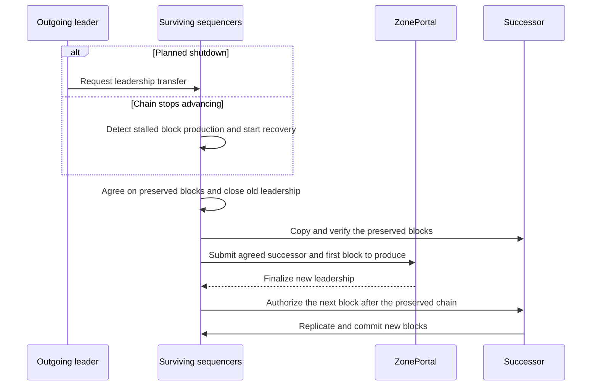
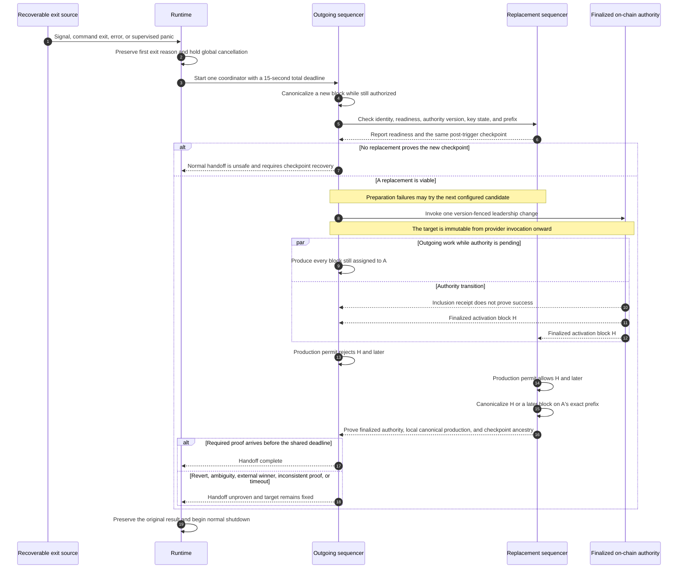
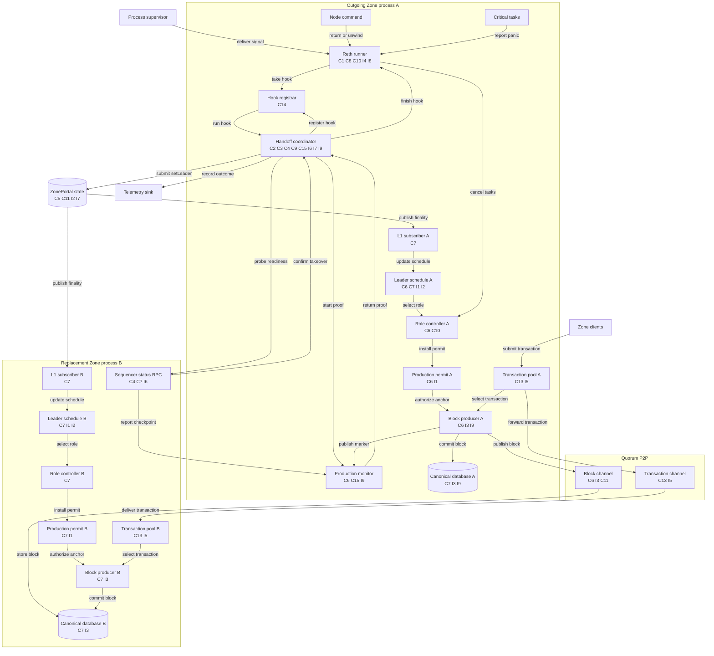
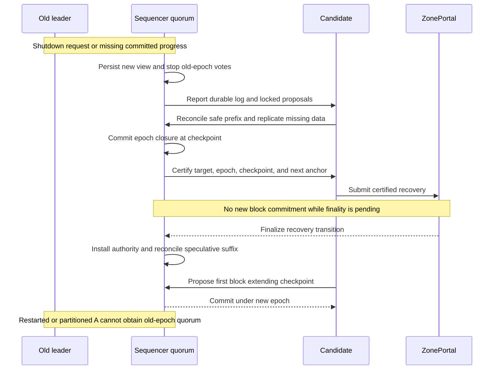
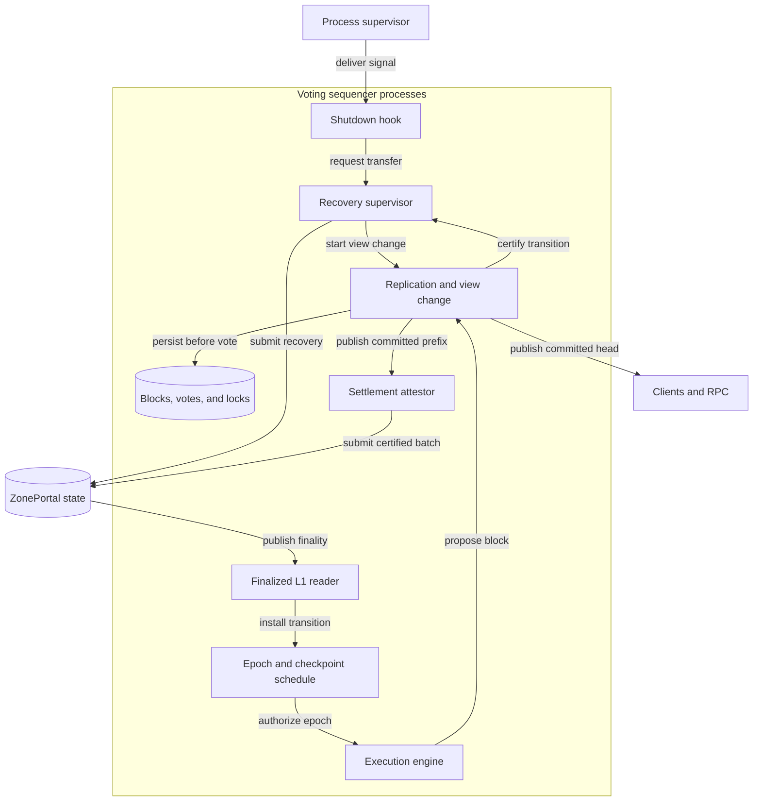

# Automated Sequencer Failover



## Motivation

The production permit assigns each Tempo anchor to one leader, but the system is missing automatic failover when that leader exits or stops responding. A shutdown hook can coordinate a healthy leader's departure, but OOM, partition, or a handoff that exceeds its deadline requires surviving sequencers to recover without that process. The recommended hardfork adds quorum-backed recovery from an agreed checkpoint and makes block durability part of the commit rule; the existing portal can support graceful handoff as an interim implementation but cannot by itself provide that recovery guarantee.

## Leader Handoff

Keep L1 finality as the authority for a new leader, and add a certified recovery transition that assigns the successor the first anchor after a preserved checkpoint even when that anchor predates the leadership transaction. Both graceful transfer and abrupt failure use this transition after the hardfork. A healthy leader can keep producing during preparation, but production pauses when the quorum closes its epoch and resumes after the new transition finalizes. This pause removes the requirement that the outgoing process survive until L1 completes.

The existing portal sets activation to `block.number` in [`_setLeader`](crates/contracts/src/runtime/tempo/ZonePortal.sol), while [`ProductionPermit::check`](crates/node/src/engine.rs) and the role controller advance by the next Tempo anchor. If A last produced anchor 100 and its replacement transaction activates at 110, B cannot produce 101–109 under the ordinary schedule. The current manifest recovery override fills that gap by assigning a chosen leader from a canonical checkpoint, but its safety relies on operator coordination; `canonical_recovery_height` explicitly establishes only local ancestry.

## Graceful Handoff

The outgoing leader starts the transfer while it can still produce blocks. With the current portal, it continues through the L1-selected activation boundary as shown below; with the certified checkpoint transition, it stops at the agreed checkpoint and surviving sequencers finish the transfer even if its shutdown deadline expires.



One coordinator owns the in-process handoff state and its monotonic deadline, but production authority remains entirely with the existing portal transition: the coordinator submits the change and reports success only after it observes finalized authority and canonical production by the replacement.

### Handoff Triggers and Eligibility

The Reth runner records the first exit reason and passes it to one opt-in async hook before global cancellation. After the Zone node registers that hook, Reth invokes it for every exit path that remains observable in-process:

- SIGTERM received from any sender;
- SIGINT received from any sender;
- clean or error completion of the node command future;
- a panic unwound from the node command future; and
- `PanickedTaskError` from any task registered with Reth's critical-task APIs.

The hook never changes the exit result: signal and command outcomes retain their current semantics, while panics remain nonzero failures.

| Exit source | Handoff behavior |
| --- | --- |
| SIGTERM or SIGINT | Tokio delivers the signal to the runner, which invokes the registered hook once before global cancellation. |
| Node command returns `Ok` or `Err` | The runner invokes the registered hook once before returning the original command result. |
| Node command or registered critical task unwinds | The runner invokes the hook outside the failed future and preserves the panic result without assuming that the failed component remains usable. |
| SIGKILL, aborting panic, OOM/segfault, host loss, or unmonitored task panic | The departing process cannot invoke the hook; recovery is operator-coordinated before the hardfork and survivor-driven afterward. |

When a critical task panics, the task manager reports the failure without releasing global shutdown until the bounded hook finishes; the runner invokes the hook outside the failed task, catches a second unwind from the hook, and still returns the original panic as a failure. Every Zone task whose loss should terminate the node must therefore use Reth's critical-task API or an equivalent supervisor, because Reth cannot initiate handoff for a panic it never observes.

`crates/node/src/role.rs` currently contains a leader-generation child panic by tearing down and restarting the complete generation, so a successful restart remains local recovery rather than a process handoff. If teardown or restart cannot be proved complete, the role controller must report a fatal outcome to Reth; implementation must also inventory every Zone spawn site and classify detached work as critical, explicitly supervised, or non-fatal so that a safety-critical panic cannot disappear outside the exit path.

Startup failures before hook registration and Reth binaries that never register a hook retain the current shutdown behavior, which keeps this change scoped to the Zone node lifecycle rather than adding process-global panic handling.

### Canonical Prefix Requirement

`setLeader` changes ownership at activation anchor H but cannot fill an earlier anchor assigned to A, so B remains fenced if A stops before completing the prefix through H-1.

Before invoking the provider, A must canonicalize a newly available anchor after the first exit reason is recorded, publish the local marker, and receive B's report that it observed the same block. This post-trigger proof covers the engine, finalized-L1 subscription, role controller, persistence, and P2P delivery as one usable production path; the coordinator cannot infer that path is healthy from a signal alone, and it cannot complete the proof when no new anchor arrives before the deadline.

If a required component has failed or the proof does not complete within the shared deadline, the coordinator skips `setLeader`, records `forced_recovery_required`, and returns the original exit result so the existing procedure can select a common checkpoint. Before the hardfork this requires operator coordination; after activation, surviving sequencers run the recovery protocol below.

Automatic handoff is opt-in through an ordered candidate list:

```text
--sequencer.handoff-candidate b=https://zone-b-private.example
--sequencer.handoff-candidate c=https://zone-c-private.example
--sequencer.handoff-timeout 15s
```

The feature requires manifest mode, and an empty list preserves current behavior; startup rejects duplicate names, the local node, unknown manifest members, RPC-only members, invalid HTTP(S) URLs, and a zero timeout.

### Replacement Selection

The coordinator may probe candidates concurrently to stay within the deadline, but it always selects the first eligible candidate in configured order, independent of RPC completion order.

B must report:

- the configured node name, Zone ID, portal address, membership digest, and pinned set version expected by A;
- an active quorum identity, not the local node or an RPC-only member;
- the same finalized leader and epoch as A;
- follower role, promotion readiness, and no pending leadership transition;
- the active finalized deposit-decryption key;
- a canonical tip at most one block behind A, with the same block hash as A at B's height.

These readiness fields establish that B can take over from A's current chain state, but they do not replace the post-trigger production proof or make an incomplete A-owned prefix safe to hand off.

The status RPC remains a private operator endpoint: a forged response within that deployment boundary can prevent handoff, but portal membership, A's signing key, and the local production permit prevent it from granting B production authority.

### Leader Change Submission

Immediately before sending, A re-reads the finalized portal leader and epoch and calls the contract only if A remains leader and B remains active:

```text
setLeader(B, currentEpoch)
```

A signs with its individual secp256k1 key and uses `ADMIN_OPS_NONCE_KEY`, leaving the batch-submission and withdrawal nonce lanes unchanged.

Split the existing client into preparation, provider invocation, and receipt observation so the coordinator can distinguish failures that occur before the L1 request from outcomes that become ambiguous after it. A candidate-specific preparation failure may return the coordinator to `Probing`, but provider invocation fixes the target for the rest of the process, so transport errors, reverts, lost responses, and missing receipts can never cause a transaction for another target.

### Block Production Handover

While candidate probes, inclusion, and finality are pending, A continues accepting valid transactions and producing every anchor that its permit still assigns to A, provided the exit-triggering failure did not remove a required production component. Starting the hook does not cancel, pause, fence, or rebuild the leader generation; if the coordinator cannot prove post-trigger progress, it stops before provider invocation and reports that forced recovery is required.

#### Success Criteria

The coordinator reports success only after B observes the finalized leader and epoch, enters the local `leader` role, and canonicalizes a locally produced block at H or later whose ancestry preserves A's pre-submit checkpoint; an inclusion receipt proves none of those local effects.

`zone_getSequencerInfo` gains a bounded `last_locally_produced` anchor, number, and hash marker that the engine publishes only after the fork-choice update succeeds and `canonical_block_by_number(height).hash == marker.hash`; `newPayload` alone is insufficient because canonicalization happens during the later fork-choice update. The marker identifies the producing process, while canonical block-by-number lookup and A's recorded checkpoint establish that the block is on the expected chain; the beneficiary cannot provide the same evidence because quorum members may share the block-production key.

### Transaction Continuity During Handoff

Run the existing local-origin forwarder in leader generations as well as follower generations. It continues to:

- forward only locally originated, still-live pool entries;
- use the existing bounded P2P command queue and 256-entry reconciliation batches;
- retry on the existing reconciliation interval;
- avoid re-flooding transactions received from P2P;
- leave validation, eviction, replacement, pricing, and inclusion rules unchanged.

This reuses the existing wire protocol to replicate transactions submitted directly to A, but it guarantees neither delivery to B before H nor eventual inclusion.

### Failure Outcomes and Exit Deadline

One 15-second budget covers candidate probes, finalized L1 reads, transaction broadcast, receipt observation, finality, successor promotion, and production evidence, and every nested network operation uses only the remaining time. Signals and panics use the same deadline so a degraded node cannot extend its lifetime through retries.

After the hook returns, Reth resumes shutdown and preserves the original result, including `PanickedTaskError` and its nonzero status. Both signal and panic paths use the existing five-second graceful-task wait and five-second runtime-drop wait, which puts the schedulable process at a 25-second upper bound and leaves five seconds of overhead when a supervisor, including Kubernetes with `terminationGracePeriodSeconds >= 30`, escalates to a hard kill at 30 seconds.

| Failure | Required behavior |
| --- | --- |
| Local node is not the current quorum leader | Return immediately to normal shutdown. |
| A critical task or command future panics | Preserve the panic as the process result while surviving tasks run the bounded coordinator, which may submit a portal handoff only after proving post-trigger production. |
| The failed task was required for handoff or production | Skip the provider call because `setLeader` cannot repair an incomplete A-owned prefix, record `forced_recovery_required`, preserve the original failure, and exit on time. |
| Any exit trigger lacks post-trigger prefix progress | Skip the provider call and record `forced_recovery_required` even when the first reason was a signal, because the signal may race with or conceal a production failure. |
| The handoff hook itself panics | Catch the unwind at the Reth boundary, record one bounded hook-failure outcome, and resume the original shutdown path without recursively invoking the hook. |
| No candidate passes preflight | Emit a bounded failure outcome and begin normal shutdown. |
| Portal state changed before provider invocation | Honor the finalized winner; do not overwrite it. |
| Candidate-specific failure before provider invocation | Mark that candidate tried and probe the next configured candidate within the same deadline. |
| Provider invocation returns an error or the transaction reverts | Record failure without nominating another target because provider invocation has already frozen the selection. |
| Send/receipt outcome is ambiguous | Keep observing the fixed target/finalized portal until deadline; never retarget. |
| B does not prove canonical production | Wait only until the shared deadline, then begin normal shutdown. |
| Duplicate or racing exit triggers | Treat the first exit reason as authoritative and reuse its coordinator result without starting another submission. |

## Graceful Handoff Implementation Plan

| ID | Step | Required behavior |
| --- | --- | --- |
| C1 | Capture recoverable exits before shutdown | Classify and preserve the first SIGTERM, SIGINT, command completion/error/unwind, or registered critical-task unwind; after hook registration, hold task-manager shutdown ownership while the hook runs before global cancellation, catch hook panics, and preserve existing behavior for binaries or exits without a registered hook. |
| C14 | Register the handoff hook at node readiness | Store one hook in a runtime-owned, cloneable one-shot registrar reachable from the node's task executor, register it after its dependencies are live but before leader readiness, and avoid process globals so exits before registration remain unchanged. |
| C15 | Supervise and classify panics | Start process handoff for command and critical-task unwinds, retain local recovery when a complete generation restart succeeds, escalate an unproven restart to Reth, and audit detached spawn sites so every safety-critical panic reaches a supervisor. |
| C2 | Gate handoff to eligible leaders | Attempt handoff only for the current finalized leader in manifest-based multi-sequencer mode with an individual L1 signer, returning followers, RPC-only nodes, fenced nodes, and legacy single sequencers directly to shutdown. |
| C3 | Load and validate candidate configuration | Validate a repeatable ordered `NAME=URL` list and 15-second default timeout at startup, with an empty list disabling automatic handoff. |
| C4 | Validate replacement readiness | Select a replacement only from private operator status that proves matching identity, deployment, membership, finalized state, readiness, decryption key, and canonical prefix. |
| C6 | Keep production live and prove the prefix | Keep surviving A tasks running so A produces every anchor assigned by its permit, and require A's post-trigger canonical production plus B's observation before provider invocation or fall back to forced recovery. |
| C5 | Submit one leader change | Re-read finalized portal state and prepare one CAS-fenced `setLeader` on the admin nonce lane, allowing candidate-specific preparation failures to resume probing but freezing the target permanently at provider invocation. |
| C9 | Freeze the target and handle uncertain outcomes | Skip ineligible candidates before provider invocation, freeze the selected target at invocation even if the call returns an error or later reverts, honor any external finalized winner, and release shutdown on deadline without installing local authority. |
| C7 | Verify successful handover | Treat a receipt as intermediate evidence and require finalized B authority, B's local leader role, B-local production at H or later, canonical block-by-number equality for B's marker, and ancestry from A's checkpoint. |
| C13 | Replicate leader-local transactions | Run existing local-origin forwarding in both leader and follower generations; do not re-flood P2P-origin transactions or change pool validity rules. |
| C8 | Enforce the process deadline | Fit one 15-second handoff deadline and two 5-second shutdown waits inside a 30-second supervisor grace period, applying the same bound to panic-triggered recovery even without an external deadline. |
| C10 | Resume the original shutdown path | After the hook, preserve the existing engine-persistence, P2P, task, and runtime shutdown order while giving surviving tasks on the panic path the same bounded drain and retaining the original panic or error result. |
| C12 | Add bounded operational telemetry | Emit phase and outcome metrics plus structured logs with bounded identity, target, epoch, transaction hash, activation anchor, and latency fields, excluding keys, transaction bodies, auth tokens, endpoint labels, and unbounded error labels. |
| C11 | Preserve protocol compatibility | Do not change portal ABI/storage, activation semantics, settlement certificates, block format, P2P wire format, manual handoff, or forced recovery. |

## Graceful Handoff Invariants

| ID | Property |
| --- | --- |
| I1 | Two honest nodes never produce or accept different canonical blocks for the same Tempo anchor; only the leader selected by finalized authority for that anchor may produce. |
| I2 | Leadership epochs remain monotonic and contiguous, so stale or competing handoffs cannot roll authority back or bypass active-sequencer membership. |
| I3 | A successful handoff preserves every pre-handoff canonical hash, has no missing or duplicate height/anchor, assigns A before H and B from H, and leaves B able to continue production and settlement. |
| I4 | Every recoverable-exit hook reaches process exit within 25 seconds while the outgoing process remains schedulable, which completes before a supervisor's configured 30-second hard-kill deadline. |
| I5 | While the hook is active, every valid local transaction still live in A's pool remains eligible for bounded forwarding; duplicate delivery cannot create duplicate canonical inclusion. |
| I6 | The coordinator never submits to self, an RPC-only/unknown/inactive member, a mismatched deployment, a non-ready node, or a node known to be on a conflicting prefix. |
| I7 | One recoverable process exit produces at most one target nomination and one logical `setLeader` submission attempt; ambiguity can never trigger a different target. |
| I8 | The first exit reason is immutable, so a successful handoff cannot mask a critical panic and a later signal or panic cannot start a second coordinator. |
| I9 | A normal handoff requires post-trigger proof that A can extend and deliver the prefix; failure to prove viability produces `forced_recovery_required` rather than a false success. |

## Graceful Handoff Code Changes

| Area | Change |
| --- | --- |
| Pinned Reth `crates/cli/runner` | Replace the nested races with an explicit first `ExitReason`, catch command-future unwinds, invoke and bound the registered hook for every post-registration exit, return the original result, and make graceful-task and runtime-drop timeouts injectable for tests without changing production defaults. |
| Pinned Reth `crates/tasks` | Separate critical-panic reporting from global-shutdown ownership so surviving tasks remain live during a runtime-owned, one-shot `PreShutdownHookRegistrar` reached through `TaskExecutor`, then fire cancellation once in the existing shutdown order. |
| `crates/node/src/cli.rs` | Parse and validate ordered candidate endpoints and the shared handoff timeout. |
| `crates/node/src/rpc.rs` | Extract the existing leader-change L1 client for internal reuse, separate preparation/provider invocation/receipt waiting, and add the canonical local-production marker to private status. |
| `crates/node/src/node.rs` | Build the coordinator from live schedule, role, engine, L1, signer, P2P, and provider handles, then register it exactly once before reporting leader readiness so earlier exits retain current shutdown behavior. |
| `crates/node/src/role.rs` and `engine.rs` | Preserve contained generation restart, escalate an unproven restart, expose production viability, and publish the local marker only after canonical fork-choice and block-by-number verification without changing permit semantics. |
| `crates/node/src/tx_forwarding.rs` | Start the existing forwarder in leader generations and retain bounded reconciliation/non-reflood behavior. |
| Node telemetry/docs | Add exit-reason plus terminal outcome/phase metrics, operator logs, unwind/abort build guidance, configuration, failure recovery, and rollout order. |
| Deployment repository | Before enabling candidates, set and verify a hard-kill grace of at least 30 seconds through the supervisor's equivalent of Kubernetes `terminationGracePeriodSeconds`; this repository contains no deployment manifests to change. |

Keep the coordinator cohesive and private behind a narrow `HandoffIo` test seam for candidate snapshots, finalized portal reads, transaction preparation/invocation/receipt, canonical block lookup, production viability, and monotonic time; candidate selection, epoch fencing, and retargeting remain production logic rather than being copied into test fakes.

## Graceful Handoff Components

The arrows represent calls, finalized events, or data transfer between concrete components. `ZonePortal` owns durable leadership authority, each Zone database owns its canonical chain, the Reth runner owns the first exit reason, and the handoff coordinator owns only in-process transition state.



## Timeout and Production Ownership

In the compatible path, A keeps producing while `setLeader` is pending because finalized authority still assigns those anchors to A. Starting B immediately on SIGTERM would either fail B's permit check or require bypassing it; A might still have an in-flight block, other nodes may never see the signal, and the L1 transaction may revert. A local signal therefore cannot transfer authority.

The 15-second hook deadline bounds A's waiting, not the network's recovery time. At expiry A preserves the transaction identity and original exit result, then begins its bounded shutdown; the pending L1 transaction may still finalize afterward.

| Timeout point | Service behavior |
| --- | --- |
| Before submission | A exits while the portal still names A; followers cannot fill the missing anchors without recovery. |
| After submission, before finality | A exits with an unresolved external operation; surviving nodes observe its eventual outcome before submitting against the current epoch. If A did not finish the prefix before the eventual activation anchor, ordinary handoff still leaves a gap. |
| After finality, before B produces | B can proceed if it has the complete prefix; if B also fails, another recovery round is required. |
| During hardfork recovery | A may exit at any point because surviving replicas persist the recovery state. They retain vote locks and reconcile finalized portal state; timeout never cancels an L1 transaction or releases a lock. |

A future activation-anchor argument can schedule a healthy transfer but still assumes A survives to that point. A historical checkpoint argument addresses the missing-prefix problem only if it identifies the chain, preserves committed data, and prevents the old leader from committing more history. Neither a height alone nor a successful `setLeader` receipt establishes those properties.

## Automatic Recovery After the Hardfork

### Block Commitment and Failure Assumptions

A block must be durably replicated before clients are told it is committed. The current engine describes head, safe, and finalized as the same block, and settlement attestations are collected at batch boundaries rather than as durable per-block commit acknowledgments; those semantics cannot preserve a block that exists only on a permanently lost leader disk.

Introduce an explicit speculative versus committed boundary: execute and replicate proposals first, then advance canonical committed RPC state and final receipts only under the quorum commit rule. Recovery preserves all committed blocks and settled history, while uncommitted execution may be discarded and its transactions retried. Pending transaction acceptance remains distinct from block commitment; promising survival of every accepted transaction would additionally require durable pool replication before acknowledging it.

Use a replicated-log consensus protocol with persistent votes, locks, and view change rather than implementing election as a collection of independent status polls. For n voting sequencers and at most f faulty members, choose quorum q with `2q > n + f` and `q <= n - f`; the usual Byzantine configuration is n = 3f + 1 and q = 2f + 1. Do not reuse the configurable settlement threshold without enforcing these bounds. Correct voters persist the block body and their consensus state before acknowledging; a restarted voter with lost state cannot vote until restored.

This design tolerates faults within that configured budget and requires a live quorum with the data plus eventual L1 progress. With no quorum, missing committed data, or stalled finality, it stops committing rather than promising a fixed recovery deadline. The outgoing process still obeys its independent shutdown deadline.

### Recovery Sequence



Every surviving sequencer runs the recovery supervisor, so A's death does not remove the component responsible for finishing the operation. A missing-progress timer starts an election but does not prove A is dead or confer authority. Candidates follow the consensus protocol's view-change rule, carrying forward locked proposals and committed history; selecting the highest reported height or the most common hash is insufficient because a certificate may have been formed but delivered to only part of the quorum.

The quorum closes the old production epoch at an agreed checkpoint after recovering the safe prefix under the consensus protocol's view-change rule; it must not require responses from every replica. Closure is a durable consensus decision that prevents further old-epoch commitments, even if A remains alive with a stale L1 view. A's in-flight speculative block may finish execution but cannot become committed without the required votes. The checkpoint includes Zone height and hash plus its Tempo anchor and hash; the next producer begins at checkpoint anchor + 1.

The selected candidate must obtain and verify the full checkpoint data before the transition is certified. If it fails before certification, consensus selects another candidate in a later view; after certification, relayers finish or resolve that same portal transition, then use a new epoch to replace a failed successor. They must never issue conflicting certificates for the same portal epoch. The consensus view-change algorithm must carry locks through retries rather than relying on a one-shot vote that can permanently strand a failed candidate.

### ZonePortal Transition

Use a versioned operation, conceptually:

```text
recoverLeader(
    expectedEpoch, successor, sequencerSetVersion,
    checkpointZoneHeight, checkpointZoneHash,
    checkpointTempoAnchor, checkpointTempoHash,
    transitionCertificate
)
```

The certificate binds the chain and portal domain, membership version, expected epoch, successor, exact checkpoint, and next production anchor. The portal verifies distinct authorized signers and the recovery quorum, compares the epoch, and records a recovery event containing the checkpoint and next anchor. A certificate is an attestation of history and data availability under the fault model; signature verification by itself does not prove either.

Recovery cannot move behind or conflict with settled history. Bind the certificate to the settled state it extends and reject stale settlement bases so a batch settling during recovery requires a refreshed base binding while preserving the already-certified successor and closed checkpoint. Settlement beyond or outside that checkpoint violates the closure invariant and cannot be repaired by selecting another history. Disable the old uncertified `setLeader` path at the fork, including any admin bypass of the new recovery safety checks; otherwise a single caller could bypass quorum closure.

The initial hardfork keeps the voting membership fixed and disables unilateral membership or threshold changes while automated recovery is enabled. Supporting online rotation requires a joint-consensus reconfiguration protocol that transfers durable locks and pending transitions between intersecting sets; a membership-version field alone would only reject an old certificate and could strand a closed epoch. This operational restriction is part of the initial rollout, not an assumption that administrators will avoid a race.

The existing schedule rejects non-increasing activation anchors, so this cannot be implemented by adding an argument to Solidity alone. Add explicit recovery records ordered by epoch, separate the L1 observation block from the resumed production anchor, and update replay and startup to discover finalized recovery events even while Zone execution is stalled on earlier anchors. Followers reconcile only speculative history after the checkpoint and retain committed ancestry.

Settlement also needs epoch-aware validation: the current batch certificate binds membership version but not leader epoch, and any sequencer may relay it. New certificates must bind the production epoch and preserved chain; old certificates may settle only the retained prefix and must not extend a closed epoch past its checkpoint. Require a verified ancestry proof or a new quorum attestation binding the settlement endpoint to the closure checkpoint, since checking height alone cannot establish chain membership. Preserve already-settled withdrawals and deposit progress across the transition.

### Early Successor Production

Keep successor commitment behind L1 finality in this design. Letting B commit before `recoverLeader` finalizes is possible only if the hardfork makes the quorum certificate an independent source of production authority, which requires rules for delayed or rejected portal transactions, competing membership changes, startup replay, and settlement. That can reduce the pause, but adding an anchor parameter alone cannot provide it.

The hardfork simplifies recovery ownership by giving graceful shutdown and OOM the same checkpoint transition, and by allowing A to exit without filling anchors up to a future L1 block. It expands consensus, storage, RPC finality, and settlement semantics; it does not turn a distributed recovery decision into a simple setter.

## Hardfork Implementation Plan

| ID | Step |
| --- | --- |
| R1 | Add durable proposal replication, quorum commitment, vote locks, and view change; require data persistence before acknowledgment and restore voting state before a restarted member participates. |
| R2 | Add a long-lived recovery supervisor on each voter with missing-progress detection, deterministic candidate preference, consensus retries, checkpoint transfer, and persisted transition identities independent of A's lifetime. |
| R3 | Implement certified epoch closure and the versioned portal transition, including domain separation, quorum validation, membership fencing, exact checkpoint binding, settled-state checks, and old-ABI retirement. |
| R4 | Separate finalized L1 observation from next-anchor execution; implement epoch-ordered recovery records in schedule, production permits, import validation, startup, and replay without rolling back committed blocks. |
| R5 | Separate speculative execution from committed RPC head and receipts; update settlement certificate domains and validation so delayed old-epoch work cannot extend a closed prefix. |
| R6 | Connect the pre-shutdown hook to the same supervisor; end local waiting on its deadline while survivors finish the durable transition or recover its failed successor. |
| R7 | Activate protocol, portal, node, and wire-format changes together at a defined fork boundary after all voting nodes upgrade and the initial committed checkpoint is agreed; fence unsupported nodes and retain old replay rules below the fork. |

The code seams are `ZonePortal.sol` and `IZonePortal.sol` for transition and settlement verification; `crates/l1` for event decoding and independent finality tracking; `crates/p2p/src/manifest.rs` for epoch/checkpoint authority; node `engine.rs`, `role.rs`, and `node.rs` for commitment, recovery, and startup; RPC head/receipt handling; and sequencer attestation collection and storage for durable, epoch-bound certificates. The existing forced-recovery override supplies useful checkpoint plumbing, but its operator-trust assumption must not become the automatic election rule.

## Recovery Invariants

| ID | Required property |
| --- | --- |
| RI1 | Every committed block and settled effect remains on the recovered chain within the configured fault and storage-loss budget. |
| RI2 | Competing leaders may execute speculative work, but two conflicting blocks cannot both commit at the same height; old-epoch work cannot commit after certified closure. |
| RI3 | Every transition binds one successor and one exact preserved checkpoint to an epoch and membership version, and survives restarts without conflicting votes or certificates. |
| RI4 | The successor commits only after finalized authorization and verified local checkpoint data; delayed old transactions and certificates cannot roll back authority or extend a closed epoch. |
| RI5 | A's shutdown ends within its local deadline, while service recovery continues under the surviving quorum; recovery needs eventual quorum communication, data availability, and L1 finality. |

## Complete System View



## Test Coverage

### Compatibility Coverage

The following C/I/T cases cover the pre-hardfork graceful path. The recovery cases afterward cover the recommended hardfork, where quorum commitment replaces local execution as the preservation boundary and the old ABI is disabled at activation.

### Unit and Model Tests

| ID | Covers | Test to write and exact oracle |
| --- | --- | --- |
| T1 | C1, C10, I4, I8 | Drive the pinned Reth runner with SIGTERM, SIGINT, clean command completion, returned command error, command-future panic, and `PanickedTaskError`; after registration, each trigger must run the same hook while surviving tasks remain live, expose the first reason, cancel exactly once, and preserve the original result, while runs before registration or without a hook retain current behavior. |
| T1R | C1, C14, I8 | Clone the runtime-owned registrar through `TaskExecutor`, race registration against every exit reason, and verify that a second registration fails, one post-registration invocation wins, pre-registration exit remains unchanged, and dropping the node or hook cannot leave a process-global callback. |
| T2 | C1, C8, C10, I4, I8 | Install one hook that never returns and one that panics, pausing Tokio time for the async 15-second deadline while testing Reth's `std::time` graceful-task and runtime-drop waits with reduced injected deadlines; each case must cancel and release every guard once without adding ten real seconds to the test. |
| T3 | C2, C3, C11 | Table-test empty, valid, duplicate, self, unknown, RPC-only, malformed-URL, zero-timeout, no-manifest, no-individual-signer, follower, fenced, and current-leader configurations, requiring only the finalized eligible leader to enter `Probing` and an empty candidate list to preserve current startup and shutdown behavior. |
| T4 | C3, C4, I6 | Generate RPC completion order independently from configured order while varying every identity, membership, readiness, finalized-state, deposit-key, lag, and prefix predicate; an independent reference predicate must always choose the first configured eligible node and preserve a minimized seed on failure. |
| T5 | C5, C9, I2, I7, I8 | Model candidate preparation failures, external epoch changes, provider invocation and errors, known or unknown transaction hashes, receipt success/revert/loss, finalized winners, duplicate triggers, and deadline expiry; failures may resume `Probing` before invocation, while invocation makes the first reason, target, and single logical send immutable. |
| T6 | C7, I1, I3 | Evaluate every combination of receipt, finalized authority, local role, pre-fork-choice marker, canonical marker, block-by-hash presence, canonical block-by-number equality, and checkpoint ancestry; only the fully canonical combination may succeed, while beneficiary identity, receipt, and noncanonical block presence must fail. |
| T7 | C13, I5 | Exercise leader-local forwarding with a full command queue, delayed reconciliation, replacement or eviction, and P2P-origin duplicates; live local entries must retry in batches no larger than 256 and reach a healthy peer, while P2P-origin entries are never re-flooded and canonical inclusion remains unique. |
| T8 | C12 | Feed every terminal outcome and phase maliciously long endpoint and error text, then verify that logs and metrics remain bounded, use finite label values, emit one terminal outcome per run, and contain no configured secret or endpoint value. |

### E2E Failover Tests

Run a real Tempo dev L1 with three independent manifest-mode Zone processes, using an OS signal rather than task cancellation for SIGTERM and named unwinding failpoints for panics. The Portal and standard block RPC form the external oracle, with process-local events used only where RPC cannot identify the producing node.

| ID | Fault schedule | Required result |
| --- | --- | --- |
| T9 — happy path | Submit immediately executable funded transactions directly to A, wait until B observes them, advance L1 continuously, then send A SIGTERM. | Portal activates B at H; A produces through H-1 and never at/after H; B produces H and later on the same prefix; every node agrees on hashes; each frozen test transaction remains in B's pool or is included at most once; settlement passes H; A exits within 25 seconds. |
| T10 — L1 delay and ambiguity | Independently delay A's provider response, receipt visibility, and finalized-tag advancement, then drop the response after the proxy forwards the transaction once. | A keeps producing while authorized, does not treat the receipt as completion, never changes the target after provider invocation, and exits by the deadline whether the transaction eventually succeeds or loses the epoch race. |
| T11 — candidate failure by phase | Partition or pause B before preflight, during preparation, after provider invocation, and after finality but before canonical local-production evidence. | The next configured eligible candidate may win before invocation, but no other target may be nominated afterward; every process remains bound by finalized authority and A begins shutdown on time. |
| T12 — concurrent authority change | Race SIGTERM with `tempo-xtask admin leader set`, duplicate SIGTERM delivery, and duplicate/replayed receipt and finality notifications. | Portal CAS produces one monotonic successor; all schedules apply it idempotently; the coordinator either observes the external winner or its fixed target, but never overwrites the winner or sends again. |
| T13 — activation-boundary restart | Delay transaction forwarding, `newPayload`, canonical fork-choice, and marker publication around H; restart B before and after each boundary. | A pre-FCU block never counts toward success; after restart, canonical block-by-number and checkpoint ancestry agree, no pre-H hash changes, no height/anchor is skipped, and production plus settlement resume. |
| T14 — no eligible successor / invoked revert | Make every candidate unreachable, stale, inactive, key-mismatched, or prefix-conflicting; in a separate run, let B pass preparation before its transaction returns a definite revert. | The first run sends nothing, while the second keeps B frozen and never tries C; both report a bounded reason and begin shutdown within the same 15-second hook budget. |
| T15 — panic classes | Add test-only failpoints to the node command future and every critical Zone task, then separately panic a leader-generation child, a deliberately detached noncritical task, startup before hook registration, and a `panic = "abort"` child process while also racing a terminating panic with SIGTERM. | Command and critical-task panics run one hook and exit nonzero with the first reason, a contained generation panic restarts without handoff, pre-registration and detached panics do not invoke the hook, the spawn audit finds no safety-critical detached work, and the aborting child establishes the non-recoverable boundary. |
| T16 — failed production path | Stall or unwind the L1 subscriber, role controller, and P2P supervisor before provider invocation; force contained engine recovery to fail; trigger SIGTERM on an already stalled A; race SIGTERM with a production panic; and use a healthy control where A canonicalizes and B observes a new post-trigger anchor. | Every unhealthy or racing case skips `setLeader` and reports `forced_recovery_required` because B remains fenced on A's missing anchor, while the healthy control may submit only after local and peer proof match. |

### Chaos Tests

Run three independent Zone processes with separately controlled P2P and L1 paths to cover timing failures that unit tests and a normal E2E run cannot reproduce reliably; the test runner remains an implementation choice.

| Scenario | Failure introduced | Expected result |
| --- | --- | --- |
| Split authority view | Partition P2P and per-node L1 views across activation H; delay schedule updates, permit checks, canonical fork-choice, and block delivery. | Every `(anchor, height)` has one producer and one canonical hash, with A producing only before H, B only from H, monotonic epochs, and the same prefix after healing. |
| Ambiguous leader-change submission | Drop or delay the provider response and receipt; race a manual leader change, duplicate exit triggers, and replayed finality notifications. | Provider invocation fixes one target, so the coordinator cannot retarget or resend and reports success only after finalized B authority and canonical B production at H or later. |
| Outgoing production failure | Stall or panic A's L1 subscriber, role controller, engine, or P2P path before triggering exit; also race the production failure with SIGTERM. | The coordinator may call `setLeader` only after A canonicalizes a new post-trigger block and B observes the same hash, with every failed proof requiring checkpoint recovery. |
| Replacement restart during activation | Pause or restart B before finality, promotion, canonical fork-choice, and publication of its local block marker. | B never produces before H, a noncanonical block never proves success, A's prefix remains unchanged, and B resumes from the correct block after healing. |
| Transactions in flight | Fill forwarding queues, delay and duplicate relays, then trigger handoff and restore the network. | Transactions observed by a surviving quorum pool remain in B's pool or become canonical with at most one inclusion, while transactions seen only by A have no delivery guarantee. |
| Exit deadlines | Fault handoff dependencies during signal and panic exits while A remains schedulable; separately pause the process after exit begins. | A schedulable process preserves the first exit reason and exits within 25 seconds, while an unschedulable process reaches the 30-second hard-kill ceiling and requires checkpoint recovery. |
| Recovery after healing | Combine L1/P2P partitions, B pause/restart, and dropped bounded-channel events, then restore all processes and links and freeze the target heights. | B produces through the frozen finalized anchor and settlement reaches the frozen Zone height within the configured recovery deadline. |

### Regression Tests

Run existing Portal contract tests; RPC/admin handoff tests; planned, lagged, and ahead-scheduled handoff tests; forced-recovery tests; network-chaos and restart tests; and legacy single-sequencer tests unchanged. The new behavior is acceptable only if those suites retain their current assertions and the automatic path remains disabled without candidate configuration.

### Hardfork Recovery Tests

Use independent Zone processes, persistent voter stores, and real L1 transactions. The oracle records every externally committed hash and settled effect before each fault and requires the successor to preserve them, while separately tracking speculative blocks that may be discarded.

| Scenario | Required result |
| --- | --- |
| Kill A after execution, local persistence, one replica, quorum replication, commitment, and client observation | Every committed hash survives; a solely local speculative block never appears as a final receipt. Simulate permanent disk loss separately from process restart. |
| Partition an alive A from the surviving quorum | A may compute locally but cannot commit or settle a conflicting suffix after closure; B resumes only after certified recovery finalizes. |
| Race two candidates and restart voters after recording votes | Durable locks and view-change rules preserve one history, including certificates only partially delivered before a crash. |
| Timeout before broadcast, after ambiguous broadcast, and after inclusion but before finality | A exits within its budget; survivors reconcile the exact transition, preserve locks, and process a late success without conflicting nomination. |
| Kill B before certification, after certification, after L1 finality, and before its first committed block | Recovery either chooses another candidate before binding the transition or finishes that epoch and changes leader again, preserving the checkpoint throughout. |
| Present a stale tip, equal-height conflicting hashes, or missing checkpoint bodies | No transition is certified from height alone; committed and settled prefixes survive, and a candidate without data cannot become ready. |
| Delay an old leader change and old settlement certificate across multiple epochs | Epoch and membership checks reject stale authority; settlement can advance only along the preserved prefix under the applicable epoch rules. |
| Advance settlement or attempt a membership change during certified recovery | Base refresh preserves the locked successor and checkpoint, ancestry checks reject conflicting settlement endpoints, and the initial fixed-membership contract rejects reconfiguration. |
| Stall L1 or remove quorum | The system stops new commitment without losing committed history; A's process deadline still holds and recovery resumes after dependencies heal. |
| Recover anchors 101–109 with the leadership event observed at 110 | B installs the finalized recovery record independently of execution progress and fills the backlog from the certified checkpoint without schedule deadlock. |
| Activate the fork with mixed versions and in-flight settlement | Unsupported nodes fence, old history replays identically, and the agreed activation checkpoint preserves receipts, withdrawals, and deposit progress. |

Measure recovery as detection + view change + data transfer + L1 inclusion/finality + first committed block. Inject bounds for each term in deterministic tests and assert their sum after healing; do not claim a universal wall-clock recovery bound during unbounded partitions or L1 stalls.

### Metrics

| Metric | Type | Labels | Purpose |
| --- | --- | --- | --- |
| `zone_handoff_attempts_total` | Counter | exit reason, outcome | One terminal result for every handoff run. |
| `zone_handoff_duration_seconds` | Histogram | outcome | Total time spent before shutdown resumes. |
| `zone_handoff_phase_duration_seconds` | Histogram | phase | Time spent proving viability, probing, submitting, waiting for finality, and proving production. |
| `zone_handoff_forced_recovery_total` | Counter | reason | Failures that could not safely use normal leader handoff. |
