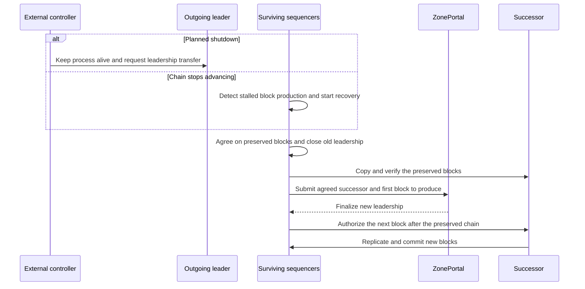
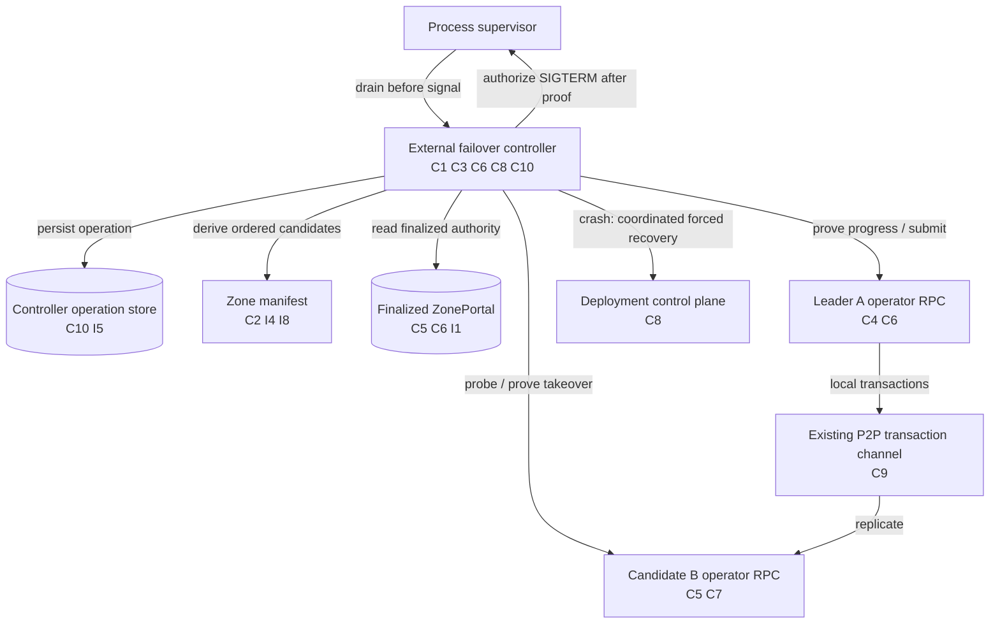
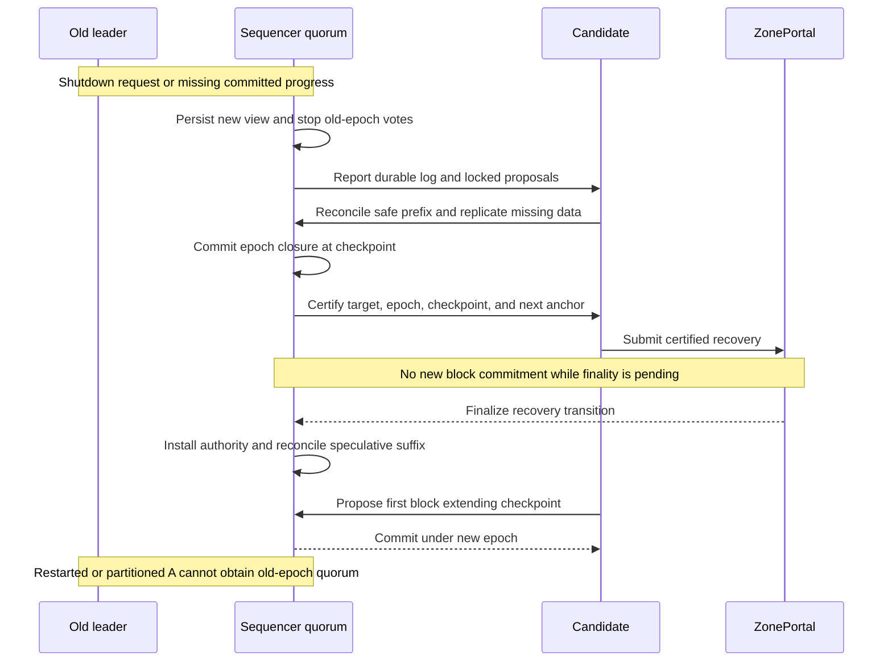
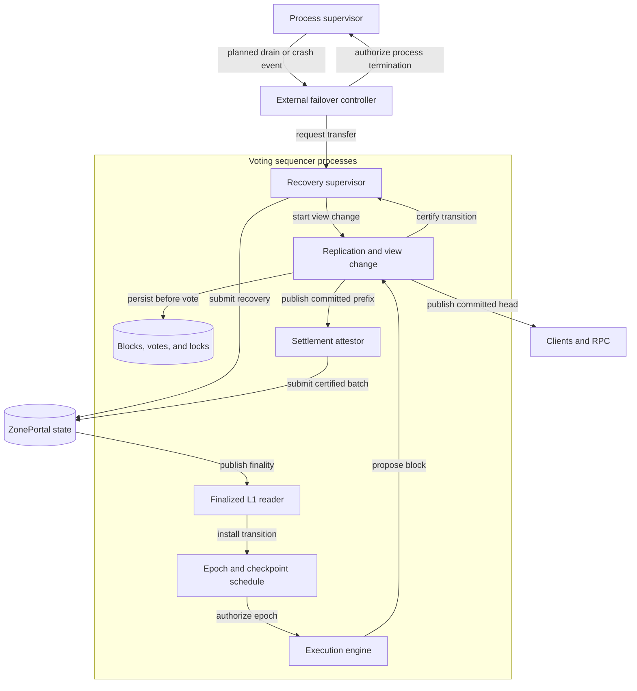

# Automated Sequencer Failover



## Motivation

The production permit assigns each Tempo anchor to one leader, but the system is missing automatic failover when that leader exits or stops responding. The departing process is the wrong owner for failover because crashes, OOM, host loss, and hard kills remove it before any callback can run. A controller outside the Zone process can coordinate a healthy drain and detect abrupt loss without changing Reth. The recommended hardfork adds quorum-backed recovery from an agreed checkpoint and makes block durability part of the commit rule; the existing portal can support controller-driven graceful handoff as an interim implementation but cannot by itself provide that recovery guarantee.

## Leader Handoff

Keep L1 finality as the authority for a new leader, and add a certified recovery transition that assigns the successor the first anchor after a preserved checkpoint even when that anchor predates the leadership transaction. Both graceful transfer and abrupt failure use this transition after the hardfork. Before the hardfork, the external controller uses ordinary `setLeader` only while the old leader is healthy and uses the existing forced-recovery workflow after a crash. A healthy leader can keep producing during preparation, but production pauses when the quorum closes its epoch and resumes after the new transition finalizes. This pause removes the requirement that the outgoing process survive until L1 completes.

The existing portal sets activation to `block.number` in [`_setLeader`](crates/contracts/src/runtime/tempo/ZonePortal.sol), while [`ProductionPermit::check`](crates/node/src/engine.rs) and the role controller advance by the next Tempo anchor. If A last produced anchor 100 and its replacement transaction activates at 110, B cannot produce 101–109 under the ordinary schedule. The current manifest recovery override fills that gap by assigning a chosen leader from a canonical checkpoint, but its safety relies on operator coordination; `canonical_recovery_height` explicitly establishes only local ancestry.

## External Failover Controller

The controller runs outside every Zone process and owns graceful termination orchestration, health detection, candidate selection, transaction identity, and the failover deadline. Reth remains pinned at its current revision and keeps its current signal, panic, cancellation, and shutdown behavior.

```mermaid
sequenceDiagram
    autonumber
    participant S as Process supervisor
    participant C as Failover controller
    participant A as Current leader
    participant B as Replacement
    participant P as Finalized ZonePortal

    alt Planned termination
        S->>C: Request drain of A
        C->>A: Read baseline status
        C->>C: Keep A running; do not deliver SIGTERM yet
        A-->>C: Report a newer canonical local-production checkpoint
        C->>B: Probe readiness and exact checkpoint
        B-->>C: Report matching identity, authority, and prefix
        C->>A: Invoke one epoch-fenced setLeader(B)
        P-->>C: Finalize B at activation H
        B-->>C: Prove local canonical production at or after H
        C-->>S: Drain complete; terminate A
    else Crash or failed health check
        C->>A: Probe
        A--xC: Unavailable or unable to extend the chain
        C->>C: Do not call ordinary setLeader
        C->>B: Collect survivor checkpoints
        C-->>S: Start existing forced-recovery workflow
    end
```

The controller never infers safety from a Unix exit reason. A planned drain is a control-plane request made before the supervisor signals the process. A crash is inferred from bounded health and chain-progress observations after A is already unavailable or unusable. Both cases use the same manifest-derived successor preference, but only the healthy path may use the existing portal handoff.

### Candidate Discovery from the Manifest

The manifest already contains the candidate name, Ed25519 identity, individual secp256k1 address, quorum standing, and stable node order. It does not contain an operator HTTP endpoint: `nodes[].address` is the Commonware P2P `host:port`, whose protocol, port, TLS policy, and routing cannot safely imply an operator RPC URL.

Add an optional operational field:

```toml
[[nodes]]
name = "follower-a"
ed25519_public_key = "0xfa..."
secp256k1_address = "0x2222222222222222222222222222222222222222"
address = "follower-a.zone.internal:9200"
operator_rpc_url = "https://follower-a-operator.zone.internal"
```

`operator_rpc_url` is excluded from the membership digest and every consensus, settlement, and P2P namespace calculation. Existing manifests remain valid. A quorum node without the field remains a member but is ineligible as an automatic candidate because the controller cannot inspect it. RPC-only nodes may carry an endpoint for observation but are never promotion candidates.

The controller derives candidates by iterating manifest nodes in file order, excluding the finalized current leader and `rpc_only` entries, then retaining nodes with a valid HTTP(S) `operator_rpc_url` and a secp256k1 address that finalized `ZonePortal` still reports active. Manifest order is the deterministic failover preference; RPC completion order never changes it. This removes `--sequencer.handoff-candidate` and its environment variable entirely.

### Controller Triggers and Ownership

For planned maintenance, the supervisor calls the controller first and does not send SIGTERM to A until the controller returns or its 15-second graceful-drain deadline expires. The controller records one operation ID, one baseline checkpoint, and one immutable target after provider invocation. Duplicate drain requests join the same operation.

For unplanned failure, the controller combines process health with missing canonical progress. A failed health check alone never grants production authority. If A cannot return and extend a canonical checkpoint, the controller cannot safely use ordinary `setLeader`: its activation anchor may leave earlier A-owned anchors unfilled. It instead gathers exact matching checkpoints from the surviving quorum and enters the existing forced-recovery deployment workflow. Before the hardfork this controller is a trusted operator automation boundary; it must not choose a checkpoint from height alone or restart only part of the fleet.

| Trigger | Required behavior |
| --- | --- |
| Planned drain request while A is healthy | Keep A running, prove new canonical progress and successor observation, submit one normal handoff, prove B production, then signal A. |
| A exits cleanly before the drain completes | Stop the normal handoff attempt and enter forced recovery; the process result needs no interpretation. |
| Panic, OOM, SIGKILL, host loss, or failed health with stalled progress | Enter forced recovery without requiring code in A to execute. |
| Health probe fails but canonical progress continues | Do not fail over; classify the controller path or endpoint as degraded. |
| Canonical progress stalls but A remains reachable | Do not call `setLeader`; collect diagnostic state and enter forced recovery if the bounded policy confirms the stall. |
| Duplicate or racing controller triggers | Reuse the persisted operation ID and never create another target or logical submission. |

### Canonical Prefix Requirement

`setLeader` changes ownership at activation anchor H but cannot fill an earlier anchor assigned to A, so B remains fenced if A stops before completing the prefix through H-1.

For a planned drain, the controller records A's `last_locally_produced`, waits for a strictly newer marker, verifies it through canonical block-by-number, and requires B to return the same block at that height before invoking the provider. This proves the production and replication path while A is deliberately kept alive. If the proof fails, the controller sends no ordinary handoff transaction and reports that forced recovery is required.

For an abrupt crash there is no post-trigger A proof. The controller must not pretend that a pre-crash tip closes A's assigned prefix. It selects a common survivor checkpoint only through the existing forced-recovery procedure before the hardfork, or through certified quorum recovery after activation.

### Replacement Readiness and Selection

Candidate probes run concurrently under one deadline, while selection follows manifest order. A candidate must report:

- the manifest node name, Ed25519 identity, Zone ID, portal address, membership digest, and pinned set version expected by the controller;
- an individual secp256k1 identity that matches the manifest and remains an active portal sequencer;
- follower role, promotion readiness, no pending leadership transition, and the same finalized leader and epoch;
- the active finalized deposit-decryption key;
- a canonical tip at most one block behind A, with the same hash as A at that height; and
- the exact canonical post-drain checkpoint produced by A.

A forged operator response can prevent a graceful handoff but cannot grant production authority: the portal validates membership and epoch fencing, A signs the normal transition, and each node's production permit follows finalized authority.

### Leader Change and Success Proof

Immediately before submission, the controller asks A to re-read finalized portal membership, leader, epoch, and its committed `ADMIN_OPS_NONCE_KEY` nonce. A may submit only while it remains the finalized leader:

```text
setLeader(B, currentEpoch)
```

Preparation failures may try the next manifest candidate. Provider invocation freezes the target permanently, including transport errors, reverts, missing receipts, and ambiguous responses. The controller persists the target and transaction hash, when known, so a restart resumes observation and never creates a second logical send.

A receipt is intermediate evidence. Success requires finalized B authority, B's local `leader` role, a B-local production marker at or after activation, canonical block-by-number equality for that marker, and preservation of A's recorded checkpoint. Only then may the supervisor terminate A. An external finalized winner is honored and never overwritten.

### Transaction Continuity

Run the existing local-origin forwarder in leader generations as well as follower generations. It continues to forward only locally originated live entries, use the bounded command queue and 256-entry reconciliation batches, retry on the existing interval, and avoid re-flooding P2P-origin transactions. Pool validity, eviction, replacement, pricing, and inclusion rules remain unchanged.

### Deadlines and Outcomes

One 15-second deadline covers the planned-drain proof, candidate probes, finalized L1 reads, provider invocation, finality, promotion, and successor production evidence. Every nested network operation uses only the remaining time. After success or deadline, the controller releases the supervisor request; the supervisor then uses the node's unchanged Reth shutdown behavior. Configure at least a 30-second supervisor grace period to leave room for the 15-second controller phase and existing process shutdown.

Crash recovery has no dependency on A's process lifetime and therefore no 15-second completion promise. It remains bounded per probe and retry, emits progress, and stops safely when it lacks a matching survivor checkpoint, deployment authority, L1 finality, or quorum.

## Compatible Controller Implementation Plan

| ID | Step | Required behavior |
| --- | --- | --- |
| C1 | Add the external controller | Add `xtask/src/admin/failover.rs` as a long-lived or one-shot supervisor entry point using the existing admin snapshot, leader-change, and configuration clients; do not patch Reth. |
| C2 | Extend manifest discovery | Add optional `nodes[].operator_rpc_url`, validate HTTP(S), keep it out of membership digests and protocol namespaces, and derive ordered quorum candidates directly from manifest order. |
| C3 | Separate planned drain from crash recovery | Accept an explicit pre-signal drain request for healthy maintenance; detect unavailable or stalled leaders independently and route them to forced recovery without inspecting an exit reason. |
| C4 | Prove the outgoing prefix | Record A's canonical production marker, require a strictly newer marker during the drain, verify canonical block-by-number, and require the candidate to observe the exact block before normal submission. |
| C5 | Validate replacement readiness | Check manifest identity, active portal membership, finalized deployment and epoch, follower readiness, decryption key, lag, and canonical prefix for every candidate. |
| C6 | Submit one leader change | Re-read finalized authority and the committed admin nonce through A, permit submission only while A remains leader, allow another candidate only before invocation, and persist the fixed target and transaction identity afterward. |
| C7 | Prove takeover before termination | Require finalized B authority, local leader role, canonical B-local production at or after activation, and ancestry from A's checkpoint before authorizing the supervisor to signal A. |
| C8 | Automate the existing crash path | When A cannot provide post-trigger progress, collect exact survivor checkpoints and drive the existing coordinated forced-recovery manifest rollout/restart; never use ordinary `setLeader` to bridge a missing prefix. |
| C9 | Preserve transaction availability | Run existing local-origin forwarding in leader and follower generations without changing the P2P wire protocol or pool rules. |
| C10 | Persist controller idempotency | Store operation ID, trigger class, baseline, selected target, expected epoch, transaction hash, and terminal state; duplicate triggers and controller restarts resume the same operation. |
| C11 | Add bounded telemetry | Emit finite trigger, phase, and outcome labels plus bounded node, epoch, checkpoint, transaction, and latency fields; exclude endpoint URLs, tokens, transaction bodies, and unbounded errors. |
| C12 | Preserve compatibility | Keep Reth, portal ABI/storage, activation semantics, settlement certificates, block format, P2P wire format, manual handoff, and forced-recovery validation unchanged. |

## Compatible Controller Invariants

| ID | Property |
| --- | --- |
| I1 | Only finalized portal authority or the existing consistently deployed forced-recovery directive can authorize production. |
| I2 | A planned handoff submits only after A extends the chain during the drain and B proves the exact same checkpoint. |
| I3 | An abrupt failure never uses ordinary `setLeader` to skip anchors assigned to the unavailable leader. |
| I4 | Manifest order determines candidate preference; probe completion order cannot change the winner. |
| I5 | Provider invocation creates one immutable target and one logical submission across controller retries and restarts. |
| I6 | The supervisor does not signal a healthy A until B proves finalized authority and canonical production, or the graceful deadline expires. |
| I7 | Existing manifests and nodes without controller configuration preserve their current behavior. |
| I8 | Operational RPC URLs cannot change membership identity, quorum thresholds, P2P namespaces, settlement, or consensus digests. |

## Compatible Controller Code Changes

| Area | Change |
| --- | --- |
| `crates/p2p/src/manifest.rs` | Parse optional `operator_rpc_url`, expose it operationally, preserve node order, and exclude it from membership digests and P2P identity. |
| `xtask/src/admin/config.rs` | Prefer manifest-derived named endpoints; retain explicit `--operator-rpc` only as an operator override for old manifests and emergency access. |
| `xtask/src/admin/failover.rs` | Own planned-drain and crash state machines, deadlines, persisted idempotency, ordered selection, fixed-target submission, forced-recovery orchestration, and telemetry. |
| `xtask/src/admin/snapshot.rs` | Return canonical local-production markers, exact block hashes, finalized authority, readiness, and membership evidence needed by the controller. |
| `crates/node/src/rpc.rs` | Expose canonical `last_locally_produced`; keep `zone_setLeader` epoch-fenced and callable only through the finalized current leader's individual signer. |
| `crates/node/src/role.rs`, `engine.rs`, and `tx_forwarding.rs` | Publish canonical local production and run the existing local-origin forwarder in leader generations without changing production permits. |
| Existing node and P2P tests | Preserve shutdown, panic, wire-format, settlement, manual-handoff, and forced-recovery behavior because Reth and protocol surfaces do not change. |
| Deployment configuration | Invoke the controller before planned process termination, grant it bounded access to operator RPC/L1/deployment APIs, persist its operation state, and configure at least 30 seconds of supervisor grace. |

Keep the controller behind a narrow `FailoverIo` test seam for manifest loading, snapshots, finalized portal reads, transaction preparation/invocation/receipt, deployment updates, canonical block lookup, persistent state, and monotonic time. Candidate ordering, epoch fencing, target immutability, and crash-versus-drain routing remain production logic rather than behavior copied into test fakes.

## Compatible Controller Components



## Timeout and Production Ownership

In a planned drain, A keeps producing while `setLeader` is pending because the supervisor has not signaled it and finalized authority still assigns those anchors to A. The 15-second deadline bounds controller waiting; on expiry the supervisor may terminate A, and any unproven or incomplete transition is reconciled through the crash path.

| Timeout point | Service behavior |
| --- | --- |
| Before submission | Send nothing; keep A when policy allows, or terminate it and enter forced recovery. |
| After ambiguous submission | Persist the fixed target and transaction identity, observe finalized authority, and never retarget. |
| After finality, before B produces | Keep A until the drain deadline; if proof remains absent, enter recovery after termination. |
| During forced or hardfork recovery | A is not required. Survivors preserve the selected checkpoint and reconcile authority before production resumes. |

A future activation-anchor argument can schedule a healthy transfer but still assumes A survives to that point. A historical checkpoint argument addresses the missing-prefix problem only if it identifies the chain, preserves committed data, and prevents the old leader from committing more history. Neither a height alone nor a successful `setLeader` receipt establishes those properties.

## Automatic Recovery After the Hardfork

### Block Commitment and Failure Assumptions

A block must be durably replicated before clients are told it is committed. The current engine describes head, safe, and finalized as the same block, and settlement attestations are collected at batch boundaries rather than as durable per-block commit acknowledgments; those semantics cannot preserve a block that exists only on a permanently lost leader disk.

Introduce an explicit speculative versus committed boundary: execute and replicate proposals first, then advance canonical committed RPC state and final receipts only under the quorum commit rule. Recovery preserves all committed blocks and settled history, while uncommitted execution may be discarded and its transactions retried. Pending transaction acceptance remains distinct from block commitment; promising survival of every accepted transaction would additionally require durable pool replication before acknowledging it.

Use a replicated-log consensus protocol with persistent votes, locks, and view change rather than implementing election as a collection of independent status polls. For n voting sequencers and at most f faulty members, choose quorum q with `2q > n + f` and `q <= n - f`; the usual Byzantine configuration is n = 3f + 1 and q = 2f + 1. Do not reuse the configurable settlement threshold without enforcing these bounds. Correct voters persist the block body and their consensus state before acknowledging; a restarted voter with lost state cannot vote until restored.

This design tolerates faults within that configured budget and requires a live quorum with the data plus eventual L1 progress. With no quorum, missing committed data, or stalled finality, it stops committing rather than promising a fixed recovery deadline. The outgoing process still obeys its independent shutdown deadline.

### Recovery Sequence



Every surviving sequencer runs the recovery supervisor, so A's death does not remove the component responsible for finishing the operation. A missing-progress timer starts an election but does not prove A is dead or confer authority. Candidates follow the consensus protocol's view-change rule, carrying forward locked proposals and committed history; selecting the highest reported height or the most common hash is insufficient because a certificate may have been formed but delivered to only part of the quorum.

The quorum closes the old production epoch at an agreed checkpoint after recovering the safe prefix under the consensus protocol's view-change rule; it must not require responses from every replica. Closure is a durable consensus decision that prevents further old-epoch commitments, even if A remains alive with a stale L1 view. A's in-flight speculative block may finish execution but cannot become committed without the required votes. The checkpoint includes Zone height and hash plus its Tempo anchor and hash; the next producer begins at checkpoint anchor + 1.

The selected candidate must obtain and verify the full checkpoint data before the transition is certified. If it fails before certification, consensus selects another candidate in a later view; after certification, relayers finish or resolve that same portal transition, then use a new epoch to replace a failed successor. They must never issue conflicting certificates for the same portal epoch. The consensus view-change algorithm must carry locks through retries rather than relying on a one-shot vote that can permanently strand a failed candidate.

### ZonePortal Transition

Use a versioned operation, conceptually:

```text
recoverLeader(
    expectedEpoch, successor, sequencerSetVersion,
    checkpointZoneHeight, checkpointZoneHash,
    checkpointTempoAnchor, checkpointTempoHash,
    transitionCertificate
)
```

The certificate binds the chain and portal domain, membership version, expected epoch, successor, exact checkpoint, and next production anchor. The portal verifies distinct authorized signers and the recovery quorum, compares the epoch, and records a recovery event containing the checkpoint and next anchor. A certificate is an attestation of history and data availability under the fault model; signature verification by itself does not prove either.

Recovery cannot move behind or conflict with settled history. Bind the certificate to the settled state it extends and reject stale settlement bases so a batch settling during recovery requires a refreshed base binding while preserving the already-certified successor and closed checkpoint. Settlement beyond or outside that checkpoint violates the closure invariant and cannot be repaired by selecting another history. Disable the old uncertified `setLeader` path at the fork, including any admin bypass of the new recovery safety checks; otherwise a single caller could bypass quorum closure.

The initial hardfork keeps the voting membership fixed and disables unilateral membership or threshold changes while automated recovery is enabled. Supporting online rotation requires a joint-consensus reconfiguration protocol that transfers durable locks and pending transitions between intersecting sets; a membership-version field alone would only reject an old certificate and could strand a closed epoch. This operational restriction is part of the initial rollout, not an assumption that administrators will avoid a race.

The existing schedule rejects non-increasing activation anchors, so this cannot be implemented by adding an argument to Solidity alone. Add explicit recovery records ordered by epoch, separate the L1 observation block from the resumed production anchor, and update replay and startup to discover finalized recovery events even while Zone execution is stalled on earlier anchors. Followers reconcile only speculative history after the checkpoint and retain committed ancestry.

Settlement also needs epoch-aware validation: the current batch certificate binds membership version but not leader epoch, and any sequencer may relay it. New certificates must bind the production epoch and preserved chain; old certificates may settle only the retained prefix and must not extend a closed epoch past its checkpoint. Require a verified ancestry proof or a new quorum attestation binding the settlement endpoint to the closure checkpoint, since checking height alone cannot establish chain membership. Preserve already-settled withdrawals and deposit progress across the transition.

### Early Successor Production

Keep successor commitment behind L1 finality in this design. Letting B commit before `recoverLeader` finalizes is possible only if the hardfork makes the quorum certificate an independent source of production authority, which requires rules for delayed or rejected portal transactions, competing membership changes, startup replay, and settlement. That can reduce the pause, but adding an anchor parameter alone cannot provide it.

The hardfork simplifies recovery ownership by giving graceful shutdown and OOM the same checkpoint transition, and by allowing A to exit without filling anchors up to a future L1 block. It expands consensus, storage, RPC finality, and settlement semantics; it does not turn a distributed recovery decision into a simple setter.

## Hardfork Implementation Plan

| ID | Step |
| --- | --- |
| R1 | Add durable proposal replication, quorum commitment, vote locks, and view change; require data persistence before acknowledgment and restore voting state before a restarted member participates. |
| R2 | Add a long-lived recovery supervisor on each voter with missing-progress detection, deterministic candidate preference, consensus retries, checkpoint transfer, and persisted transition identities independent of A's lifetime. |
| R3 | Implement certified epoch closure and the versioned portal transition, including domain separation, quorum validation, membership fencing, exact checkpoint binding, settled-state checks, and old-ABI retirement. |
| R4 | Separate finalized L1 observation from next-anchor execution; implement epoch-ordered recovery records in schedule, production permits, import validation, startup, and replay without rolling back committed blocks. |
| R5 | Separate speculative execution from committed RPC head and receipts; update settlement certificate domains and validation so delayed old-epoch work cannot extend a closed prefix. |
| R6 | Connect the external controller's planned-drain and crash triggers to the recovery supervisors; the controller may release process termination while survivors finish the durable transition or recover its failed successor. |
| R7 | Activate protocol, portal, node, and wire-format changes together at a defined fork boundary after all voting nodes upgrade and the initial committed checkpoint is agreed; fence unsupported nodes and retain old replay rules below the fork. |

The code seams are `ZonePortal.sol` and `IZonePortal.sol` for transition and settlement verification; `crates/l1` for event decoding and independent finality tracking; `crates/p2p/src/manifest.rs` for epoch/checkpoint authority; node `engine.rs`, `role.rs`, and `node.rs` for commitment, recovery, and startup; RPC head/receipt handling; and sequencer attestation collection and storage for durable, epoch-bound certificates. The existing forced-recovery override supplies useful checkpoint plumbing, but its operator-trust assumption must not become the automatic election rule.

## Recovery Invariants

| ID | Required property |
| --- | --- |
| RI1 | Every committed block and settled effect remains on the recovered chain within the configured fault and storage-loss budget. |
| RI2 | Competing leaders may execute speculative work, but two conflicting blocks cannot both commit at the same height; old-epoch work cannot commit after certified closure. |
| RI3 | Every transition binds one successor and one exact preserved checkpoint to an epoch and membership version, and survives restarts without conflicting votes or certificates. |
| RI4 | The successor commits only after finalized authorization and verified local checkpoint data; delayed old transactions and certificates cannot roll back authority or extend a closed epoch. |
| RI5 | The supervisor releases A on its configured drain deadline, while service recovery continues under the surviving quorum; recovery needs eventual quorum communication, data availability, and L1 finality. |

## Complete System View



## Test Coverage

### Compatibility Coverage

The following C/I/T cases cover the pre-hardfork external-controller path. The recovery cases afterward cover the recommended hardfork, where quorum commitment replaces operator-coordinated forced recovery and the old ABI is disabled at activation.

### Unit and Model Tests

| ID | Covers | Test to write and exact oracle |
| --- | --- | --- |
| T1 | C2, C12, I7, I8 | Parse old and new manifests with missing, valid, malformed, duplicate, and credential-bearing operator URLs; old manifests remain valid, invalid configured URLs fail, URLs never alter membership digests or P2P namespaces, and serialized diagnostics redact userinfo. |
| T2 | C2, C5, I4 | Randomize RPC completion order while varying manifest order, current leader, `rpc_only`, missing endpoint, portal membership, identity, readiness, key, lag, and prefix predicates; an independent reference predicate must always select the first eligible manifest node. |
| T3 | C3, C4, C8, I2, I3 | Model planned drain, clean early exit, panic, OOM-equivalent disappearance, health-only failure, progress-only stall, and healthy progress; only an explicit drain with new A production and exact B observation may enter normal submission, while unavailable or unproven A routes to forced recovery. |
| T4 | C6, C10, I5 | Model preparation failures, external epoch changes, provider errors, known or unknown transaction hashes, receipt success/revert/loss, controller restart, duplicate triggers, and deadline expiry; failures may choose another candidate before invocation, while invocation persists one immutable target and logical send. |
| T5 | C7, I1, I2, I6 | Evaluate every combination of receipt, finalized authority, local role, pre-fork-choice marker, canonical marker, canonical block-by-number equality, and checkpoint ancestry; only the fully canonical combination authorizes the supervisor to terminate A. |
| T6 | C8, I1, I3 | Feed survivor snapshots with equal heights and conflicting hashes, matching ancestors, missing bodies, different portal epochs, and partial deployment updates; forced recovery proceeds only from one exact checkpoint accepted by the existing validation on every restarted node. |
| T7 | C9 | Exercise leader-local forwarding with a full command queue, delayed reconciliation, replacement or eviction, and P2P-origin duplicates; live local entries retry in batches no larger than 256, while P2P-origin entries are never re-flooded. |
| T8 | C11 | Feed every trigger, terminal outcome, and phase maliciously long endpoint and error text; metrics use finite labels, emit one terminal result per operation, and expose no URL, credential, token, transaction body, or unbounded error. |

### E2E Failover Tests

Run a real Tempo dev L1, an external controller, a controllable process supervisor, and three independent manifest-mode Zone processes. The Portal and standard block RPC form the external oracle; controller state and process-local production markers provide attribution and idempotency evidence.

| ID | Fault schedule | Required result |
| --- | --- | --- |
| T9 — planned drain | Submit funded transactions directly to A, request a controller drain while L1 advances, and let the controller release SIGTERM only after proof. | A produces through H-1, B produces H and later on the same prefix, settlement passes H, forwarded transactions remain eligible, and the supervisor never signals A before B's canonical production proof. |
| T10 — L1 delay and ambiguity | Delay provider response, receipts, and finalized-tag advancement, then drop the response after forwarding the transaction once. | A stays alive until the drain deadline, the persisted target never changes, a controller restart resumes observation, and no second transaction is constructed. |
| T11 — candidate failure by phase | Partition or pause the first manifest candidate before preflight, during preparation, after invocation, and after finality but before production evidence. | The next eligible manifest node may win only before invocation; afterward the operation remains bound to the first target and A remains until success or deadline. |
| T12 — concurrent authority change | Race a drain with `tempo-xtask admin leader set`, duplicate controller requests, and replayed receipt/finality notifications. | Portal epochs remain monotonic, the controller honors an external finalized winner, and persisted idempotency prevents overwrite or resend. |
| T13 — abrupt process loss | Kill A with SIGKILL, simulate OOM and host loss, and separately crash critical production components before the controller drain. | No case calls ordinary `setLeader`; the controller gathers survivor checkpoints and either completes the existing coordinated forced-recovery rollout or stops safely without authorizing production. |
| T14 — false suspicion | Break only A's operator RPC while block production continues, then stall production while the process endpoint remains healthy. | Endpoint failure alone does not change leadership; a confirmed production stall routes to recovery and never uses a healthy-looking process response as prefix proof. |
| T15 — activation restart | Restart B before finality, promotion, fork choice, and marker publication. | A pre-FCU block never counts, B never produces before H, checkpoint ancestry remains unchanged, and only canonical B-local production completes the drain. |
| T16 — supervisor contract | Deliver SIGTERM only after success in one run and at the 15-second controller deadline in another; crash the controller and resume it between every persisted phase. | A uses unchanged Reth shutdown behavior, every resumed operation retains its target and transaction identity, and the supervisor's 30-second grace accommodates controller plus process shutdown. |

### Chaos Tests

| Scenario | Failure introduced | Expected result |
| --- | --- | --- |
| Split authority view | Partition controller, P2P, and per-node L1 views around activation H. | No ordinary submission occurs without matching finalized state and prefix; every produced anchor follows locally finalized authority, and healed nodes converge. |
| Ambiguous submission | Drop provider responses and receipts while racing manual leadership changes and controller restarts. | One persisted target and logical send survive every retry; success still requires finalized authority and canonical successor production. |
| Outgoing production failure | Stall or crash A's subscriber, role controller, engine, or P2P path before or during a planned drain. | Missing new production or missing peer observation blocks normal handoff and routes to forced recovery. |
| Conflicting survivor tips | Give surviving nodes equal heights with different hashes, then heal the network. | The controller never chooses by height or majority response timing; existing forced recovery starts only after one exact checkpoint is consistently deployed and locally validated. |
| Transactions in flight | Fill forwarding queues, delay relays, and terminate A after successful takeover. | Transactions already observed by a surviving pool remain live or become canonical at most once; transactions seen only by A retain no delivery guarantee. |
| Controller and deployment loss | Restart the controller and partially apply a forced-recovery manifest update. | Persisted operation identity prevents a second nomination, and partial fleet rollout cannot produce because existing startup and checkpoint validation fail closed. |

### Regression Tests

Run existing Reth shutdown and panic tests unchanged; Portal contract tests; RPC/admin handoff tests; planned, lagged, and ahead-scheduled handoff tests; forced-recovery tests; P2P wire golden tests; network-chaos and restart tests; and legacy single-sequencer tests. Existing manifests without `operator_rpc_url` must retain identical node behavior, and no automatic controller runs unless deployment explicitly starts it.

### Hardfork Recovery Tests

Use independent Zone processes, persistent voter stores, and real L1 transactions. The oracle records every externally committed hash and settled effect before each fault and requires the successor to preserve them, while separately tracking speculative blocks that may be discarded.

| Scenario | Required result |
| --- | --- |
| Kill A after execution, local persistence, one replica, quorum replication, commitment, and client observation | Every committed hash survives; a solely local speculative block never appears as a final receipt. Simulate permanent disk loss separately from process restart. |
| Partition an alive A from the surviving quorum | A may compute locally but cannot commit or settle a conflicting suffix after closure; B resumes only after certified recovery finalizes. |
| Race two candidates and restart voters after recording votes | Durable locks and view-change rules preserve one history, including certificates only partially delivered before a crash. |
| Timeout before broadcast, after ambiguous broadcast, and after inclusion but before finality | A exits within its budget; survivors reconcile the exact transition, preserve locks, and process a late success without conflicting nomination. |
| Kill B before certification, after certification, after L1 finality, and before its first committed block | Recovery either chooses another candidate before binding the transition or finishes that epoch and changes leader again, preserving the checkpoint throughout. |
| Present a stale tip, equal-height conflicting hashes, or missing checkpoint bodies | No transition is certified from height alone; committed and settled prefixes survive, and a candidate without data cannot become ready. |
| Delay an old leader change and old settlement certificate across multiple epochs | Epoch and membership checks reject stale authority; settlement can advance only along the preserved prefix under the applicable epoch rules. |
| Advance settlement or attempt a membership change during certified recovery | Base refresh preserves the locked successor and checkpoint, ancestry checks reject conflicting settlement endpoints, and the initial fixed-membership contract rejects reconfiguration. |
| Stall L1 or remove quorum | The system stops new commitment without losing committed history; A's process deadline still holds and recovery resumes after dependencies heal. |
| Recover anchors 101–109 with the leadership event observed at 110 | B installs the finalized recovery record independently of execution progress and fills the backlog from the certified checkpoint without schedule deadlock. |
| Activate the fork with mixed versions and in-flight settlement | Unsupported nodes fence, old history replays identically, and the agreed activation checkpoint preserves receipts, withdrawals, and deposit progress. |

Measure recovery as detection + view change + data transfer + L1 inclusion/finality + first committed block. Inject bounds for each term in deterministic tests and assert their sum after healing; do not claim a universal wall-clock recovery bound during unbounded partitions or L1 stalls.

### Metrics

| Metric | Type | Labels | Purpose |
| --- | --- | --- | --- |
| `zone_failover_operations_total` | Counter | trigger, outcome | One terminal result for every persisted controller operation. |
| `zone_failover_duration_seconds` | Histogram | trigger, outcome | Planned-drain or crash-recovery duration, reported separately. |
| `zone_failover_phase_duration_seconds` | Histogram | phase | Time spent proving viability, probing, submitting, waiting for finality, proving production, or coordinating forced recovery. |
| `zone_failover_forced_recovery_total` | Counter | reason | Triggers that could not safely use ordinary leader handoff. |
| `zone_failover_controller_restarts_total` | Counter | phase | Persisted operations resumed after controller restart. |
