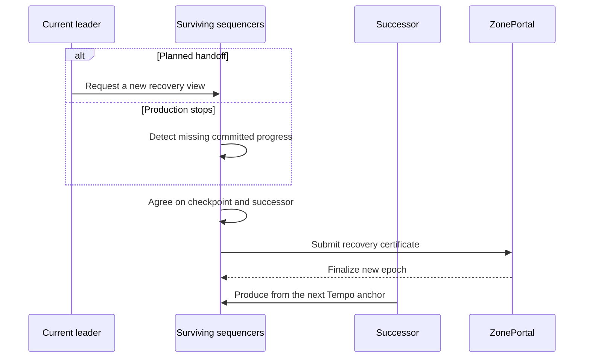
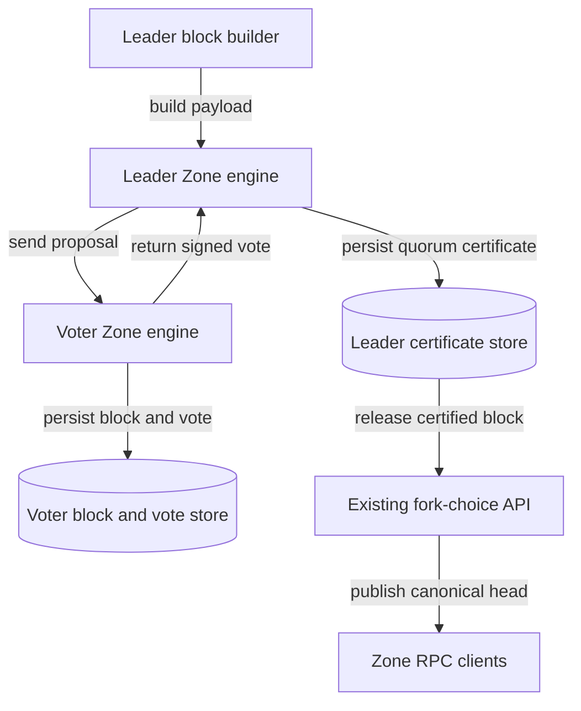
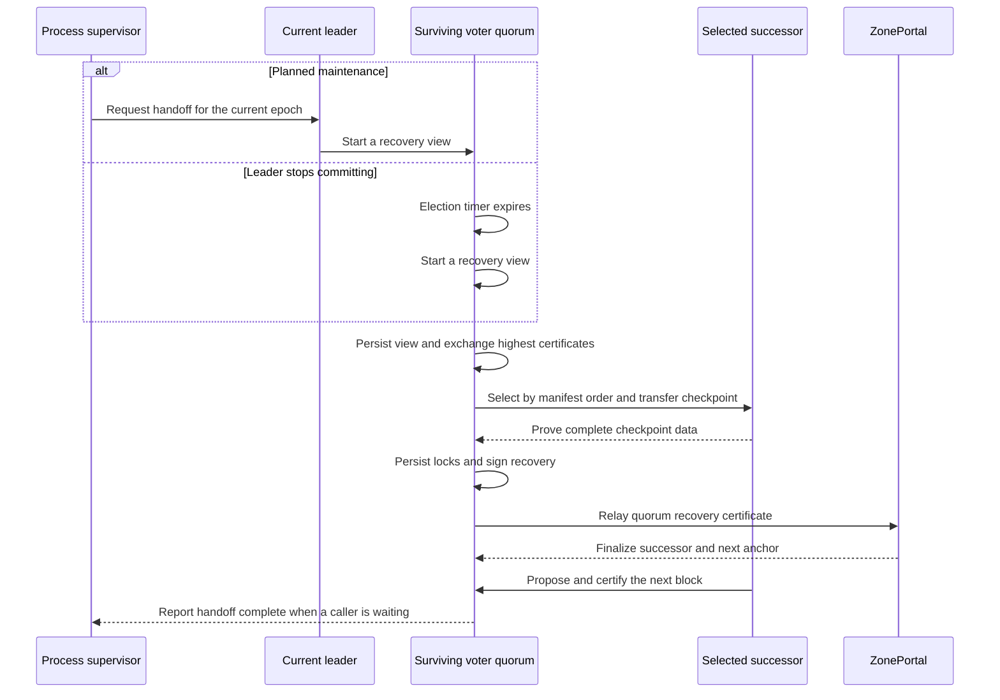
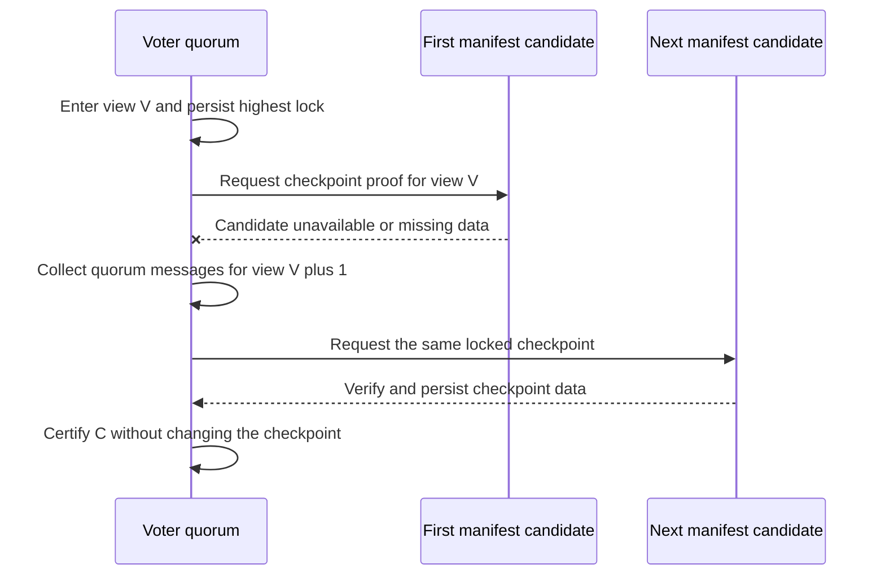
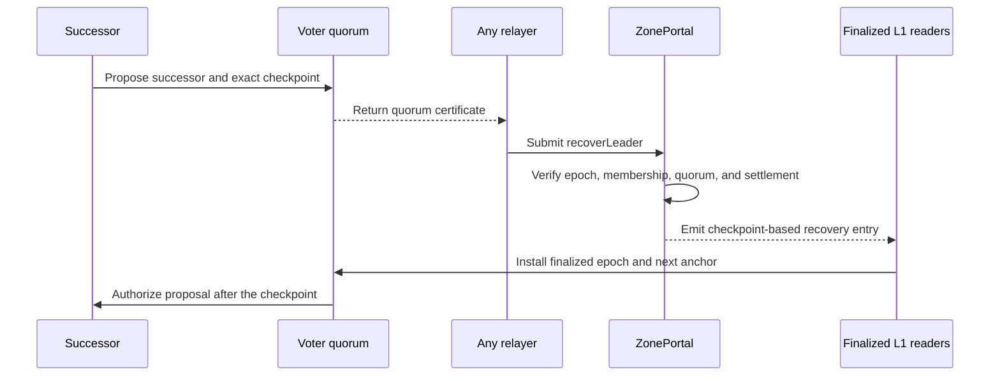
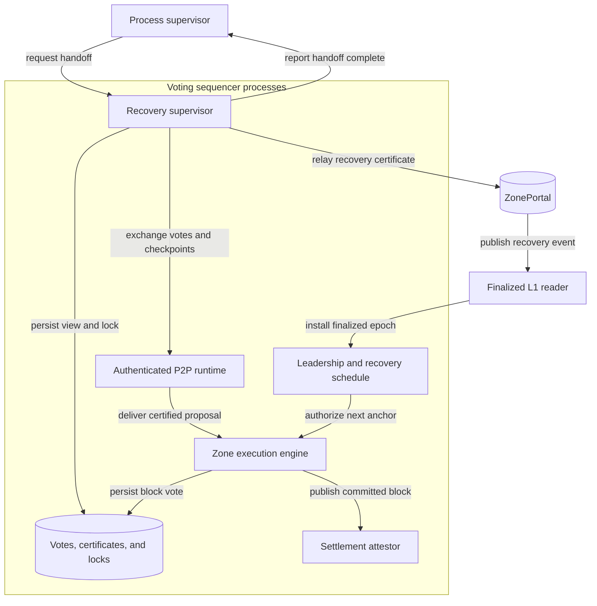

# Automated Sequencer Failover



## Motivation

The Zone assigns each Tempo anchor to one leader, but the current leader can disappear before another node is authorized to consume the next anchor. Ordinary `setLeader` cannot repair this because it activates at the L1 block containing the transaction, leaving earlier anchors assigned to the unavailable leader. Automated failover therefore needs a surviving recovery owner, a quorum-agreed checkpoint, and a transition that resumes at the checkpoint's next anchor. All three belong in Zone code and `ZonePortal`.

## Recovery Protocol

Every voting sequencer runs the recovery supervisor. A planned handoff asks the local supervisor to start recovery before the process receives a termination signal. An abrupt failure needs no callback from the old process: any survivor starts the same protocol after the committed chain stops advancing for the configured election timeout. Exit codes, signals, panic reasons, and health-probe classifications never affect the authority decision.

The first implementation supports one active leader and a fixed voting set. Sequencers use the existing authenticated P2P identities and manifest order. No external controller, operator RPC URL, or shutdown hook participates in recovery safety.

### Committed Blocks

The existing engine sends the post-payload fork-choice update immediately and reports head, safe, and finalized as the same locally produced block. That is insufficient for automatic crash recovery because a block can become client-visible before another machine has durably stored it.

The Zone engine must insert a quorum-commit step before the post-payload fork-choice update:

```text
build and execute proposal
    -> replicate block to voters
    -> voters validate and persist block plus vote
    -> collect quorum certificate
    -> persist certificate
    -> send fork-choice update
    -> expose block as head, safe, and finalized
```

A voter signs at most one block hash for each `(membershipVersion, epoch, height)` and persists the block, vote, and current lock before replying. A quorum certificate binds the Zone ID, portal address, membership version, leader epoch, Zone height and hash, parent hash, Tempo anchor number and hash, and view. The leader persists the certificate before canonicalizing the block. If the leader dies earlier, the proposal remains speculative and recovery may discard it; transactions from a discarded proposal return to the pool.



This changes ordering inside `ZoneEngine` while continuing to execute payloads and apply fork choice through the existing interfaces.

### Failure Detection

Each voter tracks the last quorum-certified block and resets one monotonic election timer only when that committed checkpoint advances. A timeout starts a new recovery view but grants no production authority. A delayed node, a failed health endpoint, or a process exit cannot independently select a leader.

A planned handoff calls an authenticated Zone operator method:

```text
zone_requestHandoff(expectedEpoch)
```

The method records a handoff request and wakes the same recovery supervisor. The caller polls `zone_getHandoffStatus` and signals the process only after the successor has finalized authority and committed its first block, or after the caller's own shutdown deadline. The process does not intercept SIGTERM.



### View Change and Checkpoint Selection

A recovery view is identified by `(membershipVersion, expectedEpoch, viewNumber)`. On entry, each voter persists the new view and broadcasts its highest block certificate and any recovery lock. Messages from older views may transfer data but cannot create new votes.

The candidate for view zero is the next voting node after the current leader in manifest order. Each later view advances one position. RPC-only nodes and the old leader are excluded. Candidate selection never depends on probe completion order, local latency, or an operator-supplied list. If the selected candidate is unavailable or cannot obtain the required checkpoint, a quorum advances to the next view.

The candidate collects a view-change quorum, chooses the highest certified checkpoint carried by those messages, downloads and verifies the complete block data, and broadcasts a recovery proposal. Voters accept only a proposal that extends the highest certificate required by the view-change set. They persist a recovery lock before signing, so a restart or partition cannot make them sign a conflicting successor or checkpoint for the same view.

The initial version keeps membership fixed while recovery is active. Membership changes require a later joint-consensus design because merely attaching a version number does not transfer locks between two voting sets.



### Recovery Certificate

A recovery certificate contains quorum signatures over:

```text
zoneId
portal
membershipVersion
expectedEpoch
viewNumber
successor
checkpointZoneHeight
checkpointZoneHash
checkpointTempoAnchor
checkpointTempoHash
nextTempoAnchor
settledZoneHeight
settledZoneHash
```

`nextTempoAnchor` must equal `checkpointTempoAnchor + 1`. The checkpoint must be at or above the finalized Portal settlement checkpoint and must descend from it. The successor must be an active voting sequencer in the certified membership version and must prove it holds the checkpoint data before voters sign.

Any sequencer may relay the certificate. Relaying does not grant authority and the relayer does not need the old leader's key.

### ZonePortal Transition

Add a versioned transition:

```solidity
function recoverLeader(
    uint64 expectedEpoch,
    uint64 viewNumber,
    address successor,
    uint64 sequencerSetVersion,
    uint256 checkpointZoneHeight,
    bytes32 checkpointZoneHash,
    uint64 checkpointTempoAnchor,
    bytes32 checkpointTempoHash,
    uint256 settledZoneHeight,
    bytes32 settledZoneHash,
    bytes calldata certificate
) external;
```

`ZonePortal` verifies the domain, distinct active signers, configured recovery quorum, membership version, current epoch, successor membership, exact checkpoint fields, and settled-state binding. It rejects stale settlement bases and conflicting or repeated transitions. A successful call increments the leader epoch and records a recovery entry whose first authorized anchor is `checkpointTempoAnchor + 1`; the L1 block containing the transaction is observation metadata, not the activation anchor.

The recovery operation is permissionless to relay because the certificate carries authority. The existing `setLeader` method remains available before activation so old nodes keep their current behavior. The hardfork disables `setLeader`; every later leader change, including planned maintenance, must use a certified recovery transition so an admin or sequencer cannot bypass epoch closure and checkpoint selection.



### Finality and Resumed Production

Sequencers continue serving the old committed checkpoint while the recovery transaction waits for L1 finality. They do not commit blocks in the closed epoch. After observing the finalized event, every node installs the recovery entry, discards only speculative blocks after the checkpoint, and rejects old-epoch proposals and settlement signatures.

The successor proposes the block for `checkpointTempoAnchor + 1` only after it has the checkpoint data and finalized recovery authority. Recovery is complete when that block receives a quorum certificate and becomes canonical. A planned-handoff caller may then terminate the old process. Crash recovery completes without the old process.

If the recovery transaction is delayed or its response is ambiguous, any relayer resubmits the same certificate. `expectedEpoch` makes replay idempotent. If another certificate already finalized for that epoch, nodes follow the finalized winner and abandon conflicting local work.

### Transaction Continuity

Every leader and follower forwards locally originated live transactions to the voting set through the existing bounded transaction channel. P2P-origin transactions are not flooded again. Pool validity, replacement, eviction, pricing, and inclusion rules remain unchanged.

Transactions included only in a speculative block may return to the pool after recovery. Transactions included in a quorum-certified block remain in the preserved prefix. This is the exact durability boundary exposed to clients.

## Timing and Availability

Failure detection and view changes use monotonic local timers. Timer expiry starts a view and never proves that the old leader is dead. Safety does not depend on synchronized clocks.

Recovery has no fixed wall-clock guarantee. It makes progress when a recovery quorum can communicate, at least one candidate holds the highest certified checkpoint, and Tempo L1 accepts and finalizes the recovery transaction. With insufficient voters, missing certified data, or stalled L1 finality, nodes stop committing instead of selecting an unsafe checkpoint.

The process supervisor may retain its own finite termination grace period. Expiring that grace period can kill the outgoing process, but it does not cancel the recovery operation because the other voters own the same persisted view and certificate state.

## Fault Model and Quorum

For `n` voting sequencers and up to `f` Byzantine voters, choose recovery quorum `q` such that `2q > n + f` and `q <= n - f`. The standard configuration is `n = 3f + 1` and `q = 2f + 1`. A crash-only deployment may use a majority quorum, but the manifest and Portal must declare that weaker fault model explicitly.

The recovery quorum is a protocol parameter and cannot silently reuse an arbitrary settlement threshold. Activation validates the configured node count and threshold. Nodes refuse automated recovery when the deployed values do not satisfy the selected fault model.

## Implementation Plan

| ID | Change |
| --- | --- |
| C1 | Add a persistent recovery store for block votes, quorum certificates, current view, and recovery locks. Persist each record before sending the corresponding vote or acknowledgement. |
| C2 | Change leader production to replicate and certify a block before the post-payload fork-choice update. Canonical RPC state advances only after the certificate is durable. |
| C3 | Add authenticated P2P messages for block votes, certificates, view changes, recovery proposals, recovery votes, and checkpoint transfer. Bound message sizes, queues, retained views, and retry work. |
| C4 | Run one recovery supervisor on every voting sequencer. Start it from a handoff request or missing committed progress without inspecting process exit reasons. |
| C5 | Select candidates by rotating through manifest voting nodes after the current leader. Advance views through quorum messages rather than independent health decisions. |
| C6 | Reconcile the highest certified checkpoint carried by a view-change quorum and require the selected candidate to verify its complete data before certification. |
| C7 | Add `recoverLeader` and recovery records to `ZonePortal`, binding successor, epoch, membership, checkpoint, next anchor, and settled state to a quorum certificate. Disable `setLeader` at activation. |
| C8 | Decode finalized recovery events independently of Zone execution and install them in the leadership schedule even while the Zone is stalled on earlier anchors. |
| C9 | Fence block import, production, and settlement by membership version and leader epoch. Reject old-epoch commitment after a recovery lock or finalized transition. |
| C10 | Add authenticated `zone_requestHandoff` and read-only `zone_getHandoffStatus`. The caller controls process termination while survivors own protocol completion. |
| C11 | Run local-origin transaction forwarding in leader and follower generations without changing transaction validation or the existing wire message. |
| C12 | Activate the Portal, node, settlement, and new P2P protocol together at one hardfork after all voters have upgraded and agreed on an initial certified checkpoint. |

## Invariants

| ID | Property |
| --- | --- |
| I1 | Two conflicting blocks cannot both obtain quorum certificates for the same membership version, epoch, and height within the configured fault bound. |
| I2 | A voter never signs after restart unless it has restored its latest block vote, view, and recovery lock from durable storage. |
| I3 | A recovery certificate preserves the highest certified checkpoint required by its view-change quorum and never moves behind finalized Portal settlement. |
| I4 | Only finalized Portal authority permits the successor to propose, and only a block quorum certificate permits fork-choice canonicalization. |
| I5 | The old epoch cannot commit another block after a quorum has locked a recovery view. |
| I6 | Candidate order depends only on the finalized current leader, manifest order, and view number. Message arrival order cannot change it. |
| I7 | A missing or unhealthy node can delay progress but cannot grant authority or choose a checkpoint. |
| I8 | A planned handoff and an abrupt process loss enter the same recovery state machine and differ only in how the first view is triggered. |
| I9 | Replaying or concurrently relaying one recovery certificate cannot create another epoch or change its successor. |
| I10 | Recovery does not alter dependency pins, signal handling, task shutdown, or existing storage and API formats. |

## Implementation Map

| Area | Responsibility |
| --- | --- |
| `crates/node/src/engine.rs` | Hold proposals speculative until a block quorum certificate is durable, then issue the existing post-payload fork-choice update. |
| `crates/node/src/role.rs` | Start the recovery supervisor for voting roles, stop old-epoch production, install finalized recovery, and run transaction forwarding in every role generation. |
| `crates/node/src/recovery.rs` | Own persistent views, locks, candidate rotation, checkpoint reconciliation, certificate assembly, retries, and handoff status. |
| `crates/node/src/rpc.rs` | Expose authenticated handoff requests and read-only recovery status without handling Unix signals. |
| `crates/p2p/src/manifest.rs` | Preserve ordered voting identities and validate the recovery quorum and fault model. No operator RPC endpoint is added. |
| `crates/p2p/src/runtime.rs` | Route bounded recovery messages and checkpoint transfers over authenticated peer identities. |
| `crates/l1` | Decode and finalize recovery events independently of Zone execution progress. |
| `crates/contracts/src/runtime/tempo/ZonePortal.sol` | Verify recovery certificates and record checkpoint-based leader epochs. |
| Settlement attestation and submission | Bind certificates to leader epoch and reject endpoints outside the certified committed prefix. |

## Complete System View



## Test Coverage

### Unit and Model Tests

| ID | Covers | Test and oracle |
| --- | --- | --- |
| T1 | C1, I1, I2 | Generate conflicting proposals, crashes between persistence and send, and restarts from every write boundary. A voter signs at most one block per epoch and height and never forgets a view or lock. |
| T2 | C2, I4 | Interrupt production before replication, during vote collection, after quorum, after certificate persistence, and after fork choice. RPC canonical state advances only in the last two valid states and always has a durable certificate. |
| T3 | C5, I6 | Randomize message order, timeouts, unavailable candidates, and manifest layouts. An independent function of leader, manifest, and view always predicts the selected candidate. |
| T4 | C6, I3 | Generate view-change sets containing different tips, partial certificates, and locked proposals. Recovery selects the highest valid certified checkpoint and rejects height-only or conflicting choices. |
| T5 | C7, I3, I9 | Fuzz certificate signers, duplicates, domains, epochs, membership versions, checkpoints, settled bases, successors, and replay. The Portal accepts exactly one well-formed quorum transition for the current epoch. |
| T6 | C8, C9, I5 | Deliver recovery finality before, during, and after local replay with delayed old proposals and settlements. No old-epoch block or batch commits past the checkpoint. |
| T7 | C10, I8 | Trigger identical recovery states through handoff requests, process disappearance, and missing progress. Only the initial wakeup source differs. |
| T8 | C11 | Fill the forwarding queue, delay reconciliation, replace transactions, and inject P2P-origin duplicates. Local transactions retry within existing bounds and remote transactions are not re-flooded. |

### E2E Tests

Run a real Tempo dev L1 and at least four independent Zone processes with durable volumes.

| Scenario | Required result |
| --- | --- |
| Planned handoff from the leader | The successor commits from the certified checkpoint, the handoff reports success, and the old process may then exit without a missing or duplicate Zone height. |
| Leader SIGKILL | Survivors elect and finalize a successor without code running in the old process. Every previously certified block remains byte-identical. |
| Leader OOM during proposal | The proposal commits only if its certificate can be reconstructed from durable voter records; otherwise recovery discards it and preserves the preceding certificate. |
| First candidate unavailable | The quorum advances views and selects the next manifest candidate without conflicting Portal submissions. |
| Relayer crashes after submission | Another relayer submits the identical certificate and the Portal creates one epoch. |
| Successor crashes after certification | Nodes finish the certified transition, then use a later view and epoch to replace it without returning to the old epoch. |
| Node restarts with lost recovery state | The node cannot vote until restored from a valid snapshot containing the current lock and certificate. |
| L1 finality stalls | No successor produces early; recovery resumes after finality without changing the certified target. |
| Transactions pending during failover | Transactions outside discarded speculative blocks remain available and are eventually included exactly once. |

### Chaos Tests

Unit tests cannot explore the timing combinations among durable writes, P2P delivery, process loss, and L1 finality.

| Scenario | Failure introduced | Expected result |
| --- | --- | --- |
| Competing views | Delay view-change messages across overlapping majorities | At most one checkpoint and successor can become certified for an epoch. |
| Old leader partition | Isolate the leader from a recovery quorum while leaving its L1 view stale | The isolated leader may execute speculatively but cannot obtain a block certificate or extend settlement. |
| Certificate withholding | Form a block quorum and deliver the aggregate certificate to only one process before killing it | View change reconstructs the highest prepared block from persisted votes or safely retains the preceding committed checkpoint. |
| Storage faults | Drop or corrupt selected vote, block, or lock writes | The affected node stops voting; remaining nodes either recover within the fault bound or stop safely. |
| Candidate churn | Kill each selected candidate after checkpoint transfer at different protocol steps | Later views preserve locks and eventually choose a live candidate without conflicting recovery certificates. |
| Duplicate delivery | Replay blocks, votes, view changes, certificates, and finalized events | State transitions remain idempotent and bounded. |
| Clock skew | Advance and pause individual monotonic timers | Timers affect view changes only and never allow conflicting commitment. |

### Regression Tests

Run existing shutdown and panic tests unchanged, Portal contract tests, P2P wire golden tests, settlement tests, forced-recovery migration tests, single-sequencer tests, restart tests, and the complete multi-sequencer E2E suite. Nodes below the activation boundary retain the current production and replay rules.

### Metrics

| Metric | Type | Bounded labels | Purpose |
| --- | --- | --- | --- |
| `zone_block_vote_total` | Counter | `result` | Detect rejected, duplicate, and persisted votes. |
| `zone_block_commit_seconds` | Histogram | none | Measure proposal-to-certificate latency. |
| `zone_recovery_view_total` | Counter | `trigger` | Count handoff and missing-progress view changes. |
| `zone_recovery_transition_total` | Counter | `result` | Track certified, finalized, rejected, and superseded transitions. |
| `zone_recovery_seconds` | Histogram | `result` | Measure checkpoint-to-first-committed-block recovery time. |
| `zone_recovery_view` | Gauge | none | Expose the current persisted recovery view. |
