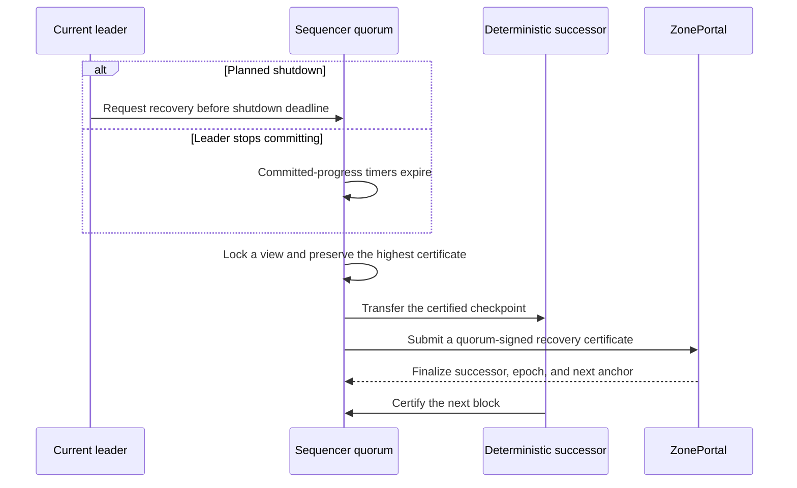
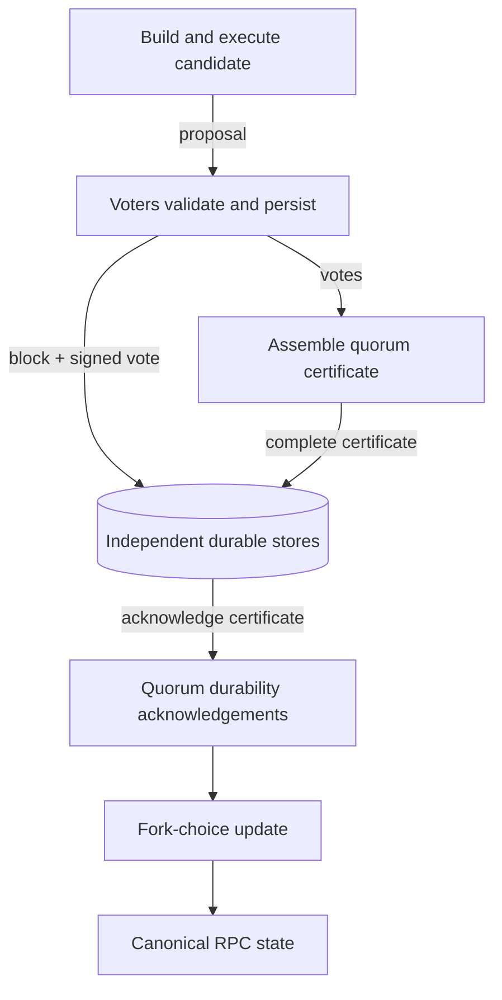
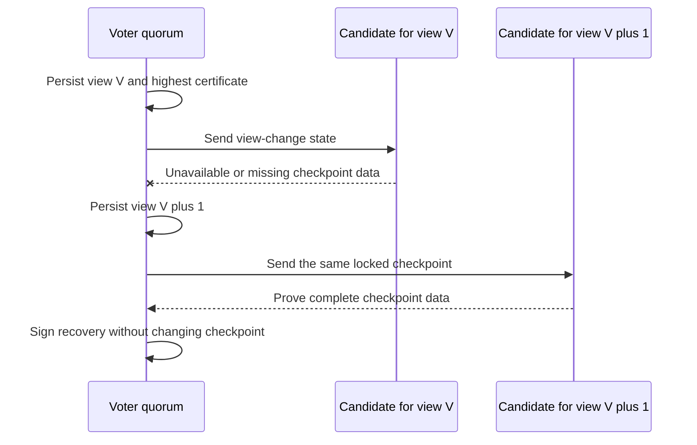
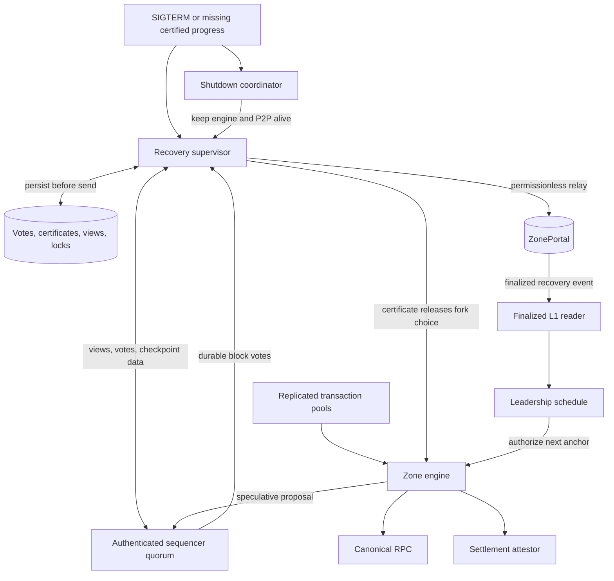

# Automated Sequencer Failover



## Motivation

Zones currently have one scheduled leader per Tempo anchor. Followers independently execute and persist that leader's blocks, but there is no automatic election: recovery requires `setLeader` or an operator-supplied forced-recovery checkpoint.

That is not sufficient when the leader dies. `setLeader` activates at the Tempo block containing the transaction, so anchors before that point remain assigned to the unavailable leader. The current leader also canonicalizes a block before broadcasting it; an abrupt crash can therefore expose a block that no survivor durably holds.

Automated failover needs two protocol changes:

1. A client-visible Zone block has a quorum-backed durability certificate.
2. A quorum can close the failed epoch at that certificate and authorize a successor from the next Tempo anchor.

The design uses the same recovery protocol for planned shutdown, panic, SIGKILL, OOM, host loss, and network isolation. A planned shutdown starts it earlier, but the outgoing process is never required for safety or completion.

## Proposed Behavior

### Certified block commitment

The current engine builds and executes a payload, applies the post-payload fork-choice update, and then broadcasts the persisted canonical block. Failover cannot promise no block loss across machines with that ordering.

Insert a quorum barrier before canonicalization:

```text
build and execute candidate
    -> voters validate and durably persist block + vote
    -> leader assembles a quorum certificate
    -> a voter quorum durably persists the complete certificate
    -> nodes apply fork choice and expose the canonical block
    -> the Tempo anchor is consumed
```



A block vote binds:

```text
zoneId, portal, sequencerSetVersion, leaderEpoch, zoneHeight,
zoneHash, parentHash, tempoAnchorNumber, tempoAnchorHash
```

A voter persists the block and its vote before replying and signs at most one hash for a `(sequencerSetVersion, leaderEpoch, zoneHeight)` tuple. After assembly, a voting quorum persists the complete certificate and acknowledges it before any node applies fork choice. A proposal without those durability acknowledgements is speculative: it is not returned as canonical RPC state, does not consume its anchor, and may be discarded after failover.

This is the exact no-loss boundary. Transactions in discarded speculative blocks return to the pool; transactions in certified blocks remain in the preserved prefix.

### Starting recovery

Every voting sequencer runs a recovery supervisor. It tracks the last certified height and resets a monotonic timer only when that height advances. Timer expiry opens a recovery view; it does not itself grant authority.

For planned maintenance, Reth's graceful-shutdown path asks the same supervisor to open a view immediately. A shared shutdown coordinator keeps the Zone engine and P2P runtime alive while handoff is attempted. The existing engine and P2P shutdown hooks wait behind that coordinator instead of racing one another.

The outgoing leader may keep proposing until a quorum durably enters the recovery view. Once locked, voters reject further old-epoch block votes, so the old leader cannot commit another block. It must not hand production directly to the successor before finalized Portal authority: doing so would permit two leaders to produce or attest settlement concurrently.

The local handoff deadline must fit inside the configured process grace period:

```text
handoff deadline + role teardown budget + shutdown reserve
    <= process grace period
    <= deployment termination grace period
```

Startup rejects an invalid relationship. At the deadline, the old process exits; survivors continue from their persisted view. A critical panic, SIGKILL, OOM, or host loss uses the missing-progress path and never depends on shutdown code running.

### Choosing a successor and checkpoint

A recovery view is `(sequencerSetVersion, expectedEpoch, viewNumber)`. On entry, each voter atomically persists the view and its highest block or recovery certificate before sending a view-change message.

The candidate is derived from protocol state, not local configuration order: sort the active on-chain voting sequencer settlement addresses, exclude the current leader for this recovery, start after it, and rotate once per view. The existing manifest maps each settlement address to its authenticated Ed25519 peer identity. RPC-only peers are excluded. Message arrival order, probe latency, and manifest file order have no effect.



The candidate collects a view-change quorum and selects the highest valid certified checkpoint in that set. It downloads and verifies the complete block data before asking for recovery votes. Voters reject a proposal below that checkpoint or one inconsistent with their persisted lock.

Quorum intersection gives the important closure property: after a quorum locks recovery, the old epoch cannot form another block certificate. Any canonical block certificate was durably stored by a quorum, so a view-change quorum intersects at an honest certificate holder and carries that complete certificate forward.

Any finalized sequencer-set change invalidates the in-progress view and restarts recovery under the new version. Certificates never combine signatures from different set versions.

### Authorizing recovery on L1

Recovery voters sign this payload:

```text
zoneId, portal, sequencerSetVersion, expectedEpoch, viewNumber,
successor, checkpointZoneHeight, checkpointZoneHash,
checkpointTempoAnchor, checkpointTempoHash, nextTempoAnchor,
settledZoneHeight, settledZoneHash
```

`nextTempoAnchor` is exactly `checkpointTempoAnchor + 1`. The checkpoint must descend from and not precede the Portal's finalized settlement checkpoint. Any account may relay the signed certificate; the relayer has no authority of its own.

Add a versioned Portal entry point:

```solidity
function recoverLeader(
    uint64 expectedEpoch,
    uint64 viewNumber,
    address successor,
    uint64 sequencerSetVersion,
    RecoveryCheckpoint calldata checkpoint,
    bytes calldata certificate
) external;
```

`ZonePortal` verifies the EIP-712 domain, distinct active signers, recovery quorum, set version, expected epoch, a distinct active successor, checkpoint, and settled-state binding. It then increments `leaderEpoch` and records `checkpointTempoAnchor + 1` as the first authorized anchor. The Tempo block containing `recoverLeader` is observation metadata, not the activation anchor.

`expectedEpoch` makes duplicate relays idempotent. Conflicting or stale certificates fail. Nodes install authority only from the finalized Portal event, using the existing L1-before-block delivery ordering, then discard speculative descendants and reject old-epoch production and settlement signatures.

After protocol activation, ordinary `setLeader` is disabled. Planned maintenance also uses `recoverLeader`; otherwise one admin or sequencer could bypass quorum closure and choose a different checkpoint.

### Availability and fault model

Local clocks only decide when to try another view. Recovery makes progress when a recovery quorum can communicate, at least one member has the highest certified block data, and Tempo L1 accepts and finalizes the transaction. If any condition is absent, the Zone stops committing instead of choosing an unsafe history.

For `n` voters and up to `f` Byzantine voters, recovery quorum `q` must satisfy:

```text
2q > n + f
q <= n - f
```

The standard Byzantine configuration is `n = 3f + 1`, `q = 2f + 1`. The existing common `2-of-3` settlement threshold is not a Byzantine failover quorum: two conflicting groups of two may intersect only in the Byzantine voter. A deployment may explicitly select a crash-only majority model, but activation must record and validate that weaker assumption. Recovery does not silently inherit an arbitrary settlement threshold.

## Implementation Plan

| ID | Change |
| --- | --- |
| C1 | Add a durable recovery store for block votes, block certificates, views, and locks. Restore it before a node can vote. |
| C2 | Insert the certificate barrier into `ZoneEngine`: proposals remain speculative until a voting quorum acknowledges durable storage of the complete certificate, then the existing fork-choice path canonicalizes them. |
| C3 | Version the authenticated P2P protocol with bounded messages for proposals, block votes, certificates, view changes, recovery votes, and checkpoint transfer. |
| C4 | Add one recovery supervisor per voting sequencer. Trigger it from certified-progress timeout or planned shutdown; never from an asserted failure reason. |
| C5 | Derive candidate rotation from sorted active on-chain settlement addresses and the persisted view. Resolve candidates to authenticated peers through the manifest mapping. |
| C6 | Reconcile the highest certificate in a view-change quorum and require complete verified checkpoint data before a voter signs recovery. |
| C7 | Add `recoverLeader` and append-only recovery state to `ZonePortal`; bind quorum signatures to the epoch, membership, checkpoint, successor, and settled prefix. |
| C8 | Decode finalized recovery events independently of Zone execution and install them in the leadership schedule before delivering the corresponding anchor. |
| C9 | Fence block production, import, voting, and settlement by set version and leader epoch. Stop old-epoch voting when the recovery lock is persisted. |
| C10 | Coordinate Reth shutdown so engine and P2P stay available through bounded handoff. Configure and validate process and deployment grace periods; survivor recovery continues after timeout. |
| C11 | Preserve live transactions across role changes using the existing replicated quorum pools. Reinsert transactions from discarded speculative blocks. |
| C12 | Upgrade voters in compatibility mode, establish the activation checkpoint, then activate Portal rules, certificate commitment, and the new P2P version at one hardfork. |

## Invariants

| ID | Property |
| --- | --- |
| I1 | Two conflicting blocks cannot both obtain valid certificates for one set version, epoch, and height within the configured fault bound. |
| I2 | A voter cannot sign after restart until its latest vote, view, and lock are restored from durable storage. |
| I3 | Canonical RPC head, safe, and finalized state never advance beyond the highest block certificate durably stored by a voting quorum. |
| I4 | Recovery preserves the highest certificate represented in its view-change quorum and never moves behind finalized Portal settlement. |
| I5 | A quorum locked in recovery prevents any later block certificate in the closing epoch. |
| I6 | Only a finalized Portal recovery event authorizes successor production from the checkpoint's next anchor. |
| I7 | Candidate choice is a pure function of finalized membership, current leader, and view; local ordering and timing cannot change it. |
| I8 | Planned shutdown and abrupt loss use the same persisted protocol and differ only in how the first view begins. |
| I9 | Replaying one recovery certificate cannot increment the epoch twice or change its successor or checkpoint. |
| I10 | Insufficient quorum, unavailable certified data, or stalled L1 causes unavailability, never uncertified commitment. |

## Implementation Map

| Area | Responsibility |
| --- | --- |
| `crates/node/src/engine.rs` | Keep a built payload speculative, obtain quorum durability acknowledgements for its certificate, then apply the existing post-payload fork-choice update and consume the anchor. |
| `crates/node/src/role.rs` | Run recovery for voting roles, fence closed epochs, preserve transaction pools, and coordinate generation teardown. |
| `crates/node/src/recovery.rs` | Own durable votes, certificates, views, locks, candidate rotation, checkpoint transfer, retries, and status. |
| `crates/node/src/node.rs` | Gate the existing engine and P2P graceful-shutdown hooks behind the bounded handoff coordinator. |
| `crates/node/src/rpc.rs` | Expose read-only recovery status and an authenticated request to start planned handoff; do not interpret Unix signals. |
| `crates/p2p/src/protocol.rs` | Add the versioned, size-bounded recovery wire messages. |
| `crates/p2p/src/manifest.rs` | Validate settlement-address-to-peer mappings and recovery quorum configuration without assigning meaning to file order. |
| `crates/l1` | Decode, verify, and deliver finalized recovery transitions before the newly authorized Zone anchor. |
| `crates/contracts/src/runtime/tempo/ZonePortal.sol` | Verify recovery certificates and store checkpoint-based leader epochs without reordering existing storage. |
| Settlement path | Bind attestations to set version and leader epoch, and reject settlement past the certified prefix. |

## Complete System View



## Compatibility and Rollout

Upgrade all voters first in compatibility mode. Before activation they preserve current leader scheduling, forced recovery, settlement signatures, transaction validation, deposits, withdrawals, and RPC formats. Single-sequencer Zones retain current behavior.

At activation, initialize the last pre-activation canonical block as the first certificate checkpoint, require a supported P2P protocol version and valid recovery quorum, and enable certificate-gated commitment plus `recoverLeader` together. Disable `setLeader` only after that boundary. Portal storage is append-only, and older historical leader events remain readable.

The deployment must configure its termination grace period to cover the node's validated process grace period. This improves planned handoff latency but is not a safety assumption: abrupt termination remains a supported trigger.

## Test Coverage

### Unit, contract, and model tests

| ID | Covers | Test and success criterion |
| --- | --- | --- |
| T1 | C1, I1, I2 | Crash at every persist/send boundary and restart. No recovered voter signs a second block, view, or successor forbidden by its durable state. |
| T2 | C2, I3 | Interrupt before votes, during certificate replication, at the durability quorum, and around fork choice. Canonical RPC state advances only after a voting quorum has persisted its complete certificate. |
| T3 | C5, I7 | Randomize manifest order, peer latency, message order, membership, and views. An independent sorted-address oracle always predicts the candidate. |
| T4 | C6, I4, I5 | Generate conflicting tips, partial vote sets, locks, and view changes. The model finds no pair of conflicting block or recovery certificates. |
| T5 | C7, I6, I9 | Fuzz EIP-712 domains, duplicate signers, thresholds, epochs, set versions, successors, checkpoints, settlement bases, and replay. The Portal accepts exactly one valid current-epoch transition. |
| T6 | C8, C9 | Reorder finalized L1 events, anchors, old proposals, and settlement signatures. The successor never starts early and the old epoch never commits late. |
| T7 | C4, C10, I8 | Exercise timeout, SIGTERM, handoff deadline, concurrent shutdown hooks, and process-grace expiry. Both triggers enter the same recovery state; engine and P2P remain live for handoff and teardown completes within the configured bound. |
| T8 | C11 | Discard speculative blocks during recovery under replacement, eviction, and queue pressure. Certified transactions stay committed and eligible speculative transactions return to the pool. |
| T9 | C3 | Round-trip every recovery message across supported protocol versions; reject oversized, malformed, cross-domain, and unsupported messages while keeping queues and retained views bounded. |
| T10 | C12 | Run immediately before, at, and after activation with mixed peer versions. Pre-activation behavior remains unchanged; incompatible voters cannot cross the activation boundary. |

### End-to-end scenarios

Run a real Tempo dev L1 with enough independent Zone processes and durable volumes to satisfy the selected fault model.

| Scenario | Success criterion |
| --- | --- |
| Planned SIGTERM | A recovery view closes the old epoch, the successor commits the next anchor, and the old process exits within its grace period without a missing or duplicate certified height. |
| Leader SIGKILL or host loss | Survivors recover without any code running on the old host; every previously certified block remains byte-identical. |
| OOM or panic during block production | The block survives only if its quorum state is durable and reconstructable; otherwise the preceding certificate is preserved and its transactions are eligible again. |
| First candidate unavailable | A quorum advances the view and deterministically selects the next active address without conflicting Portal transitions. |
| Relayer dies or L1 response is lost | Another relayer submits the same certificate and the Portal creates exactly one new epoch. |
| Successor dies before its first block | The finalized transition remains authoritative; a later recovery replaces that successor without returning to the closed epoch. |
| Sequencer set changes during recovery | Old-version votes cannot combine with the new set; nodes restart recovery from finalized membership. |
| L1 finality stalls | No successor produces early. Recovery resumes from the same certificate when finality returns. |
| Transactions remain pending | Transactions outside discarded speculative blocks remain available and are eventually included under existing pool rules. |

### Failure-schedule tests

Run deterministic schedules with recorded seeds and minimize every failing trace. Reduce election timeouts in the test environment; do not wait on production durations.

| Failure introduced | Required property |
| --- | --- |
| Partition the old leader from a recovery quorum | It may execute locally but cannot certify a block or extend settlement. |
| Kill the assembler before and after certificate durability acknowledgements | Before the acknowledgement quorum, the proposal stays speculative; afterward, view change recovers the complete certificate from an honest holder. |
| Delay, duplicate, and reorder proposals, votes, view changes, Portal submissions, and finalized events | Handlers remain idempotent and stores and queues stay within configured bounds. |
| Kill successive candidates after each protocol step | Later views retain the highest lock and eventually choose a live candidate without conflicting certificates. |
| Pause and skew individual monotonic clocks | Timers change view timing only; they never create authority. |
| Corrupt or drop a selected block, vote, or lock write | The affected node stops voting. The remaining system recovers within the fault bound or stops safely. |
| Fill P2P, checkpoint-transfer, and transaction queues | Backpressure remains bounded and cannot bypass persistence or certificate checks. |

The external oracle records each node's canonical `(height, hash, epoch, producer)`, every Portal epoch and checkpoint, and every durable vote. It asserts I1-I10 continuously, including that no old-epoch certificate appears after a recovery quorum locks.

### Regression checks

Keep the existing forced-recovery E2E as a pre-activation compatibility test. Run Portal contract tests, P2P wire tests, settlement tests, shutdown and panic tests, restart tests, single-sequencer tests, and the complete multi-sequencer E2E suite. No test may treat process exit, a health probe, or timer expiry as production authority.

### Metrics

| Metric | Type | Bounded labels | Purpose |
| --- | --- | --- | --- |
| `zone_block_certificate_seconds` | Histogram | none | Measure proposal-to-durable-certificate latency. |
| `zone_block_vote_total` | Counter | `result` | Detect persisted, duplicate, and rejected votes. |
| `zone_recovery_view_total` | Counter | `trigger` | Count planned and timeout-triggered views. |
| `zone_recovery_transition_total` | Counter | `result` | Track certified, finalized, rejected, and superseded transitions. |
| `zone_recovery_seconds` | Histogram | `result` | Measure last certificate to successor's first certificate. |
| `zone_recovery_view` | Gauge | none | Expose the current durable view without peer-address labels. |
